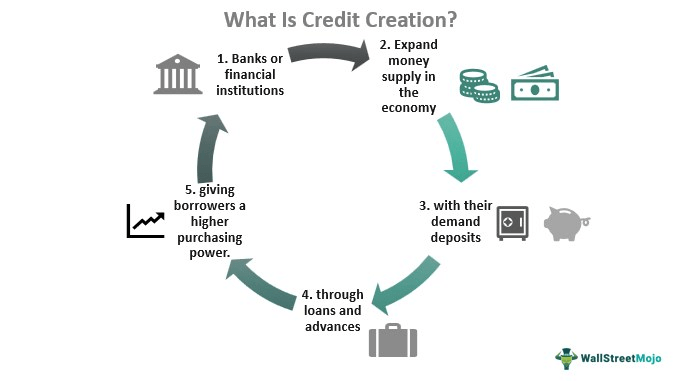

In today's rapidly evolving financial landscape, understanding monetary systems and their components is crucial for navigating an increasingly complex global economy. Monetary systems provide the essential framework through which societies manage and distribute money, playing a fundamental role in economic stability and growth. These systems allow for the seamless facilitation of exchanges by providing a common medium of exchange, serving as both a store of value and a measure of economic wealth. The significance of monetary systems extends beyond simple transactions, influencing major economic indicators and policies.

The advent of credit money has expanded the function and complexity of monetary systems, allowing for the creation of monetary value through credit extension. Instruments such as bonds, IOUs, and various debt instruments typify the diverse forms credit money can take. Understanding how these operate within structures like the fractional reserve banking system is key to comprehending modern monetary flows and the interconnectedness of global markets.



In parallel, financial markets demonstrate the practical application and impact of various monetary instruments. Bonds and equities are prime examples of how credit money not only facilitates capital generation but also impacts global capital market dynamics. The entities and mechanisms supporting these instruments are indispensable for a functional, thriving economy.

Algorithmic trading emerges as a transformative force within this landscape, utilizing advanced computer technology to optimize trading strategies across global financial markets. This method incorporates algorithms to conduct trades at speeds unattainable by human traders, increasing market efficiency and enhancing accuracy. It stands at the intersection of finance and technology, exemplifying modern advancements in trading practices.

The interplay between currency and algorithmic trading, particularly in the Forex market, underscores the integration of advanced technologies in traditional economic roles. This synergy enhances market liquidity and poses challenges and opportunities related to trade execution and strategy optimization.

Future trends poised to further revolutionize this sector include the integration of artificial intelligence and machine learning, promising increased sophistication and automation in trading strategies. However, these advancements bring with them ethical considerations, particularly regarding high-frequency trading and market fairness, which necessitate prudent regulatory approaches.

In conclusion, monetary systems, credit money, and algorithmic trading form a comprehensive framework guiding modern finance. Understanding these elements is essential for effectively engaging with and influencing the future of global finance. Balancing innovation with thoughtful regulation will be essential in ensuring sustainable economic progress.

## Table of Contents

## Monetary Systems Overview

Monetary systems are essential frameworks that dictate the creation and management of money supply within a society. They underpin economic activities by serving as a common medium of exchange, a store of value, and a measure of wealth. The primary function of any monetary system is to facilitate economic exchanges by providing a reliable and stable currency that can be universally accepted for trade.

A well-structured monetary system integrates various components such as currency issuance, banking operations, and payment mechanisms, enabling seamless transactions and maintaining the integrity of the financial ecosystem. One critical function is to provide a stable medium of exchange which reduces transaction costs compared to barter systems, thereby increasing economic efficiency and fostering trade.

Central banks play a pivotal role in regulating these systems to ensure economic stability. They are tasked with the responsibility of managing the nation's money supply and interest rates, often targeting specific economic indicators such as inflation and unemployment to maintain a stable economy. Through instruments like open market operations, reserve requirements, and the discount rate, central banks can influence the availability and cost of money to sustain economic growth.

Store of value is another critical function of monetary systems. It allows individuals and businesses to save or accumulate wealth with the confidence that their money will retain its value over time. This function is particularly important in curbing inflation, which can erode purchasing power and destabilize economies if not kept in check.

Monetary systems also act as a measure of wealth, whereby monetary units provide a basis for evaluating the value of goods and services. This uniformity allows for ease in accounting, financial reporting, and economic comparisons both domestically and internationally.

In the modern economic landscape, the adoption and refinement of technological tools have further enhanced the efficacy of monetary systems. Digital currencies and advanced payment systems are reshaping traditional models, providing greater flexibility and access to financial services across the globe. However, these innovations also present new challenges that require careful regulation to prevent financial instability.

In summary, the robustness of a monetary system hinges on its ability to efficiently manage monetary supply and provide stability through sound central bank policies, facilitating the various functions necessary for a thriving economy.

## Credit Money: Definition and Examples

Credit money involves generating monetary value by extending credit and promises to pay, characterized by instruments like IOUs, bonds, and various debt securities. Unlike fiat money, which derives its value through government decree, credit money's worth is rooted in the trust and creditworthiness of the issuing entity. 

### Forms of Credit Money

1. **IOUs (I Owe You)**: An IOU is a documented acknowledgment of debt, expressing the borrower's intention to repay the lender. While informal and lacking the legal enforceability of contracts, they are prevalent in various informal transactions and agreements.

2. **Bonds**: These are formal debt instruments within which the issuer is obligated to pay interest and repay principal at a later date. Governments and corporations commonly issue bonds to raise capital. Bonds are essential to credit money because they rely on the issuer's reputation and creditworthiness to maintain value. For instance, U.S. Treasury bonds are considered highly secure due to the low default risk associated with the U.S. government.

3. **Debt Instruments**: This category includes various certificates of debt, such as debentures and mortgages, which oblige repayment with specific terms regarding interest rates and timelines.

### Credit Money in the Fractional Reserve Banking System

The fractional reserve banking system plays a vital role in the creation and management of credit money. In this system, banks hold a fraction of their customers' deposits as reserves while using the remainder for lending. This practice effectively multiplies the money supply by allowing banks to extend more credit than the total cash reserves they possess.

#### Mechanism of Money Creation

Assume a bank has a reserve requirement of 10%. If a customer deposits $1,000, the bank must retain $100 (10%) as reserves but can lend out $900. The borrower, in turn, may deposit the $900 in the same or another bank, allowing that institution to lend $810 and retain $90. This cycle continues, with each deposit and loan expanding the money supply. The total money supply (M) stimulated by an initial deposit can be calculated using the formula:

$$
M = \frac{1}{R} \times \text{initial deposit}
$$

Where $R$ is the reserve ratio. For a 10% reserve ratio:

$$
M = \frac{1}{0.1} \times 1,000 = 10,000
$$

Thus, a $1,000 deposit can potentially increase the money supply to $10,000 through successive loans.

### Implications for Economic Activity

Credit money, through fractional reserve banking, affects economic activity significantly by facilitating greater access to funds than would be available under a full-reserve system. This access can stimulate investment, promote consumption, and influence interest rates. However, reliance on credit money and potentially excessive lending can also lead to economic instability if not managed prudently, as seen in financial crises where defaults on loans multiplied systemic risk.

Therefore, understanding the mechanisms underlying credit money and its integration into banking practices is crucial for comprehending broader economic dynamics.

## Financial Examples in Modern Economies

Financial markets exemplify how different monetary instruments operate within modern economies. Two primary instruments, bonds and equities, significantly influence these markets and function as forms of credit money.

### Bonds and Equities as Credit Money

**Bonds** are debt securities issued by entities such as governments, municipalities, and corporations. When investors purchase bonds, they effectively lend money to the issuer in exchange for periodic interest payments and the return of the bond's face value at maturity. Bonds are integral to the credit money system because they represent a promise to pay, thus adding to the money supply indirectly by creating financial claims. The coupon rate and the maturity period are fundamental characteristics of a bond, determining the interest paid to investors and the bond's duration until repayment.

**Equities**, or stocks, represent ownership in a corporation. When a company issues stocks, it receives capital from investors in exchange for equity shares, which can offer dividends and value appreciation. Although equities do not directly serve as credit money, they facilitate capital formation by allowing companies to raise funds without incurring debt. The value and performance of stocks are influenced by the issuing company’s financial health and broader market conditions.

### Supporting Entities in Financial Markets

Several entities support the functionality and stability of bond and equity markets. **Stock exchanges** like the New York Stock Exchange and NASDAQ facilitate the buying and selling of equities, providing [liquidity](/wiki/liquidity-risk-premium) and price transparency. In contrast, **bond markets** operate over-the-counter, with brokers and dealers facilitating transactions. **Investment banks** play a pivotal role in underwriting new bond and stock issuances, while **credit rating agencies** assess and publish the creditworthiness of bond issuers, influencing interest rates and investor confidence.

### Impact on Global Capital Markets

Bonds and equities significantly impact global capital markets by enabling capital flow across borders. **Globalization** and technological advancements allow investors to access diverse markets, leading to increased liquidity and market efficiency. Bonds often serve as a benchmark for interest rates and, by extension, influence currencies, inflation, and national economies. Equities, on the other hand, are closely linked to economic growth, as they provide capital for businesses to expand and innovate.

The integration of these instruments within global financial systems showcases their importance beyond merely being credit money. The strategic issuance and trading of bonds and equities affect monetary policy, investment decisions, and economic stability. As these markets continue to evolve, understanding their dynamics becomes crucial for global economic participants.

## Algorithmic Trading: Bridging Technology and Finance

Algorithmic trading leverages computer programs to execute trades at speeds unachievable by human traders. By automating the trading process, algorithms enhance trading efficiency and accuracy, minimizing human error and emotional decision-making. These programs rely on complex mathematical models and sophisticated algorithms to analyze market data and make trading decisions based on predefined criteria.

### Trading Efficiency and Market Accuracy

Algorithms improve trading efficiency by quickly processing vast amounts of market data to identify trading opportunities. High-frequency trading ([HFT](/wiki/high-frequency-trading-strategies)), a subset of [algorithmic trading](/wiki/algorithmic-trading), is notable for executing a large number of orders at incredibly high speeds. This rapid execution allows for the exploitation of small price discrepancies across markets, optimizing profit margins.

Market accuracy is another significant benefit. Algorithms use historical and real-time data to predict price movements and trade accordingly. This predictive capability helps in maintaining accurate market prices, enhancing liquidity, and narrowing bid-ask spreads. As a result, the market becomes more efficient, benefiting traders by providing better execution prices.

### Popular Algorithmic Trading Strategies

1. **Trend Following**: One of the simplest and most popular strategies in algorithmic trading is trend following. This strategy bets on trends continuing in the direction they are moving. By utilizing moving averages, price level breakouts, channel trending, and related technical indicators, traders capitalize on momentum without predicting market directions.

2. **Arbitrage**: Arbitrage strategies involve buying and selling the same asset in different markets to take advantage of differing prices for the same asset. Algorithmic traders deploy statistical models to detect and capitalize on these price differences efficiently.

3. **Mean Reversion**: This strategy operates under the assumption that asset prices will revert to their historical averages. Algorithms identify instances where prices deviate significantly from these average levels and place trades anticipating a reversal.

4. **Market Making**: This strategy involves placing simultaneous buy and sell orders to profit from the bid-ask spread. Market makers provide liquidity to the market by ensuring there are continuous buy and sell offers available at publicly quoted prices.

5. **Machine Learning and AI**: Recently, there has been an increased integration of machine learning (ML) and artificial intelligence (AI) into algorithmic trading strategies. These technologies enhance the prediction capabilities of algorithms by learning from new datasets and adapting to market changes. Techniques such as neural networks, deep learning, and natural language processing are implemented to improve decision-making.

### Integration with Modern Financial Theories

Algorithmic trading strategies often incorporate elements of modern financial theories like the Efficient Market Hypothesis (EMH), which suggests that asset prices reflect all available information. While some traders use algorithms to test hypotheses drawn from EMH, others focus on behavioral finance, which considers psychological factors influencing investor behavior.

In conclusion, algorithmic trading represents a significant advancement in the field of finance, bridging technology with trading practices to enhance efficiency, accuracy, and profitability in financial markets.

## The Interplay between Currency and Algorithmic Trading

In today's Forex market, algorithmic trading plays a significant role in the efficiency and dynamics of currency trading. Algorithmic trading employs computer programs to execute buy and sell orders based on predetermined criteria. This process offers unmatched speed and precision, enabling traders to capitalize on minute price discrepancies that may occur over brief periods. 

One of the primary advantages of algorithmic trading in Forex is liquidity enhancement. By allowing for the swift execution of large volumes of trades, algorithms contribute to deeper market liquidity. This reduces the spread between the bid and ask price, allowing for more competitive pricing and minimizing the transaction costs for traders.

However, algorithmic trading is not without its challenges. Latency, or the delay in processing and executing trades, is a critical [factor](/wiki/factor-investing). Even a millisecond delay can result in missed opportunities or suboptimal executions in a high-speed trading environment. To mitigate this, traders often employ co-location services, placing their trading servers physically close to exchange servers to minimize latency.

Algorithmic trading strategies in the Forex market vary widely, ranging from simple algorithms based on technical indicators to complex statistical models. Commonly used strategies include:

1. **Trend-following strategies**: These algorithms identify and execute trades aligned with current market trends. Strategies like moving average crossovers fall under this category, where trades are made based on the short-term moving average crossing above or below the long-term average.

2. **Arbitrage opportunities**: Algorithms seek price discrepancies across different trading platforms or currency pairs. Triangular arbitrage is an example where a trader simultaneously buys and sells currency pairs to profit from discrepancies in their exchange rates.

```python
# Example: Simple Moving Average Crossover Strategy in Python
import pandas as pd

def moving_average_strategy(df, short_window=40, long_window=100):
    # Calculate short and long moving averages
    df['Short_MA'] = df['Close'].rolling(window=short_window, min_periods=1).mean()
    df['Long_MA'] = df['Close'].rolling(window=long_window, min_periods=1).mean()

    # Generate buy/sell signals
    df['Signal'] = 0
    df['Signal'][short_window:] = np.where(df['Short_MA'][short_window:] > df['Long_MA'][short_window:], 1, 0)
    df['Position'] = df['Signal'].diff()

    return df

# Assuming 'data' is a DataFrame with a 'Close' column of currency prices
# data = pd.read_csv('forex_data.csv')
# signals = moving_average_strategy(data)
```

3. **Scalping techniques**: These involve making dozens or hundreds of trades in a single day, taking advantage of small price movements. Scalping minimizes risk by holding positions for only short durations.

The Forex algorithmic trading space is continuously evolving, incorporating [machine learning](/wiki/machine-learning) and [artificial intelligence](/wiki/ai-artificial-intelligence) to refine models and improve decision-making. These advances promise even greater efficiency and adaptability, though they also raise questions about the ethical implications of high-frequency trading and its impact on market fairness. Balancing technological prowess with ethical considerations remains a focal point in the future of currency trading.

## Future Trends and Ethical Considerations

The increasing integration of artificial intelligence (AI) and machine learning in algorithmic trading systems is reshaping the financial sector. These technologies enhance the capability of trading algorithms by enabling more sophisticated pattern recognition and predictive analysis. AI, with its ability to process large datasets quickly and discern patterns invisible to human analysts, offers traders a competitive advantage by improving trade execution timing and accurate forecasting.

Machine learning models can adapt to new data, which allows algorithms to refine their strategies based on real-time market conditions. These systems utilize techniques such as supervised learning, where historical data guides the algorithm in making predictions, and unsupervised learning, where the model identifies patterns and anomalies without prior labels.

Ethical concerns arise from the use of high-frequency trading (HFT), a subset of algorithmic trading characterized by its rapid trade execution and high transaction volumes. HFT can lead to market [volatility](/wiki/volatility-trading-strategies) and presents challenges related to market fairness. Critics argue that HFT firms may gain unequal advantages over regular investors due to their ability to execute thousands of trades in a fraction of a second, leveraging minimal price disparities.

Market fairness concerns extend to the phenomenon known as "ghost liquidity," whereby HFT algorithms flood the market with buy and sell orders that are canceled almost immediately. This can mislead other traders about the true level of supply and demand, potentially manipulating market conditions.

Regulatory bodies face mounting challenges in addressing these ethical concerns. Establishing rules that ensure transparency and equality in trade execution without stifling innovation is crucial. Measures such as imposing latency floors to slow down trading speeds or enhancing surveillance over algorithmic trading activities could mitigate unfair advantages while promoting a level playing field in financial markets.

Additionally, the rise of AI and machine learning in financial trading necessitates new ethical frameworks to manage issues related to accountability. As algorithms become more complex, determining responsibility for erroneous trades or systemic failures presents legal and regulatory challenges.

Future innovations in the financial trading ecosystem are likely to see increased collaboration between technology firms and financial institutions, further blurring the line between traditional finance and technology sectors. Emphasis on developing explainable AI models to ensure transparency and accountability, as well as robust frameworks for ethical AI usage in finance, will become paramount.

Addressing these trends and considerations requires a balanced approach, combining regulatory oversight with industry efforts to innovate responsibly, ensuring that financial markets remain efficient and equitable.

## Conclusion

Monetary systems, credit money, and algorithmic trading are integral components of contemporary finance. These elements collectively form a sophisticated structure that influences economic activities and financial markets globally. Understanding how these components function and interrelate is crucial for individuals and institutions navigating today's complex financial environment.

Monetary systems offer the backbone for economic interactions, providing a stable and widely accepted medium of exchange. They enable societies to efficiently allocate resources and facilitate trade by minimizing transaction costs. Central banks, which oversee these systems, utilize monetary policy tools to maintain economic stability and control inflation, all of which hinge on the reliable function of monetary systems.

Credit money, exemplified through instruments such as bonds and loans, allows for the expansion of financial resources beyond the physical constraints of cash. By embedding trust and future payment promises into financial instruments, credit money serves as a dynamic component of the monetary supply, vital for economic growth and liquidity. It plays an essential role within the fractional reserve banking system, permitting the multiplication of deposits and fostering investments.

Algorithmic trading introduces an advanced technological layer to financial transactions, optimizing the speed and accuracy of trading activities. This innovation has transformed traditional trading practices by leveraging complex algorithms and data analytics, enhancing market efficiencies and liquidity. However, while algorithmic trading provides significant benefits, it also presents challenges such as market volatility and ethical concerns which necessitate careful regulation.

The future of global finance rests upon effectively balancing innovation with regulation. As artificial intelligence and machine learning increasingly permeate financial strategies, ensuring market fairness and stability becomes imperative. Regulatory frameworks must evolve concurrently to address the ethical and operational challenges posed by these technological advancements. Sustainable development in global finance will depend on fostering innovations that bolster market efficiency while safeguarding against systemic risks.

## References & Further Reading

[1]: ["Advances in Financial Machine Learning"](https://www.amazon.com/Advances-Financial-Machine-Learning-Marcos/dp/1119482089) by Marcos Lopez de Prado

[2]: Bergstra, J., Bardenet, R., Bengio, Y., & Kégl, B. (2011). ["Algorithms for Hyper-Parameter Optimization."](https://dl.acm.org/doi/10.5555/2986459.2986743) Advances in Neural Information Processing Systems 24.

[3]: ["Evidence-Based Technical Analysis: Applying the Scientific Method and Statistical Inference to Trading Signals"](https://www.amazon.com/Evidence-Based-Technical-Analysis-Scientific-Statistical/dp/0470008741) by David Aronson

[4]: ["Machine Learning for Algorithmic Trading"](https://github.com/stefan-jansen/machine-learning-for-trading) by Stefan Jansen

[5]: ["Quantitative Trading: How to Build Your Own Algorithmic Trading Business"](https://www.amazon.com/Quantitative-Trading-Build-Algorithmic-Business/dp/1119800064) by Ernest P. Chan