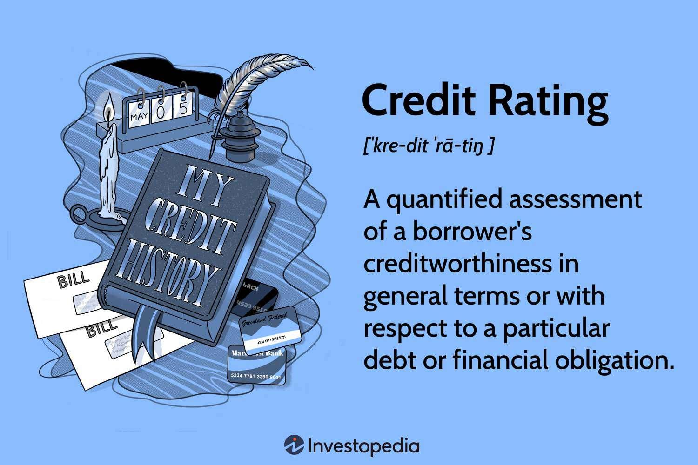

## Table of Contents

## What is a credit rating agency?

A credit rating agency is a company that looks at how likely someone or a company is to pay back money they borrow. They give a score, called a credit rating, which tells lenders if it's safe to lend money to that person or company. The rating helps banks and other lenders decide if they should give a loan and how much interest to charge.

These agencies look at things like past borrowing history, how much debt someone has, and if they pay their bills on time. They use this information to give a rating, which can be high, medium, or low. A high rating means the person or company is very likely to pay back the money, so lenders feel safer giving them a loan. A low rating means there's more risk, so lenders might charge more interest or not give a loan at all.

## What is the purpose of credit rating agencies?

Credit rating agencies help lenders figure out if it's safe to give someone or a company a loan. They do this by giving a score, called a credit rating, which shows how likely the person or company is to pay back the money they borrow. This score helps banks and other lenders make decisions about lending money. If the credit rating is high, it means the borrower is very likely to pay back the loan, so lenders feel more comfortable lending money.

If the credit rating is low, it means there's more risk that the borrower might not pay back the money. In this case, lenders might charge more interest to cover the risk, or they might decide not to give a loan at all. Credit rating agencies look at things like how much debt the borrower has, their history of paying back loans, and if they pay their bills on time. By giving this information to lenders, credit rating agencies help make the lending process safer and more informed.

## How do credit rating agencies assess creditworthiness?

Credit rating agencies look at many things to decide if someone or a company is likely to pay back money they borrow. They check the person's or company's history of paying back loans. If they have always paid on time, that's a good sign. They also look at how much debt the person or company has. If they owe a lot of money already, it might be harder for them to pay back a new loan. Agencies also consider the person's or company's income or how much money they make. If they make a lot of money, it's easier for them to pay back loans.

These agencies use all this information to give a score, called a credit rating. The score can be high, medium, or low. A high score means the person or company is very likely to pay back the money, so lenders feel safe giving them a loan. A low score means there's more risk, so lenders might charge more interest or not give a loan at all. By looking at all these things, credit rating agencies help lenders make smart choices about who to lend money to and how much interest to charge.

## Who are the major credit rating agencies?

The biggest credit rating agencies are Standard & Poor's, Moody's, and Fitch Ratings. These three are often called the "Big Three" because they rate most of the world's companies and countries. Standard & Poor's is known for its letter grades like AAA, AA, A, and so on. Moody's uses a different system with letters and numbers, like Aaa, Aa1, A1, and others. Fitch Ratings also uses a letter grade system similar to Standard & Poor's.

These agencies are important because they help people and companies all over the world know how safe it is to lend money to someone or a country. If a company or country gets a high rating from one of these agencies, it means they are very likely to pay back the money they borrow. This makes lenders feel safer about giving them loans. On the other hand, if a company or country gets a low rating, lenders might be more careful or charge more interest because there's more risk involved.

## What are the different types of credit ratings?

Credit ratings come in two main types: long-term ratings and short-term ratings. Long-term ratings look at how likely someone or a company is to pay back money over a long time, usually more than a year. These ratings use letters like AAA, AA, A, BBB, and so on. A high rating like AAA means the borrower is very likely to pay back the money, while a lower rating like B or C means there's more risk. Short-term ratings focus on how likely someone is to pay back money in the short term, usually less than a year. These ratings often use different letters or numbers, like A-1, A-2, or P-1, P-2.

There are also special types of ratings for different situations. For example, issuer ratings look at the overall creditworthiness of a company or government. Issue-specific ratings focus on a specific loan or bond that the company or government is trying to sell. Another type is sovereign ratings, which rate how likely a country is to pay back its debts. These ratings help lenders decide if it's safe to lend money to a country. Each type of rating helps lenders understand different risks and make better decisions about lending money.

## How do credit ratings impact borrowing costs?

Credit ratings affect how much it costs to borrow money. If a person or company has a high credit rating, like AAA, it means they are seen as very likely to pay back the money they borrow. Because of this, lenders feel safer lending to them and usually offer lower interest rates. This makes borrowing cheaper for those with high ratings.

On the other hand, if someone has a low credit rating, like B or C, it means there's more risk that they might not pay back the money. Lenders see this as riskier, so they might charge higher interest rates to cover that risk. This makes borrowing more expensive for those with low ratings. So, a good credit rating can save a lot of money on borrowing costs, while a bad one can make borrowing much more expensive.

## What are the criticisms of credit rating agencies?

People have some big worries about credit rating agencies. One big worry is that these agencies might not always be right. Sometimes, they give a high rating to a company or country that ends up not paying back their loans. This can cause big problems for people who trusted the rating and lent money. Also, some people think that credit rating agencies focus too much on the past and don't see new risks coming. This can make their ratings less useful for predicting future problems.

Another criticism is that credit rating agencies might have conflicts of interest. They get paid by the companies they rate, which can make it hard for them to be fair. If they give a low rating, the company might not want to pay them again in the future. This can push the agencies to give better ratings than they should. Also, there are only a few big credit rating agencies, and some people think they have too much power. This can make it hard for new agencies to start up and offer different opinions, which might be better for everyone.

## How have credit rating agencies been regulated historically?

Credit rating agencies have been regulated more over time, especially after big financial problems. Before, they didn't have many rules to follow. But after the 2008 financial crisis, people saw that these agencies made some big mistakes. They gave high ratings to risky loans that caused a lot of trouble. So, governments started making new rules to make sure these agencies do a better job.

In the United States, the Dodd-Frank Act was passed in 2010 to fix some of these problems. This law made credit rating agencies follow stricter rules and be more open about how they make their ratings. It also set up a new group called the Office of Credit Ratings to watch over these agencies and make sure they follow the rules. Other countries, like in Europe, also made new laws to keep a closer eye on credit rating agencies and make them more responsible for their ratings.

## What role did credit rating agencies play in the 2008 financial crisis?

Credit rating agencies played a big part in the 2008 financial crisis. They gave high ratings to risky loans, called subprime mortgages, which were bundled into securities and sold to investors. These high ratings made investors think the securities were safe, so they bought a lot of them. But the loans were actually very risky, and when people couldn't pay them back, the value of the securities dropped a lot. This caused big losses for investors and helped start the financial crisis.

The problem was that credit rating agencies were paid by the companies that made these securities. This made it hard for them to be fair because they wanted to keep getting paid. So, they might have given better ratings than they should have. Also, they didn't see the big risks coming because they focused too much on the past. This made their ratings less useful and helped make the financial crisis worse.

## How do credit rating agencies handle conflicts of interest?

Credit rating agencies have a big problem with conflicts of interest because they get paid by the companies they rate. This can make it hard for them to be fair. If they give a low rating, the company might not want to pay them again in the future. So, the agencies might feel pushed to give better ratings than they should. This was a big issue in the 2008 financial crisis when they gave high ratings to risky loans, which caused a lot of trouble.

To deal with these conflicts, some rules have been made to make credit rating agencies more open about how they make their ratings. For example, in the United States, the Dodd-Frank Act made them follow stricter rules and be more clear about their methods. They also have to explain why they give certain ratings. But even with these rules, it's still hard to completely fix the problem because the agencies still get paid by the companies they rate.

## What are the international differences in credit rating practices?

Credit rating practices can be different in different countries. In the United States, the big three agencies, Standard & Poor's, Moody's, and Fitch Ratings, are very important. They use letter grades like AAA, AA, A, and so on to show how likely someone or a company is to pay back money. The U.S. has strict rules, like the Dodd-Frank Act, to make sure these agencies are fair and open about how they make their ratings. In Europe, there are also rules to watch over credit rating agencies, but they might be a bit different. The European Union has its own laws to make sure these agencies are responsible and don't cause big problems like they did in the 2008 financial crisis.

In other parts of the world, like Asia, credit rating practices can be different too. Some countries have their own local credit rating agencies that might use different methods or focus on different things. For example, in Japan, the rating agency might look more at how stable a company is over time, not just how much debt they have. Also, some countries might not trust foreign credit rating agencies as much and prefer to use their own. This can make it harder for companies in those countries to borrow money from other places because their ratings might not be seen as good enough.

## How might future technologies impact the operations of credit rating agencies?

Future technologies could change how credit rating agencies work in big ways. One way is by using [artificial intelligence](/wiki/ai-artificial-intelligence) (AI) and [machine learning](/wiki/machine-learning). These technologies can look at a lot of data very quickly and find patterns that people might miss. This could help credit rating agencies make better and faster decisions about how likely someone or a company is to pay back money. They could use AI to check more things, like social media or online behavior, to see if someone is trustworthy. This might make their ratings more accurate and help them see new risks coming.

Another way technology could change credit rating agencies is through blockchain. Blockchain is a way to keep records that is very safe and hard to change. If credit rating agencies use blockchain, they could make their ratings more open and easier to trust. People could see exactly how a rating was made and be sure it wasn't changed later. This could help fix the problem of conflicts of interest because everyone could see how the agencies work. Also, new technologies might let more small credit rating agencies start up, which could give people more choices and make the big agencies work harder to be fair and accurate.

## What is the role of financial services rating agencies?

Financial services rating agencies are pivotal institutions in the financial ecosystem, tasked with evaluating the creditworthiness of diverse organizations and financial instruments. These agencies provide ratings that range from AAA, the highest credit quality, to D, indicating default, which serve as a compass for investors in navigating investment decisions.

The ratings bestowed by these agencies hinge on a comprehensive examination of quantitative and qualitative factors that encompass financial ratios, market position, and economic conditions. Credit rating agencies employ methodologies often anchored in financial metrics such as the interest coverage ratio, defined as:

$$
\text{Interest Coverage Ratio} = \frac{\text{EBIT}}{\text{Interest Expense}}
$$

where EBIT represents earnings before interest and taxes. A higher ratio suggests robust financial health, indicating that the entity can sufficiently cover its interest obligations, facilitating a favorable rating.

Beyond the calculations, the methodologies integrate qualitative assessments, encompassing management quality, industry characteristics, and governance practices. These holistic evaluations enable investors to infer the potential risk and return from different investment choices, aligning their strategies with their risk tolerance and investment objectives.

Transparency and consistency are underscored as essential attributes for these ratings, particularly in volatile markets teetering on uncertainty. The credibility of a rating hinges on transparent criteria and consistent application of methodologies to ensure that the ratings are reflective of the actual financial condition and risks inherent in the rated entity or instrument.

The demand for transparency is further compounded by the increasing complexity of financial markets and instruments. Investors need assurance that the rating agencies operate impartially, free from conflicts of interest, to uphold the integrity of their assessments. This expectation has prompted regulatory frameworks aimed at enhancing disclosure standards and accountability for rating agencies, thus helping to restore and sustain investor confidence in financial ratings.

## What is Algorithmic Trading: An Overview?

Algorithmic trading, often referred to as algo trading, employs automated platforms to execute financial transactions with precision and speed far surpassing human capabilities. This approach relies heavily on complex mathematical models and vast datasets, making it essential to analyze past performance to formulate predictive strategies for future trades. The underpinning algorithms consider various parameters, such as market trends, historical data, and statistical [arbitrage](/wiki/arbitrage), to optimize trade execution.

One fundamental principle behind [algorithmic trading](/wiki/algorithmic-trading) is the use of statistical methods to identify patterns and trends in market data, allowing traders to anticipate market movements. These algorithms typically operate on a principle known as quantitative finance, where the relationship between two variables is expressed through mathematical formulations. For instance, the moving average crossover strategy, frequently used in algorithmic trading, can be modeled as follows:

$$
\text{Signal} = \text{Short-term Moving Average} - \text{Long-term Moving Average}
$$

Here, a positive signal indicates a potential buy, while a negative one suggests a sell, allowing for disciplined and rapid response to market fluctuations.

As algorithmic trading grows in popularity, it presents new challenges for regulators and credit agencies to ensure the legitimacy of trading activities. The automated nature of algorithmic systems necessitates a robust validation framework to guard against market manipulation and false trading claims. This requires regulators to establish stringent compliance checks and data monitoring to detect and mitigate any unscrupulous trading behavior.

Algorithmic trading significantly influences market dynamics, contributing to higher market [liquidity](/wiki/liquidity-risk-premium) and narrower spreads. However, it also introduces [volatility](/wiki/volatility-trading-strategies), especially during periods of market stress, when trading algorithms might simultaneously trigger large-scale buying or selling. The 2010 Flash Crash is a notable example, where algorithmic trading was partially blamed for the rapid, massive drop in equity prices. Thus, establishing firm regulatory measures and reliable validation mechanisms is crucial to harness the benefits of algorithmic trading while curbing its risks.

Conclusively, algorithmic trading is an integral part of the modern financial ecosystem, enhancing trade efficiency and accuracy. Yet, its complexity demands vigilant oversight and the development of advanced frameworks to manage its implications and ensure fair market practices. Regulators must continue to evolve along with technological advancements to safeguard the integrity of financial markets.

## References & Further Reading

[1]: ["The Role of Credit Rating Agencies"](https://www.wallstreetmojo.com/credit-rating-agencies/) by the International Monetary Fund

[2]: ["Regulatory Framework for Algorithmic Trading"](https://www.finra.org/rules-guidance/key-topics/algorithmic-trading) by the European Securities and Markets Authority

[3]: Lopez de Prado, M. (2018). ["Advances in Financial Machine Learning"](https://www.amazon.com/Advances-Financial-Machine-Learning-Marcos/dp/1119482089). Wiley.

[4]: Chan, E. P. (2008). ["Quantitative Trading: How to Build Your Own Algorithmic Trading Business"](https://github.com/egorpe/EPChan-QuantitativeTrading/blob/master/example7_6.m). Wiley.

[5]: ["The Credit Rating Controversy"](https://www.cfr.org/backgrounder/credit-rating-controversy) by the Council on Foreign Relations