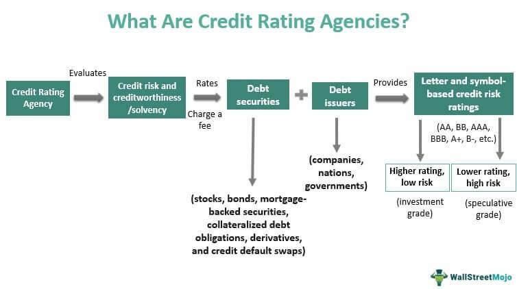

## Table of Contents

## What is a credit rating in finance?

A credit rating is a score given to a person or a company to show how likely they are to pay back money they borrow. It's like a grade that banks and other lenders use to decide if they should lend money and how much interest to charge. The rating is based on things like how much debt someone has, if they pay their bills on time, and their overall financial health.

Credit ratings are important because they affect how much it costs to borrow money. If someone has a high credit rating, it means they are seen as reliable and less risky, so they can borrow money at lower interest rates. On the other hand, if someone has a low credit rating, they might have to pay more interest because lenders see them as more likely to miss payments or not pay back the money at all.

## Why are credit ratings important for investors and borrowers?

Credit ratings are important for investors because they help them understand how safe their investments are. When investors want to buy bonds or lend money to a company, they look at the credit rating to see if the company is likely to pay back the money on time. A high credit rating means the company is trustworthy and less risky, so investors feel more confident about their investment. If the credit rating is low, investors might think twice because there's a bigger chance they won't get their money back.

For borrowers, credit ratings are crucial because they affect how much it costs to borrow money. If a person or a company has a good credit rating, banks and other lenders see them as reliable and are more willing to lend them money at lower interest rates. This makes borrowing cheaper and easier. But if the credit rating is low, lenders might charge higher interest rates or even refuse to lend money, making it harder and more expensive for the borrower to get the funds they need.

## How are credit ratings determined?

Credit ratings are determined by looking at a lot of information about a person or a company. For people, this includes things like their payment history, how much debt they have, how long they've been using credit, the types of credit they use, and if they've applied for new credit recently. For companies, credit agencies look at their financial statements, how much money they make, their debt levels, and how well they manage their money. They might also consider the company's history and the overall health of the industry it's in.

Credit rating agencies like Moody's, Standard & Poor's, and Fitch use all this information to give a score or a grade. This score shows how likely someone is to pay back their debts. The agencies use special formulas and models to figure out the score, but the main idea is to see if the person or company is responsible with money. If they pay their bills on time and don't have too much debt, they'll get a higher rating. If they miss payments or have a lot of debt, their rating will be lower.

## What are the main types of credit ratings?

There are two main types of credit ratings: personal credit ratings and corporate credit ratings. Personal credit ratings are scores given to individuals. They show how well someone manages their money, like if they pay their bills on time and how much debt they have. These ratings help banks decide if they should lend money to a person and at what [interest rate](/wiki/interest-rate-trading-strategies). A high personal credit rating means a person is seen as reliable and less risky, so they can borrow money more easily and at lower interest rates.

Corporate credit ratings are given to businesses and companies. They show how likely a company is to pay back its debts. These ratings are important for investors who want to buy the company's bonds or lend them money. A high corporate credit rating means the company is financially healthy and less risky, so investors feel more confident about their investment. If a company has a low rating, it might have to pay higher interest rates to borrow money, or investors might be less willing to lend to them.

## Who are the major credit rating agencies?

The major credit rating agencies are Moody's, Standard & Poor's (S&P), and Fitch Ratings. These agencies are really important because they give scores to people and companies to show how likely they are to pay back money they borrow. Moody's, S&P, and Fitch use special formulas to look at things like payment history, debt levels, and financial health to come up with these scores. Their ratings help banks decide if they should lend money and at what interest rate, and they help investors know if their investments are safe.

These agencies have been around for a long time and are trusted by a lot of people. They rate everything from small personal loans to big company bonds. When they give a high rating, it means they think the person or company is reliable and less risky. A low rating means there's a bigger chance they won't pay back the money. Because of this, the ratings from Moody's, S&P, and Fitch can really affect how much it costs to borrow money and how confident investors feel about their investments.

## How do credit rating agencies make money?

Credit rating agencies make money by charging fees for their services. When a company wants to get a credit rating, they pay the agency to look at their financial information and give them a score. This score helps the company show investors and lenders how reliable they are. The agencies also charge fees for keeping the ratings up to date, which they do regularly to make sure the scores are still accurate.

Besides rating companies, these agencies also make money from selling their research and data. Investors and financial institutions pay for reports and analysis that help them make better decisions about where to put their money. This extra information can be really useful, so people are willing to pay for it. By offering both ratings and detailed research, credit rating agencies can earn money in different ways and keep their business going strong.

## What is the difference between investment grade and non-investment grade ratings?

Investment grade ratings are given to people or companies that are seen as pretty safe to lend money to. They have a good chance of paying back their debts on time. These ratings are usually given by big credit rating agencies like Moody's, S&P, and Fitch. If a company has an investment grade rating, it means they are reliable and less risky. So, investors feel more comfortable buying their bonds or lending them money, and the company can borrow at lower interest rates.

Non-investment grade ratings, also called junk ratings, are given to people or companies that are seen as more risky. They might have a harder time paying back their debts on time. Because of this, investors see them as less safe to invest in. If a company has a non-investment grade rating, they might have to pay higher interest rates to borrow money because lenders want to be paid more for taking on the extra risk. These ratings can make it harder and more expensive for the company to get the money they need.

## How can a credit rating affect the interest rate on a bond?

A credit rating can really change how much interest a company has to pay on its bonds. If a company has a good credit rating, like an investment grade, it means they are seen as reliable and less risky. So, when they issue bonds, investors feel safer about lending them money. Because of this, the company can offer lower interest rates on their bonds, and people will still want to buy them. It's like getting a better deal because everyone trusts the company will pay back the money on time.

On the other hand, if a company has a bad credit rating, like a non-investment grade or junk rating, it means they are seen as more risky. Investors might worry that the company won't be able to pay back the money they borrow. To make up for this risk, the company has to offer higher interest rates on their bonds to attract investors. This makes borrowing more expensive for the company because they have to pay more money back over time. So, a credit rating can make a big difference in how much it costs a company to borrow money through bonds.

## What are the potential conflicts of interest in the credit rating industry?

Credit rating agencies can face conflicts of interest because they get paid by the companies they rate. This means they might be tempted to give a better rating to a company that pays them a lot of money, even if the company isn't as safe as the rating suggests. If the agencies give too many high ratings, it can make investors feel too safe and take more risks than they should. This can be a problem because it might lead to big financial mistakes, like what happened during the 2008 financial crisis when many risky investments were given high ratings.

Another issue is that credit rating agencies also sell their research and data to investors. They might want to keep their clients happy by giving ratings that make them feel good about their investments. This can make it hard for the agencies to be completely honest and fair. If they focus too much on making money from their clients, they might not give the most accurate ratings, which can hurt investors and the overall economy.

## How do sovereign credit ratings differ from corporate credit ratings?

Sovereign credit ratings are scores given to countries to show how likely they are to pay back their debts. These ratings look at things like a country's economy, how much money they make, and their political situation. If a country has a high sovereign credit rating, it means they are seen as reliable and less risky. This can help them borrow money at lower interest rates from other countries or investors. But if a country has a low rating, it might have to pay more interest to borrow money because lenders see them as more likely to miss payments or not pay back the money at all.

Corporate credit ratings, on the other hand, are scores given to companies to show how likely they are to pay back their debts. These ratings look at the company's financial statements, how much money they make, their debt levels, and how well they manage their money. A high corporate credit rating means the company is seen as financially healthy and less risky, so investors feel more confident about lending them money or buying their bonds. If a company has a low rating, they might have to pay higher interest rates to borrow money because lenders see them as more risky.

## What role do credit ratings play in regulatory frameworks?

Credit ratings are important in regulatory frameworks because they help set rules for how much risk banks and other financial institutions can take. Regulators use credit ratings to decide how much money banks need to keep in reserve when they lend money or invest in bonds. If a bank invests in something with a high credit rating, they might not need to keep as much money in reserve because it's seen as less risky. But if they invest in something with a low credit rating, they have to keep more money in reserve to cover the higher risk. This helps make the financial system safer by making sure banks are prepared for potential losses.

Regulators also use credit ratings to protect investors. For example, some investment funds can only buy bonds with certain credit ratings. This means the funds can't invest in very risky bonds, which helps keep the money of the people who invest in these funds safer. By using credit ratings in this way, regulators can make sure that financial markets work well and that investors are not taking on too much risk without knowing it. This helps keep the economy stable and protects people's savings.

## How have credit rating methodologies evolved over time?

Credit rating methodologies have changed a lot over time as the financial world has grown more complex. In the early days, credit ratings were pretty simple. Agencies like Moody's and Standard & Poor's mostly looked at a company's financial statements to see if they had enough money to pay back their debts. But as more people and companies started borrowing money, the agencies had to find better ways to understand risk. They started using more detailed information, like how a company manages its money, its history of paying back debts, and even the overall health of the industry it's in. This made the ratings more accurate and useful for investors and lenders.

Over the years, credit rating agencies have also started using more advanced tools and technology to make their ratings better. They now use computer models and big data to look at a lot more information at once. This helps them see patterns and risks that they might have missed before. After the 2008 financial crisis, people realized that credit ratings weren't always right, so the agencies had to improve their methods even more. They started looking at more factors, like how a company might be affected by things like climate change or new laws. By keeping up with these changes, credit rating agencies can give more reliable ratings that help keep the financial system safe and stable.

## References & Further Reading

[1]: ["Historical Evolution of Credit Rating Agencies"](https://www.investopedia.com/articles/bonds/09/history-credit-rating-agencies.asp) by R.V. Bidisha, Journal of Applied Corporate Finance.

[2]: ["Credit Ratings: Methodologies, Rationale and Default Risk"](https://www.amazon.com/Credit-Ratings-Methodologies-Rationale-Default/dp/1899332693) by A. Löffler, Journal of Credit Risk.

[3]: ["The Role of Credit Rating Agencies in Global Financial Governance"](https://link.springer.com/chapter/10.1007/978-3-030-03709-3_3) by T. Sinclair, Oxford University Press.

[4]: ["The Credit Rating Agencies and Their Credit Ratings: What They Are, How They Work, and Why They are Relevant"](https://www.wiley.com/en-us/The+Rating+Agencies+and+Their+Credit+Ratings%3A+What+They+Are%2C+How+They+Work%2C+and+Why+They+are+Relevant-p-9780470714355) by Herwig Langohr and Patricia Langohr.

[5]: ["Risk and Rating in Corporate Finance"](https://www.investopedia.com/terms/c/corporate-credit-rating.asp) by Robert Faure, Springer.

[6]: ["Algorithmic Trading and DMA: An Introduction to Direct Access Trading"](https://archive.org/details/algorithmictradi0000john) by Barry Johnson. 

[7]: ["The Handbook of Credit Risk Management: Originating, Assessing, and Managing Credit Exposures"](http://dspace.vnbrims.org:13000/xmlui/bitstream/handle/123456789/4696/The%20Handbook%20of%20Credit%20Risk%20Management%20Originating%2C%20Assessing%2C%20and%20Managing%20Credit%20Exposures.pdf?sequence=1) by Sylvain Bouteille and Diane Coogan-Pushner.