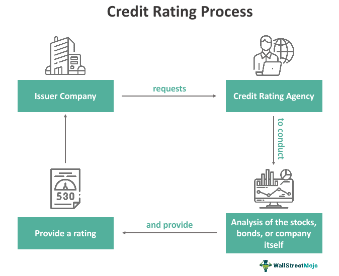

Credit ratings are essential components in finance, acting as indicators of the financial health and trustworthiness of various entities such as individuals, corporations, or governments. They serve as critical tools for investors and financial analysts, guiding investment decisions by providing insights into the risk profile and creditworthiness of borrowers. Credit ratings influence not only the interest rates entities pay but also affect investment strategies, impacting which assets investors might include in their portfolios.

This article aims to offer a comprehensive understanding of credit ratings by exploring their various types, examining the roles of financial agencies that assign these ratings, and demonstrating how these ratings are integrated into algorithmic trading systems. It highlights the impact credit ratings have on investment and trading strategies, underscoring their importance in shaping the global financial landscape. By reviewing the mechanics and implications of credit ratings, the article seeks to provide valuable insights into how these ratings influence market dynamics and investor behavior.



## Table of Contents

## What are Credit Ratings?

Credit ratings are critical evaluations provided by specialized agencies to determine the creditworthiness of borrowers, which can be individuals, corporations, or governments. These assessments are central to the financial market dynamics, as they significantly influence both the interest rates entities will be charged and the investment decisions undertaken by investors.

A credit rating is essentially a quantified measure, expressed as a letter grade, where the scale typically ranges from AAA, indicating the highest level of creditworthiness, to D, signaling default. These ratings serve as risk indicators, guiding investors on the likelihood of a borrower defaulting on their financial obligations. A higher rating generally suggests a lower risk, potentially resulting in lower interest rates for the borrower due to perceived stability and reliability.

Three prominent agencies dominate the credit rating landscape: Standard & Poor's (S&P), Moody's Investors Service, and Fitch Ratings. Each of these agencies employs distinct methodologies to evaluate creditworthiness, yet all consider key factors such as the entity's financial health, economic environment, and repayment history. Their ratings influence market perceptions and decisions by offering a streamlined assessment of credit risk.

For investors, credit ratings are indispensable tools. They provide a standardized and reliable measure to compare the credit risks associated with different borrowers. Such evaluations help in diversifying portfolios, managing risks, and optimizing investment returns. By assessing the credit ratings, investors can determine the interest income potential relative to the risk they are willing to assume.

In summary, credit ratings are integral to the financial ecosystem, playing a pivotal role in the borrowing process by affecting interest rates and influencing investor strategies. Understanding these ratings enables market participants to make informed financial decisions based on the creditworthiness of borrowers.

## Types of Credit Ratings

Credit ratings serve as crucial indicators of the financial health and creditworthiness of entities, such as corporations and governments. These ratings can be divided into two primary categories: Investment-Grade and Speculative. 

Investment-Grade ratings are assigned to entities or securities that exhibit a lower risk of default. Typically, these ratings range from AAA, the highest quality with the least risk, down through AA, A, and BBB ratings. Entities with Investment-Grade ratings are deemed to have a strong capacity to meet their financial commitments. This category is favored by risk-averse investors such as pension funds and insurance companies, who seek stable returns and are often bound by regulations that limit investments to only Investment-Grade securities.

On the other hand, Speculative ratings, sometimes referred to as Non-Investment-Grade or junk status, indicate higher risk and a greater possibility of default. These ratings encompass BB, B, CCC, CC, C, and finally D, which signifies default. Investors interested in Speculative-grade securities typically anticipate higher yields to compensate for the increased risk. Speculative ratings appeal to those willing to engage in higher risk-reward investment strategies, potentially gaining substantial returns in exchange for assuming greater risk.

The granularity in credit ratings (AAA to D) provides a spectrum for investors to assess the financial risks associated with different securities. Ratings agencies such as Standard & Poor's, Moody's, and Fitch Ratings employ extensive quantitative and qualitative analysis to arrive at these ratings. Their methodologies incorporate factors like the entity's debt levels, economic conditions, and historical performance.

Understanding the difference between Investment-Grade and Speculative ratings is essential for investors aiming to diversify their portfolios based on risk tolerance and investment goals. As market conditions fluctuate, these ratings offer an invaluable tool for assessing credit risk and making informed investment decisions.

## Role of Financial Agencies

Financial agencies, such as Standard & Poor's (S&P), Moody's Investors Service, and Fitch Ratings, play a pivotal role in the financial markets by providing credit ratings that assess the creditworthiness of borrowers, including corporations, governments, and financial instruments. These ratings fundamentally influence global financial markets and are crucial in determining the cost of borrowing for these entities. 

These agencies employ a systematic approach to assign credit ratings, taking into account a diverse range of financial factors. These factors typically include the borrower's ability to repay debt, the economic environment, historical financial performance, and any potential future risks. The evaluation process often involves both qualitative and quantitative analyses. Quantitative analysis may include the examination of key financial ratios, such as the debt-to-equity ratio, interest coverage ratio, and return on equity, which provide insights into the financial health and stability of the borrower. Qualitatively, these agencies might assess factors such as management effectiveness, industry risks, and regulatory environment. 

The impact of these credit ratings extends beyond the immediate scope of interest rates and borrowing costs. Ratings serve as crucial indicators for investors, influencing perceptions and guiding investment decisions. A high credit rating typically suggests a lower risk of default, making the entity more attractive to investors, which can lead to more favorable borrowing terms and increased investments. Conversely, a lower credit rating may signal higher risk and result in increased borrowing costs or even affect the entity's ability to acquire funding. 

Moreover, credit rating agencies provide valuable guidance on potential investment opportunities. By evaluating an entity's creditworthiness, these ratings offer insights into the risk/reward profile of securities. Investors and financial analysts leverage this information to make informed decisions about buying, holding, or selling securities. Additionally, credit ratings are often embedded into financial products, and many institutional investors have mandates that necessitate holding only investment-grade securities, further emphasizing the importance of these ratings in guiding capital flows.

In summary, the evaluations by S&P, Moody’s, and Fitch Ratings are integral to the functioning of global financial markets. They not only affect the cost and accessibility of capital for entities but also influence investor behavior and market dynamics by providing a structured framework for assessing credit risk and uncovering investment opportunities.

## Analyst Ratings and Credit Rating Agencies

Analyst ratings and credit rating agencies serve distinct yet complementary roles in the financial sector. Analyst ratings predominantly offer guidance on individual stocks by issuing recommendations such as 'buy', 'hold', or 'sell'. These ratings are determined by financial analysts who assess various factors, including a company's financial health, market conditions, and potential for future growth. These recommendations provide investors with insights into the expected performance of specific stocks and assist them in making informed investment decisions. 

In contrast, credit rating agencies like Standard & Poor's, Moody's Investors Service, and Fitch Ratings focus on assessing the creditworthiness of debt instruments such as corporate and government bonds. These agencies evaluate an issuer's ability to meet its financial obligations, which significantly impacts bond prices and yields. Credit ratings are typically expressed in letter grades, with higher ratings indicating lower risk. For instance, a rating of 'AAA' represents the highest level of creditworthiness, whereas a 'D' rating indicates default. These ratings influence investor perceptions by providing insights into the likelihood of default, thereby affecting the cost of borrowing for issuers.

Both analyst ratings and credit ratings play pivotal roles in shaping the investment landscape. Analyst ratings help investors align their portfolios with potential stock market movements, whereas credit ratings influence decisions regarding fixed-income investments. The interplay between these ratings assists investors in balancing their risk and return preferences across different asset classes. In this context, credit rating changes can also prompt analysts to revise their stock recommendations, and conversely, shifts in company prospects can affect credit evaluations.

The combined insights from analyst ratings and credit ratings contribute to a more comprehensive understanding of potential investment opportunities and risks. As a result, these ratings significantly guide decision-making processes and facilitate more strategic asset allocation within the diverse spectrum of investment options.

## Algorithmic Trading and Integration of Credit Ratings

Algorithmic trading comprises the use of sophisticated computer algorithms to execute trading decisions based on diverse data inputs. Among these inputs, credit ratings play an influential role. These ratings, assigned by agencies such as Standard & Poor's, Moody's Investors Service, and Fitch Ratings, evaluate the creditworthiness of entities, such as corporations or governments. Within [algorithmic trading](/wiki/algorithmic-trading) systems, credit ratings act as critical indicators, alerting traders and automated systems to potential changes in issuer risk. 

The integration of credit ratings in algorithmic trading facilitates better management of risks and enhances the optimization of trading decisions. This is achieved by allowing systems to incorporate creditworthiness data, thereby influencing algorithmic responses to changes in perceived financial stability. For instance, if a credit rating downgrade occurs, the algorithms can adjust trading strategies dynamically to mitigate potential risks associated with the increased likelihood of defaults. Conversely, an upgrade in credit rating might signal improved creditworthiness, prompting algorithms to adopt more aggressive trading strategies to capitalize on perceived opportunities.

Algorithmic trading strategies often rely on a variety of mathematical models and data analytics techniques, where credit ratings can be input variables affecting decision matrices. For instance, risk management algorithms might [factor](/wiki/factor-investing) in credit ratings to calculate Value at Risk (VaR) and adjust portfolios accordingly. Below is a simplified example in Python illustrating how credit ratings might be incorporated into a trading strategy:

```python
import random

# Simulated credit ratings and trading strategy adjustments
def adjust_strategy_based_on_rating(rating):
    if rating in ['AAA', 'AA', 'A']:
        # High creditworthiness, consider aggressive buying
        return "aggressive"
    elif rating in ['BBB', 'BB', 'B']:
        # Moderate risk, consider neutral strategy
        return "neutral"
    else:
        # High risk, adopt defensive measures
        return "defensive"

# Example usage
current_rating = random.choice(['AAA', 'AA', 'A', 'BBB', 'BB', 'B', 'CCC', 'CC', 'C', 'D'])
strategy = adjust_strategy_based_on_rating(current_rating)
print(f"Current Rating: {current_rating}, Trading Strategy: {strategy}")
```

In the algorithm above, the trading strategy is adjusted based on the credit rating of an entity. This exemplifies how real-world algorithmic trading systems might adjust portfolio allocations or risk exposure depending on changes in credit ratings. As financial markets evolve, the integration of credit ratings within algorithmic trading systems is expected to continue playing a significant role in sophisticated investment strategies.

## Impact of Credit Rating Changes on Markets

Changes in credit ratings have profound effects on market dynamics, particularly with regard to the [liquidity](/wiki/liquidity-risk-premium) and pricing of securities. When a credit rating for a corporation, government, or any other entity is adjusted, it often prompts a significant market response, as these ratings serve as critical signals for investors in assessing the risk and return profiles of these entities.

When an entity’s credit rating is downgraded, it typically leads to a rise in its borrowing costs. This occurs because lower credit ratings indicate a higher risk of default, thus necessitating higher interest rates to compensate lenders for the increased risk. This scenario is often accompanied by a sell-off in the entity’s securities as investors reassess the riskiness of holding those assets. Such actions can lead to a decline in security prices, thereby affecting overall market stability. For example, bonds with lower ratings may experience decreased liquidity as cautious investors opt to reduce exposure, leading to widening bid-ask spreads and heightened [volatility](/wiki/volatility-trading-strategies).

Conversely, upgrades in credit ratings generally have beneficial impacts. Enhanced ratings signify improved creditworthiness, usually resulting in decreased borrowing costs due to lower perceived risks. This can attract investors searching for more secure investment opportunities, often leading to an increase in security prices. The improved sentiment can enhance the issuer's credibility, thereby fostering greater market confidence and potentially increasing liquidity for its securities. Upgraded ratings may also provide entities with more favorable conditions when accessing capital markets, allowing for strategic financial maneuvering and investment.

Overall, credit rating changes play an essential role in influencing market perceptions and actions. They serve as catalysts that can alter the cost of capital, liquidity, and the valuation of financial instruments, underscoring the interconnected nature of credit assessments and market performance. The responses to these changes highlight the importance of credit ratings as a barometer for financial health and risk assessment in the markets.

## Conclusion

Credit ratings play a fundamental role in shaping the financial landscape by providing insights into the creditworthiness of various entities, from individual corporations to entire governments. These evaluations are essential for informing investment decisions, as they directly affect the perception of risk and anticipated returns associated with different securities. Investors and traders must grasp the nuances of credit ratings to navigate the complexities of financial markets effectively.

Understanding the spectrum of credit ratings and their impact is crucial. Investment-grade ratings typically suggest lower risk and more attractive financing terms, while speculative-grade ratings generally imply higher risk and potential difficulties in meeting financial obligations. Consequently, credit ratings influence the cost of borrowing, investor confidence, and the overall stability of financial markets.

As the dynamics of financial markets continue to evolve, the integration of credit ratings into sophisticated trading systems, such as algorithmic trading, is becoming increasingly prevalent. Algorithms that incorporate credit ratings data can adjust investment strategies based on changes in perceived credit risk. This integration allows for the optimization of trading decisions and risk management, enhancing the efficiency and effectiveness of market operations.

In conclusion, credit ratings are indispensable to the financial ecosystem. They not only guide investment and trading decisions but also provide a framework for understanding market behaviors and dynamics. As technology and markets progress, the role of credit ratings in algorithmic trading will likely expand, further influencing the evolution of advanced investment strategies. This makes an in-depth understanding of credit ratings and their implications more important than ever for participants in the financial sector.

## References & Further Reading

[1]: ["Historical Evolution of Credit Rating Agencies"](https://www.investopedia.com/articles/bonds/09/history-credit-rating-agencies.asp) by R.V. Bidisha, Journal of Applied Corporate Finance.

[2]: ["Credit Ratings: Methodologies, Rationale and Default Risk"](https://www.amazon.com/Credit-Ratings-Methodologies-Rationale-Default/dp/1899332693) by A. Löffler, Journal of Credit Risk.

[3]: ["The Role of Credit Rating Agencies in Global Financial Governance"](https://link.springer.com/chapter/10.1007/978-3-030-03709-3_3) by T. Sinclair, Oxford University Press.

[4]: ["The Credit Rating Agencies and Their Credit Ratings: What They Are, How They Work, and Why They are Relevant"](https://www.wiley.com/en-us/The+Rating+Agencies+and+Their+Credit+Ratings%3A+What+They+Are%2C+How+They+Work%2C+and+Why+They+are+Relevant-p-9780470714355) by Herwig Langohr and Patricia Langohr.

[5]: ["Risk and Rating in Corporate Finance"](https://www.investopedia.com/terms/c/corporate-credit-rating.asp) by Robert Faure, Springer.

[6]: ["Algorithmic Trading and DMA: An Introduction to Direct Access Trading"](https://archive.org/details/algorithmictradi0000john) by Barry Johnson. 

[7]: ["The Handbook of Credit Risk Management: Originating, Assessing, and Managing Credit Exposures"](http://dspace.vnbrims.org:13000/xmlui/bitstream/handle/123456789/4696/The%20Handbook%20of%20Credit%20Risk%20Management%20Originating%2C%20Assessing%2C%20and%20Managing%20Credit%20Exposures.pdf?sequence=1) by Sylvain Bouteille and Diane Coogan-Pushner.