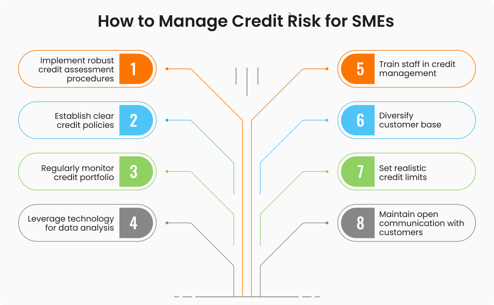

## Table of Contents

## What is credit risk and why is it important for small companies?

Credit risk is the chance that a person or a business won't be able to pay back the money they borrowed. For small companies, this can mean not being able to pay back a loan from a bank or not getting paid by their customers on time. Managing credit risk is important because it helps small companies avoid running out of money, which can lead to big problems or even closing down.

For small companies, keeping an eye on credit risk is really important. If they borrow money and can't pay it back, it can hurt their reputation and make it harder to get loans in the future. Also, if their customers don't pay on time, it can mess up their cash flow, making it tough to pay for things like rent, supplies, or employee salaries. By understanding and managing credit risk, small companies can stay financially healthy and keep growing.

## How can small companies assess their creditworthiness?

Small companies can assess their creditworthiness by looking at their credit reports from credit bureaus. These reports show how well the company has paid back loans in the past and if they have paid their bills on time. If a company sees that it has a good history of paying back money, it means they are likely to be seen as creditworthy. They can also check their credit score, which is a number that shows how risky it is to lend money to them. A higher score usually means the company is more creditworthy.

Another way small companies can assess their creditworthiness is by looking at their financial statements. They should check their income statement to see if they are making more money than they are spending. They should also look at their balance sheet to see if they have more assets than liabilities. If a company has a strong financial position, it is more likely to be seen as creditworthy. Talking to their bank or a financial advisor can also help them understand their creditworthiness better and get tips on how to improve it.

## What are the key financial ratios used in credit risk assessment for small businesses?

When small businesses want to understand their credit risk, they often look at some key financial ratios. One important ratio is the debt-to-equity ratio, which shows how much money the business has borrowed compared to how much money the owners have put into the business. A lower debt-to-equity ratio means the business is less risky because it relies less on borrowed money. Another useful ratio is the current ratio, which tells you if the business can pay its short-term bills by comparing its current assets to its current liabilities. A current ratio higher than 1 means the business has enough assets to cover its short-term debts.

Another ratio to consider is the interest coverage ratio, which shows if the business can pay the interest on its loans with its earnings before interest and taxes (EBIT). A higher interest coverage ratio means the business is in a better position to handle its debt payments. The accounts receivable turnover ratio is also important because it shows how quickly the business collects money from its customers. A higher turnover ratio means the business is good at getting paid on time, which helps with cash flow. By looking at these ratios, small businesses can get a clear picture of their credit risk and work on improving their financial health.

## What role do credit reports and scores play in assessing credit risk for small companies?

Credit reports and scores are really important when it comes to figuring out the credit risk for small companies. A credit report is like a history book of how well a company has paid back money it borrowed. It shows if the company paid its bills on time, how much money it owes, and if it has ever missed payments. Banks and other lenders look at this report to see if the company is a safe bet to lend money to. If the report shows the company always pays on time, it's seen as less risky.

The credit score is a number that comes from the credit report. It's like a quick summary of the company's credit health. A high credit score means the company is good at handling money and is likely to pay back loans on time. A low score means the company might be risky to lend to. Lenders use this score to decide if they should give the company a loan and at what [interest rate](/wiki/interest-rate-trading-strategies). For small companies, having a good credit report and score can make it easier to get the money they need to grow and stay healthy.

## How can a small company improve its credit risk profile?

A small company can improve its credit risk profile by paying its bills on time. This shows lenders that the company is good at handling money. It's also important to keep the amount of debt low. If a company borrows less money, it looks less risky to lenders. The company should also check its credit report often to make sure everything is correct. If there are mistakes, fixing them can help improve the credit score.

Another way to improve the credit risk profile is by keeping good financial records. This means making sure the company's income statement and balance sheet look healthy. The company should aim to have more money coming in than going out and more assets than liabilities. Talking to a financial advisor can also help. They can give advice on how to manage money better and improve the company's creditworthiness. By doing these things, a small company can show lenders that it is a safe and reliable business to work with.

## What are the common credit risk assessment models used for small businesses?

Credit risk assessment models for small businesses often use a mix of financial ratios and credit history to predict how likely a company is to pay back loans. One common model is the Altman Z-Score, which looks at five financial ratios to see if a business might go bankrupt. Another model is the Credit Scoring Model, which gives a score based on things like payment history, amount of debt, and how long the business has been around. These models help lenders decide if a small business is a safe bet for a loan.

Another model used is the Five Cs of Credit, which stands for Character, Capacity, Capital, Collateral, and Conditions. This model looks at the owner's personal credit history and reputation (Character), the business's ability to repay the loan (Capacity), the money the owner has invested in the business (Capital), assets that can be used to secure the loan (Collateral), and the economic environment (Conditions). By looking at these five areas, lenders can get a full picture of the small business's credit risk.

Sometimes, small businesses use simpler models like the Debt Service Coverage Ratio (DSCR), which compares the business's cash flow to its debt payments. A higher DSCR means the business has enough cash to cover its debts, making it less risky. These models help small businesses and lenders make smarter decisions about borrowing and lending money.

## How do lenders evaluate the management team of a small company in terms of credit risk?

Lenders look at the management team of a small company to see if they can trust them with money. They check the team's experience and skills to see if they know how to run a business well. If the managers have a good track record and have successfully managed other businesses before, lenders feel more confident that the company will pay back its loans.

Lenders also look at how the management team has handled money in the past. They check if the managers have paid their bills on time and if they have a good credit history. If the team has always been responsible with money, lenders think the company is less risky. This helps lenders decide if they should give the company a loan and at what interest rate.

## What are the industry-specific factors that affect credit risk assessment for small companies?

Different industries have their own special things that can affect how risky it is to lend money to small companies. For example, in the restaurant business, how much money the company makes can change a lot depending on the time of year or even the day of the week. This can make it harder for lenders to guess if the restaurant will have enough money to pay back a loan. Also, if the restaurant is in a place where a lot of other restaurants are closing down, it might be seen as more risky.

In the tech industry, things like how fast technology changes can affect credit risk. If a small tech company is working on something new, it might be hard to tell if they will make money from it. Lenders might see this as risky because the company's future is not clear. But if the company is in a growing part of the tech world, like software for online meetings, lenders might think it's less risky because more people are using that kind of technology.

## How does cash flow analysis contribute to credit risk assessment for small businesses?

Cash flow analysis is a big help in figuring out how risky it is to lend money to a small business. It shows if the business has enough money coming in to pay its bills and debts. Lenders look at the cash flow to see if the business can keep up with its loan payments. If the cash flow is strong and steady, it means the business is less risky because it can handle its debts well. But if the cash flow is up and down or not enough to cover the bills, the business might be seen as more risky because it might struggle to pay back the loan.

Lenders also use cash flow analysis to see how the business is doing over time. They look at past cash flow statements to see if the business has been getting better at making money or if it's been having trouble. This helps them guess if the business will be able to pay back a loan in the future. By looking at the cash flow, lenders can make smarter choices about lending money and small businesses can show that they are good at managing their money.

## What are the implications of macroeconomic factors on credit risk for small companies?

Macroeconomic factors like the overall health of the economy can really change how risky it is for small companies to borrow money. When the economy is doing well, people are spending more money, and businesses are making more sales. This means small companies are more likely to have enough money to pay back their loans, making them less risky to lenders. But if the economy is not doing well, like during a recession, people spend less, and businesses might see their sales drop. This can make it hard for small companies to pay their bills and loans, making them more risky.

Interest rates are another big macroeconomic [factor](/wiki/factor-investing) that affects credit risk. When interest rates go up, it costs more for small companies to borrow money. This can make it harder for them to pay back their loans because more of their money goes towards interest payments. On the other hand, when interest rates are low, borrowing money is cheaper, and small companies might find it easier to manage their debts. Lenders keep an eye on these rates because they can change how much risk they are taking on when they give loans to small businesses.

## How can small companies use credit risk assessment to negotiate better loan terms?

Small companies can use credit risk assessment to show lenders that they are good at managing money. By keeping a close eye on their financial ratios, credit reports, and cash flow, they can make their credit risk profile look better. When they go to a bank or a lender to ask for a loan, they can show these good numbers to prove that they are not a big risk. This can help them get a lower interest rate or a longer time to pay back the loan. It's like telling the lender, "Look, we're doing well, so you can trust us with your money."

If a small company knows its credit risk well, it can also talk to different lenders and compare what they offer. If one lender sees that the company has a strong credit score and good cash flow, they might want to give a better deal to win the company's business. The company can use this to their advantage by showing the better offer to other lenders and asking if they can match it or do better. This way, the small company can get the best loan terms possible, saving money and helping their business grow.

## What advanced statistical techniques can be applied to enhance credit risk assessment for small businesses?

Small businesses can use advanced statistical techniques like [machine learning](/wiki/machine-learning) to better understand their credit risk. Machine learning can look at a lot of data from the business's past, like how much money they made, how they paid their bills, and even things like the economy or the industry they are in. By finding patterns in this data, machine learning can help predict if the business will be able to pay back a loan in the future. This can make the credit risk assessment more accurate and help small businesses show lenders that they are a safe bet.

Another technique is called logistic regression, which is a bit like a math formula that helps figure out the chances of something happening. For small businesses, logistic regression can use their financial numbers to predict if they will have trouble paying back a loan. By using this technique, lenders can get a clearer picture of the business's risk level. This can help small businesses get better loan terms because they can show lenders a detailed and scientific look at their creditworthiness.

## References & Further Reading

[1]: Bergstra, J., Bardenet, R., Bengio, Y., & Kégl, B. (2011). ["Algorithms for Hyper-Parameter Optimization."](https://papers.nips.cc/paper/4443-algorithms-for-hyper-parameter-optimization) Advances in Neural Information Processing Systems 24.

[2]: ["Advances in Financial Machine Learning"](https://www.amazon.com/Advances-Financial-Machine-Learning-Marcos/dp/1119482089) by Marcos Lopez de Prado

[3]: ["Evidence-Based Technical Analysis: Applying the Scientific Method and Statistical Inference to Trading Signals"](https://www.amazon.com/Evidence-Based-Technical-Analysis-Scientific-Statistical/dp/0470008741) by David Aronson

[4]: ["Machine Learning for Algorithmic Trading"](https://github.com/stefan-jansen/machine-learning-for-trading) by Stefan Jansen

[5]: ["Quantitative Trading: How to Build Your Own Algorithmic Trading Business"](https://www.amazon.com/Quantitative-Trading-Build-Algorithmic-Business/dp/1119800064) by Ernest P. Chan