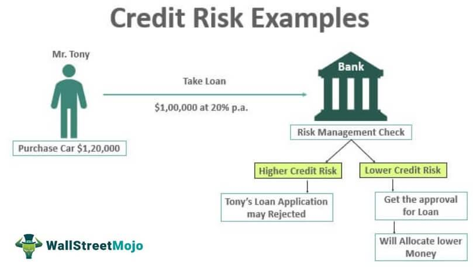

In the rapidly evolving world of finance, algorithmic trading has become a prominent tool for small companies to enhance their participation in financial markets. By leveraging technology, these businesses can execute large volumes of trades at high speeds, taking advantage of micro-opportunities that would otherwise be unattainable through traditional trading methods. This shift has opened doors to greater financial prospects, offering efficiency and potential profitability.

However, accompanying these technological advancements are significant credit risks that cannot be overlooked. Credit risk refers to the possibility of a financial loss arising from a counterparty's failure to fulfill contractual obligations. For small companies, effective management of credit risk is vital to maintaining financial stability and fostering growth. Without a thorough understanding and assessment of these risks, small enterprises may find themselves vulnerable to market volatility and financial instability.



This article explores the intersection of risk assessment, credit risk, and algorithmic trading, emphasizing the unique challenges faced by small companies. Small enterprises, unlike their larger counterparts, often lack the resources and infrastructure necessary to manage complex financial risks efficiently. Therefore, developing robust risk management strategies is crucial to safeguarding their financial health and ensuring sustainable growth.

By examining various risk assessment strategies, this discussion aims to illuminate how small businesses can bolster their financial standing in the realm of algorithmic trading. Through strategic planning and effective risk assessments, these companies can protect themselves from potential pitfalls and enhance their capabilities in an increasingly competitive market.

## Table of Contents

## Understanding Credit Risk in Small Companies

Credit risk refers to the possibility that a borrower will fail to meet its financial obligations as they come due, leading to a loss for the lender or investor. For small companies, credit risk is a significant concern because their access to capital is often limited compared to larger enterprises. The financial stability of small businesses can be disproportionately affected by credit events due to their generally smaller cash reserves and higher volatility in cash flows.

Small companies face several unique challenges when managing credit risk. Unlike larger organizations, they may not have comprehensive risk management departments or access to advanced analytics tools to assess creditworthiness. The lack of diversified revenue streams can also make them more vulnerable to credit events. Additionally, small businesses often rely heavily on a limited number of customers or suppliers, increasing the impact of counterparty credit risk. They may also face more stringent credit terms from lenders, which can lead to higher borrowing costs or reduced access to funds.

The impact of credit risk on a small company's financial health and trading capabilities can be profound. Firstly, any default or delay in payments can strain [liquidity](/wiki/liquidity-risk-premium), making it difficult to meet operational expenses or invest in growth opportunities. Furthermore, increased credit risk may lead to higher interest rates on loans or reduced credit lines, which can limit a company's ability to leverage new market opportunities, including [algorithmic trading](/wiki/algorithmic-trading). Poor credit health might also negatively affect a company’s reputation, impacting trade partnerships and investor confidence.

Small companies engaged in algorithmic trading must be particularly vigilant about credit risk due to the fast-paced and highly leveraged nature of trading. Algo trading requires quick decision-making and the ability to execute large volumes of trades rapidly. Any disruptions in credit can hinder the ability to fulfill margin requirements or force the liquidation of positions at unfavorable prices. Moreover, the reliance on technology and data increases operational risks, where credit issues might exacerbate the impact of system failures or data inaccuracies. Therefore, maintaining strong creditworthiness is essential for sustaining algorithmic trading activities without incurring significant financial losses.

## The Role of Algorithmic Trading in Small Businesses

Algorithmic trading, commonly referred to as algo trading, involves the use of computer algorithms to automate trading processes in financial markets. These algorithms are programmed to make specific trading decisions based on a set of predetermined criteria, such as price, [volume](/wiki/volume-trading-strategy), and timing. As technology advances and access to trading platforms becomes more democratized, small businesses are increasingly adopting algorithmic trading to enhance their market participation.

One of the primary reasons for the growing popularity of algorithmic trading among small companies is its potential for improving trading efficiency and speed. By automating the trading process, small businesses can execute trades at a much faster pace than manual trading, allowing them to capitalize on fleeting market opportunities. Algorithms can monitor multiple markets simultaneously and execute trades at optimal times, often in milliseconds, which is crucial in volatile market conditions. This efficiency can lead to lower transaction costs and better execution prices, providing small companies with a competitive edge.

Algorithmic trading also enables small businesses to leverage market opportunities that they might otherwise miss due to human limitations. For example, an algorithm can be designed to react to specific market signals, such as changes in interest rates or price patterns, and execute trades based on these signals without human intervention. This allows small companies to exploit [arbitrage](/wiki/arbitrage) opportunities or engage in high-frequency trading strategies, strategies that require rapid decision-making and execution where human traders may falter.

Despite these advantages, algorithmic trading is not without risks. One significant concern is market risk, which arises from changes in market conditions that can adversely affect trading positions. Algorithms may fail to adapt to unexpected market movements, potentially leading to substantial financial losses. Execution risk is another concern, as technical glitches or latency issues can result in trades not being executed at the intended time or price. Technology risk, encompassing system failures and cybersecurity threats, poses additional challenges for small businesses relying on algo trading.

Given these risks, it is imperative for small businesses to integrate robust risk management practices into their algorithmic trading strategies. Effective risk management involves constant monitoring of trading algorithms to ensure they operate within predefined risk parameters. Setting stop-loss limits, conducting regular stress tests, and using advanced analytics to assess algorithm performance are essential steps in mitigating trading risks. Furthermore, small companies should ensure that their algorithms are compliant with relevant regulatory standards to avoid potential legal issues.

In summary, while algorithmic trading offers small businesses significant advantages in terms of efficiency and the ability to exploit market opportunities, it also introduces various risks. By integrating comprehensive risk management practices, small businesses can navigate these challenges and enhance their success in financial markets.

## Risk Assessment Strategies for Small Companies

Risk assessment is a critical process for small companies involved in algorithmic trading, as it helps identify, evaluate, and prioritize risks to minimize adverse impacts on financial health. Effective risk assessment not only addresses credit risks but also covers trading and operational risks. Small companies, often with limited resources, must implement thorough risk assessment strategies to safeguard their financial positions.

Credit risk refers to the possibility that a borrower will fail to meet its obligations, leading to financial loss for the lender. This risk is particularly significant for small companies in algorithmic trading, given their less diversified portfolios compared to large financial institutions. Effective credit risk assessment models enable these companies to make informed trading decisions, manage counterparty risks, and maintain financial stability.

Various models and approaches are employed to evaluate credit risk. Credit scoring models, which utilize historical data to predict the likelihood of default, are widely used due to their simplicity and effectiveness. These models often involve logistic regression or [machine learning](/wiki/machine-learning) algorithms to generate a credit score based on relevant data points, such as payment history, credit utilization, and other financial metrics.

Probabilistic models, such as the Merton model, estimate the probability of default based on the company's asset value and [volatility](/wiki/volatility-trading-strategies). This approach is rooted in option pricing theory, where the default probability is viewed in terms of the distance to default, calculated using variables like firm value, debt, and risk-free rate.

Data analytics and machine learning significantly enhance risk assessment for algorithmic trading by providing sophisticated tools for analyzing large volumes of market data. Advanced techniques such as natural language processing (NLP) and neural networks can be employed to analyze unstructured data—including news articles and financial reports—thereby improving risk prediction accuracy. Machine learning algorithms facilitate dynamic and real-time risk assessments, adjusting to market changes and evolving trading patterns.

Python is a popular language for implementing these models and techniques due to its extensive libraries for data analysis and machine learning. Libraries such as scikit-learn provide efficient tools for creating and evaluating credit risk models. For example, using Python and scikit-learn, a logistic regression credit scoring model can be developed as follows:

```python
from sklearn.linear_model import LogisticRegression
from sklearn.model_selection import train_test_split
from sklearn.metrics import accuracy_score

# Assume features and labels are defined as X and y
X_train, X_test, y_train, y_test = train_test_split(X, y, test_size=0.2, random_state=42)
model = LogisticRegression()
model.fit(X_train, y_train)
predictions = model.predict(X_test)

accuracy = accuracy_score(y_test, predictions)
print(f"Model Accuracy: {accuracy * 100:.2f}%")
```

Regular review and adaptation of risk assessment strategies are crucial due to the dynamic nature of financial markets. As market conditions change, the assumptions and parameters of risk models may become outdated, necessitating recalibration. This iterative process ensures that the models remain relevant and accurate, providing reliable forecasts that help in mitigating potential risks.

In conclusion, small companies engaged in algorithmic trading must prioritize comprehensive and dynamic risk assessment strategies. By leveraging modern approaches and technologies like data analytics and machine learning, these companies can better manage credit and trading risks, thereby securing their financial health and competitive edge in the market.

## Implementing Effective Risk Management Practices

Implementing effective risk management practices is critical for small companies engaged in algorithmic trading to safeguard their financial health. A fundamental best practice is the establishment of clear risk limits. By defining allowable levels of risk for each trading algorithm, small companies can control potential losses. Risk limits serve as a boundary for exposure and ensure informed decision-making. They can be based on parameters such as the maximum percentage of total capital at risk or the maximum drawdown permissible in a given period. 

Moreover, monitoring compliance with these risk limits is essential. Advanced monitoring systems can be employed to ensure adherence to these limits in real-time. Such systems can automatically trigger alerts or actions like trade halts when predefined thresholds are breached. This level of oversight helps mitigate significant financial exposures and aligns operations with the company's risk appetite.

The use of stop-loss strategies is another vital component in managing trading risk. Stop-loss orders automatically sell a security when its price falls to a certain level, thus limiting the loss on an investment. This strategy provides a safety net against volatile market conditions and helps preserve capital.

Regulatory frameworks play a pivotal role in governing algorithmic trading activities. Compliance with regulations is mandatory to maintain market integrity and protect investors. Small companies can ensure compliance by staying informed of regulatory changes and incorporating these requirements into their trading systems. For example, implementing robust audit trails, maintaining appropriate documentation, and ensuring system integrity through regular audits are all practices encouraged by regulation bodies like the Securities and Exchange Commission (SEC) and the Financial Industry Regulatory Authority (FINRA).

One case study exemplifying effective risk management is that of a boutique trading firm that successfully mitigated credit risk by implementing a comprehensive risk management framework. This firm utilized a combination of quantitative risk measurement tools and qualitative assessments to continuously monitor their portfolio's risk profile. They incorporated machine learning algorithms to predict potential default events and adjusted their trading strategies accordingly. Emphasizing regular training for their team on the latest regulatory compliances, the firm maintained a vigilant stance against risk. This proactive approach resulted in increased investor confidence and sustainable growth.

In conclusion, setting risk limits, ensuring compliance, and employing strategies like stop-loss orders are crucial for prudent risk management in algorithmic trading. By adhering to regulatory frameworks and learning from successful case studies, small companies can navigate the complexities of trading markets and enhance their financial stability.

## Conclusion

In summary, small companies engaged in algorithmic trading face significant challenges in managing credit risk. As highlighted throughout this article, the agility and speed offered by algorithmic trading present undeniable advantages but also bring forth a set of credit, market, and operational risks that need careful management. Comprehensive risk assessments are critical in safeguarding these companies from potential financial pitfalls. By systematically evaluating creditworthiness and trading exposures, firms can protect themselves from significant losses and enhance financial stability.

It is imperative that small businesses continuously adapt their risk management practices to keep pace with technological advancements. This involves leveraging data analytics and machine learning to refine credit risk assessment models, ensuring they are robust and adaptive to changing market conditions. Taking a proactive approach in managing credit risk not only shields companies from immediate financial threats but also lays the groundwork for sustainable growth and long-term success in the financial markets.

Therefore, small enterprises should prioritize investment in advanced risk assessment tools and frameworks. These tools enable them to identify and mitigate risks effectively, maintain compliance with regulatory standards, and capitalize on market opportunities without exposing themselves to undue risk. By building a strong foundation in risk management, small companies can turn potential vulnerabilities into strategic strengths, ultimately securing their position in increasingly competitive financial markets.

## References & Further Reading

[1]: Bergstra, J., Bardenet, R., Bengio, Y., & Kégl, B. (2011). ["Algorithms for Hyper-Parameter Optimization."](https://papers.nips.cc/paper/4443-algorithms-for-hyper-parameter-optimization) Advances in Neural Information Processing Systems 24.

[2]: ["Advances in Financial Machine Learning"](https://www.amazon.com/Advances-Financial-Machine-Learning-Marcos/dp/1119482089) by Marcos Lopez de Prado

[3]: ["Evidence-Based Technical Analysis: Applying the Scientific Method and Statistical Inference to Trading Signals"](https://www.amazon.com/Evidence-Based-Technical-Analysis-Scientific-Statistical/dp/0470008741) by David Aronson

[4]: ["Machine Learning for Algorithmic Trading"](https://github.com/stefan-jansen/machine-learning-for-trading) by Stefan Jansen

[5]: ["Quantitative Trading: How to Build Your Own Algorithmic Trading Business"](https://www.amazon.com/Quantitative-Trading-Build-Algorithmic-Business/dp/1119800064) by Ernest P. Chan