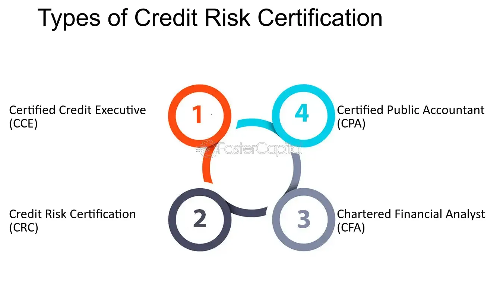

The finance industry is undergoing significant transformation, characterized by the growing sophistication of risk management and algorithmic trading. As markets become more complex and interconnected, professionals in this field must equip themselves with a deeper understanding and specialized skills to navigate the evolving landscape effectively. Certification in areas such as credit risk and financial risk management has thus emerged as a vital credential for those seeking to advance their careers. These certifications not only validate a professional's expertise but also enhance their ability to apply risk management principles to algorithmic trading—a sector that has gained remarkable traction in recent years.

Algorithmic trading, which involves using computational algorithms to execute trading strategies, has transformed the way transactions are conducted across global markets. Its reliance on sophisticated models and real-time data analysis underscores the need for precise and strategic risk management. As such, financial risk management now plays a critical role in ensuring the integrity and stability of these automated trading systems.



In this context, the significance of obtaining certifications in credit risk, financial risk management, and algorithmic trading cannot be overstated. These certifications provide professionals with a robust framework for assessing and mitigating potential risks, while also equipping them with the latest technological insights. As technology continues to drive advancements in financial markets, professionals who pursue these certifications are well-positioned to capitalize on new opportunities and contribute to the industry’s advancement. This article examines the importance of these certifications, highlights the dynamics of financial risk management, and explores the growing impact of algorithmic trading.

## Table of Contents

## Understanding Certification in Credit Risk

Credit risk certification is an essential credential for professionals engaged in commercial credit, lending, or loan review. Institutions like the Risk Management Association (RMA) provide this certification to equip professionals with the necessary skills to manage and assess credit risk effectively. The certification process is structured to validate the competency and proficiency of individuals in evaluating creditworthiness, understanding financial documents, and making informed lending decisions.

### Prerequisites and Exam Structure

To pursue a credit risk certification, candidates often need a foundational understanding and practical experience in the finance or banking sector. Typically, professionals must have several years of relevant work experience or a combination of education and experience that would qualify them for the certification exam. This requirement ensures that candidates possess a baseline proficiency in credit risk concepts, enabling them to apply theoretical knowledge effectively in an exam setting.

The exam structure examines a candidate's skills across multiple domains. These might include credit analysis, financial statement interpretation, risk assessment methodologies, and the legal aspects of credit. Exam questions are designed to test the candidate's ability to analyze financial conditions, predict potential credit issues, and devise strategies to mitigate risks. The assessment is usually a combination of multiple-choice questions, case studies, and problem-solving tasks that reflect real-world scenarios financial professionals encounter.

### Benefits of Certification

Achieving certification in credit risk management offers several benefits that can significantly enhance a professional's career trajectory. Certified individuals tend to have better career opportunities, as employers often prefer candidates with recognized credentials that verify their expertise and commitment to the field. Additionally, possessing a certification can lead to enhanced professional reputation, providing a competitive edge in job markets and leading to promotions and new responsibilities within an organization.

Moreover, certified professionals often experience the potential for higher pay. As organizations recognize the value of strong credit risk management, they are willing to offer premium compensation packages to those with proven capabilities in this area. A certification signals to employers that the individual has a comprehensive understanding of credit risk management practices and is adept at implementing them effectively.

In summary, certification in credit risk is not just a testament to a professional's skillset but also a strategic career move that opens up pathways to advanced professional roles, competitive salaries, and leadership positions in the finance industry.

## Financial Risk Management: A Core Competency

Financial risk management is the strategic process of identifying, assessing, and controlling threats to an organization's capital and earnings. These threats, or risks, primarily stem from financial market uncertainties, such as fluctuations in interest rates, foreign exchange rates, stock prices, and macroeconomic indicators. Additionally, business-related risks, like operational inefficiencies or poor management decisions, also fall under the purview of financial risk management. The discipline involves a broad range of tools and techniques to manage these risks, thereby safeguarding the financial health of the institution.

One of the foundational aspects of financial risk management is understanding the types of risks faced by financial institutions. These include market risk, credit risk, and operational risk.

**Market Risk** refers to the possibility of losses due to unfavorable movements in market prices. It encompasses various sub-categories, such as interest rate risk, which is the risk of financial loss due to fluctuations in interest rates, and equity risk, which arises from volatility in stock prices. To manage market risk, institutions use techniques such as Value at Risk (VaR), stress testing, and scenario analysis. VaR, for example, estimates the potential loss in value of a portfolio over a defined period for a given confidence interval. 

**Credit Risk** is the risk of loss stemming from a borrower's failure to repay a loan or meet contractual obligations. It involves evaluating the creditworthiness of potential borrowers and ensuring that lending standards are robust. Credit risk is managed through credit scoring systems, diversification of the loan portfolio, credit derivatives, and establishing provisions and reserves for potential defaults.

**Operational Risk**, on the other hand, arises from failures in internal processes, systems, human factors, or external events. This includes losses due to fraud, legal risks, or system failures. Management of operational risk often involves implementing robust internal controls, regularly reviewing and updating procedures, and investing in technology and training to mitigate the risk of operational failures.

The role of financial risk management in ensuring the stability and reliability of financial institutions cannot be overstated. By systematically identifying and managing risks, financial risk management helps institutions avoid significant losses, maintain cash flow, and ensure regulatory compliance. As financial markets evolve and become more complex, the importance of effective risk management practices continues to grow. Incorporating cutting-edge technology and data analytics enhances risk management capabilities, allowing institutions to predict potential threats more accurately and respond swiftly. This proactive approach is essential for maintaining the trust and confidence of stakeholders and for the sustained growth and profitability of financial institutions.

## Algorithmic Trading: An Emerging Trend

Algorithmic trading, a significant evolution in financial markets, employs computers to execute trades efficiently using predefined strategies. This approach integrates data analysis, economic theories, and market knowledge to automate decision-making processes, significantly enhancing the speed and accuracy of trades.

The rise of [artificial intelligence](/wiki/ai-artificial-intelligence) (AI) and [machine learning](/wiki/machine-learning) (ML) technologies has further amplified the capabilities of [algorithmic trading](/wiki/algorithmic-trading). These technologies analyze vast datasets to identify patterns and trends that are typically not visible to the human eye. Machine learning algorithms can adapt to new data inputs and improve their performance over time, making trading systems more proficient in predicting market movements.

One prominent application of algorithmic trading is high-frequency trading ([HFT](/wiki/high-frequency-trading-strategies)), where algorithms execute numerous orders at incredibly high speeds, often in fractions of seconds. HFT benefits from small price discrepancies in the market and requires robust technological infrastructure due to its dependency on execution speed. The impact of HFT on market dynamics is debated; while it provides [liquidity](/wiki/liquidity-risk-premium) and narrows bid-ask spreads, critics argue it may contribute to market [volatility](/wiki/volatility-trading-strategies) and unfair competition.

Algorithmic trading extends beyond HFT. It includes strategies like [market making](/wiki/market-making), [trend following](/wiki/trend-following), and [arbitrage](/wiki/arbitrage), allowing traders to diversify and mitigate risks. These strategies often utilize statistical models and quantitative analysis to support decision-making. Python, a preferred language in this field, offers numerous libraries such as Pandas for data manipulation, NumPy for numerical computing, and Scikit-learn for machine learning, streamlining the development of sophisticated algorithms.

To illustrate a simple moving average crossover strategy in Python:

```python
import numpy as np
import pandas as pd

# Sample time series data
data = pd.DataFrame({
    'price': [100, 102, 101, 103, 107, 105, 108, 110, 109, 111]
})

# Calculate moving averages
data['short_mavg'] = data['price'].rolling(window=3, min_periods=1).mean()
data['long_mavg'] = data['price'].rolling(window=5, min_periods=1).mean()

# Generate buy/sell signals
data['signal'] = np.where(data['short_mavg'] > data['long_mavg'], 1, 0)

print(data)
```

This code snippet calculates short and long moving averages and generates buy signals when the short-term average crosses above the long-term average. While simplistic, it demonstrates the computational capability of algorithmic trading, enabling rapid and emotionless execution of trades.

The transformative power of algorithmic trading reshapes financial markets by increasing efficiency and transparency. However, its complexity necessitates continuous monitoring and strategic adjustments to counteract potential risks, underscoring the importance of comprehensive understanding and expertise in the field.

## Integrating Risk Management with Algorithmic Trading

Integrating risk management with algorithmic trading involves applying financial risk management principles to strategically mitigate potential losses and enhance decision-making processes. Financial risk management encompasses the identification, analysis, and mitigation of potential risks that could adversely impact an entity's financial health. By integrating these principles with algorithmic trading, institutions can safeguard against volatilities and inefficiencies.

Algorithmic trading relies heavily on strategies driven by pre-determined parameters and models, which can sometimes result in unintended financial repercussions if not carefully managed. One of the primary principles is the implementation of risk assessment frameworks that evaluate volatility, liquidity, and potential adverse price movements. Tools such as Value at Risk (VaR) and stress testing are used to quantify and forecast potential risks, ensuring algorithms operate within acceptable risk thresholds. 

Monitoring algorithmic trading strategies is crucial to prevent market manipulations and ensure regulatory compliance. With high-frequency trading (HFT) and complex algorithms, there is a heightened risk of creating systemic instability or engaging in manipulative practices like spoofing. Continuous monitoring involves the use of real-time data analytics and automated alerts to detect anomalies and breaches in trading patterns. Compliance with regulations, such as the European Union’s MiFID II, is essential to maintain market integrity and protect investors. These frameworks mandate transparency and record-keeping to enable precise tracking and reporting of trading activities.

Certifications play a crucial role in equipping professionals with the necessary skills and knowledge to handle these integrative processes. They provide a structured learning path that covers the latest regulatory standards, technological advancements, and strategic risk management methodologies. Certifications in Algorithmic Trading (such as the Certified Algorithmic Trader (CAT) certification) and Financial Risk Management (FRM) are particularly relevant. They validate a professional's ability to implement sophisticated algorithms while maintaining rigorous risk oversight, ensuring that the trading activity aligns with both profitability and compliance goals.

By emphasizing these aspects, financial institutions not only enhance their trading efficacy but also fortify their market position against potential risks, laying the foundation for sustainable and ethically sound trading environments.

## Benefits of Certification in Algo Trading and Risk Management

Certifications in algorithmic trading and financial risk management hold significant advantages for professionals, positioning them strategically for emerging opportunities within the fintech sector. As the finance industry undergoes rapid technological transformation, possessing such certifications ensures individuals are not only up-to-date with current best practices but are also recognized for their commitment to maintaining high ethical standards in trading. This is particularly crucial in maintaining ethical trading practices and understanding technological advancements that shape modern financial markets.

Algorithmic trading, which involves the use of computers to execute trades based on pre-defined strategies, benefits greatly from certified professionals who have proven their expertise in managing complex algorithms and ensuring their alignment with ethical standards. Such certifications assure potential employers and stakeholders of a professional’s ability to manage risks associated with algorithmic trading, such as ensuring compliance with regulatory standards and implementing strategies to prevent market manipulation.

Furthermore, certifications in this domain aid continuous professional development, keeping industry practitioners competitive as the financial landscape continues to evolve. With advancements in artificial intelligence (AI) and machine learning, the financial industry is experiencing unprecedented transformations. Professionals holding certifications in algorithmic trading and financial risk management are better equipped to leverage these new technologies to optimize trading strategies, thereby making more informed and effective financial decisions.

These certifications also play a pivotal role in career advancement, often leading to higher pay and improved career opportunities. They serve as a testament to a professional's dedication to understanding and applying modern financial technologies safely and effectively, ensuring they remain at the forefront of innovation within the financial sector. Ultimately, certifications in algorithmic trading and financial risk management not only enhance individual career prospects but also contribute to the broader stability and reliability of financial markets by fostering a workforce equipped with robust risk management skills and technological expertise.

## Conclusion

Certifications in credit risk, financial risk management, and algorithmic trading stand as vital credentials that enhance the competence and credibility of professionals in the finance industry. These certifications are crucial for understanding the intricate intricacies of risk management and trading strategies. By attaining such qualifications, professionals demonstrate a strong commitment to mastering essential financial theory and practical applications, ensuring they are well-prepared to address the complexities of modern finance.

In the rapidly evolving financial market, professionals with certifications are better positioned to adapt and leverage emerging opportunities. This adaptability is particularly evident in the integration of risk management with algorithmic trading, technologies that are transforming how markets operate. Certified professionals are equipped with the necessary skills to develop, implement, and manage sophisticated trading algorithms that comply with regulatory standards while mitigating potential risks.

Pursuing these certifications not only broadens a professional's expertise but also significantly boosts their career prospects. Employers in the finance sector highly value certified individuals for their demonstrated knowledge and ability to maintain high ethical standards. Additionally, certifications can lead to increased [earning](/wiki/earning-announcement) potential and present numerous opportunities for advancement within organizations.

With the financial industry continuously innovating, the demand for professionals who are well-versed in the latest technological and risk management strategies is on the rise. Certified professionals are poised to lead this wave of growth and innovation, making substantial contributions to the stability and efficiency of financial markets. Consequently, professionals are encouraged to engage in continuous education and certification to remain competitive and drive the financial sector forward.

## References & Further Reading

[1]: Culp, C. L. (2001). ["The Risk Management Process: Business Strategy and Tactics"](https://archive.org/details/riskmanagementpr0000culp). Wiley.

[2]: ["Risk Management Association's Credit Risk Certification Program"](https://www.rmahq.org/credentialing/crc/?gmssopc=1) - Risk Management Association

[3]: Gregoriou, G. (2018). ["Handbook of High Frequency Trading"](https://www.amazon.com/Handbook-High-Frequency-Trading-Gregoriou/dp/0128022051). Academic Press.

[4]: Jorion, P. (2006). ["Value at Risk: The New Benchmark for Managing Financial Risk"](https://books.google.com/books/about/Value_at_Risk_3rd_Ed.html?id=nnblKhI7KP8C). McGraw-Hill.

[5]: Aldridge, I. (2013). ["High-Frequency Trading: A Practical Guide to Algorithmic Strategies and Trading Systems"](https://www.amazon.com/High-Frequency-Trading-Practical-Algorithmic-Strategies/dp/1118343506). Wiley.

[6]: Hull, J. C. (2015). ["Risk Management and Financial Institutions"](https://www.amazon.com/Management-Financial-Institutions-Wiley-Finance/dp/1119932483). Wiley.

[7]: Tuckman, B., & Serrat, A. (2011). ["Fixed Income Securities: Tools for Today's Markets"](https://www.amazon.com/Fixed-Income-Securities-Todays-Markets/dp/0470891696). Wiley.

[8]: Narang, R. K. (2009). ["Inside the Black Box: The Simple Truth About Quantitative Trading"](https://onlinelibrary.wiley.com/doi/book/10.1002/9781118267738). Wiley.