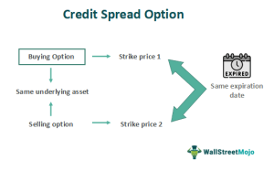

Financial derivatives, particularly options, have become integral to modern financial markets by providing sophisticated tools for managing risk and enhancing investment strategies. Derivatives are financial contracts whose value is derived from an underlying asset, such as stocks, bonds, commodities, or market indices. Options, a subset of derivatives, offer investors the capacity to either hedge against potential adverse price movements or take advantage of speculative opportunities. This flexibility makes them highly popular among investors and traders.

Options trading has become a crucial aspect of risk management and speculative activities in financial markets. Options contracts come in two primary forms: calls and puts. A call option gives the holder the right, but not the obligation, to purchase an asset at a predetermined price before a specific expiration date, whereas a put option provides the right to sell under similar terms. This dual nature of options enables investors to craft strategies that not only safeguard their portfolios against negative market movements but also allow them to profit from anticipated price changes.



One strategy that has garnered popularity among options traders is the use of credit spread options. Credit spreads involve simultaneously buying and selling options of the same class (calls or puts) on the same underlying security with different strike prices or expiration dates. These strategies are employed to generate income through premiums, providing a controlled risk profile appealing to traders seeking limited risk exposure.

Algorithmic trading, which employs automated systems to execute trades based on predetermined criteria, has significantly transformed trading by enhancing speed, accuracy, and efficiency. Algorithms allow traders to systematically explore large volumes of data, quickly identify opportunities, and execute complex strategies with minimal human intervention. This evolution has made algorithmic trading an indispensable part of today's financial markets, particularly in the realm of options trading, where rapid decision-making and execution are necessary.

This article provides an in-depth exploration of financial derivatives, specifically focusing on options trading, credit spread strategies, and the influence of algorithmic trading on these dynamics. By examining these elements, the article aims to offer valuable insights into how contemporary trading strategies are developed and executed in an environment driven by advanced technology and automation.

## Table of Contents

## Understanding Financial Derivatives and Options

Financial derivatives are financial instruments whose value is derived from an underlying asset, index, or [interest rate](/wiki/interest-rate-trading-strategies). They are crucial in risk management because they allow investors and institutions to hedge against potential losses. By entering into derivative contracts, parties can lock in prices, transfer risk, and gain exposure to various financial markets without actually owning the underlying asset. 

Options are a type of derivative contract that grant the holder the right, but not the obligation, to buy or sell an underlying asset at a predetermined price, known as the strike price, before or on a specific date. There are two primary types of options: calls and puts. A call option gives the holder the right to purchase the asset, while a put option allows the holder to sell the asset. 

The mechanics of options involve the interplay of multiple factors that determine their pricing, known as the option's premium. These factors include the current price of the underlying asset, the strike price, time until expiration, interest rates, and implied [volatility](/wiki/volatility-trading-strategies). Implied volatility is a crucial component, as it reflects the market's expectations of how much the asset's price will move before the option's expiration. 

Options serve dual purposes in financial strategies: hedging and speculation. As hedging instruments, options protect against adverse price movements. For instance, a portfolio manager might purchase put options to mitigate the risk of a declining stock market. In speculative strategies, traders may use options to bet on market direction, attempting to profit from favorable price movements. Due to their leverage nature, options can provide substantial returns with a relatively small initial investment, though they come with increased risk.

An example of utilizing options to capitalize on market movements could involve a trader anticipating that a particular stock will rise significantly within the next three months. The trader may purchase call options for that stock, allowing them to buy shares at the current strike price. If the stock price surges beyond the strike price plus the option premium before expiration, the trader can exercise the option and purchase the stock at a lower cost, thereby realizing a profit.

In summary, financial derivatives and options are foundational tools in modern financial markets. They offer versatile means for managing risk and seizing speculative opportunities, with the potential to amplify returns through strategic use.

## What Is a Credit Spread Option?

Credit spread options are a class of options trading strategies that involve the simultaneous buying and selling of options of the same class (calls or puts) with the same expiration date but different strike prices. These strategies are predominantly used to profit from the expectation that the price of the underlying asset will remain stable or move moderately. 

Credit spread options can be structured to capitalize on either a bullish or bearish market outlook. There are two primary types of credit spreads: bull put spreads and bear call spreads.

**Bull Put Spread:**

A bull put spread is constructed by selling a put option at a higher strike price while simultaneously buying another put option at a lower strike price, both with the same expiration date. This strategy generates a net credit (income) upfront, as the sold option typically commands a higher premium than the purchased option. It is effectively a bullish strategy, as maximum profit is achieved when the price of the underlying asset remains above the higher strike price at expiration.

The potential profit is limited to the net credit received, whereas the risk is limited to the difference between the strike prices minus the net credit.

*Example:*
Consider an asset trading at $50. An investor could sell a put option with a strike price of $48 for a premium of $2 and buy a put option with a strike price of $46 for a premium of $1. The net credit received is $1.

**Bear Call Spread:**

Conversely, a bear call spread involves selling a call option at a lower strike price and buying another call option at a higher strike price. Like the bull put spread, the bear call spread also results in a net credit, since the premium for the sold option is higher than the premium paid for the purchased option. This strategy benefits from price stagnation or a decline, achieving maximum profitability when the asset's price stays below the lower strike price at expiration.

The possible profit is the net credit, while the maximum loss is the difference between strike prices minus the net premium received.

*Example:*
Assume an asset trades at $60. An investor might sell a call option with a strike price of $62 for $3 and purchase a call option with a strike price of $64 for $1, obtaining a net credit of $2.

**Benefits and Risks:**

Credit spreads offer several benefits, including:
- **Limited Risk:** The risk is capped at the difference between strike prices minus the received premium, providing a defined risk-reward scenario.
- **Income Generation:** They allow traders to generate income through premiums, even if the underlying asset moves sideways.
- **Probability-based Trading:** Credit spreads can be structured to align with the trader's market outlook, focusing on probability-based strategies rather than outright directional bets.

However, there are risks to consider, such as the underlying asset moving significantly against the position, resulting in a maximum loss situation. Market volatility can also affect the pricing and profitability of these spreads.

**Appeal as an Income Strategy:**

Credit spreads are particularly appealing as an income strategy due to their potential for consistent returns when the underlying asset's movement is limited. By collecting premiums while managing risk, traders can create a steady stream of income as part of broader trading strategies. These strategies require careful assessment of market conditions and probable price action, often making them suitable for options traders looking for relatively conservative income opportunities in uncertain markets.

## How Credit Spread Options Work

Credit spread options are a strategic component of options trading, favored for their potential to generate income while managing risk. Setting up a credit spread involves two simultaneous options transactions designed to create a net credit — meaning the premiums received from selling options exceed the premiums paid for buying options. Credit spreads can be configured as either bull put spreads or bear call spreads.

### Process of Setting Up a Credit Spread Option

To establish a credit spread, an investor sells an option with a higher premium and buys an option with a lower premium on the same underlying asset, usually with the same expiration date. For a bull put spread, this involves writing a put option at a higher strike price and purchasing a put option at a lower strike price. Conversely, a bear call spread is created by selling a call option at a lower strike price while simultaneously buying another call option at a higher strike price.

### Cost-Benefit Analysis

The advantage of initiating a credit spread is the upfront net credit received, which is the difference between the premiums collected and paid:

$$
\text{Net Credit} = P_{\text{sold}} - P_{\text{bought}}
$$

This net credit represents the maximum potential profit while the maximum potential loss is limited to the difference between the strike prices of the two options, minus the net credit received. Thus, an investor's potential return can be calculated as:

$$
\text{Potential Return} = \frac{\text{Net Credit}}{\text{Maximum Possible Loss}}
$$

### Scenarios of Advantage and Detriment

Credit spreads can offer advantages in specific market conditions. They are beneficial in range-bound, neutral to moderately bullish (bull put spreads) or bearish (bear call spreads) markets. Under these scenarios, the limited risk and potential for moderate profit prove attractive. However, if the market moves strongly against the investor's position, losses can occur, although they are capped. For instance, if the underlying asset price sharply declines in a bull put spread, the investor may incur the maximum potential loss.

### Impact of Market Volatility

Volatility plays a crucial role in the effectiveness of credit spread strategies. High market volatility can increase the option premiums received, enhancing potential profit. However, it also raises the probability of significant moves in the asset price, which can lead to potential losses if the price movement exceeds the protective leg of the spread. When setting up a credit spread, traders must evaluate the implied volatility of the options and consider its impact on both premium levels and potential price movements.

In conclusion, credit spread options provide traders a mechanism for balancing income generation with risk limitation. The adaptability of these strategies to shifting market conditions, coupled with careful analysis of volatility, is essential for optimizing performance.

## Algorithmic Trading in Options Markets

Algorithmic trading is the use of computer algorithms to automate the process of trading financial securities, including options. It has had a transformative impact on financial markets by increasing the speed, efficiency, and accuracy of trading activities. Algorithms enable traders to execute a large [volume](/wiki/volume-trading-strategy) of orders at a [high frequency](/wiki/high-frequency-trading) with minimal human intervention, thus reducing transaction costs and eliminating the emotional biases often associated with manual trading.

In options trading, algorithmic systems enhance efficiency by processing complex calculations and data analysis to identify trading opportunities quickly. They can manage an enormous amount of market data to detect patterns or [arbitrage](/wiki/arbitrage) opportunities that are not readily observable to human traders. This is particularly beneficial in high-frequency trading, where speed is critical, and the difference of milliseconds can significantly affect profitability.

The integration of options trading strategies within algorithmic frameworks allows traders to implement sophisticated strategies with precision. For instance, algorithms can be used to execute and manage a variety of option spreads, straddles, and strangles, as well as to adjust positions dynamically in response to market changes. One such strategy is dynamic hedging, where algorithms continually adjust the hedge ratios of an options portfolio to maintain a desired level of risk exposure.

Dynamic hedging illustrates the complexity of strategies facilitated by [algorithmic trading](/wiki/algorithmic-trading). This strategy involves the constant recalibration of an options portfolio to hedge against price fluctuations in the underlying asset. The algorithm takes into account factors such as the delta, gamma, and vega of options positions:

$$
\Delta = \frac{\partial V}{\partial S}
$$
$$
\Gamma = \frac{\partial^2 V}{\partial S^2}
$$
$$
\text{Vega} = \frac{\partial V}{\partial \sigma}
$$

Where $V$ is the option price, $S$ is the underlying asset price, and $\sigma$ is the volatility. Dynamic hedging aims to minimize risk by keeping the net option position as close to delta-neutral as possible, despite changes in the underlying asset price or volatility.

Another example is the execution of volatility arbitrage strategies, where algorithms exploit discrepancies between the implied volatility of options and their historical volatility to generate profits. These strategies require precise and timely execution, which is facilitated by algorithmic trading systems.

In conclusion, algorithmic trading has revolutionized options markets by enhancing trade execution and enabling the deployment of complex trading strategies. Its ability to process vast amounts of data swiftly and accurately has made it an indispensable tool for modern traders looking to optimize their trading strategies and manage risk effectively.

## Pros and Cons of Using Algorithmic Trading for Credit Spreads

Algorithmic trading, a cornerstone of modern financial markets, brings significant improvements and challenges when applied to credit spread options. This section evaluates both the advantages and the potential downsides of employing algorithms in this context.

### Benefits of Using Algorithms for Credit Spread Strategies

1. **Efficiency and Speed**: Algorithms enable traders to execute orders at speeds impossible for human traders. This efficiency is particularly beneficial in credit spread strategies, where rapid execution can secure favorable premiums before market conditions change. For example, an algorithm can quickly identify an optimal bull put spread by scanning large volumes of data and executing trades in milliseconds.

2. **Improved Risk Management**: Algorithms enhance risk management by continuously monitoring positions and market conditions. They can automatically adjust positions or trigger stop-loss orders to mitigate potential losses. For example, an algorithm could employ a delta-neutral strategy to maintain a balanced exposure to market movements.

3. **Strategy Optimization**: Algorithms facilitate the optimization of trading strategies by analyzing historical data to identify patterns and refine models. Machine learning techniques can be used to predict volatility or market trends, thus optimizing entry and exit points for credit spreads. Here’s a simple Python example of using historical data for strategy optimization:

   ```python
   import numpy as np
   import pandas as pd
   from sklearn.ensemble import RandomForestRegressor

   # Load historical market data
   data = pd.read_csv('market_data.csv')

   # Prepare features and labels
   X = data.drop(columns=['CreditSpreadReturn'])
   y = data['CreditSpreadReturn']

   # Train a model to predict credit spread returns
   model = RandomForestRegressor()
   model.fit(X, y)

   # Predict future returns
   future_data = pd.read_csv('future_market_data.csv')
   predictions = model.predict(future_data)
   ```

4. **Precision**: Algorithms reduce the likelihood of human error in executing complex strategies, ensuring each trade is executed as intended. This precision is crucial in maintaining the integrity and intended outcomes of credit spread strategies.

### Challenges and Risks

1. **System Failures**: Algorithmic trading systems are prone to technical glitches or failures, which can lead to substantial financial losses if not managed correctly. For instance, an algorithm might encounter a bug that misprices options, resulting in unfavorable trades.

2. **Market Risk and Liquidity Challenges**: Unforeseen market conditions, such as a sudden drop in liquidity, can adversely affect algorithmic strategies. Algorithms may struggle to find buyers or sellers for credit spreads during such times, leading to execution risk and slippage.

3. **Data Quality and Reliability**: The effectiveness of algorithmic strategies heavily depends on the quality of input data. Inaccurate or unreliable data can lead to erroneous trading decisions. Ensuring data integrity is essential for maintaining the effectiveness of trading algorithms.

4. **Regulatory and Compliance Issues**: Algorithmic trading must comply with various regulatory requirements, which can vary by region and market. Ensuring that algorithms adhere to these regulations can be complex, potentially limiting their flexibility and execution speed.

In sum, while algorithmic trading offers substantial benefits in executing credit spread strategies—such as increased efficiency, better risk management, and strategy optimization—it also presents significant challenges. System failures, market volatility, data quality issues, and regulatory compliance can pose risks that traders must carefully consider and address.

## Case Studies and Real-World Applications

In analyzing case studies of successful credit spread option trades executed via algorithms, we can gain valuable insights into the factors that contribute to strategy success and recognize potential pitfalls. A notable example involves algorithmic systems employed by large financial institutions, which utilize historical data and market conditions to optimize credit spread strategies effectively.

### Successful Execution of Credit Spreads via Algorithms

For instance, consider a case where an algorithmic trading firm successfully implemented a bull put spread during a period of moderate market volatility. The strategy involved selling a put option with a higher strike price and buying another put option with a lower strike price, both with the same expiration date. This trade benefitted from the moderate uptrend in the market, allowing the firm to collect a substantial premium.

The algorithm leveraged historical data to identify optimal entry and [exit](/wiki/exit-strategy) points by considering implied volatility levels and projected market movements. The trade capitalized specifically on overvalued put options, yielding consistent profits as the anticipated market conditions played out. 

### The Role of Market Conditions and Historical Data

In scenarios where credit spread strategies thrive, market conditions and historical data are crucial. Algorithms can scan vast datasets to identify patterns and correlations that might not be obvious to the human eye. For successful trades, algorithms typically [factor](/wiki/factor-investing) in metrics like:

- **Implied Volatility (IV):** Algorithms assess the IV to determine if options are overpriced or underpriced. In high volatility environments, credit spreads can be more appealing due to increased premiums.

- **Market Trends:** Identifying bullish, bearish, or neutral trends helps in selecting the appropriate credit spread type, such as bull put or bear call spreads.

- **Historical Price Patterns:** Exploiting recurring price patterns allows algorithms to predict potential price ranges within which the market can move.

These data-driven insights enable precise timing for trades, increasing their profitability.

### Real-World Instances of Algorithmic Credit Spread Opportunities

In another example, a quantitative [hedge fund](/wiki/hedge-fund-trading-strategies) utilized algorithmic trading to implement a bear call spread against a backdrop of declining technological stock prices. By selling call options at a lower strike and buying them at a higher strike, both close to expiration, the fund capitalized on the downturn, collecting premiums significantly higher than usual.

The success was attributed to the algorithm's ability to continuously monitor real-time data feeds and adjust the spread in response to market sentiment shifts, ensuring maximum premium capture. The algorithm was programmed to adjust positions dynamically, which proved invaluable during volatile sessions that were not anticipated by traditional traders.

### Conclusion Remarks

These case studies highlight that the strategic use of historical data and real-time market analysis by algorithms can enhance the effectiveness of credit spread options. The ability to dynamically adjust to market conditions and exploit inefficiencies ensures better risk management and higher chances of successful trades. As trading technology advances, the integration of sophisticated algorithms will likely become even more critical in identifying and capitalizing on credit spread opportunities within the financial markets.

## Conclusion

Financial derivatives, particularly options, serve as vital instruments in the financial markets, providing mechanisms for hedging and speculation. Our exploration of credit spread options reveals their potential as a strategy for income generation with limited risk. These derivatives offer investors the ability to execute precise market moves based on forecasts of volatility, price direction, and time decay. Understanding the mechanics of credit spreads, including bull put and bear call spreads, enables traders to tailor their risk exposure and optimize returns.

Algorithmic trading has significantly transformed trading dynamics by introducing enhanced efficiency, speed, and accuracy. By leveraging algorithmic frameworks, traders can implement complex strategies, such as credit spreads, with precision and consistency. The integration of algorithms allows for dynamic risk management and strategic optimization, enhancing decision-making through data-driven insights.

Looking forward, the integration of advanced technology and automation within trading systems is expected to deepen. As [machine learning](/wiki/machine-learning) and [artificial intelligence](/wiki/ai-artificial-intelligence) evolve, they will offer more sophisticated models for trade execution and market analysis. This evolution presents an opportunity for traders to harness algorithmic approaches to refine their strategies and adapt to ever-changing market conditions. Embracing algorithmic trading not only provides an edge in execution but also prepares traders for the future landscape of financial markets, which will increasingly rely on automation and technological advancement.

## References & Further Reading

[1]: Natenberg, S. (1994). ["Option Volatility & Pricing: Advanced Trading Strategies and Techniques."](https://www.amazon.com/Option-Volatility-Pricing-Strategies-Techniques/dp/0071818774) McGraw-Hill.

[2]: Hull, J. C. (2018). ["Options, Futures, and Other Derivatives."](https://www.semanticscholar.org/paper/Options%2C-Futures%2C-and-Other-Derivatives-Hull/89bdee500c8623864fc9eb7a471546aa713acc44) Pearson.

[3]: Kissell, R. (2013). ["The Science of Algorithmic Trading and Portfolio Management."](https://www.sciencedirect.com/book/9780124016897/the-science-of-algorithmic-trading-and-portfolio-management) Academic Press.

[4]: Lopez de Prado, M. (2018). ["Advances in Financial Machine Learning."](https://www.amazon.com/Advances-Financial-Machine-Learning-Marcos/dp/1119482089) Wiley.

[5]: Chan, E. P. (2009). ["Quantitative Trading: How to Build Your Own Algorithmic Trading Business."](https://github.com/ftvision/quant_trading_echan_book) Wiley.