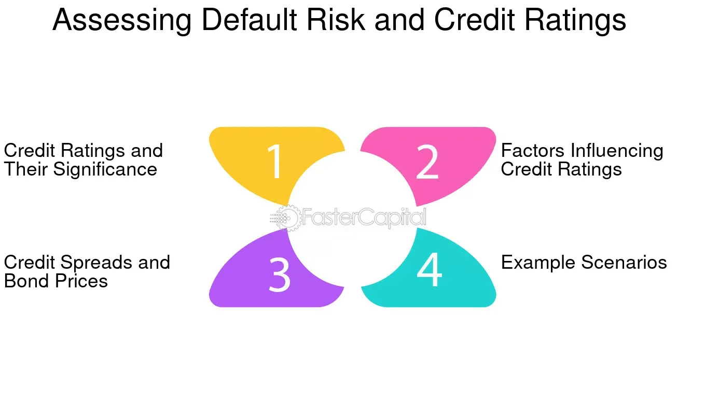

## Table of Contents

## What is credit spread risk?

Credit spread risk is the risk that the difference in interest rates between two types of bonds will change. One bond might be a safe government bond, and the other might be a riskier corporate bond. The difference in their interest rates is called the credit spread. If this spread gets bigger, it means the market thinks the riskier bond is even riskier than before. This can cause the price of the riskier bond to drop, which is bad news for people who own it.

This risk is important for investors to understand because it can affect how much money they make or lose. For example, if an investor owns a lot of corporate bonds and the credit spread widens, the value of their investment could go down. On the other hand, if the credit spread narrows, it could mean the market thinks the corporate bonds are less risky, and their value could go up. Managing credit spread risk is a key part of investing in bonds.

## What is default risk?

Default risk is the chance that a person or company who borrowed money won't be able to pay it back. This can happen when someone takes out a loan or a company issues bonds. If they can't make their payments, it's called a default. This risk is important for lenders and investors to think about because it can affect how much money they might lose.

For example, if you lend money to a friend and they lose their job, they might not be able to pay you back. The same thing can happen with big companies. If a company is doing badly and can't pay its debts, the people who bought its bonds could lose money. To deal with this risk, lenders and investors often check how likely someone is to pay back their debt before they lend or invest money.

## How do credit spread risk and default risk differ?

Credit spread risk and default risk are two different kinds of risks that people who invest in bonds need to think about. Credit spread risk is about the difference in interest rates between a safe bond, like a government bond, and a riskier bond, like a corporate bond. If this difference, or spread, gets bigger, it means the market thinks the riskier bond is even riskier than before. This can make the price of the riskier bond go down, which is bad for people who own it. So, credit spread risk is all about how the market's view of risk can change and affect bond prices.

On the other hand, default risk is about the chance that the person or company who borrowed money won't be able to pay it back. This is a more direct risk because if a borrower defaults, they stop making payments altogether. For example, if a company goes bankrupt and can't pay back its bonds, the investors who own those bonds could lose a lot of money. Default risk is about the actual ability of the borrower to repay, while credit spread risk is about how the market's perception of that risk can change.

## What factors contribute to credit spread risk?

Credit spread risk can be affected by many things. One big [factor](/wiki/factor-investing) is how the economy is doing. When the economy is strong, people feel more confident about companies paying back their debts, so the credit spread might get smaller. But if the economy is doing badly, people might worry more about companies defaulting, which can make the credit spread bigger. Another factor is how well a specific company or industry is doing. If a company is struggling or an industry is having problems, investors might see it as riskier, which can also widen the credit spread.

Another thing that can affect credit spread risk is changes in interest rates. If interest rates go up, the cost of borrowing money goes up too, which can make it harder for companies to pay back their debts. This can lead to a wider credit spread. Also, news and events can play a role. For example, if there's a big scandal or a natural disaster that affects a company, investors might see it as more risky, which can change the credit spread. All these factors together can make credit spread risk go up or down.

## What factors contribute to default risk?

Default risk is affected by many things. One big factor is how well the economy is doing. When the economy is strong, companies usually make more money and can pay back their debts easier. But if the economy is weak, companies might struggle to make money, which can make it harder for them to pay back what they owe. Another factor is how much debt a company has. If a company has a lot of debt, it might have a harder time paying it all back, especially if things go wrong.

The health of the company itself is also important. If a company is doing well and making good profits, it's less likely to default. But if a company is losing money or facing big problems, the risk of default goes up. Things like bad management, losing important customers, or facing tough competition can all make a company more likely to default. Also, changes in interest rates can affect default risk. If interest rates go up, it can make borrowing more expensive, which can put more pressure on companies that already have a lot of debt.

## How can credit spread risk be measured?

Credit spread risk can be measured by looking at the difference in interest rates between a safe bond, like a government bond, and a riskier bond, like a corporate bond. This difference is called the credit spread. If the credit spread gets bigger, it means the market thinks the riskier bond is even riskier than before. To measure this, people often use something called the credit spread index, which tracks the average difference in interest rates between different types of bonds.

Another way to measure credit spread risk is by using statistical models. These models look at things like how much the credit spread has changed in the past and how likely it is to change in the future. They can help predict how much the value of a bond might go up or down because of changes in the credit spread. By understanding these measurements, investors can make better choices about which bonds to buy and how to manage their risk.

## How can default risk be assessed?

Default risk can be assessed by looking at the financial health of the borrower. This means checking things like how much money the borrower makes, how much debt they have, and if they have enough money to pay back what they owe. Credit rating agencies, like Moody's or Standard & Poor's, help with this by giving borrowers a grade that shows how likely they are to pay back their debts. A high grade means the borrower is seen as safe, while a low grade means they are seen as risky. Investors use these grades to decide if they want to lend money to a borrower or buy their bonds.

Another way to assess default risk is by looking at how the economy is doing. If the economy is strong, companies usually have an easier time making money and paying back their debts. But if the economy is weak, companies might struggle, which can make it harder for them to pay back what they owe. Also, things like interest rates can affect default risk. If interest rates go up, it can make borrowing more expensive, which can put more pressure on companies that already have a lot of debt. By looking at all these things, people can get a better idea of how likely a borrower is to default.

## What are the impacts of credit spread risk on investment portfolios?

Credit spread risk can have a big impact on investment portfolios. When the credit spread between safe and risky bonds gets bigger, it means the market thinks the risky bonds are even riskier than before. This can make the price of these risky bonds go down. If someone has a lot of these bonds in their portfolio, the value of their investment can drop. This is bad news for investors because it means they could lose money. To manage this risk, investors might choose to spread their money across different types of bonds or use other ways to protect their investments.

On the other hand, if the credit spread gets smaller, it can be good for investors who own risky bonds. A smaller spread means the market thinks the risky bonds are less risky, so their prices might go up. This can make the value of an investment portfolio go up too. But managing credit spread risk is tricky because it can change quickly based on things like how the economy is doing or news about specific companies. Investors need to keep an eye on these changes and adjust their portfolios to try and make the most money while keeping their risk under control.

## What are the consequences of default risk for lenders?

When someone or a company can't pay back the money they borrowed, it's called a default. This is a big problem for lenders because they might lose the money they lent out. If a lot of people or companies default at the same time, like during a bad economy, it can be really bad for the lender. They might have to write off the loans as losses, which means they won't get that money back. This can make it hard for the lender to keep doing business, and in the worst cases, it could even make them go out of business.

To try and avoid these problems, lenders look at how likely someone is to pay back their debt before they lend money. They might check things like how much money the borrower makes, how much debt they already have, and if they have a good history of paying back loans. If a lender thinks someone is too risky, they might not lend them money or they might charge them a higher [interest rate](/wiki/interest-rate-trading-strategies) to make up for the risk. By being careful about who they lend to, lenders can try to lower their chances of losing money because of defaults.

## How do financial institutions manage credit spread risk?

Financial institutions manage credit spread risk by using different strategies to protect their investments. One way they do this is by diversifying their bond holdings. This means they spread their money across many different types of bonds, so if the credit spread changes and one type of bond loses value, it won't hurt their whole portfolio too much. They also use something called hedging. This is like buying insurance for their investments. They might buy other financial products that will make money if the credit spread gets bigger, which can help offset any losses they might have from their bonds.

Another way financial institutions manage credit spread risk is by keeping a close eye on the market. They watch economic indicators and news that could affect the credit spread. If they see signs that the credit spread might get bigger, they can adjust their investments to be less risky. They might sell some of their riskier bonds or buy more safe bonds. By staying informed and being ready to make changes, financial institutions can better handle the ups and downs of credit spread risk.

## How do financial institutions mitigate default risk?

Financial institutions work hard to lower the chances of people or companies not paying back their loans, which is called default risk. One way they do this is by checking how likely someone is to pay back their debt before they lend them money. They look at things like how much money the borrower makes, how much debt they already have, and if they have a good history of paying back loans. If a borrower seems too risky, the lender might not give them a loan or might charge them a higher interest rate to make up for the risk. This helps the lender protect their money.

Another way financial institutions manage default risk is by spreading out their loans. Instead of lending all their money to just a few people or companies, they lend it to many different ones. This way, if one borrower can't pay back their loan, it won't hurt the lender too much because they still have money coming in from other loans. Financial institutions also set aside some money as a cushion, just in case some loans do go bad. By being careful about who they lend to and spreading out their risk, financial institutions can better handle the problem of defaults.

## What advanced models are used to predict credit spread and default risks?

To predict credit spread and default risks, financial experts use advanced models that look at a lot of data. One common model is the structural model, which looks at a company's assets and debts to see how likely it is to default. It works by figuring out if a company's assets are worth more than its debts. If the assets are worth less, the company might not be able to pay back its loans, which increases the default risk. Another model is the reduced-form model, which uses things like how the economy is doing and the company's credit rating to predict the chances of default. These models help investors and lenders understand how risky a bond or loan might be.

Another type of model used is the machine learning model. These models can look at huge amounts of data, like past credit spreads and default rates, to find patterns that might be hard for people to see. Machine learning can help predict how the credit spread might change in the future and how likely a company is to default. By using all this data, these models can give a more accurate picture of the risks involved. Financial institutions use these models to make better decisions about which bonds to buy or which loans to give out, helping them manage their risks more effectively.

## What is Credit Spread Risk and How is it Explained?

Credit spread risk is a crucial component of credit risk, reflecting the additional yield that investors demand for taking on the credit risk of a bond issuer over risk-free securities of comparable maturity. This yield difference, or spread, is indicative of the perceived risk associated with the bond's issuance.

Wider credit spreads are often symptomatic of increased perceived risk. This can occur due to economic instability or specific issues related to the bond issuer, such as deteriorating financial health, political uncertainties, or industry-specific challenges. For instance, during periods of economic downturn, investors may demand higher spreads to compensate for the increased likelihood of default, leading to widening credit spreads across the market.

Conversely, narrower spreads suggest a more optimistic view of the issuer's financial stability or favorable economic conditions. In such scenarios, investors are more confident in the issuer's ability to meet its debt obligations, and therefore, require a lower premium for the credit risk involved. This is commonly observed during periods of economic growth or when an issuer's creditworthiness improves, either through debt reduction, revenue growth, or strategic reforms.

An understanding of credit spread risk is essential for investors aiming to evaluate the risk-reward ratio in bond investments. The spread provides insight into market sentiment and the issuer's credit risk. Investors use credit spreads to gauge whether the yields offered appropriately compensate for the underlying risk. A fundamental equation often used to quantify this risk-return trade-off is:

$$
\text{Yield (Bond)} = \text{Risk-free Rate} + \text{Credit Spread}
$$

Here, the credit spread represents the additional yield required by investors to take on the issuer's credit risk. Investors and portfolio managers use various financial models and tools, such as the CreditMetrics model, to predict potential changes in these spreads and manage their exposure accordingly.

In practical terms, understanding credit spreads allows investors to make informed decisions about which bonds to include in their portfolios based on their risk tolerance and market expectations. Monitoring spread movements can also aid in identifying market trends, shifts in economic outlook, and changes in issuer risk profiles, all of which are vital for strategic investment and risk management.

## References & Further Reading

Further insights into credit spreads and their impact can be found in various financial literature and studies. Several key resources provide foundational and advanced knowledge for understanding these financial instruments.

One valuable resource is "Financial Machine Learning" by Marcos López de Prado. This book explores the application of [machine learning](/wiki/machine-learning) techniques to financial data, making it a significant resource for those interested in [algorithmic trading](/wiki/algorithmic-trading) strategies related to credit spreads. It covers advanced data handling techniques and provides novel approaches to predictive modeling, which can be crucial for optimizing credit spread strategies.

For a comprehensive understanding of fixed income markets and analysis, "Fixed Income Analysis" by Frank J. Fabozzi is highly recommended. This text investigates into the intricacies of bond markets, credit risk assessment, and the evaluation of credit spreads. It offers readers tools to understand and manage the risks associated with fixed-income securities, including the impact of interest rate movements and credit spread changes.

Investors and analysts focusing on derivatives and their pricing might consider "Options, Futures, and Other Derivatives" by John C. Hull. This book provides an extensive overview of the mechanics and valuation techniques for options and derivatives. Understanding the principles outlined in this text can help in constructing strategies to hedge against credit spread risk using derivative instruments.

Staying updated with the latest financial news is vital for monitoring changes in credit markets. Platforms such as Bloomberg, Reuters, and The Wall Street Journal provide real-time updates and analyses of market trends, which can influence credit spreads. These resources enable investors to make timely decisions based on current market conditions.

For those inclined towards empirical finance research, reviewing academic journals such as "The Journal of Finance" or "Journal of Financial and Quantitative Analysis" can offer peer-reviewed studies on credit risk and spread analysis. These journals regularly publish cutting-edge research on financial markets, providing insights into the latest methodologies and findings in the field. 

By engaging with these resources, investors and financial professionals can deepen their understanding of credit spreads and enhance their ability to craft strategic and informed investment decisions.

