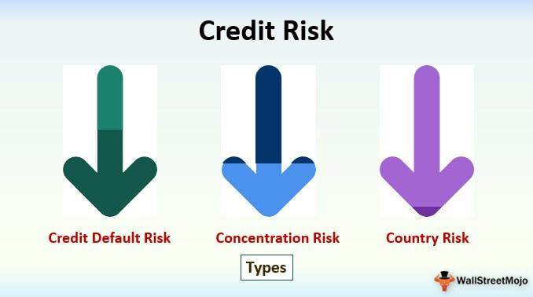

In the modern financial landscape, effectively managing and leveraging risk is essential, especially within credit markets. A refined understanding of credit spread risk, default risk, and algorithmic trading is pivotal for investors aiming to optimize their portfolios and market strategies. Credit markets are integral components of the global financial system, and their associated risks can significantly impact investment decisions and outcomes. 

Credit spread risk relates to the variations in yield differences between bonds of similar maturity but differing credit qualities. This differential can provide insights into the market's perception of an issuer's creditworthiness, influenced by economic conditions and issuer-specific factors. Default risk, on the other hand, measures the probability that a borrower will fail to fulfill their debt obligations. Both credit spread and default risks play critical roles in shaping the risk-reward profiles of bond investments.



Algorithmic trading, characterized by the use of complex algorithms to automate trades, has become increasingly influential in managing these risks. In the context of credit spreads, algorithmic strategies can enhance the efficiency of trading operations by optimizing trade executions based on real-time market data and pre-defined conditions. This technological advance reduces human error, enhances speed, and allows for more precise trading strategies.

Understanding how financial situations interplay with these components is key to influencing investment portfolios effectively. By strategically utilizing credit spreads and leveraging technology, investors can improve their outcomes amid the complexities of today's financial markets, ensuring both optimized risk management and potential gains.

This article aims to explore these facets in detail, providing a comprehensive overview of credit spreads' definitions, implications, and strategic applications within financial markets.

## Table of Contents

## Understanding Credit Risk

Credit risk represents a fundamental aspect of financial transactions, acting as a subset of counterparty risk. It arises from the uncertainty surrounding a counterparty's ability to meet its financial obligations. Key elements of credit risk include default risk and spread risk, both critical in evaluating potential losses in financial activities.

Default risk, often referred to as credit default risk, is the risk that a borrower will be unable to make the required payments on their debt obligations. This can occur due to a variety of reasons, including financial distress, bankruptcy, or insolvency. The estimation of default risk is crucial for lenders and investors, as it heavily influences the interest rates and terms applied to loans and credit facilities. Financial institutions typically use credit ratings, historical default rates, and other financial metrics to assess this risk. For instance, the probability of default (PD) is a commonly used metric which estimates the likelihood of a borrower defaulting on their obligations within a specified time frame. The calculation of PD often involves complex statistical models and requires historical data to provide accurate assessments.

Spread risk, on the other hand, pertains to the potential changes in credit spreads, which reflect the difference in yield between bonds of differing credit qualities but similar maturities. These spreads are influenced by shifts in credit ratings or prevailing market conditions. A widening of credit spreads typically indicates increased perceived risk for the issuer’s financial solidity or adverse economic conditions, whereas narrowing spreads suggest improved financial health or economic stability. Spread risk can significantly impact bond pricing and investor returns, making its assessment critical for maintaining optimal investment strategies.

In practical terms, understanding and managing credit risk enables institutions and investors to make informed decisions regarding credit exposure and risk mitigation. Financial models used to evaluate credit risk often include variables that capture the likelihood of default and the potential variability in credit spreads, facilitating more dynamic and responsive risk management strategies.

## Credit Spread Risk Explained

Credit spread risk is a crucial component of credit risk, reflecting the additional yield that investors demand for taking on the credit risk of a bond issuer over risk-free securities of comparable maturity. This yield difference, or spread, is indicative of the perceived risk associated with the bond's issuance.

Wider credit spreads are often symptomatic of increased perceived risk. This can occur due to economic instability or specific issues related to the bond issuer, such as deteriorating financial health, political uncertainties, or industry-specific challenges. For instance, during periods of economic downturn, investors may demand higher spreads to compensate for the increased likelihood of default, leading to widening credit spreads across the market.

Conversely, narrower spreads suggest a more optimistic view of the issuer's financial stability or favorable economic conditions. In such scenarios, investors are more confident in the issuer's ability to meet its debt obligations, and therefore, require a lower premium for the credit risk involved. This is commonly observed during periods of economic growth or when an issuer's creditworthiness improves, either through debt reduction, revenue growth, or strategic reforms.

An understanding of credit spread risk is essential for investors aiming to evaluate the risk-reward ratio in bond investments. The spread provides insight into market sentiment and the issuer's credit risk. Investors use credit spreads to gauge whether the yields offered appropriately compensate for the underlying risk. A fundamental equation often used to quantify this risk-return trade-off is:

$$
\text{Yield (Bond)} = \text{Risk-free Rate} + \text{Credit Spread}
$$

Here, the credit spread represents the additional yield required by investors to take on the issuer's credit risk. Investors and portfolio managers use various financial models and tools, such as the CreditMetrics model, to predict potential changes in these spreads and manage their exposure accordingly.

In practical terms, understanding credit spreads allows investors to make informed decisions about which bonds to include in their portfolios based on their risk tolerance and market expectations. Monitoring spread movements can also aid in identifying market trends, shifts in economic outlook, and changes in issuer risk profiles, all of which are vital for strategic investment and risk management.

## Default Risk in Financial Markets

Default risk is a critical consideration in the evaluation of financial instruments, reflecting the probability that a borrower will fail to meet their debt obligations in a timely manner. This risk is intrinsic to various financial products, including loans, bonds, and credit lines, making it a pivotal [factor](/wiki/factor-investing) for both lenders and investors.

The presence of default risk necessitates compensation mechanisms, typically through adjustments in interest rates and the imposition of collateral requirements. Lenders increase interest rates to offset the potential losses from default, thereby balancing the risk-return profile of the lending engagement. For example, a borrower with a lower credit rating may receive a loan with a higher [interest rate](/wiki/interest-rate-trading-strategies) to mitigate the lender's exposure to default risk. Additionally, lenders might require collateral as a buffer against potential losses, ensuring recovery of the loan principal despite borrower default.

For investors, assessing default risk is vital for making strategic portfolio allocations. By evaluating the default risk, investors can determine the riskiness of their investments and adjust their portfolios accordingly to optimize returns while managing potential losses. This assessment often involves analyzing credit ratings, which reflect the creditworthiness of borrowers. Higher-rated instruments typically indicate lower default risk, while lower ratings suggest higher risk.

Quantifying default risk can involve models and formulas. Credit ratings from agencies like Moody’s or S&P provide a qualitative measure of default risk, while quantitative models can be used to estimate the probability of default (PD). For instance, the Merton model uses company financial data to assess default probabilities by modeling the firm's equity as a call option on its assets. This approach helps in estimating the likelihood of a firm meeting its financial obligations based on its asset value relative to its liabilities.

In practical applications, assessing and managing default risk involves not only understanding the inherent financial implications but also employing strategic instruments and methodologies to safeguard investments. This proactive approach enables investors and financial institutions to maintain robust portfolios aligned with desired risk tolerance levels.

## Algorithmic Trading and Credit Spread Strategies

Algorithmic trading, a cornerstone of modern financial markets, leverages sophisticated algorithms to automate trading strategies, including those involving credit spreads. These algorithms are designed to efficiently process vast amounts of data, optimizing trade execution in response to dynamic market conditions. 

In the context of credit spread strategies, algorithms analyze the yield differences between bonds of similar maturity but varying credit quality. They execute trades when predefined credit spread levels are reached. This approach allows traders to capitalize on market inefficiencies and changes in credit spreads, which can be influenced by factors such as changes in credit ratings or broader economic shifts.

The automation provided by [algorithmic trading](/wiki/algorithmic-trading) systems enhances both the speed and precision of trade executions. For example, consider a scenario where an algorithm continually monitors bond yield spreads and places trades when the spread between a corporate bond and a government bond exceeds a certain threshold. An illustrative Python pseudo-code for such a strategy might look like this:

```python
def monitor_credit_spreads(bond_data):
    trading_threshold = 0.03  # example threshold for the yield spread
    for data in bond_data:
        corporate_yield = data['corporate_bond_yield']
        government_yield = data['government_bond_yield']
        spread = corporate_yield - government_yield

        if spread > trading_threshold:
            execute_trade(data['bond_id'], 'buy')
        elif spread < -trading_threshold:
            execute_trade(data['bond_id'], 'sell')
```

In this code, `bond_data` includes yield information for various bonds, and `execute_trade` is a hypothetical function that performs the trade. The algorithm buys when the spread exceeds the threshold, anticipating a narrowing spread, and sells when it narrows excessively, predicting a widening.

The advantages of using algorithmic trading in credit spread strategies are significant. Automation minimizes human error and reduces the cognitive load on traders, allowing for rapid response to market changes that human traders might miss. Furthermore, algorithms can backtest strategies over historical data, optimizing decision-making based on empirical evidence.

However, algorithmic trading isn't without challenges. It requires robust infrastructure, continuous data feed, and effective strategies to manage risks such as market [volatility](/wiki/volatility-trading-strategies) and [liquidity](/wiki/liquidity-risk-premium) shortages. Despite these challenges, the precision and scalability offered by algorithmic systems make them an invaluable tool in modern trading operations.

## Risks and Challenges in Credit Spread Trading

Credit spread trading is subject to a range of risks and challenges that can significantly affect the profitability of these financial strategies. Market volatility is a primary concern as it can lead to abrupt changes in credit spreads, impacting the valuation of credit spread positions. When volatility is high, credit spreads may widen or narrow unpredictably, creating both opportunities and risks for traders. An increase in market volatility often signals heightened uncertainty in the economic environment, thereby influencing investor behavior and credit ratings.

Liquidity risk presents another challenge in credit spread trading. This risk refers to the difficulty traders may face when attempting to enter or [exit](/wiki/exit-strategy) positions, particularly in markets characterized by lower trading volumes. In less liquid markets, executing large transactions can lead to unfavorable price movements, or even make it impossible to complete trades without incurring substantial costs. This situation is especially pertinent in over-the-counter (OTC) markets where transparency is lower, and liquidity may be inconsistent.

Credit spread strategies, by design, come with certain limitations in gain potential; however, the losses could be considerable if spreads widen contrary to expectations. The primary goal of these strategies is often to capture incremental yield, which involves a calculated acceptance of risk. If a credit event or economic shock occurs, spreads might widen unexpectedly, resulting in significant losses. Therefore, traders need to be particularly vigilant about managing these positions and anticipating market shifts.

Effective risk management is crucial to tackle these challenges. Diversification of the credit portfolio can mitigate some risks inherent in credit spread trading. However, traders must also employ scenario modeling and stress testing to prepare for extreme market conditions. By simulating various market scenarios, traders can better understand how their positions might behave under different conditions and develop strategies to mitigate potential adverse effects.

Advanced techniques such as Value at Risk (VaR) and Conditional Value at Risk (CVaR) analyses are often employed to quantify potential losses and optimize the risk-return profile of portfolios. Implementing these risk assessment tools can help identify potential vulnerabilities in trading strategies and guide adjustments in portfolio allocations.

Furthermore, using algorithmic trading systems can enhance the ability to respond to market changes swiftly and accurately. These systems can monitor market indicators and execute trades when specified criteria are met, thereby reducing the latency and human error associated with manual trading. Nevertheless, it is crucial for investors and traders to continuously monitor the financial and economic landscape to adapt their strategies accordingly. By being proactive and informed, they can navigate the complexities of credit spread trading more effectively.

## Conclusion

Incorporating credit spread strategies into investment portfolios necessitates a comprehensive understanding of market dynamics. Investors should be acutely aware of the factors influencing credit spreads, such as economic indicators, credit ratings, and issuer-specific developments. Leveraging credit spread strategies involves analyzing the relative yield differences between bonds with varying credit qualities and similar maturities. Accurately predicting the movement of credit spreads can optimize the risk-reward profile of a portfolio.

Algorithmic trading plays a crucial role in enhancing the precision and speed of executing credit spread strategies. By automating the trading process, complex algorithms can swiftly process vast amounts of data to identify optimal trading opportunities based on pre-defined spread criteria. This automation reduces the likelihood of human error and allows for the execution of trades at the most opportune moments. Python, for example, can be utilized to develop algorithms that continuously analyze bond market data, ensuring timely responses to market changes.

Moreover, investors must remain vigilant and adapt to evolving market conditions to optimize their risk and return profiles effectively. This requires continuous monitoring of market trends, interest rate developments, and economic forecasts. An adaptive strategy enables investors to recalibrate their portfolios in response to shifts in credit spreads, thereby maintaining an advantageous position in a volatile market.

By strategically incorporating credit spread strategies and capitalizing on the capabilities of algorithmic trading, investors can enhance their outcomes in today's complex financial environment. A disciplined approach, supported by rigorous analysis and technological tools, can provide a competitive edge in managing credit spread risk and achieving desirable investment objectives.

## References & Further Reading

Further insights into credit spreads and their impact can be found in various financial literature and studies. Several key resources provide foundational and advanced knowledge for understanding these financial instruments.

One valuable resource is "Financial Machine Learning" by Marcos López de Prado. This book explores the application of [machine learning](/wiki/machine-learning) techniques to financial data, making it a significant resource for those interested in algorithmic trading strategies related to credit spreads. It covers advanced data handling techniques and provides novel approaches to predictive modeling, which can be crucial for optimizing credit spread strategies.

For a comprehensive understanding of fixed income markets and analysis, "Fixed Income Analysis" by Frank J. Fabozzi is highly recommended. This text investigates into the intricacies of bond markets, credit risk assessment, and the evaluation of credit spreads. It offers readers tools to understand and manage the risks associated with fixed-income securities, including the impact of interest rate movements and credit spread changes.

Investors and analysts focusing on derivatives and their pricing might consider "Options, Futures, and Other Derivatives" by John C. Hull. This book provides an extensive overview of the mechanics and valuation techniques for options and derivatives. Understanding the principles outlined in this text can help in constructing strategies to hedge against credit spread risk using derivative instruments.

Staying updated with the latest financial news is vital for monitoring changes in credit markets. Platforms such as Bloomberg, Reuters, and The Wall Street Journal provide real-time updates and analyses of market trends, which can influence credit spreads. These resources enable investors to make timely decisions based on current market conditions.

For those inclined towards empirical finance research, reviewing academic journals such as "The Journal of Finance" or "Journal of Financial and Quantitative Analysis" can offer peer-reviewed studies on credit risk and spread analysis. These journals regularly publish cutting-edge research on financial markets, providing insights into the latest methodologies and findings in the field. 

By engaging with these resources, investors and financial professionals can deepen their understanding of credit spreads and enhance their ability to craft strategic and informed investment decisions.

