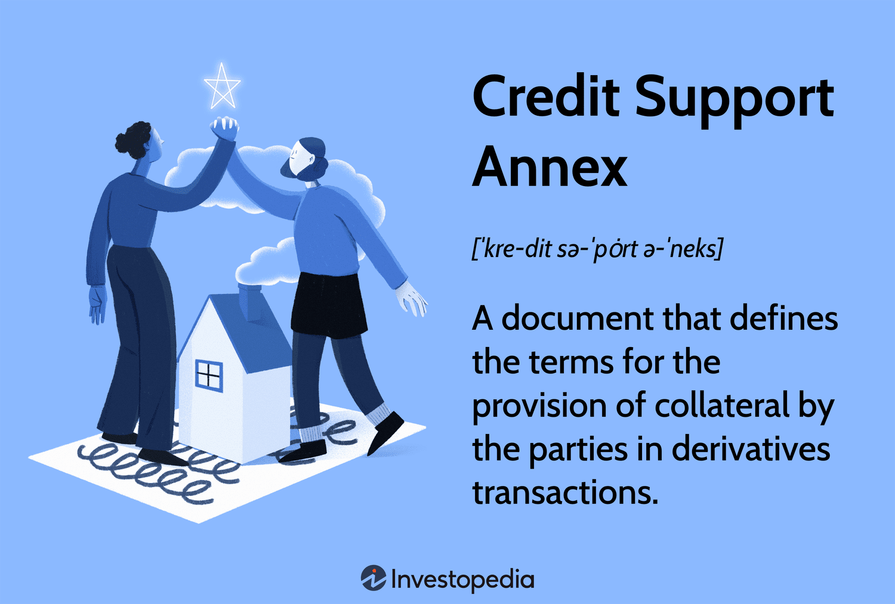

Financial agreements play a crucial role in the functioning of global financial markets, with the Credit Support Annex (CSA) holding significant importance in trading. A CSA is a legal document used within derivatives transactions, particularly over-the-counter (OTC) derivatives, to mitigate credit risk between counterparties. It facilitates the provision and management of collateral, ensuring that parties are protected against potential defaults. This framework enhances market stability by outlining the terms under which collateral is posted or received, directly impacting trading activities and risk management strategies.

The rise of algorithmic trading has profoundly influenced financial markets, transforming the way trading is conducted. Algorithmic trading uses complex mathematical models and algorithms to execute trades at speeds and frequencies that are impossible for human traders. This has resulted in increased market efficiency, liquidity, and reduced transaction costs. However, it also imposes new challenges concerning risk management, given the high speed and volume of transactions. 

Integrating CSAs with algorithmic trading activities is crucial for market participants. The intersection of CSA and algorithmic trading is a significant focus because both are foundational to modern financial practices. CSAs provide a safety net through risk mitigation, which becomes indispensable given the rapid nature of algorithmic transactions. For algorithmic trading to be efficient and secure, robust financial agreements like CSAs are necessary to handle credit exposures in real time, thus maintaining trust and stability in the trading system.

As we progress, a comprehensive understanding of the Credit Support Annex's structure and functions will shed light on its critical role in safeguarding algorithmic trading operations. By exploring the components and mechanisms of a CSA, we can appreciate its significance in facilitating seamless algo trading, ensuring that market participants can navigate the complexities of modern financial landscapes efficiently and effectively. This discussion sets the stage for further examination of CSAs, their components, and their role in enabling adaptive and resilient algorithmic trading environments.

## Table of Contents

## Understanding CSA (Credit Support Annex)

A Credit Support Annex (CSA) is an indispensable component of a financial contract, specifically within derivatives trading agreements. It acts as a security tool that outlines the rules for collateral posting between counterparties. By defining the terms surrounding the exchange of collateral, a CSA aims to mitigate counterparty credit risk, ensuring that both parties adhere to their contractual obligations regardless of market fluctuations.

A CSA is typically part of a broader International Swaps and Derivatives Association (ISDA) Master Agreement, which governs the overall trading relationship. The CSA itself is fundamentally concerned with credit support mechanics, going beyond simple debt obligations. It specifies collateral requirements, including the types of eligible collateral, valuation methods, and frequency of collateral calls. The agreement typically includes:

1. **Collateral Terms**: The CSA stipulates which assets qualify as collateral, how these assets are valued, and the procedures for substitution. It defines what financial instruments can be tendered as security, such as cash, government bonds, or equities.

2. **Thresholds and Minimum Transfer Amounts**: This component determines the minimum exposure level required before collateral needs to be posted. Thresholds are set to avoid the constant exchange of small collateral amounts, which can be operationally burdensome.

3. **Valuation and Haircuts**: CSAs contain stipulations regarding how collateral is valued, often applying 'haircuts' to account for market volatility and the liquidity of collateral. Haircuts reduce the market value of collateral to ensure more conservative valuation, thereby providing additional protection against credit risk.

4. **Frequency of Margin Calls**: The CSA will describe how often margin requirements are recalculated and when collateral must be posted. Frequent recalculations can help maintain credit exposure within agreed limits, ensuring swift responses to changing market conditions.

The primary function of the CSA is to reduce counterparty credit risk. This is crucial in derivatives markets where fluctuating asset values pose a significant risk. The arrangement of collateral exchange keeps both parties secure by reducing potential losses if one party defaults. For instance, during the 2008 financial crisis, firms with robust CSA frameworks faced fewer credit risks due to adequately managed collateral exchanges, highlighting the CSA's risk mitigation role.

In derivative trading, CSAs play a critical role in risk management. Consider a scenario involving a credit default swap (CDS) between two financial institutions. If the creditworthiness of the reference entity deteriorates, the value of the CDS may increase, necessitating additional collateral under the CSA to cover the increased market risk. Thus, CSAs ensure that the credit risk is constantly monitored and managed, serving as a cornerstone for maintaining stability in derivative trading.

By mandating collateral exchanges, CSAs provide a financial cushion that protects against default risks. This is particularly important in over-the-counter (OTC) derivatives, where counterparty default could have significant repercussions. Overall, the CSA is a key risk management tool, enhancing market confidence by clearly delineating the processes for managing and securing credit risk in financial contracts.

## The Role of Financial Agreements in Algo Trading

Financial agreements like the Credit Support Annex (CSA) play a crucial role in the infrastructure of [algorithmic trading](/wiki/algorithmic-trading) operations. These agreements provide the foundational legal and financial structures that enable smooth and efficient trading processes, which are vital for the functioning of modern, high-speed trading environments.

The significance of well-structured financial agreements in algorithmic trading cannot be overstated. A CSA defines the terms under which collateral is provided by parties involved in derivative transactions. This collateral arrangement is essential for managing counterparty credit risk, ensuring that both parties have an assurance of payment. By clearly outlining the parameters for collateral transfer, valuation, and maintenance, CSAs facilitate a seamless execution of algorithmic strategies. This precision is critical because many trading algorithms depend on the reliability and predictability of their supporting legal structures to function optimally.

Algorithmic trading, especially high-frequency trading, demands rapid execution speeds and high efficiency. The speed at which trades are executed and processed can have significant impacts on profitability. In such an environment, financial agreements must be robust yet flexible enough to accommodate quick decision-making processes. CSAs need to be structured to allow for rapid collateral adjustments and settlements, minimizing delays that could impede trading performance. High-frequency traders rely on these agreements to support the large [volume](/wiki/volume-trading-strategy) of transactions executed at accelerated speeds, ensuring regulatory compliance and risk management protocols are maintained without sacrificing efficiency.

A critical aspect in this context is the adaptability and automation of financial agreements like the CSA. Traditional manual processes are insufficient for high-frequency trading, where decisions are made in milliseconds. Financial agreements must be integrated into trading platforms in a way that allows for automatic adjustments and real-time synchronization with trading activities. This integration ensures that as market conditions fluctuate, the collateral requirements and risk exposures are automatically and continuously updated, conforming to the parameters set within the CSA.

To support such automation, technological solutions like Application Programming Interfaces (APIs) and advanced data management systems are deployed. These technologies enable real-time data processing and streamline the interaction between trading algorithms and financial contracts. The automation of CSA management through algorithms and [machine learning](/wiki/machine-learning) can provide traders with predictive insights, helping to optimize collateral usage and reduce operational risks.

In conclusion, financial agreements such as the CSA are indispensable for the efficient operation of algorithmic trading. Their structuring, adaptability, and automation form the backbone that supports swift and precise trading activities, highlighting their importance in today's fast-paced trading environments.

## Integrating CSA with Algorithmic Trading Platforms

Credit Support Annex (CSA) agreements are essential components in the landscape of algorithmic trading platforms. They play a crucial role in ensuring the efficient management of collateral, reducing counterparty risks, and maintaining the overall stability of financial operations. Their integration into trading platforms involves leveraging various technological solutions that facilitate seamless data management and processing.

The technological backbone supporting CSA integration consists of sophisticated data management and processing tools. Advanced databases and data warehouses are utilized to store and retrieve vast amounts of financial data effectively. These systems are designed to handle real-time data processing, enabling market participants to access up-to-date information crucial for algorithmic trading strategies. Furthermore, data analytics tools are employed to analyze historical data, providing insights that can shape trading decisions and strategies.

Application Programming Interfaces (APIs) play a pivotal role in the integration of CSA agreements within algorithmic trading platforms. They serve as conduits through which data and commands are communicated between different software applications, allowing for the automation of routine processes. Through APIs, trading platforms can interact with CSA data, ensuring that collateral requirements are automatically calculated and managed. This automation reduces manual intervention, minimizes the chances of human error, and enhances the responsiveness of trading operations.

Automated systems are indispensable in maintaining compliance with CSA agreements in the fast-paced environment of algorithmic trading. These systems continuously monitor trading transactions against predefined CSA terms to ensure adherence. For instance, if a trade breaches collateral thresholds, the system can automatically trigger processes to adjust margins or issue margin calls. Such automation ensures that compliance is maintained without significant delays, thus protecting both parties involved in the trading agreement.

Despite these technological advancements, challenges remain in aligning CSAs with automated and algorithm-driven workflows. One notable challenge is ensuring the interoperability of different technological systems. Trading platforms often integrate various software solutions, making it critical to ensure these systems can seamlessly communicate and exchange data regarding CSAs. Additionally, maintaining up-to-date CSA data across all platforms poses a challenge due to the dynamic nature of financial markets.

To address these issues, solutions such as standardized data formats and protocols are being developed. These standards facilitate the seamless exchange of CSA-related data between different systems, thus enhancing compatibility and reducing integration complexities. Furthermore, financial institutions are increasingly adopting agile development practices that allow for the rapid iteration and deployment of system updates, ensuring that CSA management tools keep pace with evolving market requirements.

In conclusion, the integration of CSA agreements with algorithmic trading platforms requires a robust technological framework that supports data management, automated processes, and compliance maintenance. By leveraging APIs, automated systems, and standardized solutions, the challenges of aligning CSAs with algorithm-driven workflows can be effectively mitigated, paving the way for more efficient and compliant trading operations.

## Risk Management in Algo Trading Using CSA

Credit Support Annex (CSA) agreements play a crucial role in risk management within algorithmic trading by mitigating both credit and operational risks. These agreements function as part of the International Swaps and Derivatives Association (ISDA) Master Agreement, providing a framework that dictates the collateral posting and management between counterparties. By specifying conditions under which collateral is transferred, CSAs enhance the security of financial transactions by ensuring that counterparty credit risk is minimized.

One key aspect of CSA agreements is their capability to buffer against market [volatility](/wiki/volatility-trading-strategies) and counterparty defaults. By defining specific thresholds and haircuts for collateral, CSAs require counterparties to post additional collateral when certain market conditions are met. This dynamic adjustment mechanism helps maintain the stability of trading operations even when markets become highly volatile. For instance, if a counterparty’s credit rating downgrades or market positions shift unfavorably, the CSA agreement will enforce the collateral posting, ensuring that the trading position remains adequately secured.

Furthermore, CSAs are instrumental in mitigating operational risk by standardizing procedures and enhancing transparency. Algorithmic trading, characterized by speed and volume, can be prone to operational errors. CSAs add a layer of protection by clearly defining each party’s responsibilities regarding collateral management and dispute resolution. This reduces the potential for misunderstandings and errors, thereby promoting smoother trading operations.

Successful implementation of CSA structures in algorithmic trading can be observed in various case studies. A notable example is the trading strategy employed by quantitative hedge funds that leverage dynamically managed CSAs to maintain optimal collateral levels. These funds use sophisticated algorithms to predict market movements and adjust collateral requirements accordingly, achieving a balance between risk management and capital efficiency. The integration of CSAs with advanced risk management algorithms allows these funds to effectively minimize credit exposure while optimizing trading strategies.

In conclusion, CSA agreements significantly enhance risk management in algorithmic trading by ensuring robust credit and operational risk controls. Through effective implementation, market participants can achieve improved resilience against market volatility and counterparty defaults, ultimately fostering a more stable trading environment.

## Regulatory Considerations

Financial markets operate within a framework of stringent regulations, particularly when it comes to managing counterparty risk and ensuring market stability. Credit Support Annexes (CSAs) and algorithmic trading are subject to these regulatory requirements, which aim to enhance transparency, reduce systemic risk, and protect market participants. Key regulations such as the Dodd-Frank Act in the United States and the European Market Infrastructure Regulation (EMIR) in the European Union exert significant influence on the structuring and usage of CSAs within algorithmic trading environments.

The Dodd-Frank Act, enacted in response to the 2007–2008 financial crisis, mandates comprehensive reforms for over-the-counter (OTC) derivatives markets. It stipulates the use of CSAs to mitigate credit risk by requiring adequate collateralization. This ensures that counterparties maintain sufficient financial reserves to cover potential losses, thereby reducing the likelihood of defaults. The act also demands heightened transparency through mandatory reporting to trade repositories and the clearing of eligible derivatives via central counterparties (CCPs). CSAs facilitate compliance with these requirements by specifying collateral arrangements, valuation, and dispute resolution procedures.

EMIR is another cornerstone regulation that aims to increase the safety and transparency of the OTC derivatives market within the EU. It introduces obligations similar to Dodd-Frank, such as the clearing of standardized OTC derivatives, risk mitigation techniques for non-centrally cleared contracts, and reporting obligations. Under EMIR, CSAs are crucial for non-cleared derivatives as they govern the exchange of collateral, including margin requirements. The regulation emphasizes the need for robust risk management processes, which CSAs support by outlining clear terms for collateral management and valuation adjustments.

As algorithmic trading gains traction, regulatory scrutiny intensifies due to concerns about its impact on market stability. High-frequency trading ([HFT](/wiki/high-frequency-trading-strategies)), a subset of algorithmic trading, is particularly subject to examination. Regulators demand that firms operating in this space maintain a high level of operational resilience and adaptability, which CSAs can facilitate by ensuring robust risk management. CSAs contribute to meeting regulatory obligations by standardizing collateral practices, thus fostering better predictability and stability in trading activities.

Emerging regulatory trends indicate a continuous evolution towards stricter oversight of financial markets. Initiatives like the Markets in Financial Instruments Directive II (MiFID II) in the EU set higher standards for transparency and investor protection. These regulations could further influence the integration of CSAs in algorithmic trading by enforcing detailed records of trading activities and collateral exchanges. Moreover, global regulatory bodies, including the International Organization of Securities Commissions (IOSCO), are pushing for increased harmonization of rules across jurisdictions, potentially affecting the future development and deployment of CSAs in algo trading practices.

In summary, regulatory frameworks like Dodd-Frank and EMIR are pivotal in shaping the landscape for CSAs within algorithmic trading. These regulations oblige market participants to implement effective risk management through standardized collateral agreements, thereby ensuring compliance with global standards and enhancing market stability. As regulatory requirements evolve, the role of CSAs is likely to expand, necessitating continuous adaptation by financial institutions to align with emerging trends and technologies.

## Future Trends and Innovations

The landscape of Credit Support Annex (CSA) frameworks is poised for evolution, driven by technological advancements and changing market dynamics. One major area of innovation is the incorporation of blockchain technology. Blockchain's decentralized ledger can enhance the transparency and security of CSA agreements, ensuring that all transactions are recorded immutably and in real-time. This can significantly reduce the time and resources required for reconciliation processes and minimize the risk of fraud or manipulation. By implementing smart contracts on blockchain platforms, CSA terms can be automated, triggering margin calls or collateral adjustments without the need for human intervention.

Artificial Intelligence (AI) is another transformative force in CSA management and algorithmic trading. AI algorithms can analyze vast datasets to optimize collateral management strategies, predict margin calls, and assess counterparty risk more accurately. Machine learning models can be trained to identify patterns and anomalies in trading data, providing traders with actionable insights to enhance decision-making and strategy refinement. These AI-driven insights can lead to more efficient collateral allocation and reduced operational costs.

Evolving market dynamics and technologies are reshaping CSA utilization and algorithmic trading strategies. The increasing integration of real-time data analytics allows trading systems to respond swiftly to market changes, optimizing trade execution and risk management. As markets become more interconnected, there is a growing need for unified CSA frameworks that can operate seamlessly across different jurisdictions and asset classes.

Innovative practices are being developed to enhance the synergy between CSA and algorithmic trading. For instance, the use of Application Programming Interfaces (APIs) enables seamless communication between trading platforms and CSA management systems. This integration ensures that CSA terms are continuously monitored and adhered to, even in high-frequency trading environments.

Furthermore, advancements in cloud computing are facilitating the scalability and flexibility of CSA management systems. Traders can leverage cloud-based platforms to store, manage, and analyze large datasets, ensuring that CSA frameworks remain robust and adaptable to changing market conditions.

In conclusion, the future of CSA frameworks in algorithmic trading is marked by technological innovation and strategic adaptation. Market participants who embrace these advancements are likely to gain a competitive edge, achieving greater efficiency and effectiveness in their trading operations.

## Conclusion

In examining the intersection of Credit Support Annexes (CSA) and algorithmic trading, it becomes evident that CSAs are indispensable in modern financial agreements. They play a crucial role in managing counterparty credit risk by providing a standardized framework for collateral exchange. This structure not only mitigates risk but also enhances the operational efficiency necessary for high-frequency trading environments. As algorithmic trading becomes more prevalent, the seamless integration of CSAs into trading platforms is essential for ensuring compliance and reliability in trade execution.

Effective management of CSAs requires financial professionals to maintain a robust understanding of their components and implications. This involves staying informed on regulatory changes and leveraging advanced technologies to automate and streamline CSA-related processes. The integration of technological solutions, such as APIs and automated systems, into CSA management enables traders to meet the speed and agility demands of today's markets.

The ongoing evolution of financial markets and technologies highlights the necessity for professionals to continually adapt and innovate. It is imperative for market participants to engage in further research and development to enhance the functionality and integration of CSAs in algorithmic trading systems. By prioritizing continuous improvement and exploration in this domain, the industry can better navigate the challenges and opportunities presented by the dynamic financial landscape.

## References & Further Reading

[1]: Gregory, J. (2014). ["Central Counterparties: Mandatory Central Clearing and Bilateral Margin Requirements for OTC Derivatives."](https://onlinelibrary.wiley.com/doi/book/10.1002/9781118891568) Wiley.

[2]: Hull, J. C. (2018). ["Options, Futures, and Other Derivatives."](https://www.semanticscholar.org/paper/Options%2C-Futures%2C-and-Other-Derivatives-Hull/89bdee500c8623864fc9eb7a471546aa713acc44) Pearson.

[3]: Johnson, B. (2010). ["Algorithmic Trading & DMA: An introduction to direct access trading strategies."](https://www.semanticscholar.org/paper/Algorithmic-trading-%26-DMA-%3A-an-introduction-to-Johnson/aa5de1ab883d5e23b6651faa7c1807586d688e4b) 4Myeloma Press.

[4]: Duffie, D., & Singleton, K. J. (2003). ["Credit Risk: Pricing, Measurement, and Management."](https://press.princeton.edu/books/hardcover/9780691090467/credit-risk) Princeton University Press.

[5]: Pirrong, C. (2011). ["The Economics of Central Clearing: Theory and Practice."](https://www.isda.org/attachment/MzE0NA==/ISDAdiscussion_CCP_Pirrong.pdf) ISDA Discussion Papers.