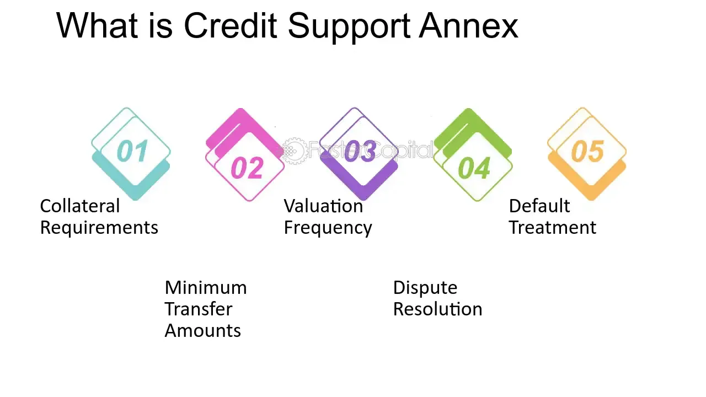

## Table of Contents

## What is a Credit Support Annex (CSA)?

A Credit Support Annex, or CSA, is a legal document that is part of a bigger agreement called an ISDA Master Agreement. It is used by two parties who are trading financial products, like derivatives, to manage the risk of one party not being able to pay what they owe. The CSA outlines the rules for exchanging collateral, which is something of value that one party gives to the other as a security against the risk of default.

In simple terms, if one party owes money to the other, the CSA helps decide what kind of collateral can be used, how much should be given, and when it needs to be returned. This makes the trading safer because it reduces the chance that one party will lose money if the other party can't pay. By setting clear rules, the CSA helps both parties feel more secure when they are doing business together.

## Why is a CSA important in financial transactions?

A CSA is really important in financial transactions because it helps keep things safe for both people or companies involved. When you're dealing with big money and things like derivatives, there's always a chance that one side might not be able to pay back what they owe. The CSA sets up rules about giving and getting back collateral, which is like a safety net. It makes sure that if someone can't pay, the other person isn't left with nothing. This makes everyone feel more secure and willing to do business.

Another reason the CSA is important is that it helps avoid arguments and confusion. By clearly saying what kind of collateral can be used, how much should be given, and when it should be returned, the CSA takes away a lot of the guesswork. This clear agreement means that both sides know exactly what to expect, which can prevent disagreements and keep the business relationship smooth. In the end, having a CSA in place helps keep financial transactions fair and straightforward.

## How does a CSA relate to the ISDA Master Agreement?

A CSA is a part of the bigger ISDA Master Agreement. The ISDA Master Agreement is like a rulebook that two parties use when they trade financial products like derivatives. It sets out the general terms and conditions that both parties agree to follow. The CSA is a special section of this rulebook that focuses on one important thing: managing the risk that one party might not be able to pay what they owe.

The CSA works by setting rules about exchanging collateral. Collateral is something valuable that one party gives to the other as a kind of promise or security. If one party can't pay, the other party can use the collateral to cover their losses. The CSA says what kind of collateral can be used, how much should be given, and when it should be returned. By including the CSA in the ISDA Master Agreement, both parties have clear guidelines on how to handle this important part of their financial dealings, making the whole process safer and smoother.

## What are the main components of a CSA?

The main parts of a CSA include the types of collateral that can be used. This means that the agreement will say what kinds of things, like cash or securities, can be given as a promise or security. It also talks about how much collateral needs to be given. This is important because it makes sure that the amount is enough to cover the risk but not too much to be unfair. The CSA also sets rules about when and how often the collateral should be checked and adjusted, which is called margin calls. This helps keep the collateral value in line with the changing value of the financial products being traded.

Another key part of the CSA is the rules for returning the collateral. Once the financial deal is over or the risk goes away, the CSA says how and when the collateral should be given back to the person who provided it. This makes sure that everyone gets their stuff back in a fair way. The CSA also includes what happens if one party can't pay, which is called a default. It says what the other party can do with the collateral in that situation. By covering all these points, the CSA helps keep financial transactions safe and clear for everyone involved.

## How does a CSA mitigate counterparty credit risk?

A CSA helps lower the risk that the other person in a financial deal won't be able to pay by making rules about giving and getting back collateral. Collateral is like a safety net - it's something valuable that one person gives to the other as a promise. If the first person can't pay, the second person can use the collateral to cover their losses. By setting clear rules on what kind of collateral can be used and how much should be given, the CSA makes sure that both people feel safer when they're doing business together.

The CSA also helps by saying when and how often the collateral should be checked and changed. This is important because the value of the financial products being traded can go up and down. By keeping the collateral in line with these changes, the CSA makes sure that the safety net stays strong. If one person can't pay, the other person won't lose as much money because they have the collateral to fall back on. This makes the whole financial deal less risky and more secure for everyone involved.

## What are the different types of collateral that can be used in a CSA?

In a CSA, different types of things can be used as collateral to make the financial deal safer. Cash is one common type of collateral. It's easy to use and value, so both parties often agree on it. Besides cash, securities can also be used. Securities are things like stocks or bonds that have a clear value and can be sold if needed. Sometimes, other assets like government bonds or even commodities like gold can be used as collateral, depending on what the two parties agree on.

The type of collateral used in a CSA can change based on what the two parties decide works best for them. For example, one party might prefer to use cash because it's simple, while the other might want to use securities because they already have a lot of them. The CSA will say what kinds of collateral are okay to use, making sure both parties know what to expect. By agreeing on the right type of collateral, the CSA helps make the financial deal safer and more secure for everyone involved.

## How is the valuation and margining process handled in a CSA?

The valuation and margining process in a CSA is all about making sure the collateral stays in line with the value of the financial products being traded. This process starts with figuring out how much the financial products are worth right now. Both parties agree on a way to check this value regularly, which could be every day or at other set times. If the value of the financial products goes up or down, the amount of collateral needs to change too. This is called a margin call. If the value goes up, the person who owes money might need to give more collateral. If it goes down, they might get some back.

The CSA sets clear rules on how to handle these margin calls. It says how often the value should be checked, how much the collateral can change, and how quickly the changes need to happen. This makes sure that both parties know what to expect and can plan accordingly. By keeping the collateral in line with the value of the financial products, the CSA helps keep the deal fair and safe. If one party can't pay, the other party has the right amount of collateral to cover their losses, making the whole process more secure.

## What are the key differences between a CSA and other credit support documents?

A CSA is a special part of the ISDA Master Agreement that focuses on managing the risk of one party not being able to pay in financial deals, especially with derivatives. It sets clear rules on what kind of collateral can be used, how much should be given, and when it should be returned. This makes the CSA different from other credit support documents because it's very specific about collateral and how it's managed. Other credit support documents might talk about general credit terms or different ways to manage risk, but they don't go into as much detail about collateral as a CSA does.

Another key difference is that a CSA is usually used between two parties who are trading financial products like derivatives. It's designed to work within the bigger framework of the ISDA Master Agreement, making it a tailored solution for these kinds of deals. In contrast, other credit support documents might be used for different types of financial agreements or might not be as closely linked to a specific master agreement. This makes the CSA a more specialized tool for managing credit risk in derivative trading, while other documents might have a broader or different focus.

## How do thresholds, minimum transfer amounts, and rounding conventions work in a CSA?

Thresholds, minimum transfer amounts, and rounding conventions are important parts of a CSA that help manage how collateral is exchanged. A threshold is like a limit that says how much one party can owe the other before they have to give collateral. If the amount they owe is less than the threshold, they don't need to give any collateral. But if it goes over the threshold, they have to give collateral to cover the difference. This helps keep the process simple by not having to exchange small amounts of collateral all the time.

Minimum transfer amounts and rounding conventions also help keep things smooth. A minimum transfer amount is the smallest amount of collateral that can be exchanged at one time. If the amount of collateral needed is less than this minimum, it's not exchanged until it reaches that level. Rounding conventions are rules about how to round the amounts of collateral to make them easier to handle. For example, if the collateral amount comes out to $123,456.78, the rounding convention might say to round it to the nearest $1,000, making it $123,000. These rules help make the process of exchanging collateral more straightforward and less confusing for both parties.

## What are the implications of a CSA on liquidity management for financial institutions?

A CSA can have a big impact on how financial institutions manage their money, especially their liquidity. Liquidity means having enough cash or assets that can be quickly turned into cash to meet financial needs. When a CSA is in place, a financial institution might need to keep more cash or liquid assets on hand to use as collateral. This can tie up money that could be used for other things, like investing or lending. So, the institution needs to plan carefully to make sure it has enough liquidity to cover both its regular business and the collateral requirements of the CSA.

On the other hand, a CSA can also help a financial institution manage its liquidity better in some ways. By having clear rules about when and how much collateral needs to be given or returned, the institution can predict its cash needs more accurately. This can help with planning and make it easier to manage money flows. Also, if the institution knows it has strong collateral in place, it might be able to borrow money more easily or at better rates, which can improve its overall liquidity position. So, while a CSA can make liquidity management more challenging, it can also provide tools to handle it more effectively.

## How does the choice of law and jurisdiction affect the enforceability of a CSA?

The choice of law and jurisdiction in a CSA can really affect whether the agreement will hold up if there's a problem. When two parties agree on a CSA, they also pick which country's laws will apply and which court will handle any disputes. If they choose a place with strong and clear laws about financial deals, it can make the CSA more enforceable. But if they pick a place with unclear or weak laws, it might be harder to make the CSA work if someone tries to challenge it.

Also, choosing a jurisdiction that both parties trust can make a big difference. If both parties feel the court system in that place is fair and reliable, they're more likely to follow the CSA without arguing. But if one party thinks the chosen jurisdiction is unfair, they might fight the CSA more, making it harder to enforce. So, picking the right law and jurisdiction is key to making sure the CSA does its job in keeping financial deals safe and secure.

## What are some advanced strategies for optimizing the use of a CSA in trading operations?

One advanced strategy for optimizing the use of a CSA in trading operations is to carefully manage the types of collateral used. By choosing high-quality and liquid assets as collateral, a trader can ensure that the collateral can be easily sold or used if needed. This can help reduce the risk of not being able to cover losses if the other party can't pay. Another part of this strategy is to regularly review and adjust the collateral based on market conditions. If the value of the financial products being traded changes a lot, updating the collateral can keep the CSA strong and effective.

Another strategy is to use the CSA to negotiate better terms with trading partners. By showing that you have a strong CSA in place, you can build trust with your partners. This might help you get better rates or more favorable terms in your deals. Also, understanding the thresholds, minimum transfer amounts, and rounding conventions in the CSA can help you plan your trades better. By knowing exactly when and how much collateral you need to give or get back, you can manage your money more efficiently and make smarter trading decisions.

## References & Further Reading

[1]: Gregory, J. (2014). ["Central Counterparties: Mandatory Central Clearing and Bilateral Margin Requirements for OTC Derivatives."](https://onlinelibrary.wiley.com/doi/book/10.1002/9781118891568) Wiley.

[2]: Hull, J. C. (2018). ["Options, Futures, and Other Derivatives."](https://www.semanticscholar.org/paper/Options%2C-Futures%2C-and-Other-Derivatives-Hull/89bdee500c8623864fc9eb7a471546aa713acc44) Pearson.

[3]: Johnson, B. (2010). ["Algorithmic Trading & DMA: An introduction to direct access trading strategies."](https://www.semanticscholar.org/paper/Algorithmic-trading-%26-DMA-%3A-an-introduction-to-Johnson/aa5de1ab883d5e23b6651faa7c1807586d688e4b) 4Myeloma Press.

[4]: Duffie, D., & Singleton, K. J. (2003). ["Credit Risk: Pricing, Measurement, and Management."](https://press.princeton.edu/books/hardcover/9780691090467/credit-risk) Princeton University Press.

[5]: Pirrong, C. (2011). ["The Economics of Central Clearing: Theory and Practice."](https://www.isda.org/attachment/MzE0NA==/ISDAdiscussion_CCP_Pirrong.pdf) ISDA Discussion Papers.