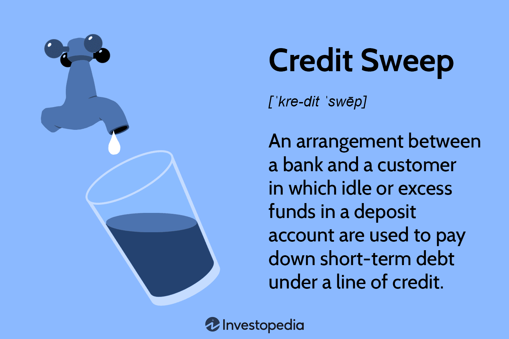

## Table of Contents

## What is a credit sweep?

A credit sweep is a way for businesses to manage their money better. It happens when a business has money in different bank accounts, like a checking account and a savings account. The bank automatically moves extra money from the checking account to the savings account at the end of each day. This helps the business earn more interest on their savings because the money isn't just sitting in the checking account.

This process is helpful because it makes sure that the business always has enough money in its checking account to pay for things like bills and salaries. If the checking account needs more money during the day, the bank can move money back from the savings account. This way, the business can keep its money working hard for them without having to do anything extra.

## How does a credit sweep work?

A credit sweep works by moving extra money from a business's checking account to its savings account at the end of each day. This happens automatically, so the business doesn't have to do anything. The bank checks how much money is in the checking account and if there's more than what's needed for daily expenses, it sweeps the extra money into the savings account. This helps the business earn more interest on their money because savings accounts usually offer higher interest rates than checking accounts.

If the business needs money back in the checking account during the day, the bank can move money from the savings account back to the checking account. This way, the business always has enough money to pay for things like bills and salaries. The credit sweep system helps businesses manage their money better without having to keep track of it all the time. It's like having a helper that makes sure the money is in the right place at the right time.

## What are the main components of a credit sweep?

A credit sweep has two main parts: the checking account and the savings account. The checking account is where the business keeps money for daily expenses like paying bills and salaries. The savings account is where the business can earn more interest on their money. The bank looks at the checking account at the end of each day to see if there's any extra money that isn't needed for daily expenses.

If there is extra money, the bank automatically moves it from the checking account to the savings account. This is called a sweep. The business doesn't have to do anything because it happens on its own. If the checking account needs more money during the day, the bank can move money back from the savings account to the checking account. This way, the business always has enough money to cover its costs and can also earn more interest on their savings.

## What are the benefits of using a credit sweep?

Using a credit sweep helps businesses make the most of their money. It works by moving extra money from a checking account to a savings account at the end of each day. This means the business can earn more interest on their money because savings accounts usually have higher interest rates than checking accounts. It's like having a helper that automatically makes sure the money is working hard for the business.

Another benefit is that a credit sweep helps keep the right amount of money in the checking account. The bank makes sure there's always enough money to pay for things like bills and salaries. If the checking account needs more money during the day, the bank can move money back from the savings account. This way, the business doesn't have to worry about keeping track of their money all the time. It makes managing money easier and more efficient.

## Are there any risks associated with credit sweeps?

There are some risks with using a credit sweep. One risk is that if the business needs more money in their checking account than expected, it might take a little time for the bank to move money back from the savings account. This could cause problems if the business needs to pay for something right away and there isn't enough money in the checking account.

Another risk is that the business might not keep a close eye on their accounts. Because the credit sweep happens automatically, the business might not check their accounts as often. If there's a mistake or if the bank doesn't move the money correctly, the business might not notice right away. This could lead to money problems if not caught quickly.

## How does a credit sweep differ from other credit management techniques?

A credit sweep is different from other credit management techniques because it automatically moves extra money from a checking account to a savings account every day. Other methods might need the business to move money themselves or use different accounts for different purposes. With a credit sweep, the bank does the work for the business, making it easier to manage money without having to do anything extra.

Another way a credit sweep is different is that it helps the business earn more interest on their savings. Other techniques might focus on paying off debts faster or keeping money in the checking account for easy access. A credit sweep makes sure the business has enough money in the checking account for daily expenses while also putting extra money into a savings account where it can earn more interest. This way, the business can use their money more efficiently without having to think about it all the time.

## What are the legal considerations when implementing a credit sweep?

When a business decides to use a credit sweep, they need to think about some legal things. First, they have to make sure they follow the rules set by the bank where they have their accounts. Banks have their own rules about how credit sweeps work, and the business needs to agree to these rules before starting a credit sweep. If the business doesn't follow the bank's rules, they could face penalties or lose the ability to use the credit sweep.

Another important thing is to make sure that the credit sweep doesn't break any laws about how businesses manage their money. For example, there are laws that say businesses need to keep enough money in their accounts to pay their bills and taxes. If a credit sweep moves too much money out of the checking account, it could make it hard for the business to pay what they owe. So, the business needs to make sure their credit sweep plan follows all the laws and keeps them in good financial health.

## Can a credit sweep improve my credit score? If so, how?

A credit sweep can help improve your credit score, but it does this in an indirect way. It doesn't directly affect your credit score because it's a way to manage money between your checking and savings accounts. But, by using a credit sweep, you can keep better track of your money and make sure you always have enough to pay your bills on time. Paying bills on time is really important for your credit score because it shows that you're good at managing your money.

If you use a credit sweep to make sure you always have money in your checking account for bills, you're less likely to miss a payment. Missing payments can hurt your credit score a lot. So, by helping you pay your bills on time, a credit sweep can help keep your credit score from going down and might even help it go up over time. It's like having a helper that makes sure you're always ready to pay what you owe.

## What industries commonly use credit sweeps and why?

Many businesses in different industries use credit sweeps to help manage their money better. One industry that commonly uses credit sweeps is the retail industry. Retail businesses often have a lot of money coming in and going out every day, so they need to make sure they always have enough money in their checking accounts to pay for things like inventory and employee salaries. A credit sweep helps them move extra money into a savings account where it can earn more interest, while still keeping enough money in the checking account for daily expenses.

Another industry that often uses credit sweeps is the healthcare industry. Hospitals and clinics have to manage a lot of money because they need to pay for things like medical supplies and staff salaries. A credit sweep helps them keep their money working hard for them by moving extra money into a savings account at the end of each day. This way, they can earn more interest on their money and still have enough in their checking account to cover their costs. Both of these industries use credit sweeps because they help make money management easier and more efficient.

## How can businesses implement a credit sweep effectively?

To implement a credit sweep effectively, businesses need to start by talking to their bank. They should explain what they want to do and make sure the bank offers a credit sweep service. Once they find out the bank can help, they need to agree on the rules. This means deciding how much money should stay in the checking account for daily expenses and how much can be moved to the savings account. The business should also make sure they understand all the bank's fees and rules so there are no surprises later.

After setting up the credit sweep with the bank, businesses should keep an eye on their accounts. Even though the credit sweep happens automatically, it's important to check the accounts regularly to make sure everything is working right. If the business sees that the credit sweep isn't moving enough money or is moving too much, they can talk to the bank to make changes. By staying on top of their accounts and working closely with their bank, businesses can make sure their credit sweep helps them manage their money better and earn more interest on their savings.

## What are the advanced strategies for optimizing a credit sweep?

To optimize a credit sweep, businesses can start by fine-tuning the threshold for the sweep. This means figuring out the right amount of money to keep in the checking account for daily expenses. By setting this threshold just right, the business can make sure they always have enough money to pay bills and salaries, while also moving as much extra money as possible into the savings account to earn more interest. They can work with their bank to analyze past spending patterns and set a threshold that balances daily needs with [earning](/wiki/earning-announcement) potential.

Another strategy is to use multiple sweep accounts. Some businesses might have different types of expenses, like payroll and inventory costs. By setting up different sweep accounts for these different needs, the business can move money more efficiently. For example, they could have one sweep account for payroll that moves money at a different time than the sweep account for inventory. This way, they can make sure each type of expense is covered without tying up too much money in the checking account. Regularly reviewing and adjusting these strategies based on the business's changing needs can help keep the credit sweep working at its best.

## How do regulatory changes impact the use of credit sweeps?

Regulatory changes can affect how businesses use credit sweeps. If the rules about how much money a business has to keep in their checking account change, it might mean they need to adjust their credit sweep. For example, if a new law says businesses need to keep more money in their checking account to cover bills and taxes, they might not be able to move as much money into their savings account. This could make it harder for them to earn as much interest as before. Businesses need to keep up with these changes and work with their bank to make sure they're following the new rules.

Another way regulatory changes can impact credit sweeps is by changing the fees or costs of using them. If new regulations make it more expensive for banks to offer credit sweeps, the bank might pass those costs onto the business. This could make credit sweeps less appealing if the costs start to outweigh the benefits of earning more interest. Businesses should stay informed about any regulatory changes that might affect their credit sweep and be ready to adjust their money management strategies to keep things running smoothly.

## What is Understanding Credit Sweep?

Credit sweep is an efficient cash management technique used primarily by corporations to minimize interest expenses associated with loans. At its core, the strategy capitalizes on the unused or excess funds available in a company's bank account, channeling these resources to automatically curtail outstanding debt, especially short-term liabilities.

This mechanism is particularly advantageous for organizations aiming to sustain [liquidity](/wiki/liquidity-risk-premium) while maximizing the utility of their financial resources. By systematically redirecting idle cash towards debt reduction, companies can achieve considerable savings on interest, enhancing their financial efficiency. For example, if a corporation maintains a revolving credit line, the credit sweep can dynamically allocate surplus funds to pay down the balance, thereby reducing the interest accrued on the borrowed amount.

The flexibility of the credit sweep is one of its primary benefits, especially for businesses experiencing variable cash flows. For these entities, fluctuations in income and expenditures can lead to periods of cash surplus, which, if left unmanaged, could result in lost opportunities for cost savings. By integrating a credit sweep system, companies can seamlessly manage these fluctuations, ensuring that excess funds are systematically utilized to decrease debt burdens.

In effect, the credit sweep not only aids in managing liquidity but also promotes the strategic deployment of cash. This tactical approach to cash management allows companies to maintain a delicate balance between immediate financial obligations and the optimization of available cash, thereby fostering greater financial health and operational agility.

Mathematically, if $C$ is the surplus cash in a company’s account, and $I$ is the [interest rate](/wiki/interest-rate-trading-strategies) on outstanding debt, the potential savings per period from the credit sweep can be approximated as:

$$
\text{Savings} = C \times I
$$

This simple formula highlights how even modest surpluses, when applied judiciously, can lead to substantial savings over time, reaffirming the credit sweep’s value as a financial strategy.

## References & Further Reading

[1]: ["Advances in Financial Machine Learning"](https://www.amazon.com/Advances-Financial-Machine-Learning-Marcos/dp/1119482089) by Marcos Lopez de Prado

[2]: Bank for International Settlements. (2022). ["Triennial Central Bank Survey – Foreign exchange turnover in April 2022."](https://www.bis.org/statistics/rpfx22_fx.pdf)

[3]: ["Quantitative Trading: How to Build Your Own Algorithmic Trading Business"](https://www.amazon.com/Quantitative-Trading-Build-Algorithmic-Business/dp/1119800064) by Ernest P. Chan

[4]: ["Machine Learning for Algorithmic Trading"](https://github.com/stefan-jansen/machine-learning-for-trading) by Stefan Jansen

[5]: ["Evidence-Based Technical Analysis: Applying the Scientific Method and Statistical Inference to Trading Signals"](https://www.amazon.com/Evidence-Based-Technical-Analysis-Scientific-Statistical/dp/0470008741) by David Aronson