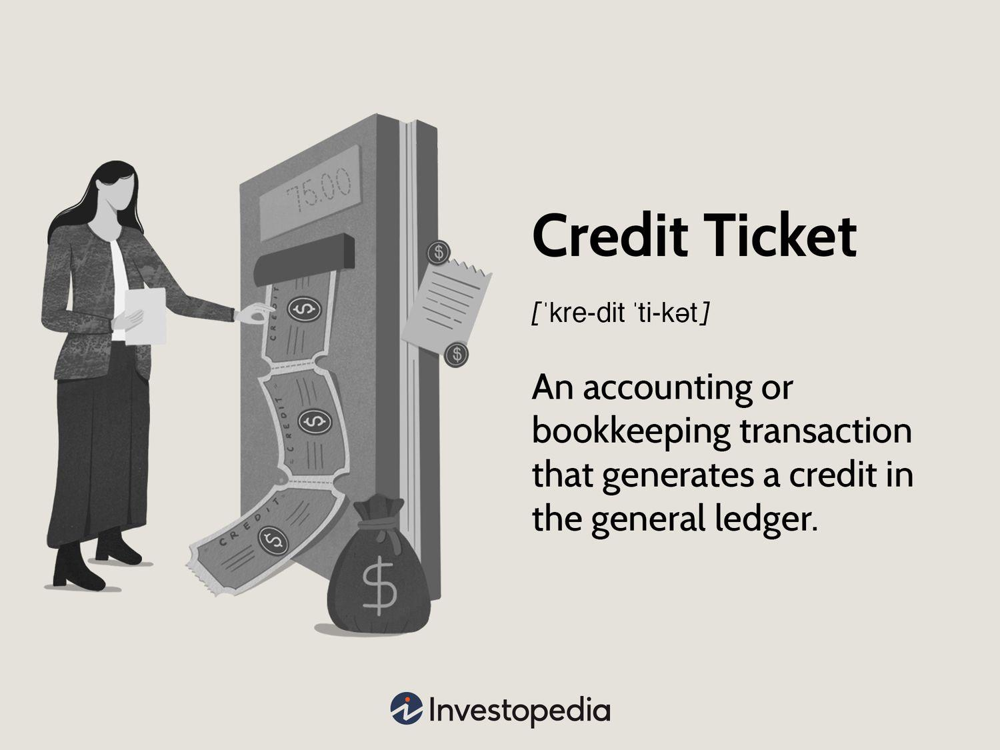

In the world of finance, a variety of instruments play crucial roles in the growth and sustainability of businesses and the economy. These instruments, ranging from accounting elements to sophisticated trading platforms, are fundamental in shaping financial landscapes. Among them, credit tickets serve as essential components of bookkeeping, representing credits in accounting ledgers and maintaining financial balance. Properly managing these entries is vital for accurate financial reporting and analysis.

Another significant advancement is algorithmic trading, which has revolutionized trading activities through the use of computer algorithms. This innovation automates trading processes by executing trades based on predefined patterns and criteria, aiming to improve efficiency, accuracy, and overall performance in financial markets. The interplay between technology and finance through algo trading not only enhances trade execution but also minimizes the impact of human emotions and biases on trading decisions.



Understanding the significance of financial instruments like credit tickets and the impact of algorithmic trading is crucial for businesses and investors. These tools and strategies provide the framework for informed financial management and decision-making, enabling participants to navigate the complexities of modern finance. As technology continues to advance, the potential of these instruments in enhancing financial activities and efficacy remains substantial.

## Table of Contents

## Understanding Financial Instruments

Financial instruments are essential components of the financial markets, serving as vehicles for investment, risk management, and capital raising. These instruments are essentially contracts that derive value from their underlying components, playing a critical role in the functioning of modern economies. They can be broadly classified into three primary categories: equities, debt instruments, and derivatives.

### Equities

Equities, commonly known as stocks or shares, represent ownership interest in a corporation. Holders of equities are entitled to a portion of the company's profits, often received as dividends, and have voting rights in company decisions. Equities are traded on various stock exchanges, where their prices fluctuate based on market conditions and company performance. They are a key instrument for investors seeking long-term capital appreciation and portfolio diversification.

### Debt Instruments

Debt instruments are financial tools that represent loans made by an investor to a borrower, typically a corporation or government. These instruments include bonds, notes, and debentures, among others. Debt instruments promise the repayment of principal along with interest over a specified period. They are crucial for entities that require capital for projects or operational expenditures. Investors purchase debt instruments for their relatively stable returns and fixed income generation.

### Derivatives

Derivatives are complex financial contracts whose value is derived from an underlying asset, index, or rate. Common derivatives include futures, options, and swaps. They are used primarily for hedging risk or for speculative purposes. Derivatives allow investors to manage exposure to various financial risks, such as price fluctuations, interest rates, and currency exchange rates. They are inherently leveraged instruments, meaning they can magnify gains but also present higher risks.

### Other Types

Apart from the primary categories, financial instruments also include hybrid securities, which combine characteristics of both debt and equity, such as convertible bonds. Additionally, money market instruments like treasury bills and certificates of deposit are short-term debt instruments used for managing [liquidity](/wiki/liquidity-risk-premium).

Each type of financial instrument serves specific roles in financial activities, contributing to markets' overall liquidity, efficiency, and stability. Understanding these instruments is crucial for investors, policymakers, and participants in financial markets who aim to optimize their financial strategies and risk management practices.

## The Concept of Credit Ticket

A credit ticket is an integral element in accounting, representing a transaction that contributes to a credit in the ledger. In the framework of double-entry bookkeeping, two primary types of entries exist: credit and debit. A credit ticket is a specific accounting entry that increases a liability, equity, or income account. On the contrary, a debit ticket is an entry that increases asset or expense accounts.

These tickets are structured to ensure that every financial transaction affects at least two accounts, maintaining the equilibrium of accounting records. This balance is mathematically represented by the equation:

$$
\text{Assets} = \text{Liabilities} + \text{Equity}
$$

In practice, when a credit ticket is generated, it is recorded on the right side of the accounting ledger. This action indicates an increase in liabilities or income or a decrease in assets. For example, when a business receives revenue through sales, it records the income as a credit ticket, which simultaneously reflects a rise in cash or accounts receivable as a debit entry to maintain balance.

Credit tickets are crucial for the precise and transparent recording of financial transactions. They enable businesses to track obligations and revenue accurately, essential for financial reporting and analysis. By understanding credit tickets and their differentiation from debit tickets, organizations can maintain robust financial controls and support informed financial decision-making.

## Example of a Credit Ticket

To further understand how credit tickets function, consider a scenario where a bank accepts a deposit from a customer. This deposit is recorded as a liability for the bank because it represents an obligation for the bank to repay the amount to the customer upon demand. Concurrently, the same deposit appears as a credit entry in the customer's ledger, signaling an increase in their financial resources. 

In double-entry bookkeeping, every financial transaction affects at least two accounts, maintaining a balance between debits and credits. When a customer deposits $1,000 into their bank account, the bank's records will reflect this as follows:

- Debit: Cash Account (Asset) $1,000
- Credit: Customer Deposits Account (Liability) $1,000

This ensures that the accounting equation (Assets = Liabilities + Equity) holds true. In the customer’s ledger, the deposit manifests as:

- Debit: Bank Account (Asset) $1,000
- Credit: Income/Deposits (Revenue) $1,000

The credit entry in the customer’s ledger signifies an increase in their available financial resources, enhancing their net worth. 

Credit tickets are essential in various financial operations, allowing precise tracking and reporting of cash flows. For example, in accounting software, these transactions might be automated using scripts or software functionalities that ensure every deposit or credit activity reflects appropriately across all ledgers. Skilful management of these entries can prevent discrepancies and maintain financial health within an organization. 

Moreover, in larger financial contexts, such as international banking or corporate finance, the accurate and timely management of credit tickets is integral for compliance with financial regulations and for strategic planning. Properly managed credit entries allow organizations to efficiently allocate resources, plan cash flow, and meet regulatory requirements, all of which are critical for sustainable financial growth.

## Algorithmic Trading: An Overview

Algorithmic trading, commonly referred to as algo trading, employs sophisticated computer programs designed to execute trade strategies automatically based on predefined criteria. This method represents a shift from conventional trading methods by leveraging technology to improve the speed and precision of trades.

### Mechanisms of Algorithmic Trading

At its core, [algorithmic trading](/wiki/algorithmic-trading) integrates advanced mathematical models and computational techniques to analyze market data and execute orders. The algorithms are typically based on a set of rules developed from historical data patterns and market forecasts. These rules dictate the timing, price, and quantity of trades, allowing the system to identify optimal trading opportunities without requiring human intervention.

The primary goal of algorithmic trading is to enhance trading efficiency and accuracy. By eliminating human emotion and bias, algorithms can consistently execute strategies under diverse market conditions. This automation helps mitigate the pitfalls of emotional decision-making, such as fear or greed, which often plague manual trading.

A basic structure of an algorithmic trading system includes the following components:

1. **Data Acquisition**: Collecting and processing real-time market data.
2. **Signal Generation**: Identifying potential trade opportunities based on predefined algorithms.
3. **Risk Management**: Assessing and managing potential risks associated with trades.
4. **Execution of Trades**: Automating the buying and selling of securities.

### Influence on Modern Trading

The growing prevalence of algorithmic trading is reshaping financial markets. Its impact is evident in various aspects:

1. **Market Liquidity**: Algorithmic trading strategies such as market making contribute to enhanced liquidity, facilitating smoother transactions and narrower bid-ask spreads. This role is crucial in maintaining market order and stability.

2. **Volatility Management**: While algo trading can increase liquidity, it may also contribute to market volatility during high-frequency trading scenarios. Algorithms can react instantaneously to market anomalies, sometimes amplifying rapid price movements.

3. **Transaction Costs**: The efficient execution capabilities of algorithmic systems often result in reduced transaction costs, as they can swiftly implement large orders without significantly affecting market prices. 

4. **Market Reach**: Algorithms have broadened access to global markets, enabling traders to engage in simultaneous dealings across different exchanges, thereby optimizing opportunities for arbitrage and diversification.

In summary, algorithmic trading is a transformative force in the financial sector, enhancing the precision and efficiency of trading operations. Its reliance on technology and automation positions it as a critical component of contemporary trading practices, with ongoing advancements continuing to refine its capabilities and applications.

## Types of Algorithmic Trading Strategies

Algorithmic trading strategies, which leverage computational power and defined rules to execute trades, have become essential components in contemporary finance. Various strategies cater to distinct market conditions and investor goals.

### Trend Following

Trend following is a straightforward strategy where algorithms are designed to detect and follow existing market trends. These trends are often determined through technical indicators such as moving averages or the relative strength index (RSI). For example, a moving average crossover strategy might execute a buy order when a short-term moving average crosses above a long-term moving average, signaling an uptrend. The primary advantage of [trend following](/wiki/trend-following) is its simplicity and the ability to capitalize on sustained market movements.

#### Example Python Code for Moving Average Crossover:
```python
def moving_average_crossover(data, short_window, long_window):
    signals = pd.DataFrame(index=data.index)
    signals['price'] = data['Close']
    signals['short_mavg'] = data['Close'].rolling(window=short_window, min_periods=1).mean()
    signals['long_mavg'] = data['Close'].rolling(window=long_window, min_periods=1).mean()
    signals['signal'] = 0.0
    signals['signal'][short_window:] = np.where(signals['short_mavg'][short_window:]
                                                > signals['long_mavg'][short_window:], 1.0, 0.0)
    signals['positions'] = signals['signal'].diff()
    return signals
```

### Arbitrage

Arbitrage entails exploiting price discrepancies of the same asset across different markets. Algorithms swiftly identify and execute trades to capitalize on these minute differences, which can be as trivial as milliseconds in delay between market information updates. This strategy requires high-speed execution and minimal latency, thus benefiting from co-location services at exchanges to reduce delay. Arbitrage ensures market efficiency by equalizing prices across different venues.

### Market Making

Market making algorithms provide liquidity to financial markets by posting buy and sell orders for a particular asset. The strategy profits from the bid-ask spread, which is the difference between the buying and selling prices. A market maker might place buy orders at slightly lower than the current market price and sell orders slightly higher. The role of market makers is critical in enhancing market depth, thereby reducing [volatility](/wiki/volatility-trading-strategies) and facilitating smoother transactions.

### Other Strategies

- **Mean Reversion**: Based on the idea that prices will return to an average or mean over time. This strategy works under the belief that an asset's price will revert to its historical mean.
- **Statistical Arbitrage**: Uses mathematical models to identify temporary mispricings of stocks relative to their expected value.
- **Machine Learning-Based Strategies**: Leverage advanced algorithms and data analysis techniques to predict price movements or detect patterns that are not evident through traditional analysis.

Each algorithmic trading strategy offers unique mechanisms suited to different market conditions and investor objectives. They enhance market operations, improve efficiency, and ensure competitive pricing, although they also require sophisticated risk management due to their computational nature.

## Example of Algorithmic Trading in Action

Consider a [momentum](/wiki/momentum) trading algorithm, a popular tool used to take advantage of stock price movements by systematically executing trades based on momentum signals. The primary goal of such algorithms is to identify and capitalize on opportunities where a stock's price is more likely to continue moving in a particular direction.

In a typical scenario, the algorithm relies on a combination of technical indicators such as moving averages, relative strength index (RSI), or moving average convergence divergence (MACD). These indicators help identify potential buy or sell signals when the stock's price crosses certain thresholds.

For instance, let's say a momentum trading algorithm is designed to execute a buy order when a stock's short-term moving average (e.g., 20-day MA) crosses above its long-term moving average (e.g., 50-day MA). This crossover is interpreted as a bullish signal, suggesting that the stock's price may continue to rise.

```python
import pandas as pd
import numpy as np

# Sample data: stock prices
data = {'date': pd.date_range(start='2023-01-01', periods=100),
        'price': np.random.uniform(low=50, high=150, size=100)}
df = pd.DataFrame(data)

# Calculate moving averages
df['short_rolling'] = df['price'].rolling(window=20).mean()
df['long_rolling'] = df['price'].rolling(window=50).mean()

# Generate buy signals
df['buy_signal'] = np.where(df['short_rolling'] > df['long_rolling'], 1.0, 0.0)

# Example of executing trades based on the buy signal
executed_trades = df[df['buy_signal'] == 1]
```

This script illustrates the operational core of a momentum-based trading strategy. The algorithm calculates the short-term and long-term moving averages of stock prices and generates buy signals when the short-term average surpasses the long-term average. These signals are crucial for identifying advantageous entry points in the market.

From a strategic perspective, employing such a trading algorithm minimizes emotional biases prevalent in manual trading by adhering strictly to predefined rules based on quantitative analysis. Moreover, it allows for rapid response to market changes, ensuring that trades are executed at optimal moments to maximize returns. However, it is imperative for traders to thoroughly backtest and refine algorithms to mitigate potential risks like overfitting and market volatility.

## Advantages and Disadvantages of Algorithmic Trading

Algorithmic trading, often referred to as algo trading, has become an integral component of modern financial markets, primarily due to its numerous advantages that enhance trading processes. One of the primary benefits of algorithmic trading is the significant increase in speed and precision. By employing pre-defined algorithms, trades can be executed in milliseconds, far quicker than any human trader could achieve. This speed allows market participants to capitalize on fleeting opportunities, such as minor price discrepancies, that might not be available for long.

Another substantial advantage is the reduction of emotional bias in trading decisions. Human traders can be influenced by emotions, leading to suboptimal decisions, such as panic selling or overenthusiastic buying. Algorithms, on the other hand, strictly adhere to their programming, ensuring consistent application of trading strategies without emotional interference. This aspect is particularly crucial for executing large volumes of trades where manual trading could lead to inconsistent outcomes.

Improved trade execution is another key benefit. Algorithms can evaluate hundreds of variables and execute trades at optimal prices, minimizing market impact and transaction costs. For example, algorithmic strategies can be designed to split large orders into smaller ones and execute them over time, thereby avoiding moves that might unfavorably affect market prices.

However, despite these advantages, algorithmic trading is not without its pitfalls. Technical glitches present a significant risk. Since these systems rely heavily on technology, any software bugs or hardware failures can lead to substantial financial losses. A historical example is the "Flash Crash" of May 6, 2010, where a combination of automated trading activities led to a dramatic drop and recovery in the U.S. stock market within minutes.

Regulatory scrutiny is another challenge faced by algorithmic trading. Given the potential for algorithms to cause market disturbances, regulatory bodies closely monitor trading activities to ensure fair and efficient markets. Compliance with these regulations can entail additional costs and complexities for trading firms.

Finally, there's the risk of over-optimization, where algorithms may be overly tailored to historical data, often referred to as "curve fitting". While these algorithms may perform well on past data, they might not adapt effectively to unforeseen market conditions, leading to unexpected losses.

In summary, while algorithmic trading significantly boosts trading efficiency and accuracy, it demands careful consideration of its associated risks. Traders must balance the benefits of speed, precision, and consistency against the potential disadvantages of technical and regulatory challenges to make informed decisions in their trading strategies.

## Conclusion

Financial instruments such as credit tickets and the developments in algorithmic trading are significantly influencing the financial industry. Credit tickets are an essential part of accounting, enabling accurate and balanced financial records through double-entry bookkeeping. They ensure that every transaction is recorded with corresponding credits and debits, maintaining the integrity of financial information. This is vital for businesses aiming to optimize their financial management, as accurate records are the foundation for informed decision-making and strategic planning.

Algorithmic trading, on the other hand, leverages technology and computational power to execute trades with precision and speed. By utilizing pre-set algorithms, this trading method minimizes human errors and emotional biases, leading to efficient and often advantageous trading outcomes. The use of sophisticated algorithms allows investors and financial institutions to react swiftly to market changes, exploit emerging opportunities, and manage risks effectively.

As businesses and investors continue to navigate complex financial landscapes, understanding these instruments' roles and intricacies becomes increasingly important. The ongoing evolution of technology promises further enhancements in these areas. Algorithmic trading strategies, for instance, are expected to become more advanced, incorporating [artificial intelligence](/wiki/ai-artificial-intelligence) and [machine learning](/wiki/machine-learning) to refine decision-making processes even further. Similarly, the application of digital tools in financial accounting could revolutionize how credit entries are managed, promoting greater accuracy and automation.

In conclusion, the integration of these financial instruments into modern practices not only optimizes financial management but also paves the way for innovative approaches to trading and accounting. As technology continues to advance, its potential to augment these instruments promises a future of improved efficiency, accuracy, and strategic capability in financial activities.

## References & Further Reading

[1]: Bergstra, J., Bardenet, R., Bengio, Y., & Kégl, B. (2011). ["Algorithms for Hyper-Parameter Optimization."](https://dl.acm.org/doi/10.5555/2986459.2986743) Advances in Neural Information Processing Systems 24.

[2]: ["Advances in Financial Machine Learning"](https://www.amazon.com/Advances-Financial-Machine-Learning-Marcos/dp/1119482089) by Marcos Lopez de Prado

[3]: ["Evidence-Based Technical Analysis: Applying the Scientific Method and Statistical Inference to Trading Signals"](https://www.amazon.com/Evidence-Based-Technical-Analysis-Scientific-Statistical/dp/0470008741) by David Aronson

[4]: ["Machine Learning for Algorithmic Trading"](https://github.com/stefan-jansen/machine-learning-for-trading) by Stefan Jansen

[5]: ["Quantitative Trading: How to Build Your Own Algorithmic Trading Business"](https://github.com/LucindaYa/quant-resources/blob/master/Quantitative%20Trading%20How%20to%20Build%20Your%20Own%20Algorithmic%20Trading%20Business.pdf) by Ernest P. Chan