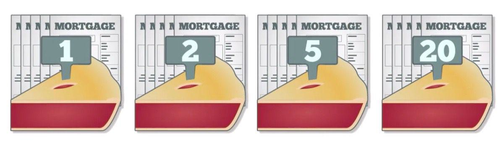

In today's dynamic financial environment, understanding the intersection of investment finance, credit tranches, and algorithmic trading has become crucial. These components collectively shape the modern landscape of investing, offering opportunities and complexities that demand a nuanced grasp of their functions.

Credit tranches are an essential aspect of structured finance. They segment securities into portions, each with its unique risk and return profile. This segmentation allows investors to choose tranches that align with their risk tolerance and investment objectives. The tranching process not only enables customization of risk exposure but also aids in enhancing the marketability of financial products. By dividing securities such as collateralized debt obligations (CDOs) and mortgage-backed securities (MBS) into various tranches, structured finance can efficiently allocate risk among diverse investor groups.



On the other hand, algorithmic trading revolutionizes the execution of trades by utilizing computer algorithms to maximize speed and precision. The technology underpinning algorithmic trading facilitates the processing of vast amounts of market data to make informed trading decisions autonomously. This capability has transformed the ways investments are managed, significantly reducing transaction costs and increasing market liquidity. Furthermore, algorithms can swiftly adapt to shifting market conditions, optimizing trade execution where manual trading might falter due to time constraints.

The integration of these mechanisms is increasingly central to modern investing strategies. Credit tranches provide tailored risk management options, while algorithmic trading offers the efficiency and responsiveness required in contemporary financial markets. This article explores these financial mechanisms, their interactions, and their impact on modern investing strategies. Understanding these elements is essential for investors looking to navigate and leverage the complexities of the present-day financial landscape.

## Table of Contents

## Understanding Credit Tranches

Credit tranches are integral components of structured finance, designed to match varying risk profiles and investment objectives. Essentially, a tranche is a portion of a financial instrument structured to offer distinct levels of credit exposure. This stratification enables investors to select securities that align with their risk tolerance, thereby optimizing their investment strategies.

The International Monetary Fund (IMF) operationalizes the concept of credit tranches through its lending policies. When a member country applies for financial assistance, the IMF disburses funds incrementally via credit tranches. Each tranche is linked to specific economic reform benchmarks the country must fulfill, thereby providing a structured way of monitoring and supporting financial stability efforts.

Structured finance products rely extensively on tranches to mitigate and distribute risk among investors. Collateralized Debt Obligations (CDOs) and Collateralized Mortgage Obligations (CMOs) are prominent examples. In these products, underlying assets are pooled together, and cash flows from the pool are allocated across different tranches according to predefined rules. Typically, these tranches are prioritized in a waterfall structure, with senior tranches receiving payments first and bearing the least risk. In contrast, junior tranches offer higher yields due to their increased risk exposure.

The structuring of tranches is crucial in risk management and enhancing marketability. By appealing to a wide spectrum of investors, tranches can attract capital more effectively, facilitating the diversification of risk. For example, if an asset-backed security has a default rate higher than anticipated, investor losses are primarily absorbed by the lower-priority tranches, thus protecting the senior tranches.

Tranches also contribute significantly to diversification strategies. Investors are equipped to spread their investments across different tranches with varying levels of risk and return. This approach not only aligns with targeted investment goals but also insulates portfolios against specific market sectors' volatilities.

Overall, credit tranches serve as a versatile tool in structured finance, offering nuanced risk management and diversification opportunities. The capacity to tailor investments to distinct risk appetites ensures that financial products can effectively cater to a diverse investor base, thus enhancing overall market [liquidity](/wiki/liquidity-risk-premium) and stability.

## Investment Finance and Structured Products

Investment finance is pivotal in the orchestration of capital allocation and risk management through the development of diverse financial instruments. Within this domain, structured products such as Mortgage-Backed Securities (MBS) and Collateralized Debt Obligations (CDOs) are prominent due to their capacity to pool various financial assets and redistribute the resultant cash flows to investors. This redistribution process commonly involves tranching, where the pooled assets are segmented into different tranches, each offering a unique risk-return profile. These profiles are meticulously tailored to meet the varied risk appetites and return expectations of different investors, thereby enhancing the marketability of the structured products.

Structured products serve as sophisticated tools in investment strategies by facilitating risk diversification and allowing investors to manage exposure effectively across differing economic and market conditions. Mortgage-Backed Securities (MBS), for example, are securities backed by a collection of mortgages, where investors receive periodic payments derived from the underlying mortgage repayments. These securities are engineered to accommodate various investor preferences by creating tranches with distinct priority levels in receiving cash flows and absorbing defaults.

Collateralized Debt Obligations (CDOs) further illustrate this mechanism by pooling various income-generating assets, which may include loans, bonds, or other CDO tranches. The tranches in a CDO are stratified based on their credit rating, seniority, and potential yield, allowing investors to choose tranches that align with their investment goals, be it stability or high returns. This stratification is typically categorized into senior tranches, mezzanine tranches, and equity tranches, each differentiated by their risk profile and return potential.

The functionality and appeal of these structured products in investment finance lie in their capacity to transform illiquid assets into marketable securities. By offering diversification benefits and tailored risk exposure, structured products like MBS and CDOs have become integral components of modern investment portfolios. They enable innovation in financial engineering by allowing investors to directly engage with complex asset classes, manage risks more precisely, and exploit specific market opportunities.

These financial instruments have also evolved with advancements in technology and analytics, allowing for more nuanced price discovery and enhanced risk management techniques. The adaptability of structured products to accommodate various investment strategies underscores their significance in the landscape of investment finance, emphasizing the need for continuous adaptation and understanding of these products in a dynamically shifting financial environment.

## The Role of Algorithmic Trading

Algorithmic trading has fundamentally altered financial markets by utilizing computer algorithms to execute trades efficiently. By automating and accelerating complex trading decisions, [algorithmic trading](/wiki/algorithmic-trading) significantly enhances market liquidity and reduces operational costs. Algorithms can process large volumes of data with speed and precision unattainable by human traders, offering substantial benefits in terms of market efficiency. 

One of the primary advantages of algorithmic trading is its ability to optimize the selection and management of financial instruments, including tranches in structured finance. Structured finance products, such as collateralized debt obligations (CDOs) and collateralized mortgage obligations (CMOs), benefit from algorithmic trading through the precise adjustment of positions in response to changing market conditions and the careful balancing of risk profiles. This capability enhances the strategic allocation of capital within structured products and can result in more attractive risk-return profiles for investors.

Implementing algorithmic trading within structured finance, however, is not without its challenges. The complexity of the algorithms required to navigate the sophisticated landscape of financial products demands significant computational resources and expertise. Additionally, the reliance on algorithms introduces potential risks associated with technological failures or erroneous programming, which can result in unexpected trading behaviors and financial losses. 

Moreover, the increased automation and speed brought by algorithmic trading have raised concerns about market stability. High-frequency trading, a subset of algorithmic trading, has been scrutinized for its potential to exacerbate market [volatility](/wiki/volatility-trading-strategies) and contribute to flash crashes. Regulators and market participants must remain vigilant to ensure that the efficiency gains from algorithmic trading do not come at the expense of market integrity.

In conclusion, while algorithmic trading offers numerous advantages for structured finance by optimizing the selection and management of tranches, it also presents challenges related to technological reliance and market stability. As technology continues to advance, striking a balance between innovation and control will be vital for the sustainable evolution of financial markets.

## Synergies Between Tranche Finance and Algo Trading

The integration of tranche finance and algorithmic trading represents a significant advancement in modern financial markets by enhancing both investment returns and risk management strategies. Credit tranches, which segment financial products into layers with varying risk levels, can benefit from the precise analysis capabilities provided by algorithmic trading systems. Algorithms, relying on computational power, can process vast datasets and analyze historical tranche performance, allowing for informed decision-making when selecting optimal tranches for investment portfolios.

Technological advancements in [artificial intelligence](/wiki/ai-artificial-intelligence) (AI) and [machine learning](/wiki/machine-learning) further enhance this integration. Machine learning models can identify patterns and forecast trends within tranche performance data that might not be immediately evident to human analysts. These data-driven insights enable investors to optimize tranche selection, aligning investment strategies with risk exposure preferences and market conditions.

One innovative aspect of this synergy is the ability of algorithms to perform real-time analysis and adjustments to an investment strategy. Leveraging AI can facilitate continuous monitoring of market conditions and tranche performance, allowing for dynamic reallocation of assets in response to market shifts. Such adaptability helps in minimizing risks, capturing opportunities efficiently, and potentially increasing returns on investment.

Python, a popular language in financial analytics, can be employed to implement such algorithms. For instance, using libraries like `pandas` and `scikit-learn`, one can create and test models to predict tranche performance. Here's an example of how one might start this process using Python:

```python
import pandas as pd
from sklearn.model_selection import train_test_split
from sklearn.ensemble import RandomForestRegressor
from sklearn.metrics import mean_squared_error

# Load historical tranche data
data = pd.read_csv('tranche_data.csv')

# Feature selection
features = data[['feature1', 'feature2', 'feature3']]
target = data['performance']

# Split data into training and testing sets
X_train, X_test, y_train, y_test = train_test_split(features, target, test_size=0.2, random_state=42)

# Initialize and train the model
model = RandomForestRegressor(n_estimators=100, random_state=42)
model.fit(X_train, y_train)

# Make predictions and evaluate the model
predictions = model.predict(X_test)
mse = mean_squared_error(y_test, predictions)
print(f"Mean Squared Error: {mse}")
```

This example illustrates a basic structure for predicting tranche performance. The `RandomForestRegressor` is a machine learning algorithm that can be fine-tuned for more accurate predictions, thus assisting investors in making optimized choices in tranche selection.

This synergy between tranche finance and algorithmic trading forges innovative pathways within the financial markets. By combining advanced technological tools with traditional financial instruments, investors can navigate complex market landscapes with greater efficacy, achieving a balance between risk and return unattainable through conventional methods alone.

## Investment Strategies and Risk Management

In structured finance, managing risk and optimizing investment performance require a sophisticated understanding of credit enhancements and tranche ratings. Credit enhancements serve as critical tools in reducing the risk of investment in structured products. Techniques such as over-collateralization, where the value of the collateral exceeds the value of the securitized asset, and the use of reserve accounts can help mitigate potential losses. The tranches themselves are rated by credit rating agencies, with higher-rated tranches offering lower yield but greater security, thereby allowing investors to choose a segment that aligns with their risk tolerance.

Quantitative models play an indispensable role in forecasting risks associated with structured finance. These models employ statistical methods to evaluate historical data and simulate future performance under various market conditions. Monte Carlo simulations, for example, can generate numerous potential future states of the market, providing insights into how different tranches might perform under varying scenarios. A Python code snippet for a simple Monte Carlo simulation to evaluate tranche risk might look like this:

```python
import numpy as np

# Parameters
num_simulations = 10000
initial_investment = 100000  # Initial investment in a tranche
mean_return = 0.05
volatility = 0.10

# Simulation
simulated_returns = np.random.normal(mean_return, volatility, num_simulations)
simulated_end_values = initial_investment * (1 + simulated_returns)

# Risk assessment
value_at_risk = np.percentile(simulated_end_values, 5)  # 5% Value at Risk
print(f"5% Value at Risk: ${initial_investment - value_at_risk:.2f}")
```

Understanding market conditions and the nuances of different tranches is integral to constructing a balanced portfolio. Investors often rely on diversification across various tranches and asset classes to reduce the overall portfolio risk. Credit ratings provide a starting point for assessing tranche risk, but investors must also consider underlying asset quality, economic trends, and potential [interest rate](/wiki/interest-rate-trading-strategies) fluctuations.

Strategies for optimizing tranche selection include the use of credit default swaps (CDS) and other derivatives to hedge against potential losses. Additionally, scenario analysis and stress testing can reveal potential vulnerabilities in a portfolio and guide adjustments in tranche allocation.

By blending these strategies, investors can enhance portfolio performance while maintaining an acceptable risk level. The synergy of credit enhancements, accurate tranche ratings, and advanced risk modeling techniques allows for informed decision-making in structured finance investment.

## Conclusion and Future Outlook

The convergence of structured finance, credit tranches, and algorithmic trading signifies a considerable transformation in the landscape of investment finance. This amalgamation has yielded sophisticated strategies that cater to modern investors' needs, enhancing both the efficiency and effectiveness of financial markets. Advancements in technology and analytics are pivotal, continually reshaping the methods by which investment strategies are developed and executed. 

The future of this sector is poised for further transformation through increased automation and the integration of artificial intelligence (AI). Automation minimizes human error, accelerates transaction speeds, and reduces operational costs, thereby fostering a more streamlined trading environment. Additionally, AI and machine learning techniques offer the ability to analyze vast datasets, uncovering patterns and insights that were previously inaccessible. This capability enhances data-driven decision-making, allowing investors to make informed choices rapidly in reaction to market changes.

Emerging trends also suggest a stronger reliance on quantitative analysis and computational algorithms to optimize risk management and return on investment. These technologies can simulate various scenarios, predicting the potential impact of economic shifts on credit tranches and structured products, thus providing investors with comprehensive risk assessments.

Investors must remain agile, continuously updating their knowledge base and skill set to navigate this rapidly evolving domain effectively. Staying informed about technological advancements and market dynamics is crucial for leveraging these developments to maintain a competitive edge in the increasingly complex financial landscape. Enhanced analytical capabilities, combined with the strategic application of technology, will define the future of investment management and the ability to harness opportunities within structured finance and algorithmic trading.

## References & Further Reading

Fabozzi, F. J., Bhattacharya, A. K., & Berliner, W. S. 'Mortgage-Backed Securities: Products, Structuring, and Analytical Techniques'. This book provides a comprehensive analysis of mortgage-backed securities (MBS), detailing the structuring and underlying analytics crucial for understanding these complex financial products. The insights offered can enhance one's grasp of how MBS are designed, enabling a better appreciation of their role in investment finance and risk management.

Hull, J. C. 'Options, Futures, and Other Derivatives'. This reference offers a thorough exploration of derivatives markets, covering an array of financial instruments including options and futures. Hull's work is instrumental for anyone seeking to understand the mechanics of derivatives and their applications in hedging and speculative strategies, particularly in the context of tranching and risk assessment.

Lewis, M. 'The Big Short: Inside the Doomsday Machine'. In this narrative, Michael Lewis provides a detailed account of the 2008 financial crisis, with a focus on the mortgage market collapse. The book sheds light on the implications of risky tranches in mortgage-backed securities, offering readers a cautionary tale about the potential dangers of these financial products.

Additional resources include industry publications, academic papers, and financial market analyses, which provide valuable insights into the rapidly evolving landscape of finance. These resources cover a broad spectrum of topics including algorithmic trading, structured finance, credit enhancements, and risk management strategies, all of which are crucial for investors and professionals looking to stay informed and agile in today's complex financial environment.