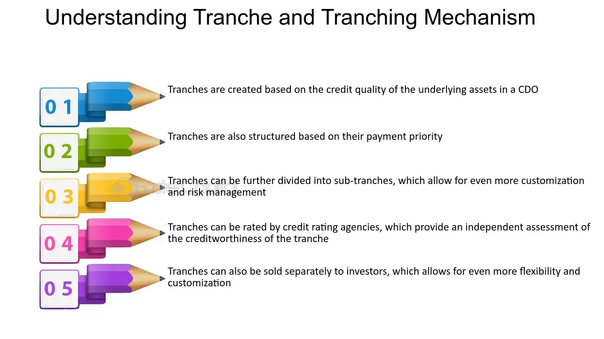

## Table of Contents

## What are credit tranches?

Credit tranches are like slices of a financial pie that the International Monetary Fund (IMF) gives to countries. When a country needs money, it can borrow from the IMF. The IMF doesn't give all the money at once. Instead, it divides the loan into parts, called tranches. Each tranche is given out at different times, based on certain conditions the country must meet.

These conditions can be things like making economic changes or following specific policies. The idea is to help the country improve its economy step by step. If the country does what it's supposed to do, it gets the next tranche of money. This system helps make sure the money is used wisely and that the country is moving in the right direction.

## How do credit tranches work?

Credit tranches are a way the International Monetary Fund (IMF) lends money to countries. Instead of giving all the money at once, the IMF splits the loan into smaller parts, called tranches. Each tranche is like a piece of the total loan. The country gets the first tranche right away, but to get the next ones, it has to meet certain conditions set by the IMF.

These conditions are like homework for the country. They might need to make changes to their economy, like reducing spending or changing laws. The IMF checks to see if the country is doing what it promised. If the country follows the rules and makes the changes, the IMF gives them the next tranche of money. This way, the IMF can help the country slowly improve its economy and make sure the money is used well.

## What is the purpose of using credit tranches in financial agreements?

The main purpose of using credit tranches in financial agreements is to help manage risk and encourage responsible behavior. When a country borrows money from the International Monetary Fund (IMF), the loan is divided into smaller parts, or tranches. This way, the IMF can give out the money little by little instead of all at once. By doing this, the IMF can keep a close eye on how the country is using the money and make sure it's being spent wisely.

Another important reason for using credit tranches is to motivate countries to make positive changes in their economies. Each tranche comes with certain conditions that the country must meet before getting the next part of the loan. These conditions might include making economic reforms or following specific policies. If the country does what it's supposed to do, it gets more money. This step-by-step approach helps the country improve its economy gradually and ensures that the IMF's help is making a real difference.

## Can you explain the different types of credit tranches?

Credit tranches used by the International Monetary Fund (IMF) can be divided into two main types: reserve tranches and credit tranches. Reserve tranches are like a country's own money that it has put into the IMF. Each member country of the IMF can use this money whenever it needs to, without any special conditions. It's like having a savings account at the IMF that you can take money out of if you're in a pinch.

Credit tranches, on the other hand, are the money that the IMF loans to a country when it needs more help. These loans are split into different parts, or tranches, and each part comes with certain rules that the country must follow. The first part, called the first credit tranche, is usually given out easily, but to get the rest, the country has to do things like change its economic policies or make other reforms. This way, the IMF can make sure the country is using the money wisely and making improvements step by step.

## How are credit tranches structured in a loan agreement?

Credit tranches in a loan agreement are like pieces of a puzzle that come together to make up the whole loan. When a country borrows money from the International Monetary Fund (IMF), the loan is divided into smaller parts called tranches. Each tranche is given out at different times, and the country gets the first one right away. The rest of the tranches come later, and the country has to do certain things to get them, like making changes to its economy or following specific rules set by the IMF.

The idea behind this structure is to help the country use the money wisely and make sure it's moving in the right direction. By giving out the money in pieces, the IMF can check on the country's progress and see if it's doing what it promised. If the country follows the rules and makes the changes, it gets the next tranche of money. This step-by-step approach helps the country improve its economy little by little and makes sure the IMF's help is making a real difference.

## What are the typical conditions or covenants associated with credit tranches?

When a country gets a loan from the International Monetary Fund (IMF) in credit tranches, there are usually some conditions or covenants that come with it. These conditions are like rules that the country has to follow to get the next part of the loan. They can include things like making changes to the country's economy, like cutting spending or raising taxes. The IMF might also ask the country to change its laws or policies to make the economy stronger. These conditions are important because they help make sure the country is using the money in a good way and making progress.

The IMF checks to see if the country is following these rules before giving out the next tranche of money. If the country does what it's supposed to do, it gets more money. But if it doesn't, the IMF might hold back the next part of the loan until the country fixes the problem. This step-by-step approach helps the country improve slowly and makes sure the IMF's help is really making a difference. By having these conditions, the IMF can help guide the country towards a better economic future.

## How do credit tranches affect the risk and return profile for lenders?

Credit tranches help lenders manage risk by breaking up a loan into smaller parts that are given out over time. When a country borrows money from the International Monetary Fund (IMF), it doesn't get all the money at once. Instead, the loan is divided into tranches, and the country has to meet certain conditions before getting each part. This way, the IMF can keep an eye on how the country is using the money and make sure it's being spent wisely. If the country doesn't follow the rules, the IMF can hold back the next tranche, which lowers the risk for the lender because they don't have to give out all the money if things go wrong.

The return for lenders can also be affected by credit tranches. If the country does well and follows the IMF's rules, it gets more money, which can help improve its economy. This means the country is more likely to pay back the loan, which is good for the lender. But if the country doesn't meet the conditions, it might not get the next tranche, and its economy might not improve as much. This could make it harder for the country to pay back the loan, which increases the risk for the lender but also means they might not have to give out all the money if the situation gets worse.

## What are some common examples of credit tranches in practice?

When a country needs help from the International Monetary Fund (IMF), it often gets the money in pieces called credit tranches. For example, in 2010, Greece got a big loan from the IMF to help with its money problems. The loan was split into several tranches, and Greece had to make changes to its economy, like cutting spending and raising taxes, to get each part. This helped the IMF make sure Greece was using the money well and making progress.

Another example is Ukraine, which got help from the IMF in 2015. The loan was also divided into tranches, and Ukraine had to do things like fight corruption and change its laws to get the money. Each time Ukraine met the IMF's conditions, it got more money to help its economy. This way, the IMF could see if Ukraine was improving and using the money the right way.

## How do credit tranches impact the borrowing costs for a company?

Credit tranches can change how much it costs for a company to borrow money. When a company gets a loan that's split into tranches, it doesn't get all the money at once. Instead, it gets the money in smaller parts, and each part might have different interest rates. If the company does well and meets the conditions set by the lender, it might get a lower interest rate on the next tranche. But if the company doesn't do what it's supposed to do, the lender might charge a higher interest rate or even stop giving out more money. This means the company has to be careful and do what the lender asks to keep the borrowing costs down.

The way credit tranches work can also affect how much a company pays over time. If the company meets all the conditions and gets all the tranches, it might end up paying less interest overall because the loan is spread out and managed well. But if the company struggles to meet the conditions, it might have to pay more because the lender could raise the interest rates or the company might have to find other, more expensive ways to borrow money. So, credit tranches can help a company save money if it manages the loan well, but they can also make borrowing more expensive if things don't go as planned.

## What role do credit tranches play in syndicated loans?

In syndicated loans, credit tranches help a group of lenders give money to a borrower in a smart way. When a big loan is needed, it's often too much for one lender to handle alone. So, a group of lenders comes together to share the risk and the money. They divide the loan into different parts, or tranches, and each part might have different rules and interest rates. This way, lenders can decide which parts of the loan they want to give money for, based on how much risk they're okay with and what kind of return they want.

Credit tranches in syndicated loans also help manage the money better over time. The borrower doesn't get all the money at once. Instead, they get it in pieces, and to get each piece, they have to meet certain conditions set by the lenders. This keeps the borrower on track and helps the lenders make sure the money is being used well. If the borrower does what they're supposed to do, they get more money. But if they don't, the lenders might hold back the next tranche, which helps control the risk for everyone involved.

## How can credit tranches be used strategically by a company to manage its debt?

A company can use credit tranches to manage its debt in a smart way. By getting a loan that's split into different parts, the company can get money little by little instead of all at once. Each part of the loan might have different rules and interest rates. If the company does well and meets the rules set by the lender, it might get a lower interest rate on the next part of the loan. This can help the company save money over time. But if the company struggles to meet the rules, the lender might charge a higher interest rate or even stop giving out more money. So, the company has to be careful and do what the lender asks to keep the borrowing costs down.

Credit tranches also help the company spread out its debt over time. Instead of having to pay back a big loan all at once, the company can pay back smaller parts as it gets them. This can make it easier to manage the money and keep the business running smoothly. If the company is doing well and meeting the lender's conditions, it can keep getting more money and use it to grow or fix problems. But if things aren't going well, the company might have to find other ways to borrow money, which could be more expensive. So, using credit tranches can be a good way for a company to manage its debt and keep its finances in good shape.

## What are the advanced considerations and potential pitfalls of using credit tranches?

When a company uses credit tranches, it needs to think about some advanced things and be careful of some potential problems. One important thing to consider is how well the company can meet the conditions set by the lender. If the company can do what the lender asks, it might get lower interest rates and more money, which can help the business grow. But if the company struggles to meet these conditions, it might have to pay more interest or even lose out on getting more money. This can make it harder for the company to manage its debt and keep its finances in good shape. Another thing to think about is how the company can use the money from each tranche. If the company uses the money wisely, it can help improve the business and make it easier to pay back the loan. But if the company doesn't use the money well, it might end up in a worse financial situation.

There are also some potential pitfalls to watch out for when using credit tranches. One big problem is if the company can't meet the lender's conditions. If this happens, the lender might stop giving out more money, which can leave the company short on cash. This can make it hard for the company to keep running and might even lead to bankruptcy. Another pitfall is if the company gets too much debt. If the company keeps taking on more tranches without being able to pay them back, it might end up with too much debt to handle. This can make it hard for the company to borrow more money in the future and can hurt its credit rating. So, the company needs to be very careful and think about all these things when using credit tranches to manage its debt.

## References & Further Reading

Fabozzi, F. J., Bhattacharya, A. K., & Berliner, W. S. 'Mortgage-Backed Securities: Products, Structuring, and Analytical Techniques'. This book provides a comprehensive analysis of mortgage-backed securities (MBS), detailing the structuring and underlying analytics crucial for understanding these complex financial products. The insights offered can enhance one's grasp of how MBS are designed, enabling a better appreciation of their role in investment finance and risk management.

Hull, J. C. 'Options, Futures, and Other Derivatives'. This reference offers a thorough exploration of derivatives markets, covering an array of financial instruments including options and futures. Hull's work is instrumental for anyone seeking to understand the mechanics of derivatives and their applications in hedging and speculative strategies, particularly in the context of tranching and risk assessment.

Lewis, M. 'The Big Short: Inside the Doomsday Machine'. In this narrative, Michael Lewis provides a detailed account of the 2008 financial crisis, with a focus on the mortgage market collapse. The book sheds light on the implications of risky tranches in mortgage-backed securities, offering readers a cautionary tale about the potential dangers of these financial products.

Additional resources include industry publications, academic papers, and financial market analyses, which provide valuable insights into the rapidly evolving landscape of finance. These resources cover a broad spectrum of topics including [algorithmic trading](/wiki/algorithmic-trading), structured finance, credit enhancements, and risk management strategies, all of which are crucial for investors and professionals looking to stay informed and agile in today's complex financial environment.

