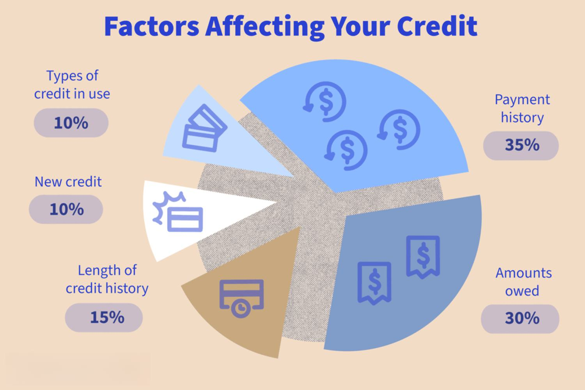

The financial landscape is in a state of constant flux, shaped by a myriad of factors that influence market dynamics daily. This article seeks to shed light on critical components of this landscape, namely credit ratings, financial assessments, credit watches, and algorithmic trading. These elements are interdependent and play a significant role in guiding investors and stakeholders as they navigate the complexities of the financial world.

Credit ratings provide essential insights into the creditworthiness of entities such as corporations and governments, affecting their ability to borrow and the terms of such borrowing. These insights are pivotal for making informed investment decisions and are a cornerstone of financial assessments. Financial assessments, in turn, offer a granular view of an entity's financial status, its liquidity, solvency, and operational efficiency. These metrics are crucial for a comprehensive understanding of credit risk and are constantly refined through technology and data analytics.

Technological advancements have not only enhanced risk assessment but also transformed investment strategies. Algorithmic trading, driven by sophisticated computer algorithms, exemplifies this shift by executing trades with remarkable speed and precision. The confluence of real-time data analysis with financial metrics has exponentially elevated the strategic decision-making process for investors and financial institutions. While the benefits are numerous, this integration of technology also introduces new risks that must be expertly managed.

Ultimately, the goal of this article is to provide a comprehensive overview that contextualizes these concepts within modern finance. By understanding the synergy between credit ratings, financial assessments, and algorithmic trading, professionals can better manage risk and exploit market opportunities. In a landscape characterized by rapid technological evolution, continual learning and adaptability are essential to achieving financial success and stability.

## Table of Contents

## Understanding Credit Ratings and Their Importance

Credit ratings are essential tools used to assess the creditworthiness of entities, such as corporations and governments. These ratings are typically provided by major credit rating agencies like Moody’s Investors Service, Standard & Poor’s (S&P), and Fitch Ratings. The primary purpose of credit ratings is to evaluate the likelihood that a borrower will be able to meet its debt obligations. These assessments directly influence both borrowing costs and investment decisions, making them critical to financial markets.

Credit rating agencies evaluate several factors to assign a rating to an entity. These criteria generally include the entity's financial health, economic outlook, and industry-specific risks. Financial health is analyzed through a scrutiny of financial statements, focusing on metrics such as profitability, leverage, and cash flow stability. An entity's economic outlook considers broader economic conditions that could impact its ability to repay debt. Industry risk looks at the competitive environment and regulatory framework affecting the entity's sector.

The ratings themselves are conveyed through a series of letter grades, with triple-A (AAA) ratings representing the highest level of creditworthiness. Entities with higher ratings benefit from lower interest rates on borrowed capital due to the perceived lower risk of default. Conversely, a downgrade in credit rating can lead to higher costs of capital due to increased risk perceptions. For instance, a downgrade from an A to a BB rating might result in a substantial increase in borrowing costs, making it more expensive for the entity to finance its operations or expansion plans.

Investors rely heavily on credit ratings as they offer a succinct measure of risk when evaluating potential investments. For example, fixed-income securities such as corporate bonds often see their yields adjusted based on the issuer's credit rating. A high credit rating typically equates to lower yields, reflecting lower risk, whereas entities with lower ratings may have to offer higher yields to attract investors.

The impact of credit ratings extends beyond just borrowing costs. They also play a pivotal role in regulatory environments and capital allocation decisions within financial markets. Certain institutional investors, like pension funds and insurance companies, often have mandates to invest primarily in higher-rated securities, underscoring the influence of these ratings on investment patterns.

In summary, credit ratings serve as a crucial barometer of financial stability and credit risk, impacting an entity’s borrowing conditions and the strategic decisions of investors. Understanding these ratings, and the factors influencing them, is vital for participants in the global financial markets.

## The Role of Financial Assessment in Credit Evaluation

Financial assessments play a crucial role in evaluating the creditworthiness of entities by providing an in-depth analysis of their financial status and potential future performance. These evaluations are essential for understanding various aspects of an entity's financial health, including [liquidity](/wiki/liquidity-risk-premium), solvency, and operational efficiency.

Liquidity, which refers to the ability of an entity to meet its short-term obligations, is often assessed using metrics such as the current ratio (current assets divided by current liabilities). Solvency, on the other hand, relates to the entity's capacity to meet long-term obligations, commonly measured by the debt-to-equity ratio. This ratio is calculated by dividing total liabilities by shareholder equity, providing insight into the relative proportion of debt and equity used to finance the company.

Operational efficiency is gauged through profit margins and return on assets (ROA), which indicate how well a company is using its resources to generate earnings. For example, the net profit margin, obtained by dividing net income by total revenue, reveals the percentage of revenue that turns into profit after all expenses are accounted for. Similarly, ROA is calculated by dividing net income by total assets, measuring how efficiently a company can manage its assets to produce earnings.

Financial assessments also emphasize the analysis of cash flow statements, which offer a detailed account of cash inflows and outflows over a period. These statements are critical for assessing the liquidity and overall financial flexibility of an entity.

The advent of technology and data analytics has significantly enhanced the precision and accuracy of these financial assessments. Advanced algorithms and software tools enable the processing of vast amounts of data, allowing for more nuanced and timely evaluations. For instance, [machine learning](/wiki/machine-learning) models can analyze historical financial performance and macroeconomic indicators to predict future trends, thereby refining credit risk evaluations and decision-making processes for banks, investors, and credit agencies.

In summary, financial assessments are indispensable for assessing credit risk, utilizing a range of key financial metrics. The integration of technology and data analytics significantly improves the reliability of these assessments, providing stakeholders with precise insights necessary for informed investment and lending decisions.

## What is Credit Watch and Its Implications?

A credit watch plays a crucial role in the financial ecosystem, signaling the potential for a change in an entity's credit rating due to significant developments. When an entity is placed on credit watch, it comes under increased scrutiny, as it indicates that the credit rating could be adjusted—either upgraded or downgraded—based on evolving circumstances.

The initiation of a credit watch is often triggered by critical events such as mergers, acquisitions, and changes in the economic landscape. For instance, an impending merger might prompt a rating agency to put both companies involved on credit watch. This status allows analysts to evaluate the transaction's impact on financial health, strategic fit, and market position, all of which are crucial for determining future creditworthiness.

The implications of being on a credit watch are significant. Firstly, it affects market perception; investors and stakeholders view entities on credit watch with heightened caution or interest, depending on whether an upgrade or downgrade is anticipated. This can lead to behavioral shifts among investors, influencing stock prices and investment flows. Companies on credit watch may experience fluctuations in their stock values as market participants react to the potential changes in credit ratings.

Moreover, understanding credit watch is vital for anticipating short-term market reactions. For investors, a watch status can serve as an early warning system for potential changes in investment risk. For an entity, it underscores the importance of addressing the triggering factors swiftly and effectively to mitigate any adverse effects. Consequently, being attuned to credit watch announcements can offer valuable insights into market dynamics, helping both investors and companies make informed decisions in response to possible rating adjustments.

## The Rise of Algorithmic Trading in Financial Markets

Algorithmic trading, or algo trading, utilizes computer algorithms to execute trades with precision and speed, outperforming traditional trading methods. This technological advancement allows algorithms to analyze vast quantities of data and execute trades at high speeds and frequencies, fundamentally transforming financial markets.

One of the primary advantages of [algorithmic trading](/wiki/algorithmic-trading) is the enhancement of market efficiency. By reducing the time required to identify and execute profitable trades, algorithmic systems increase liquidity and ensure more accurate pricing. This results in tighter spreads and reduced market impact costs, making transactions more economical for investors.

Algorithms are designed to implement a variety of trading strategies. Arbitrage exploits price differentials of the same asset across different markets, ensuring that prices remain consistent. Trend following identifies and capitalizes on ongoing market trends, while [market making](/wiki/market-making) involves continuously quoting buy and sell prices to provide liquidity and facilitate trading.

Algorithmic trading's reliance on data and technology makes it highly responsive to market behavior. For example, algorithms can incorporate real-time news and sentiment analysis to adapt strategies accordingly. Furthermore, with the integration of big data and machine learning, these systems continuously improve by learning from past market data and outcomes.

However, this technological advancement is not without its risks. A notable concern is the occurrence of "flash crashes," where algorithms contribute to rapid market sell-offs, leading to extreme price [volatility](/wiki/volatility-trading-strategies) within a short period. Additionally, the increased speed and frequency of trades can result in heightened market volatility, as rapid and large-[volume](/wiki/volume-trading-strategy) transactions may exacerbate price swings.

Despite these challenges, the benefits of algorithmic trading, when coupled with robust risk management strategies, continue to outweigh the risks. Institutions employing algorithm-driven strategies must ensure proper safeguards like circuit breakers and real-time monitoring systems to mitigate potential negative impacts.

In summary, algorithmic trading has significantly advanced the dynamics of financial markets. It offers improved efficiency, liquidity, and pricing accuracy but also requires vigilant oversight to prevent adverse market effects. As technology continues to evolve, algorithmic trading will likely play an increasingly crucial role in shaping the future of global finance.

## The Interplay Between Credit Ratings, Financial Assessment, and Algo Trading

The interplay between credit ratings, financial assessments, and algorithmic trading represents a significant shift in how financial markets operate. Credit ratings and financial assessments serve as critical inputs for the development of sophisticated trading algorithms. These elements provide the foundational data that algorithms rely upon, particularly in environments where speed and efficiency are paramount.

Algorithmic trading exploits high-speed computation to react to credit rating changes and shifts in financial data almost instantly. This responsiveness is critical in modern markets, where the timely execution of trades can significantly affect profitability. Algorithms are programmed to interpret data from credit ratings and financial assessments, allowing for trading decisions that reflect the latest available information.

The reliance on real-time data analysis in algorithmic trading enhances market efficiency by ensuring that asset prices more accurately reflect available information. However, this increased efficiency comes with the demand for rigorous risk management strategies. The complexity and speed of algo trading introduce potential risks, such as exacerbating market volatility during periods of instability. Therefore, integrating solid risk management frameworks is integral to mitigating these risks and maintaining market stability.

Real-time data analysis capabilities of algorithmic trading algorithms enable more strategic decision-making. By incorporating inputs from credit ratings and financial assessments, these systems can detect patterns and execute trades aligned with sophisticated investment strategies. This capability benefits investors and institutions by enhancing decision-making processes and optimizing investment outcomes.

Understanding the dynamics between credit ratings, financial assessments, and algorithmic trading is crucial for leveraging technology in financial planning and investment. It requires an appreciation of how data-driven methodologies can transform traditional financial practices. The strategic use of algorithms not only facilitates better investment strategies but also reshapes the broader financial landscape, setting a new standard for efficiency and adaptability in modern markets.

## Conclusion: Navigating the Modern Financial Terrain

In an era where technology increasingly drives financial operations, the convergence of credit ratings, financial assessments, and algorithmic trading represents a pivotal shift in modern finance. This integration is essential for managing risk efficiently and leveraging market opportunities, thereby necessitating an adaptive approach from financial professionals.

The rapid pace of technological advancement mandates continuous learning and adaptation. As algorithms evolve to incorporate real-time financial data and credit assessments, they allow traders and analysts to make more informed decisions. For instance, an algorithm might adjust trading strategies based on a sudden credit rating change or financial assessment update, thereby optimizing both return and risk management. This requires professionals to not only understand traditional financial metrics but also to engage deeply with modern technologies and data analytics.

The synergy between traditional and modern trading strategies holds significant potential to reshape market dynamics. By blending classic financial assessments with algorithm-driven insights, market participants can achieve a more nuanced understanding of market conditions. This enhanced analytical capacity can lead to more effective investment strategies and improved financial outcomes.

Staying informed and proactive in understanding these ongoing technological trends is crucial for sustained financial success. The landscape of finance is becoming more interconnected, and embracing this change is key to maintaining stability and achieving growth. Financial professionals must remain engaged with the latest developments in credit ratings, financial assessments, and algorithmic trading to stay competitive and maximize their impact in the market.

## References & Further Reading

[1]: Bergstra, J., Bardenet, R., Bengio, Y., & Kégl, B. (2011). ["Algorithms for Hyper-Parameter Optimization."](https://papers.nips.cc/paper/4443-algorithms-for-hyper-parameter-optimization) Advances in Neural Information Processing Systems 24.

[2]: ["Advances in Financial Machine Learning"](https://www.amazon.com/Advances-Financial-Machine-Learning-Marcos/dp/1119482089) by Marcos Lopez de Prado

[3]: ["Evidence-Based Technical Analysis: Applying the Scientific Method and Statistical Inference to Trading Signals"](https://www.amazon.com/Evidence-Based-Technical-Analysis-Scientific-Statistical/dp/0470008741) by David Aronson

[4]: ["Machine Learning for Algorithmic Trading"](https://github.com/stefan-jansen/machine-learning-for-trading) by Stefan Jansen

[5]: ["Quantitative Trading: How to Build Your Own Algorithmic Trading Business"](https://www.amazon.com/Quantitative-Trading-Build-Algorithmic-Business/dp/1119800064) by Ernest P. Chan

[6]: ["The Rating Agencies and Their Credit Ratings: What They Are, How They Work, and Why They are Relevant"](https://onlinelibrary.wiley.com/doi/pdf/10.1002/9781119208785.fmatter) by Herwig M. Langohr and Patricia T. Langohr

[7]: Blume, M. E., Lim, F., & Mackinlay, A. C. (1998). ["The Declining Credit Quality of U.S. Corporate Debt: Myth or Reality?"](https://www.jstor.org/stable/117406) The Journal of Finance, 53(4), 1389-1413.

[8]: [International Organization of Securities Commissions (IOSCO) -](https://www.iosco.org/) "Technological Challenges to Effective Market Surveillance Issues and Regulatory Tools"

[9]: ["The New Science of Credit Assessment"](https://www.sciencedirect.com/science/article/pii/S2405918822000095) by Moody’s Analytics

[10]: Aldridge, I. (2013). ["High-Frequency Trading: A Practical Guide to Algorithmic Strategies and Trading Systems"](https://onlinelibrary.wiley.com/doi/pdf/10.1002/9781119203803.fmatter)