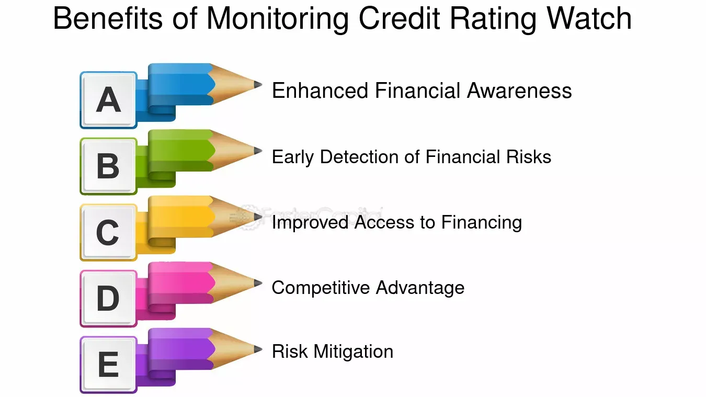

## Table of Contents

## What is a credit watch?

A credit watch is when a credit rating agency keeps a close eye on a company or a country's credit rating. It means they are watching to see if the credit rating might change soon. This can happen if there are big changes or problems that might affect how well the company or country can pay back its debts.

When a credit rating is put on watch, it can be a warning sign for investors. It tells them that the credit rating might go up or down in the near future. If the rating goes down, it might mean the company or country is riskier to lend money to. If it goes up, it might mean they are doing better and are less risky.

## How does a credit watch service work?

A credit watch service keeps an eye on a company's or a country's credit rating. Credit rating agencies, like Moody's or Standard & Poor's, do this. They look at how well the company or country is doing with money. If they see big changes or problems, they might put the credit rating on a watch list. This means they think the rating might change soon, either going up or down.

When a credit rating is on a watch list, it's a sign for people who lend money or invest. It tells them to be careful because the company or country might become riskier or safer soon. If the rating goes down, it might mean the company or country is having trouble paying back what they owe. If it goes up, it might mean they are doing better and it's safer to lend them money. The credit watch helps everyone know what might happen next with the credit rating.

## What are the main benefits of using a credit watch service?

Using a credit watch service helps people and businesses make smart choices about lending money or investing. It gives them early warnings about possible changes in a company's or country's credit rating. This means they can decide if it's safe to lend money or if they should be careful because the risk might be going up.

Another big benefit is that it helps keep track of how well a company or country is doing with money over time. If there are problems, the credit watch service will notice them quickly. This can help investors and lenders take action to protect their money before things get worse. It's like having a lookout that helps everyone stay informed and ready for what might happen next.

## Can a credit watch help prevent identity theft?

A credit watch can help prevent identity theft by keeping an eye on your credit report. If someone tries to use your identity to open new accounts or take out loans, a credit watch service will notice these changes quickly. It can alert you to any suspicious activity, like new accounts you didn't open or strange charges on your existing accounts. This gives you a chance to act fast and stop the thief before they do more harm.

Using a credit watch service also means you get regular updates about your credit score and report. This helps you see if anything unusual is happening with your credit. If you spot something that doesn't look right, you can contact the credit bureau and your bank to fix it. By staying on top of your credit, you make it harder for identity thieves to get away with stealing your information.

## What are the potential drawbacks of using a credit watch service?

One potential drawback of using a credit watch service is that it can cost money. Many of these services require a monthly or yearly fee. This might be a problem for people who are already tight on money and need to watch their spending closely. They might not want to pay extra just to keep an eye on their credit, especially if they don't think they're at high risk for identity theft.

Another issue is that credit watch services can sometimes send too many alerts. If you get a lot of notifications about small changes or things that aren't really important, it can be annoying. It might make you ignore the alerts, even when something serious happens. This can lead to missing out on important warnings about real problems with your credit.

Lastly, not all credit watch services cover all three major credit bureaus. Some only monitor one or two, which means you might not get a complete picture of your credit situation. If you want to make sure you're fully protected, you might need to sign up for multiple services, which can be confusing and even more expensive.

## How much does a typical credit watch service cost?

The cost of a credit watch service can be different depending on what the service offers and which company you choose. Some services might cost around $10 to $30 a month. There are also yearly plans that can save you money if you pay for the whole year at once. These plans might cost between $100 and $200 a year.

Some credit watch services might offer a basic plan for free or at a lower cost, but these usually don't give you as much information or as many alerts as the paid plans. If you want more detailed reports and better protection, you'll need to pay more. It's a good idea to look at different services and see what they offer to find the best one for your needs and budget.

## Are there different types of credit watch services available?

Yes, there are different types of credit watch services. Some services focus on just watching your credit report for any changes. They will tell you if someone tries to open a new account in your name or if there are new charges on your existing accounts. These services are good for people who want to protect against identity theft. Other services offer more than just watching your credit. They might also give you tips on how to improve your credit score and help you understand your credit report better.

Some credit watch services only look at one or two of the three major credit bureaus. This means you might not get a full picture of your credit situation. If you want to be sure you're fully protected, you might need to sign up for more than one service. This can be more expensive and a bit confusing, but it helps make sure you don't miss anything important. 

There are also services that offer different levels of protection. Basic plans might be free or cheaper, but they usually don't give you as many alerts or as much information as the more expensive plans. If you want detailed reports and better protection, you'll need to pay more. It's important to look at what each service offers and choose the one that fits your needs and budget the best.

## How often should I check my credit report if I'm using a credit watch service?

Even if you're using a credit watch service, it's a good idea to check your credit report yourself every few months. This helps you make sure the service is doing its job and that there are no mistakes on your report. Sometimes, a credit watch service might miss something or not tell you about a small change that could be important.

Checking your credit report regularly also helps you stay on top of your financial health. You can see if your credit score is going up or down and understand why. This way, you can catch any problems early and fix them before they get worse. It's like doing a regular check-up to keep everything running smoothly.

## What should I do if the credit watch service alerts me to a change in my credit report?

If your credit watch service alerts you to a change in your credit report, you should act quickly. First, check the details of the alert to see what changed. It could be a new account opened in your name, a change in your existing accounts, or something else. Make sure you understand what the alert is telling you.

Next, if the change looks suspicious or you didn't make it, contact the credit bureau that sent the alert. They can help you figure out if it's a mistake or a sign of identity theft. You might also need to call your bank or the company where the change happened. Acting fast can help you stop any problems before they get worse.

## How does a credit watch service compare to a credit monitoring service?

A credit watch service and a credit monitoring service are similar because they both keep an eye on your credit report. They look for changes like new accounts or strange charges. But a credit watch service is usually more focused on watching for big changes that might mean your credit rating could go up or down soon. This is helpful if you're worried about your credit score changing.

On the other hand, a credit monitoring service often gives you more details about your credit report. It might tell you about small changes and give you tips on how to improve your credit score. Credit monitoring services might also watch all three major credit bureaus, while some credit watch services might only watch one or two. So, if you want a more complete picture of your credit, a credit monitoring service might be better for you.

## Can a credit watch service improve my credit score?

A credit watch service by itself won't directly improve your credit score. It just keeps an eye on your credit report and tells you about any changes. But knowing about these changes can help you take steps to improve your credit score. For example, if the service alerts you to a mistake on your report, you can fix it. Or if you see a new account you didn't open, you can stop someone from using your identity to hurt your credit.

Using a credit watch service can help you stay on top of your credit. It can give you early warnings about problems that might lower your score. By acting quickly to fix these problems, you can keep your credit score from going down. Over time, taking care of your credit this way can help you build a better credit score.

## What advanced features do premium credit watch services offer?

Premium credit watch services come with extra features that can help you keep your credit safe and understand it better. One of these features is watching all three major credit bureaus. This means you get a full picture of your credit situation because these services check your reports from Equifax, Experian, and TransUnion. They also give you more detailed reports and more frequent alerts. This way, you know about any changes to your credit as soon as they happen, which can help you catch and fix problems quickly.

Another useful feature is that premium services often include identity theft protection. This means they not only watch your credit but also look for signs that someone might be using your identity. They might check public records, the dark web, and other places for your personal information. If they find anything suspicious, they'll let you know right away. Plus, some premium services offer help if you do become a victim of identity theft, like guiding you through the steps to fix it and recover your credit.

## References & Further Reading

[1]: Bergstra, J., Bardenet, R., Bengio, Y., & Kégl, B. (2011). ["Algorithms for Hyper-Parameter Optimization."](https://papers.nips.cc/paper/4443-algorithms-for-hyper-parameter-optimization) Advances in Neural Information Processing Systems 24.

[2]: ["Advances in Financial Machine Learning"](https://www.amazon.com/Advances-Financial-Machine-Learning-Marcos/dp/1119482089) by Marcos Lopez de Prado

[3]: ["Evidence-Based Technical Analysis: Applying the Scientific Method and Statistical Inference to Trading Signals"](https://www.amazon.com/Evidence-Based-Technical-Analysis-Scientific-Statistical/dp/0470008741) by David Aronson

[4]: ["Machine Learning for Algorithmic Trading"](https://github.com/stefan-jansen/machine-learning-for-trading) by Stefan Jansen

[5]: ["Quantitative Trading: How to Build Your Own Algorithmic Trading Business"](https://www.amazon.com/Quantitative-Trading-Build-Algorithmic-Business/dp/1119800064) by Ernest P. Chan

[6]: ["The Rating Agencies and Their Credit Ratings: What They Are, How They Work, and Why They are Relevant"](https://onlinelibrary.wiley.com/doi/pdf/10.1002/9781119208785.fmatter) by Herwig M. Langohr and Patricia T. Langohr

[7]: Blume, M. E., Lim, F., & Mackinlay, A. C. (1998). ["The Declining Credit Quality of U.S. Corporate Debt: Myth or Reality?"](https://www.jstor.org/stable/117406) The Journal of Finance, 53(4), 1389-1413.

[8]: [International Organization of Securities Commissions (IOSCO) -](https://www.iosco.org/) "Technological Challenges to Effective Market Surveillance Issues and Regulatory Tools"

[9]: ["The New Science of Credit Assessment"](https://www.sciencedirect.com/science/article/pii/S2405918822000095) by Moody’s Analytics

[10]: Aldridge, I. (2013). ["High-Frequency Trading: A Practical Guide to Algorithmic Strategies and Trading Systems"](https://onlinelibrary.wiley.com/doi/pdf/10.1002/9781119203803.fmatter)