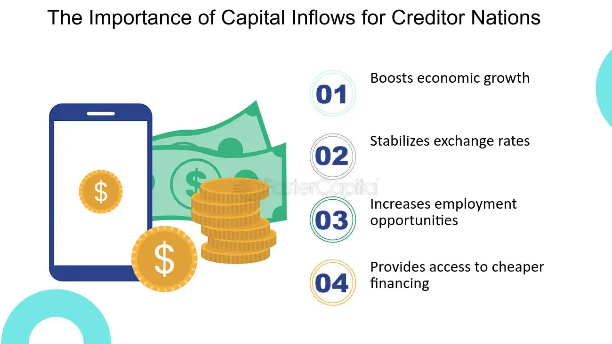

## Table of Contents

## What is a creditor nation?

A creditor nation is a country that lends more money to other countries than it borrows from them. This means that the total amount of money other countries owe to this nation is greater than the amount it owes to others. Countries become creditor nations by investing in foreign assets, like government bonds or businesses in other countries, and by having a strong, stable economy that attracts foreign investment.

Being a creditor nation can be a sign of economic strength. It shows that the country has enough money to lend to others and that other countries trust it enough to borrow from it. However, it also means that the creditor nation's economy can be affected by what happens in the countries it lends to. If those countries struggle to pay back their debts, it can cause problems for the creditor nation too.

## How does a country become a creditor nation?

A country becomes a creditor nation by lending more money to other countries than it borrows from them. This happens when the country has a lot of money to invest in foreign assets, like buying government bonds or investing in businesses in other countries. It also helps if the country has a strong and stable economy, which makes other countries trust it enough to borrow money from it.

When a country starts lending more than it borrows, it builds up a positive balance in its international accounts. This means that over time, the total amount of money other countries owe to this nation grows bigger than the amount it owes to others. Being a creditor nation can be a good sign that the country is doing well economically, but it also means that its economy can be affected by what happens in the countries it lends to. If those countries have trouble paying back their debts, it can cause problems for the creditor nation too.

## What are the key indicators of a creditor nation?

A key indicator of a creditor nation is a positive balance in its international accounts. This means that the country lends more money to other countries than it borrows from them. You can see this in the country's current account surplus, which shows that it earns more from exports and investments abroad than it spends on imports and foreign debts.

Another indicator is the country's high level of foreign assets. This includes things like government bonds and investments in businesses in other countries. When a country has a lot of these assets, it means it has been lending money to other countries and building up its position as a creditor nation.

Lastly, a strong and stable economy is often a sign of a creditor nation. Other countries are more likely to borrow money from a country that they trust and believe will remain economically strong. This trust and stability help the country maintain its status as a creditor nation.

## Can you explain the difference between a creditor nation and a debtor nation?

A creditor nation is a country that lends more money to other countries than it borrows from them. This means that the total amount of money other countries owe to this country is bigger than the amount it owes to others. Countries become creditor nations by investing in things like government bonds or businesses in other countries. When a country is a creditor nation, it often has a strong economy and other countries trust it enough to borrow money from it.

On the other hand, a debtor nation is a country that borrows more money from other countries than it lends to them. This means that the total amount of money this country owes to other countries is bigger than the amount it is owed. Countries can become debtor nations if they need to borrow money to pay for things like imports or to help their economy grow. Being a debtor nation can be risky because the country has to pay back the money it borrowed, and if it can't, it might have financial problems.

The main difference between a creditor nation and a debtor nation is about who owes more money. A creditor nation is in a position where it is owed more money, while a debtor nation owes more money to others. Both situations can affect a country's economy, but in different ways.

## What are the economic benefits of being a creditor nation?

Being a creditor nation can bring several economic benefits. One big benefit is that it shows other countries trust you and believe your economy is strong. This can make more people want to invest in your country, which can help your economy grow even more. Also, when you lend money to other countries, you can earn interest on those loans, which adds more money to your economy.

Another benefit is that being a creditor nation can give you more power in the world. Countries that owe you money might listen to you more when making decisions. This can help you have a bigger say in international matters. Plus, having a lot of money to lend can help you support your own currency, making it stronger and more stable.

## What are the potential risks associated with being a creditor nation?

Being a creditor nation can have some risks. One big risk is that if the countries you lend money to have trouble paying you back, it can hurt your own economy. If they can't pay back their debts, you might lose money, which can make your economy weaker. Also, if a lot of countries owe you money and they all start having problems at the same time, it can be really hard for you to handle.

Another risk is that being a creditor nation can make your economy too dependent on what happens in other countries. If the countries you lend money to start doing badly, it can affect your own economy, even if your country is doing well on its own. This means that your economy can be hurt by things that you can't control, like problems in other countries' economies.

## How do creditor nations manage their foreign assets?

Creditor nations manage their foreign assets by carefully choosing where to invest their money. They often buy things like government bonds from other countries or invest in businesses abroad. This helps them earn money from the interest on the bonds or from the profits of the businesses. They also keep an eye on how well the countries they lend to are doing, to make sure those countries can pay back the money they owe.

Sometimes, creditor nations use special organizations to help manage their foreign assets. These organizations can give advice on where to invest and how to handle the risks of lending money to other countries. By doing this, creditor nations can try to make sure they get the most out of their investments and that their economy stays strong, even if something goes wrong with the countries they lend to.

## What role do international trade and foreign investments play in maintaining a creditor nation status?

International trade and foreign investments are very important for a country to stay a creditor nation. When a country exports more than it imports, it earns money from other countries. This extra money can be used to lend to other countries, helping the nation keep its creditor status. Also, when a country invests in businesses or buys government bonds from other countries, it is lending money and building up its foreign assets. These investments can earn interest or profits, which adds more money to the country's economy and helps it stay a creditor nation.

But it's not just about [earning](/wiki/earning-announcement) money. International trade and foreign investments also help the country's economy stay strong and stable. When a country has a strong economy, other countries are more likely to trust it and borrow money from it. This trust is important because it helps the country keep lending more than it borrows, which is what makes it a creditor nation. So, by doing well in international trade and making smart foreign investments, a country can keep its economy strong and maintain its status as a creditor nation.

## How does a creditor nation's monetary policy affect its status?

A creditor nation's monetary policy can have a big impact on its status. When a country's central bank sets its monetary policy, it decides things like interest rates and how much money is in the economy. If a creditor nation keeps its interest rates high, it can attract more money from other countries. People and businesses from other countries might want to invest there because they can earn more interest. This can help the creditor nation lend even more money to other countries, making its creditor status stronger.

But, if the creditor nation's monetary policy makes its currency too strong, it might hurt its exports. When a country's currency is strong, its goods and services become more expensive for other countries to buy. This can make it harder for the creditor nation to earn money from exports, which it needs to keep lending to other countries. So, the creditor nation has to be careful with its monetary policy. It needs to balance keeping its economy strong and attractive for foreign investment, while also making sure it can keep earning money to stay a creditor nation.

## What historical examples illustrate the rise and fall of creditor nations?

One historical example of a creditor nation is Great Britain during the 19th century. At that time, Britain was the world's leading industrial power and had a strong economy. It lent a lot of money to other countries, especially through investments in government bonds and businesses around the world. This helped Britain become a major creditor nation. But after World War I and World War II, Britain's economy weakened. It had to borrow a lot of money to recover from the wars, which made it lose its status as a creditor nation. By the mid-20th century, Britain was no longer lending more than it was borrowing.

Another example is the United States, which became a major creditor nation after World War II. The U.S. had a strong economy and helped rebuild Europe and other parts of the world through loans and investments. For many years, the U.S. lent more money to other countries than it borrowed, making it a big creditor nation. However, starting in the 1980s, the U.S. began to borrow more than it lent. This was because of big budget deficits and trade imbalances. By the early 21st century, the U.S. had become a debtor nation, borrowing more from other countries than it was lending to them.

## How do global economic shifts impact the position of a creditor nation?

Global economic shifts can have a big impact on a creditor nation's position. When the world economy changes, it can affect how much money a creditor nation can lend and how much it gets back. For example, if there is a global recession, countries that owe money to the creditor nation might have a hard time paying it back. This can make the creditor nation lose money and weaken its economy. Also, if other countries start doing really well, they might not need to borrow as much money. This means the creditor nation might have fewer chances to lend money and keep its creditor status.

Another way global economic shifts can affect a creditor nation is through changes in trade and investment patterns. If a creditor nation relies a lot on exporting goods to other countries, a shift in global trade can hurt its economy. For example, if other countries start buying less from the creditor nation, it might not earn as much money to lend. Also, if global interest rates change, it can affect where people want to invest their money. If other countries start offering higher interest rates, investors might move their money there instead of to the creditor nation. This can make it harder for the creditor nation to attract foreign investment and keep its economy strong.

## What advanced strategies do creditor nations use to optimize their economic influence globally?

Creditor nations use smart strategies to make their economic influence bigger around the world. One way they do this is by making special deals with other countries. They might offer loans with lower interest rates or help build important things like roads and factories in other countries. By doing this, they can make friends with other countries and get them to do what they want. Also, creditor nations often work together in groups like the International Monetary Fund or the World Bank. These groups help them lend money to other countries and give them more say in global money matters.

Another strategy creditor nations use is to keep their money strong and stable. They do this by setting good rules for their economy, like keeping interest rates at the right level. When their money is strong, other countries trust them more and are happy to borrow from them. This helps creditor nations keep lending money and stay powerful. They also watch what's happening in the world economy very closely. If they see a problem coming, they can change their plans to protect their money and keep their influence strong.

## References & Further Reading

[1]: ["The Current Account Balance: Alternative Developments"](https://www.investopedia.com/insights/exploring-current-account-in-balance-of-payments/) from the International Monetary Fund (IMF)

[2]: ["Global Imbalances and the Financial Crisis: Products of Common Causes"](https://eml.berkeley.edu/~obstfeld/globalimbalances2010.pdf) by Maurice Obstfeld and Kenneth Rogoff

[3]: Brynjolfsson, E., & McAfee, A. (2014). ["The Second Machine Age: Work, Progress, and Prosperity in a Time of Brilliant Technologies"](https://psycnet.apa.org/record/2014-07087-000) 

[4]: Aldridge, I. (2013). ["High-Frequency Trading: A Practical Guide to Algorithmic Strategies and Trading Systems"](https://onlinelibrary.wiley.com/doi/pdf/10.1002/9781119203803.fmatter) 

[5]: Hull, J. C. (2018). ["Options, Futures, and Other Derivatives"](https://www.semanticscholar.org/paper/Options%2C-Futures%2C-and-Other-Derivatives-Hull/89bdee500c8623864fc9eb7a471546aa713acc44) 

[6]: ["Japan's Foreign Exchange Reserves"](https://tradingeconomics.com/japan/foreign-exchange-reserves) by the Bank of Japan

[7]: ["China's Growing External Debt"](https://www.gobankingrates.com/money/economy/10-countries-with-worst-national-debt-how-it-can-hit-your-wallet/) from the International Monetary Fund (IMF)

[8]: Pomerleano, M. (2009). ["Corporate Balance Sheets and Macro Financial Stability"](https://www.semanticscholar.org/paper/Corporate-Restructuring%3A-Lessons-from-Experience-Pomerleano-Shaw/32664bf99dd2ba70b3ecc0a3809e10b0362df2e1)