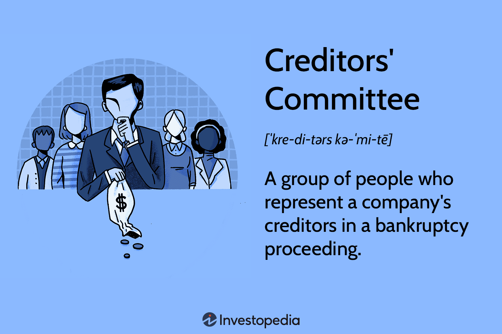

## Table of Contents

## What is a creditors' committee?

A creditors' committee is a group of people chosen to represent all the creditors of a company that is in financial trouble. This committee is usually formed during a bankruptcy process. The main job of the committee is to work with the company and the court to make sure that the creditors' interests are protected. They help decide how the company's assets should be used to pay back what is owed.

The members of the creditors' committee are usually chosen from the largest creditors, because they have the most at stake. They meet regularly to discuss the company's situation and to make decisions about how to move forward. The committee can also hire lawyers and other experts to help them understand the situation better and to make sure their rights are protected. By working together, the committee tries to get the best possible outcome for all the creditors.

## How is a creditors' committee formed?

A creditors' committee is formed when a company files for bankruptcy. The process starts with the court, which usually appoints the committee early in the bankruptcy case. The court looks at the list of creditors and picks a group of people to be on the committee. These people are usually from the biggest creditors because they have a lot of money at stake. The idea is to have a committee that can fairly represent all the creditors.

Once the court picks the members, they get together and start working. Their main job is to keep an eye on the bankruptcy process and make sure the creditors' interests are looked after. The committee can meet with the company's management, talk to lawyers, and even hire their own experts if they need to. They work together to figure out the best way to handle the company's debts and assets, trying to get the best deal possible for everyone who is owed money.

## Who can be a member of a creditors' committee?

Members of a creditors' committee are usually chosen from the company's biggest creditors. These are people or businesses that the company owes a lot of money to. The court picks these members because they have a big stake in what happens to the company. This way, the committee can represent the interests of all the creditors fairly.

The members don't have to be experts in finance or law, but they should be able to work together and make decisions. They need to be able to meet regularly and talk about the company's situation. Sometimes, the committee might hire lawyers or other experts to help them understand things better and make sure the creditors' rights are protected.

## What are the primary functions of a creditors' committee?

The main job of a creditors' committee is to look out for the interests of all the creditors during a bankruptcy. They do this by working closely with the company that's in financial trouble and the court. The committee helps decide how the company's assets should be used to pay back the money that's owed. They also keep an eye on the company's actions to make sure everything is fair and that the creditors get the best possible outcome.

The committee members meet regularly to talk about the company's situation and to make important decisions. They can ask the company's management questions and get updates on what's happening. If needed, the committee can hire lawyers or other experts to help them understand things better and to make sure the creditors' rights are protected. By working together, the committee tries to find the best way to handle the company's debts and assets, aiming to get a good deal for everyone who is owed money.

## How does a creditors' committee interact with the debtor?

A creditors' committee talks to the debtor, which is the company that owes money, to keep an eye on what the company is doing. They meet with the company's leaders to ask questions and get updates on the company's financial situation. This helps the committee make sure the company is being honest and fair. The committee wants to know how the company plans to use its assets to pay back the creditors.

The committee also works with the debtor to come up with a plan for dealing with the company's debts. They talk about different ways to handle the money and assets so that the creditors can get paid back as much as possible. By working together, the committee and the debtor try to find the best solution for everyone. This can mean selling off parts of the company or making a new payment plan that everyone agrees on.

## What role does a creditors' committee play in bankruptcy proceedings?

A creditors' committee plays a big role in bankruptcy proceedings. They are a group of people chosen by the court to represent all the creditors of a company that is in financial trouble. The committee's job is to make sure the creditors' interests are looked after during the bankruptcy process. They work closely with the company and the court to figure out how the company's assets should be used to pay back what is owed. The committee keeps an eye on everything the company does to make sure it's fair and that the creditors get the best possible outcome.

The committee meets regularly to talk about the company's situation and to make important decisions. They can ask the company's leaders questions and get updates on what's happening. If needed, the committee can hire lawyers or other experts to help them understand things better and to make sure the creditors' rights are protected. By working together with the debtor, the committee tries to find the best way to handle the company's debts and assets, aiming to get a good deal for everyone who is owed money.

## How does a creditors' committee influence the reorganization plan?

A creditors' committee has a big say in the reorganization plan during bankruptcy. They work with the company to come up with a plan that will help the company get back on its feet while also making sure the creditors get paid back as much as possible. The committee looks at different ways to use the company's assets and decides what's fair for everyone. They can suggest changes to the plan and make sure it's good for the creditors.

The committee talks to the company's leaders and asks questions about the plan. They want to make sure the company is being honest and that the plan will really work. If the committee thinks the plan isn't good enough, they can say no and ask for it to be changed. By working together, the committee and the company try to find a plan that everyone can agree on, so the company can start fresh and the creditors can get some of their money back.

## What are the legal rights and powers of a creditors' committee?

A creditors' committee has the right to look into the debtor's business and financial situation. They can ask the company's leaders questions and get information about what's going on. This helps them make sure the company is being honest and fair. The committee can also hire lawyers, accountants, or other experts to help them understand things better and to make sure the creditors' rights are protected. They can use the money from the bankruptcy estate to pay for these experts.

The committee has the power to work with the debtor to come up with a reorganization plan. They can suggest changes to the plan and make sure it's good for the creditors. If the committee thinks the plan isn't fair, they can say no and ask for it to be changed. They also have the right to go to court if they think the debtor is doing something wrong. By working together, the committee tries to find the best way to handle the company's debts and assets, aiming to get a good deal for everyone who is owed money.

## How are the costs and expenses of a creditors' committee covered?

The costs and expenses of a creditors' committee are paid for by the bankruptcy estate. This means the money comes from the company that is in financial trouble. The committee can use this money to hire lawyers, accountants, or other experts who help them understand the company's situation better and make sure the creditors' rights are protected.

The court decides how much money the committee can spend. They look at what the committee needs to do their job well and make sure the creditors get a fair deal. If the committee spends too much money, the court might say no to some of the costs. This way, the money from the bankruptcy estate is used carefully to help everyone who is owed money.

## What are the common challenges faced by creditors' committees?

Creditors' committees often face challenges because they need to work together and make big decisions. One big problem is that the members might not agree on what to do. They all want to get their money back, but they might have different ideas about the best way to do that. This can make it hard to come up with a plan that everyone likes. Also, the committee has to deal with a lot of information and sometimes they need to hire experts to help them understand it all. This can take a lot of time and money.

Another challenge is that the committee has to keep an eye on the company to make sure they are being honest. Sometimes, the company might try to hide things or not tell the whole truth. The committee needs to ask a lot of questions and check the facts to make sure they are getting the right information. This can be hard work and can slow down the process. Plus, the committee has to balance the need to get money back for the creditors with the need to help the company get back on its feet. Finding the right balance can be tricky and can lead to more disagreements among the members.

## How does a creditors' committee ensure transparency and accountability?

A creditors' committee makes sure things are clear and honest by keeping a close watch on the company that owes money. They talk to the company's leaders and ask a lot of questions about what's going on. This helps them find out if the company is telling the truth and doing things the right way. The committee also looks at all the information the company gives them to make sure it's correct. If they think something is wrong, they can go to court and ask for help.

The committee also hires experts like lawyers and accountants to help them understand the company's situation better. These experts can check the company's [books](/wiki/algo-trading-books) and make sure everything adds up. The committee uses the money from the company's assets to pay for these experts. This way, they can make sure the creditors' rights are protected and that the company is doing what it's supposed to do. By working together and being careful, the committee helps keep things open and fair for everyone involved.

## What advanced strategies can a creditors' committee employ to maximize recovery for creditors?

A creditors' committee can use smart plans to get more money back for the people who are owed money. One way is by working closely with the company to make a good reorganization plan. The committee can suggest selling parts of the company that are not doing well and using the money to pay back creditors. They can also look for new ways to make money, like finding new customers or selling products in different places. By doing this, the committee helps the company make more money, which means more money for the creditors.

Another way is by keeping a close eye on the company's money. The committee can hire experts to check the company's books and make sure no money is being wasted. If they find any problems, they can go to court and ask for help to fix them. The committee can also talk to other creditors and try to make deals that help everyone get more money back. By working together and being careful, the committee can find the best ways to use the company's money and assets to pay back the creditors as much as possible.

## References & Further Reading

[1]: Coelho, R., De Masi, G., Riccaboni, M., & Stanley, H. E. (2007). ["Dynamics of the Trading Activity on the Stock Exchange: Knowledge Transfer from Natural Sciences"](https://pubmed.ncbi.nlm.nih.gov/32996556/). Physical Review E, 76(3).

[2]: Gomber, P., Arndt, B., Lutat, M., & Uhle, T. (2011). ["High-Frequency Trading."](https://papers.ssrn.com/sol3/papers.cfm?abstract_id=1858626) Wirtschaftsinformatik, 53(2), 87-99.

[3]: ["Corporate Bankruptcy: Economic and Legal Perspectives"](https://assets.cambridge.org/97805214/57170/frontmatter/9780521457170_frontmatter.pdf) by Jagdeep S. Bhandari and Lawrence A. Weiss, Cambridge University Press.

[4]: Lopez de Prado, M. (2018). ["Advances in Financial Machine Learning."](https://www.amazon.com/Advances-Financial-Machine-Learning-Marcos/dp/1119482089) Wiley.

[5]: Jones, C. M. (2013). ["What Do We Know About High-Frequency Trading?"](https://papers.ssrn.com/sol3/papers.cfm?abstract_id=2236201) The Review of Financial Studies, 24(8), 2224–2233.