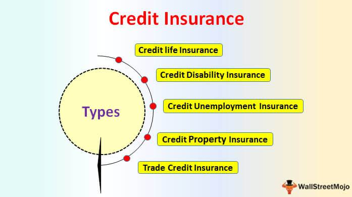

The financial world is a complex network comprising various participants, including borrowers who seek funds, creditors who provide them, and investors who allocate capital to generate returns. These entities interact within a dynamic ecosystem where the flow of capital is essential for economic stability and growth. At the core of this intricate web lies the issue of debt and its potential mishandling, particularly when obligations are not met, known as nonpayment. 

Understanding the consequences of nonpayment on debts is essential for anyone engaged in the financial markets. Nonpayment can lead to a cascade of effects, from individual credit deterioration to broader economic implications, impacting not only the involved parties but also the entire financial system. Creditors, often financial institutions or individual lenders, play a pivotal role in this scenario. They extend credit under various conditions and, consequently, hold specific rights and responsibilities in instances of debt nonpayment.



An imperative aspect of this financial interaction is algorithmic trading, which has become a cornerstone of modern finance. Utilizing advanced algorithms, this trading strategy efficiently processes massive amounts of data to execute trades. The implications of nonpayment are particularly significant in automated trading environments, where rapid market shifts are processed almost instantaneously by these algorithms. Nonpayment events can alter market signals and trigger unforeseen responses in trading behavior, raising both opportunities and challenges.

This article aims to explore the multifaceted nature of debt nonpayment, focusing on how creditors manage these situations and examining the ramifications within algorithmic trading contexts. By analyzing these elements, readers can better comprehend the underlying financial dynamics and the strategic measures available to mitigate associated risks. Through this exploration, we aim to equip readers with a thorough understanding of the financial ecosystem's intricacies and provide insights into effective risk management strategies.

## Table of Contents

## Understanding the Role of Creditors

Creditors are fundamental to the financial ecosystem, providing the necessary capital for individuals and businesses to pursue opportunities and meet various financial obligations. They extend credit under a range of terms and agreements, which can vary based on the risk assessment of the borrower, prevailing economic conditions, and legal frameworks.

The rights and actions available to creditors in cases of nonpayment are primarily determined by the credit terms agreed upon in the initial contract. Creditors can essentially be categorized into two types: secured and unsecured. Secured creditors hold collateral against the credit extended, which can include properties, vehicles, or other tangible assets. In the event of default, secured creditors have the right to reclaim these assets to offset the unpaid debt. This security significantly reduces the risk to the creditor and often results in more favorable lending terms for the borrower, such as lower interest rates.

Conversely, unsecured creditors do not have collateral to fall back on, thereby facing a higher risk of loss if the borrower defaults. To mitigate this risk, unsecured creditors may rely more heavily on the borrower's creditworthiness and financial history when making lending decisions. In cases of nonpayment, unsecured creditors commonly pursue legal actions to recover the outstanding debts. This can involve obtaining judgments against the debtor in court, which can subsequently lead to wage garnishments, bank account levies, or liens on personal property.

Understanding the strategic approaches of creditors is crucial for businesses and individuals aiming to manage their debt obligations effectively. For instance, being aware of the distinction between secured and unsecured credit can help debtors make strategic decisions about the types of loans to pursue, depending on their financial situation and risk tolerance. Additionally, maintaining a strong credit profile and transparent communication with creditors can enhance a borrower's ability to negotiate better terms or restructure debts under distressing financial conditions.

For creditors, managing the risk of nonpayment involves not only assessing the borrower's credit risk at the initial stage but also implementing robust credit monitoring and risk management strategies throughout the credit lifecycle. By doing so, they can identify early warning signs of potential defaults and take proactive measures to mitigate losses.

In summary, creditors operate within a framework shaped by the terms of credit agreements and legal rights, managing risks through a range of strategies that reflect the secured or unsecured nature of their lending. This understanding is pivotal for debt management and the maintenance of financial stability.

## Consequences of Nonpayment

Nonpayment of debts can have far-reaching consequences that extend beyond the immediate concerns of the debtor, impacting broader economic conditions. At the individual level, nonpayment damages the debtor's credit score, reducing their ability to obtain credit in the future and often leading to increased interest rates. This can create a cycle of financial distress as higher borrowing costs make future obligations harder to meet.

From a legal perspective, creditors may engage in debt recovery actions, such as filing lawsuits or garnishing wages. These actions not only increase stress on the debtor but also incur legal costs and time, impacting overall productivity and personal well-being.

On a macroeconomic scale, widespread defaults contribute to financial instability. When numerous borrowers fail to meet their obligations, creditors experience losses that can undermine their financial position. This can lead to a restriction in the availability of credit, causing [liquidity](/wiki/liquidity-risk-premium) issues within markets. Reduced liquidity constrains economic growth, as businesses and consumers find it harder to access necessary funds for expansion or consumption. 

Furthermore, significant nonpayment incidents can erode market confidence. Investors may perceive increased risk, leading to volatile market conditions and potentially prompting a withdrawal of investment. The cascading effect can amplify economic downturns, as interconnected financial systems react to perceived instabilities.

In summary, while the immediate repercussions of nonpayment focus on credit scores and legal ramifications, its broader impact on economic stability highlights the essential role of debt management in maintaining market trust and liquidity.

## Algorithmic Trading: An Overview

Algorithmic trading employs sophisticated algorithms to execute trading strategies automatically, vastly enhancing trading efficiency and contributing to a large proportion of market transactions. The process involves using computer programs to determine the timing, pricing, and quantity of trade orders, often based on a predefined set of rules and market indicators.

One of the primary advantages of [algorithmic trading](/wiki/algorithmic-trading) is its efficiency. The automation of trade execution allows for rapid processing of large amounts of data and execution of trades within milliseconds, which is significantly faster than human capabilities. This speed is crucial in markets where timing can impact profitability. Additionally, algorithmic trading reduces costs by minimizing human intervention, thereby decreasing transaction costs and the potential for human error.

Furthermore, algorithmic trading significantly enhances market liquidity. By enabling high-frequency trading ([HFT](/wiki/high-frequency-trading-strategies)), which involves executing a large number of trades at extremely high speeds, it contributes to the availability of assets in the market, allowing for smoother transactions and reducing the spread between the bid and ask prices.

However, algorithmic trading also introduces certain risks. The increased speed and [volume](/wiki/volume-trading-strategy) of transactions can lead to greater market [volatility](/wiki/volatility-trading-strategies), as trading algorithms react to market conditions more rapidly and, sometimes, simultaneously. This can exacerbate price fluctuations within very short time frames, potentially leading to price anomalies or "flash crashes," wherein asset prices plummet suddenly and recover almost as quickly.

Additionally, algorithmic trading systems can contribute to systemic susceptibilities, particularly during financial crises. The algorithms are designed to respond to specific inputs and conditions, and if multiple systems react similarly to a particular market event, it can lead to cascading effects, amplifying market movements and potentially destabilizing financial markets.

Enhanced regulatory measures and more sophisticated risk management practices are crucial to mitigating these risks. Algorithmic trading continues to evolve, with advancements in [machine learning](/wiki/machine-learning) and [artificial intelligence](/wiki/ai-artificial-intelligence) further refining the precision and adaptability of trading algorithms. Nonetheless, the potential for systemic risk necessitates ongoing scrutiny and adaptation of regulatory frameworks to ensure the stability and integrity of financial markets.

## Impact of Debt Nonpayment on Algorithmic Trading

Nonpayment scenarios in the context of financial markets present unique challenges and opportunities for algorithmic trading systems. These automated systems are meticulously programmed algorithms that aim to execute trades based on predefined criteria, responding to market conditions such as price changes, volume fluctuations, and other financial indicators. When debt defaults occur, they can trigger significant disruptions that algorithmic systems must effectively navigate.

The primary influence of debt nonpayment on algorithmic trading lies in the alteration of market signals. Defaults can lead to unexpected market volatility, causing prices to fluctuate rapidly as investor sentiment shifts. Algorithmic systems, which rely heavily on historical data and pattern recognition, can find it challenging to adjust to such abrupt changes. These algorithms may react to defaults as a signal of increased risk, prompting them to execute trades that can exacerbate market movements. For instance, a sudden sell-off initiated by algorithmic systems in response to a default can lead to a cascading effect, further destabilizing prices.

Moreover, debt nonpayment affects risk assessments conducted by algorithmic trading systems. Given that defaults are often accompanied by broader economic concerns, algorithms may adjust their risk parameters to adapt to the heightened uncertainty. This adjustment can involve recalibrating stop-loss levels, adjusting position sizes, or even shifting asset allocation to minimize exposure to volatile sectors. The immediate reactivity of algorithms to such defaults is crucial, as delays in response can lead to significant financial losses or missed opportunities for profit.

The impact of debt nonpayment on algorithmic trading can be modeled and analyzed using advanced quantitative techniques. For example, consider an algorithm that trades based on a moving average strategy. The moving average formula is given by:

$$
\text{MA}_{n} = \frac{1}{n} \sum_{i=0}^{n-1} P_{t-i}
$$

where $P_{t-i}$ is the price at time $t-i$, and $n$ is the number of periods. In the case of increased volatility due to a default, the moving average may trigger buy or sell signals more frequently, affecting the efficiency of the trading strategy. Implementing safeguards such as volatility filters can help in making these systems more robust against sudden market shifts induced by nonpayment events.

Python can be leveraged to simulate the impact of debt default on algorithmic trading strategies. Here is a simple example of how one might adjust a strategy in response to increased market volatility:

```python
import numpy as np

def moving_average(prices, n):
    return np.convolve(prices, np.ones(n)/n, mode='valid')

def adjust_strategy(prices, volatility_threshold):
    current_volatility = np.std(prices[-n:])
    if current_volatility > volatility_threshold:
        print("Market volatility is high. Adjusting strategy...")
        # Code to adjust trading strategy here
        # For instance, increase cash reserves, decrease position sizes, etc.

prices = [/* historical price data */]
n = 20
volatility_threshold = 1.5

ma = moving_average(prices, n)
adjust_strategy(prices, volatility_threshold)
```

This example outlines a straightforward approach to incorporating volatility checks, allowing the algorithm to adapt dynamically to debt nonpayment-induced volatility. The flexibility and adaptability of algorithmic trading systems are vital in ensuring their resilience amid market perturbations caused by defaults.

## Mitigating Risks Through Algorithmic Strategies

Algorithmic trading employs diverse strategies to manage risks related to financial defaults, such as diversification and hedging. These strategies aim to protect portfolios from sudden market changes triggered by default events. Diversification involves spreading investments across various financial instruments, sectors, or geographies to reduce exposure to any single source of risk. By not putting all capital into one asset or asset class, traders can limit potential losses from the default of a single entity.

Hedging is another critical strategy, where financial positions are offset to reduce the risk from adverse price movements. This often involves derivatives like options or futures, which can profit from unfavorable events, thereby compensating for potential losses in the primary portfolio. For example, purchasing put options on a stock can provide insurance against the stock's price decline, such as what might occur following a default.

Advanced risk models and machine learning are crucial in predicting potential defaults and enabling preemptive strategy adjustments. Machine learning algorithms, trained on historical data, can identify patterns indicative of financial distress before defaults occur. These models use various factors, from macroeconomic indicators to firm-specific financial metrics, to assess the likelihood of default.

For instance, a machine learning model could be implemented in Python using libraries like scikit-learn or TensorFlow to predict credit defaults. Below is a simplified example using Python:

```python
import pandas as pd
from sklearn.model_selection import train_test_split
from sklearn.ensemble import RandomForestClassifier

# Assume `financial_data` is a DataFrame with relevant financial information
# and `default` is the target variable indicating default status.
financial_data = pd.read_csv('financial_data.csv')
X = financial_data.drop('default', axis=1)
y = financial_data['default']

# Split the data
X_train, X_test, y_train, y_test = train_test_split(X, y, test_size=0.3, random_state=42)

# Initialize a Random Forest Classifier
rf_classifier = RandomForestClassifier(n_estimators=100, random_state=42)
rf_classifier.fit(X_train, y_train)

# Predict defaults
predictions = rf_classifier.predict(X_test)

# The model can then be used to adjust trading strategies dynamically
```

Risk management techniques in algorithmic trading also involve stress testing and scenario analysis. These methods evaluate how trading algorithms might perform under various adverse conditions, including severe default scenarios. Stress testing entails subjecting algorithms to extreme but plausible conditions to identify vulnerabilities, while scenario analysis assesses performance under hypothetical situations.

By integrating these risk management strategies, algorithmic trading systems enhance financial stability and lessen the impact of default shocks on both individual portfolios and broader market conditions. This anticipatory approach ensures that traders can adapt quickly to changes, safeguarding investments even amidst financial turbulence.

## Conclusion

Understanding the consequences of debt nonpayment and the role of creditors is crucial for sustaining financial stability. Nonpayment of debts can reverberate through the financial systems, leading to potential destabilization. A comprehensive grasp of how creditors respond and navigate these challenges provides critical insights into maintaining equilibrium in financial markets.

Algorithmic trading has emerged as a significant player in today's financial landscape, offering both opportunities and challenges in the context of debt defaults. On one hand, the efficiency of algorithmic trading systems contributes to enhanced market liquidity and cost reduction. On the other hand, it introduces vulnerabilities, particularly when confronted with unexpected debt nonpayment scenarios that can trigger abrupt market fluctuations. These systems, reliant on pre-programmed algorithms, may struggle to adapt to sudden changes in credit conditions, amplifying market volatility.

To mitigate the adverse effects of debt nonpayment on algorithmic trading, strategic insights and the implementation of advanced technologies are essential. Diversification and hedging strategies can provide buffers against initial shocks. Furthermore, the integration of sophisticated risk models and machine learning techniques can enable the prediction of potential defaults, allowing for preemptive adjustments in trading algorithms. This predictive capability empowers traders to adapt their strategies to maintain market stability and possibly capitalize on anticipated market movements.

In conclusion, the interplay between debt nonpayment and algorithmic trading underscores the need for continuous innovation and adaptation in risk management approaches. By leveraging strategic insights and investing in advanced technological solutions, financial systems can enhance their resilience against debt-related disruptions, safeguarding overall economic stability.

## References & Further Reading

1. Altman, E. I. (1968). "Financial Ratios, Discriminant Analysis and the Prediction of Corporate Bankruptcy". *The Journal of Finance, 23*(4), 589–609. This paper presents the Z-score formula, which is widely used for predicting bankruptcy and assessing the credit risk of firms.

2. Merton, R. C. (1974). "On the Pricing of Corporate Debt: The Risk Structure of Interest Rates". *The Journal of Finance, 29*(2), 449–470. This foundational work applies the Black-Scholes option pricing model for corporate debt to evaluate default risk.

3. Hull, J. C., & White, A. (2004). "Valuation of a CDO and an n-th to Default CDS Without Monte Carlo Simulation". *The Journal of Derivatives, 12*(2), 8–23. This paper offers insights into credit derivative pricing, which is crucial for understanding credit risk management.

4. Black, F., & Scholes, M. (1973). "The Pricing of Options and Corporate Liabilities". *Journal of Political Economy, 81*(3), 637–654. This seminal article introduces the Black-Scholes model, forming the basis for modern financial derivatives and risk management practices.

5. Thakor, A. V. (1982). "Toward a Theory of Bank Loan Commitments". *The Journal of Banking & Finance, 6*(1), 55–83. This article discusses the strategic and risk considerations creditors must manage within bank loan commitments.

6. Murphy, K. P. (2012). *Machine Learning: A Probabilistic Perspective*. Cambridge: MIT Press. This book provides a comprehensive overview of machine learning techniques, applicable to algorithmic trading and financial modeling.

7. Chan, E. (2009). *Algorithmic Trading: Winning Strategies and Their Rationale*. Hoboken: Wiley Trading. This book covers practical insights and strategies for implementing successful algorithmic trading systems.

8. Duffie, D., & Singleton, K. J. (1999). "Modeling Term Structures of Defaultable Bonds". *The Review of Financial Studies, 12*(4), 687–720. This paper offers a framework for understanding the pricing and risk management of defaultable bonds.

9. Ait-Sahalia, Y., & Lo, A. W. (2000). "Nonparametric Risk Management and Implied Risk Aversion". *Journal of Econometrics, 94*(1), 9–51. This research discusses risk management methodologies, including their application in algorithmic trading systems.

10. Tsay, R. S. (2010). *Analysis of Financial Time Series*. Hoboken: Wiley. This book focuses on statistical methods and time series analysis, crucial for developing algorithmic trading models and strategies.

