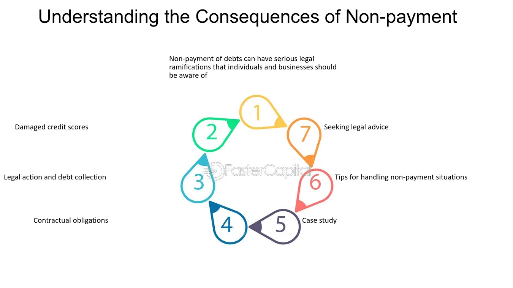

## Table of Contents

## What is a creditor?

A creditor is someone who lends money or extends credit to another person or business. This could be a bank that gives you a loan, a credit card company, or even a friend who lends you money. When you borrow money from a creditor, you promise to pay it back, usually with interest. The creditor trusts that you will keep your promise and repay the money on time.

If you don't pay back the money you owe, the creditor can take action to get it back. They might send you reminders or even take you to court. It's important to understand your responsibilities when you borrow money, so you can keep a good relationship with your creditors and maintain a good credit score.

## What are common types of creditors?

There are several common types of creditors that people deal with. One type is banks. Banks give out loans for things like buying a house or a car. They also let you borrow money with credit cards. Another type of creditor is credit card companies. They give you a card that lets you buy things now and pay later. You have to pay them back every month, or you'll owe more because of interest.

Another common type of creditor is a store or a company that lets you buy things on credit. For example, furniture stores might let you take home a couch and pay for it over time. There are also payday lenders. They give you small loans that you have to pay back when you get your next paycheck. These loans often have high interest rates.

Lastly, there are peer-to-peer lenders. These are people who lend money to others through websites. It's like borrowing from a friend, but you meet them online. Each type of creditor has different rules and interest rates, so it's important to understand them before you borrow money.

## What does nonpayment mean?

Nonpayment means not paying money that you owe. When you borrow money or buy something on credit, you promise to pay it back. If you don't pay, that's called nonpayment. It can happen with loans, credit cards, or bills. Nonpayment can cause big problems. The person or company you owe money to, called the creditor, might get upset. They could send you letters asking for the money, call you, or even take you to court.

If you don't pay, your credit score can go down. A credit score is like a report card for how well you pay your bills. A low score makes it hard to borrow money in the future. It can also make things like renting an apartment or getting a job harder. Sometimes, if you don't pay, the creditor can take things you own, like your car or house, to get their money back. This is called repossession or foreclosure. It's important to talk to your creditor if you can't pay, so you can work out a plan to avoid these problems.

## What are the immediate consequences of nonpayment to creditors?

When you don't pay what you owe to creditors, they will start to take action right away. They might send you letters or emails reminding you to pay. They could also call you to ask for the money. If you still don't pay, they might send your account to a collection agency. These agencies are hired to get the money back from you. They can be very persistent and might call you a lot or even visit your home.

If you keep not paying, your credit score will start to go down. Your credit score is like a number that shows how good you are at paying your bills. When it goes down, it can be hard for you to borrow money in the future. Banks and other lenders might not want to give you loans or credit cards. This can make it tough to buy a house, a car, or even rent an apartment. In some cases, if you owe a lot of money and don't pay, the creditor might take you to court. This can lead to more serious problems like losing your things or even part of your income.

## How does nonpayment affect my credit score?

When you don't pay what you owe, your credit score can go down a lot. Your credit score is like a number that shows how good you are at paying your bills. If you miss payments, this number gets lower. Creditors report your missed payments to credit bureaus, and these bureaus keep track of your payment history. The more you miss, the worse your score becomes. A low credit score can make it hard for you to borrow money later. Banks and other lenders might not want to give you loans or credit cards because they think you won't pay them back.

A low credit score can also affect other parts of your life. It can be harder to rent an apartment because landlords check your credit to see if you're good at paying bills. Some employers also look at your credit score when you apply for a job, especially if the job involves handling money. So, not paying your bills can make it tough to find a place to live or get a good job. It's important to pay what you owe on time to keep your credit score high and avoid these problems.

## Can nonpayment lead to legal action?

Yes, nonpayment can lead to legal action. When you don't pay what you owe, the creditor might take you to court to try to get their money back. This is called a lawsuit. If the court decides you owe the money, they might order you to pay it. If you still don't pay, the court can take money from your wages or bank account. This is called garnishment.

In some cases, if you owe a lot of money and don't pay, the creditor might be able to take things you own. For example, if you didn't pay your car loan, they could take your car. This is called repossession. If you didn't pay your mortgage, they could take your house. This is called foreclosure. Legal action can be serious and stressful, so it's important to talk to your creditor if you can't pay, so you can work out a plan to avoid these problems.

## What are the long-term financial impacts of nonpayment?

If you don't pay what you owe, it can hurt your money situation for a long time. When you don't pay, your credit score goes down. A low credit score makes it hard to get loans, credit cards, or even rent an apartment. Banks and lenders might not trust you to pay them back, so they might say no when you ask for money. This can make it tough to buy things you need, like a house or a car. It can also make it harder to get a good job because some employers check your credit score.

Not paying can also lead to big problems with the law. If you don't pay, the people you owe money to might take you to court. If the court says you have to pay, they could take money from your paycheck or your bank account. They might even take things you own, like your car or house. All these problems can make it hard for you to get your money situation back on track. It's really important to pay what you owe on time to avoid these long-term issues.

## How can I negotiate with creditors if I'm unable to pay?

If you can't pay what you owe, it's a good idea to talk to your creditors. They might be willing to work with you to make a plan that you can handle. You can ask them if you can pay less each month, or if you can skip a payment without getting into trouble. Sometimes, they might even agree to lower the total amount you owe. It's important to be honest about your situation and show them that you want to pay, but you need some help to do it.

When you talk to your creditors, be ready to explain why you can't pay and what you can do instead. They might ask for proof, like showing them your income and bills. If you can, offer a plan that shows how you will pay them back, even if it's going to take longer. Remember, creditors want to get their money back, so they might be willing to help you if you talk to them early and keep trying to pay what you can.

## What are the differences between secured and unsecured creditors in terms of nonpayment?

When you borrow money, you might deal with secured or unsecured creditors. Secured creditors are the ones who have something valuable that you own as a promise to pay back the loan. This could be your house, your car, or something else important. If you don't pay, they can take that thing away from you. This is called repossession or foreclosure. So, if you stop paying a car loan, the bank might take your car. If you don't pay your mortgage, the bank could take your house.

Unsecured creditors, on the other hand, don't have anything valuable to take if you don't pay. This includes credit card companies and most personal loans. If you don't pay them, they can't just take your stuff. But they can still do other things to get their money. They might send your account to a collection agency, or they might take you to court. If they win in court, they could take money from your paycheck or your bank account. This is called garnishment. So, while secured creditors can take your things right away, unsecured creditors have to go through other steps to get their money back.

## How do creditors report nonpayment to credit bureaus?

When you don't pay what you owe, creditors tell the credit bureaus about it. They send information about your missed payments to these bureaus, which keep track of your credit history. The credit bureaus then update your credit report to show that you didn't pay on time. This can make your credit score go down because your payment history is a big part of your score. The more payments you miss, the worse it looks on your credit report.

Creditors usually wait a little while before reporting nonpayment. They might give you some time to catch up on your payments. But if you keep missing payments, they will report it. Once it's on your credit report, it can stay there for a long time, usually up to seven years. This can make it hard for you to borrow money in the future because lenders will see that you didn't pay your bills on time. It's important to talk to your creditors if you're having trouble paying, so you can work out a plan before they report your nonpayment.

## What are the potential impacts of nonpayment on future borrowing?

If you don't pay what you owe, it can make it hard to borrow money in the future. When you miss payments, your credit score goes down. A low credit score tells banks and other lenders that you might not pay them back. So, they might say no when you ask for a loan or a credit card. Even if they do give you money, they might charge you more interest because they think it's riskier to lend to you.

Not paying your bills can also make it tough to get other kinds of loans, like a mortgage for a house or a loan for a car. Lenders look at your credit history to see if you're good at paying back what you owe. If they see that you didn't pay before, they might not want to lend to you again. This can make it hard to buy things you need or want, and it can take a long time to fix your credit score after nonpayment.

## What strategies can be used to manage and recover from the consequences of nonpayment?

If you've missed payments and are dealing with the consequences, there are ways to get back on track. First, talk to your creditors. Explain why you couldn't pay and ask if they can work with you on a new plan. They might let you pay less each month or even lower the total amount you owe. It's important to be honest and show that you want to pay, even if it takes longer. Also, try to catch up on any missed payments as soon as you can. The sooner you start paying again, the less damage it will do to your credit score.

Another way to recover is to make a budget and stick to it. Look at your income and expenses, and see where you can cut back. Use the money you save to pay off what you owe. If you can, pay more than the minimum amount each month to pay off your debt faster. It's also a good idea to check your credit report regularly. Make sure all the information is correct, and if you see any mistakes, report them to the credit bureaus. Over time, as you keep paying your bills on time, your credit score will start to go up again.

## What is the impact of debt nonpayment on algorithmic trading?

Nonpayment scenarios in the context of financial markets present unique challenges and opportunities for algorithmic trading systems. These automated systems are meticulously programmed algorithms that aim to execute trades based on predefined criteria, responding to market conditions such as price changes, volume fluctuations, and other financial indicators. When debt defaults occur, they can trigger significant disruptions that algorithmic systems must effectively navigate.

The primary influence of debt nonpayment on algorithmic trading lies in the alteration of market signals. Defaults can lead to unexpected market volatility, causing prices to fluctuate rapidly as investor sentiment shifts. Algorithmic systems, which rely heavily on historical data and pattern recognition, can find it challenging to adjust to such abrupt changes. These algorithms may react to defaults as a signal of increased risk, prompting them to execute trades that can exacerbate market movements. For instance, a sudden sell-off initiated by algorithmic systems in response to a default can lead to a cascading effect, further destabilizing prices.

Moreover, debt nonpayment affects risk assessments conducted by algorithmic trading systems. Given that defaults are often accompanied by broader economic concerns, algorithms may adjust their risk parameters to adapt to the heightened uncertainty. This adjustment can involve recalibrating stop-loss levels, adjusting position sizes, or even shifting asset allocation to minimize exposure to volatile sectors. The immediate reactivity of algorithms to such defaults is crucial, as delays in response can lead to significant financial losses or missed opportunities for profit.

The impact of debt nonpayment on algorithmic trading can be modeled and analyzed using advanced quantitative techniques. For example, consider an algorithm that trades based on a moving average strategy. The moving average formula is given by:

$$
\text{MA}_{n} = \frac{1}{n} \sum_{i=0}^{n-1} P_{t-i}
$$

where $P_{t-i}$ is the price at time $t-i$, and $n$ is the number of periods. In the case of increased volatility due to a default, the moving average may trigger buy or sell signals more frequently, affecting the efficiency of the trading strategy. Implementing safeguards such as volatility filters can help in making these systems more robust against sudden market shifts induced by nonpayment events.

Python can be leveraged to simulate the impact of debt default on algorithmic trading strategies. Here is a simple example of how one might adjust a strategy in response to increased market volatility:

```python
import numpy as np

def moving_average(prices, n):
    return np.convolve(prices, np.ones(n)/n, mode='valid')

def adjust_strategy(prices, volatility_threshold):
    current_volatility = np.std(prices[-n:])
    if current_volatility > volatility_threshold:
        print("Market volatility is high. Adjusting strategy...")
        # Code to adjust trading strategy here
        # For instance, increase cash reserves, decrease position sizes, etc.

prices = [/* historical price data */]
n = 20
volatility_threshold = 1.5

ma = moving_average(prices, n)
adjust_strategy(prices, volatility_threshold)
```

This example outlines a straightforward approach to incorporating volatility checks, allowing the algorithm to adapt dynamically to debt nonpayment-induced volatility. The flexibility and adaptability of algorithmic trading systems are vital in ensuring their resilience amid market perturbations caused by defaults.

## References & Further Reading

1. Altman, E. I. (1968). "Financial Ratios, Discriminant Analysis and the Prediction of Corporate Bankruptcy". *The Journal of Finance, 23*(4), 589–609. This paper presents the Z-score formula, which is widely used for predicting bankruptcy and assessing the credit risk of firms.

2. Merton, R. C. (1974). "On the Pricing of Corporate Debt: The Risk Structure of Interest Rates". *The Journal of Finance, 29*(2), 449–470. This foundational work applies the Black-Scholes option pricing model for corporate debt to evaluate default risk.

3. Hull, J. C., & White, A. (2004). "Valuation of a CDO and an n-th to Default CDS Without Monte Carlo Simulation". *The Journal of Derivatives, 12*(2), 8–23. This paper offers insights into credit derivative pricing, which is crucial for understanding credit risk management.

4. Black, F., & Scholes, M. (1973). "The Pricing of Options and Corporate Liabilities". *Journal of Political Economy, 81*(3), 637–654. This seminal article introduces the Black-Scholes model, forming the basis for modern financial derivatives and risk management practices.

5. Thakor, A. V. (1982). "Toward a Theory of Bank Loan Commitments". *The Journal of Banking & Finance, 6*(1), 55–83. This article discusses the strategic and risk considerations creditors must manage within bank loan commitments.

6. Murphy, K. P. (2012). *Machine Learning: A Probabilistic Perspective*. Cambridge: MIT Press. This book provides a comprehensive overview of machine learning techniques, applicable to algorithmic trading and financial modeling.

7. Chan, E. (2009). *Algorithmic Trading: Winning Strategies and Their Rationale*. Hoboken: Wiley Trading. This book covers practical insights and strategies for implementing successful algorithmic trading systems.

8. Duffie, D., & Singleton, K. J. (1999). "Modeling Term Structures of Defaultable Bonds". *The Review of Financial Studies, 12*(4), 687–720. This paper offers a framework for understanding the pricing and risk management of defaultable bonds.

9. Ait-Sahalia, Y., & Lo, A. W. (2000). "Nonparametric Risk Management and Implied Risk Aversion". *Journal of Econometrics, 94*(1), 9–51. This research discusses risk management methodologies, including their application in algorithmic trading systems.

10. Tsay, R. S. (2010). *Analysis of Financial Time Series*. Hoboken: Wiley. This book focuses on statistical methods and time series analysis, crucial for developing algorithmic trading models and strategies.

