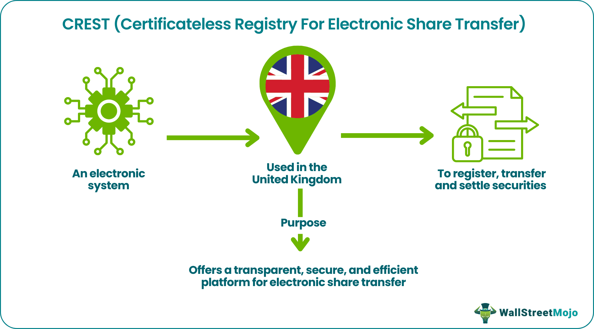

## Table of Contents

## What is CREST and its basic function in stock trading?

CREST is a system used in the UK and Ireland for holding and transferring shares electronically. It stands for Certificateless Registry for Electronic Share Transfer. Instead of using paper certificates, CREST allows people to buy, sell, and hold shares in a digital form. This makes trading quicker and easier because you don't need to wait for physical documents to be mailed back and forth.

The basic function of CREST in stock trading is to make the process of buying and selling shares more efficient. When someone wants to buy or sell shares, they can do it through their broker, who uses the CREST system to complete the transaction. The system keeps track of who owns what shares and makes sure that when a trade happens, the shares are moved from the seller's account to the buyer's account quickly and accurately. This helps to keep the stock market running smoothly.

## How does CREST facilitate the buying and selling of stocks?

CREST helps people buy and sell stocks by keeping everything digital. Instead of using paper certificates, CREST uses electronic records to show who owns what shares. When someone wants to buy or sell a stock, they tell their broker, and the broker uses CREST to make the trade happen. The system checks who owns the shares, and then it moves the shares from the seller's account to the buyer's account. This makes trading fast and easy because there's no need to wait for paper documents to be sent around.

CREST also makes sure that all trades are done correctly. It keeps track of every transaction and makes sure that the right number of shares are moved between accounts. This helps prevent mistakes and keeps the stock market running smoothly. By using CREST, people can trade stocks quickly and safely, without worrying about losing or damaging paper certificates.

## What are the main benefits of using CREST for stock transactions?

Using CREST for stock transactions makes things a lot easier and faster. Instead of waiting for paper certificates to be mailed, CREST lets you buy and sell stocks right away because everything is done electronically. This means you can trade stocks quickly without any delays, which is really important in the fast-moving world of the stock market.

Another big benefit of CREST is that it keeps everything safe and accurate. Since all the records are digital, there's no chance of losing or damaging paper certificates. CREST makes sure that every trade is done correctly by keeping track of who owns what shares and making sure the right number of shares are moved between accounts. This helps prevent mistakes and keeps the stock market running smoothly.

## How does CREST ensure the security of stock transactions?

CREST keeps stock transactions safe by using a digital system instead of paper certificates. This means there's no risk of losing or damaging important documents. All the information about who owns what shares is stored securely in the system, and only authorized people can access it. This helps prevent anyone from stealing or changing the records without permission.

The system also makes sure that every trade is done correctly. When someone buys or sells shares, CREST checks to make sure the seller actually owns the shares they're selling. Then, it moves the shares from the seller's account to the buyer's account right away. This helps stop mistakes and fraud, keeping the stock market safe and fair for everyone.

## Can you explain the process of settling a trade using CREST?

When someone wants to settle a trade using CREST, it starts with the buyer and seller agreeing on the trade through their brokers. The seller's broker tells CREST that they want to sell some shares, and the buyer's broker tells CREST that they want to buy those shares. CREST then checks to make sure the seller actually owns the shares they're trying to sell. If everything looks good, CREST goes ahead and moves the shares from the seller's account to the buyer's account.

Once the shares are moved, CREST also takes care of the money part of the trade. The buyer's broker sends the money to the seller's broker through CREST. This makes sure that the seller gets paid for their shares and the buyer gets the shares they paid for. The whole process is done quickly and safely because everything is done electronically, without any need for paper certificates or waiting for mail.

## What are the roles of different participants in the CREST system?

In the CREST system, there are different people who help make stock trading work smoothly. The first group is the investors, who are the people buying and selling shares. They tell their brokers what they want to do, like buying or selling certain shares. The brokers are the next important group. They act like middlemen, helping investors make their trades. They use the CREST system to send and receive shares and money on behalf of their clients.

The CREST system itself is run by a company called Euroclear UK & Ireland. They make sure the system works well and keeps everyone's information safe. Another important group is the registrars. They keep track of who owns what shares and make sure all the records are correct. When a trade happens, the registrars update their records to show the new owner of the shares. All these groups work together to make sure buying and selling shares is quick, safe, and easy.

## How does CREST handle corporate actions like dividends and stock splits?

When a company decides to do something that affects its shareholders, like paying dividends or splitting its stock, CREST helps make sure everything goes smoothly. If a company decides to pay a dividend, CREST automatically updates the accounts of all the shareholders who are eligible to receive it. This means that if you own shares in that company, CREST will make sure you get your dividend payment without any hassle. It keeps track of who owns what and makes sure the right amount of money goes to the right people.

For stock splits, CREST also plays an important role. When a company decides to split its stock, it means they're increasing the number of shares each shareholder owns. CREST makes sure that after the split, the right number of new shares are added to each shareholder's account. This way, if you own 10 shares and the company does a 2-for-1 split, CREST will update your account to show you now own 20 shares. It keeps everything organized and ensures that all shareholders get their fair share of the new stock.

## What are the fees associated with using CREST for stock trading?

When you use CREST for stock trading, there are some fees you need to know about. The main fee is the transaction fee, which is charged every time you buy or sell shares. This fee helps cover the cost of using the CREST system to move shares from one account to another. The exact amount of the transaction fee can change, but it's usually a small percentage of the total value of the shares you're trading.

Besides the transaction fee, there might be other fees depending on what you're doing. For example, if you want to hold your shares in CREST instead of getting paper certificates, there could be a fee for that. Also, if you need to do something special like a corporate action, there might be extra fees for those services. It's a good idea to check with your broker to find out exactly what fees you'll need to pay when using CREST.

## How does CREST integrate with other financial systems and platforms?

CREST works well with other financial systems and platforms to make stock trading easier. It connects with the systems that brokers use, so when you want to buy or sell shares, your broker can use CREST to do it quickly. CREST also talks to the systems that banks use, so when money needs to move from the buyer to the seller, it can happen smoothly. This connection helps make sure that everything in the stock market works together without any big problems.

Another way CREST integrates is with the systems that keep track of who owns what shares. These are called registrar systems, and they need to know about every trade that happens. CREST sends them information about trades so they can update their records correctly. This helps keep everything accurate and up-to-date. By working well with these other systems, CREST helps make the whole process of buying and selling shares faster and safer.

## What advanced features does CREST offer for institutional investors?

CREST offers some special tools for big investors like banks and investment funds. One of these tools is called "settlement netting." This means that if a big investor is buying and selling a lot of shares at the same time, CREST can figure out the difference and only move the net amount of shares and money. This makes things simpler and can save time and money.

Another useful feature for institutional investors is the ability to do trades in big batches. Instead of doing one trade at a time, CREST lets them do many trades all at once. This is really helpful for big investors who need to buy or sell a lot of shares quickly. It makes their work easier and helps them manage their investments better.

## How can CREST be used to manage international stock trading?

CREST helps with international stock trading by connecting with other systems around the world. If an investor in the UK wants to buy shares from a company in another country, CREST can work with the systems in that country to make the trade happen. This means that even though the shares are from a different place, the investor can still use CREST to buy and sell them easily. It makes trading across borders simpler and faster.

To manage international stock trading, CREST also keeps track of different rules and regulations in different countries. This is important because each country might have its own rules about how to trade stocks. CREST makes sure that all these rules are followed when it moves shares and money between countries. This helps keep international trading safe and fair for everyone involved.

## What future developments are expected for CREST in the stock trading industry?

In the future, CREST is expected to keep getting better to make stock trading even easier and safer. One big change might be using more advanced technology like blockchain. Blockchain is a special way of keeping records that is very safe and hard to change. If CREST uses blockchain, it could make trading even faster and more secure. This would be really helpful for everyone who uses the system, especially big investors who trade a lot of shares.

Another thing that might happen is that CREST could work even better with other systems around the world. Right now, CREST already helps with international trading, but in the future, it could connect with even more systems in different countries. This would make it easier for people to buy and sell shares from anywhere in the world. It would also help make sure that all the different rules and regulations in different places are followed correctly, making international trading smoother and safer.

## What are the types of algorithmic trading strategies?

Algorithmic trading strategies are diverse and sophisticated, each designed to exploit different market conditions and inefficiencies. These strategies are implemented through computer algorithms, which make decisions and execute trades more rapidly and efficiently than human traders could.

Trend-following algorithms are among the most popular strategies, capitalizing on sustained market trends. These algorithms identify and follow price movements to initiate buy or sell orders. They rely on technical indicators like moving averages, [momentum](/wiki/momentum) oscillators, and [breakout](/wiki/breakout-trading) patterns. The idea is to capture gains by riding on an existing trend, whether upward or downward. Python libraries such as `pandas` and `numpy` are often used to code and backtest these strategies.

Mean reversion strategies are based on the assumption that asset prices will return to their historical average or mean over time. These strategies detect when an asset has deviated significantly from its mean and predict a correction. Traders using mean reversion look for opportunities where prices are abnormally high or low compared to their historical averages, executing trades to profit from these corrections. Statistical tools and methods like the Z-score are frequently applied to identify these deviations:

$$
Z = \frac{x - \mu}{\sigma}
$$

where $x$ is the current price, $\mu$ is the historical mean, and $\sigma$ is the standard deviation.

Statistical [arbitrage](/wiki/arbitrage) involves leveraging statistical and mathematical models to find pricing inefficiencies between related assets. The strategy typically involves pairs trading—identifying two correlated assets diverging in price, then shorting the overvalued asset while buying the undervalued one. As prices converge, profits are made. These models often use regression analysis and [machine learning](/wiki/machine-learning) algorithms to identify tradable divergences.

Market-making algorithms provide [liquidity](/wiki/liquidity-risk-premium) to the markets by continuously quoting both the buy (bid) and sell (ask) prices for a particular security. Market makers earn profits through the bid-ask spread, which is the difference between the purchase price and the selling price. These algorithms must respond rapidly to market changes to maintain effective spreads and reduce risk.

High-frequency trading ([HFT](/wiki/high-frequency-trading-strategies)) strategies are designed to capitalize on small price fluctuations over short periods. HFT algorithms execute large volumes of trades at extremely high speeds, often across multiple exchanges. The goal is to accumulate small profits from each trade, which can lead to significant gains due to the sheer number of transactions. These strategies require robust infrastructure and low-latency networks to be effective.

Each of these [algorithmic trading](/wiki/algorithmic-trading) strategies requires a deep understanding of market dynamics, statistical analysis, and programming skills to develop and optimize the algorithms for real-world application. Traders and firms often continuously refine their models to maintain a competitive edge in fast-evolving markets.

## References & Further Reading

[1]: Alexandridis, A., Zapranis, A., & Livanis, E. (2019). ["Time Series Forecasting using Machine Learning for Algorithmic Trading of Cryptocurrencies."](https://www.sciencedirect.com/science/article/pii/S0169207019300322) Applied Soft Computing, 82.

[2]: Domowitz, I., & Steil, B. (2001). ["Automation, Trading Costs, and the Structure of the Trading Services Industry."](https://www.nomurafoundation.or.jp/en/wordpress/wp-content/uploads/2014/09/19971011_Ian_Domowitz_-_Benn_Steil.pdf) The Review of Financial Studies, 14(1), 101-140.

[3]: Anagnostidis, P., Varsakelis, C., & Emmanouilides, C. J. (2016). ["Has Algorithmic Trading Improved Market Efficiency? Evidence from the UK."](https://www.sciencedirect.com/science/article/pii/S0378426616302771) Research in International Business and Finance, 37, 527-544.

[4]: Hasbrouck, J., & Saar, G. (2013). ["Low-Latency Trading."](https://www.sciencedirect.com/science/article/abs/pii/S1386418113000165) The Review of Financial Studies, 26(9), 2790-2839.

[5]: Mackintosh, I. (2003). ["Settling for Electronic Efficiency with CREST."](https://www.sciencedirect.com/science/article/abs/pii/S0378426607000866) Bank of England Quarterly Bulletin, 43(1), 96-104.