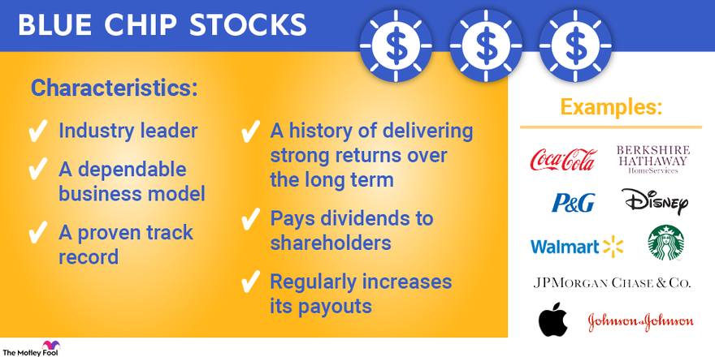

## Table of Contents

## What is a blue chip company?

A blue chip company is a big and well-known company that is considered safe and reliable for investors. These companies usually have a long history of making money and paying dividends to their shareholders. They are often leaders in their industries, like technology, finance, or consumer goods. Examples of blue chip companies include Apple, Microsoft, and Coca-Cola.

People like to invest in blue chip companies because they are seen as stable and less risky than smaller or newer companies. Even though they might not grow as fast as some smaller companies, blue chip companies tend to have steady growth over time. This makes them a good choice for people who want to invest their money safely and see it grow slowly but surely.

## What are the common characteristics of blue chip companies?

Blue chip companies are known for being big and well-established. They have been around for a long time and are leaders in their industries. This means they have a strong reputation and are trusted by people. They also have a history of making good profits year after year. Because of this, they are seen as safe investments. People believe that these companies will keep doing well even during tough economic times.

Another important characteristic of blue chip companies is that they often pay dividends to their shareholders. Dividends are like rewards that the company gives to people who own its stock. These companies have enough money to share some of their profits with investors. Blue chip companies also have strong financial health, which means they have a lot of money and assets. This makes them more stable and less likely to fail. Overall, these characteristics make blue chip companies a popular choice for people looking for reliable investments.

## How do blue chip companies differ from other types of companies?

Blue chip companies are different from other types of companies because they are big, well-known, and have been around for a long time. They are leaders in their industries and have a strong reputation. This makes them more stable and less risky than smaller or newer companies. People see blue chip companies as safe investments because they have a history of making good profits and doing well even during tough economic times.

Another way blue chip companies differ is that they often pay dividends to their shareholders. This means they share some of their profits with people who own their stock. Not all companies do this, especially smaller ones that might need all their money to grow. Blue chip companies have strong financial health, with a lot of money and assets, which makes them more reliable. This stability and the ability to pay dividends make blue chip companies a popular choice for investors looking for steady and safe returns on their investments.

## What financial metrics are used to identify blue chip companies?

To identify blue chip companies, people look at several financial metrics. One important metric is the company's earnings history. Blue chip companies usually have a long track record of making profits year after year. This shows they are stable and can be trusted to keep making money. Another key metric is the company's dividend payout. Blue chip companies often pay dividends regularly, which means they share their profits with shareholders. This shows they have enough money to not only run their business but also give back to investors.

Another financial metric used is the company's market capitalization, or market cap. Blue chip companies have a large market cap, which means they are big and well-known. A large market cap shows that many people believe in the company and are willing to invest in it. Finally, the company's debt-to-equity ratio is also important. Blue chip companies usually have a low debt-to-equity ratio, which means they don't rely too much on borrowed money. This makes them financially healthy and less risky for investors.

## Can you list some examples of well-known blue chip companies?

Some well-known blue chip companies are Apple, Microsoft, and Coca-Cola. Apple is famous for making iPhones and other tech products. Microsoft is known for its Windows operating system and other software. Coca-Cola makes the popular soda drink that many people around the world enjoy. These companies are big and have been around for a long time, which makes them safe and reliable for investors.

Other examples of blue chip companies include Johnson & Johnson, which makes healthcare products, and Procter & Gamble, which makes everyday items like shampoo and diapers. These companies are leaders in their industries and have a strong history of making profits. They also pay dividends to their shareholders, which shows they have enough money to share with investors. People trust these companies because they are stable and have a good reputation.

## How important is market capitalization in defining a blue chip company?

Market capitalization, or market cap, is very important when defining a blue chip company. It tells us how big a company is by showing the total value of all its shares. Blue chip companies have a large market cap, which means they are big and well-known. This large size shows that many people believe in the company and are willing to invest in it. When a company has a big market cap, it is often seen as more stable and less risky than smaller companies.

Having a large market cap is one of the reasons why blue chip companies are trusted by investors. It shows that the company has a strong position in its industry and can handle tough economic times better than smaller companies. This stability is what makes blue chip companies a safe choice for people who want to invest their money without taking big risks. So, market capitalization is a key factor in identifying and understanding blue chip companies.

## What role does stability and reliability play in the classification of a company as blue chip?

Stability and reliability are very important when deciding if a company is a blue chip. These companies have been around for a long time and have a strong history of making money. This means they can be trusted to keep doing well, even when the economy is not doing great. People see blue chip companies as safe places to invest their money because they are less likely to fail.

Because blue chip companies are stable and reliable, they often pay dividends to their shareholders. This means they share their profits with people who own their stock. This shows that the company has enough money to not only run its business but also give back to investors. Overall, the stability and reliability of blue chip companies make them a popular choice for people looking for safe and steady investments.

## How do blue chip companies perform during economic downturns?

Blue chip companies usually do better during economic downturns than smaller companies. They have been around for a long time and have a lot of money and assets. This makes them more stable and able to handle tough times. People trust these companies because they have a history of making profits even when the economy is not doing well.

During an economic downturn, blue chip companies might not grow as fast as they do in good times, but they are less likely to lose a lot of money. They often have enough cash to keep running their business and paying dividends to shareholders. This stability makes them a safe choice for investors who want to protect their money during tough economic times.

## What are the criteria for a company to be considered a blue chip in different sectors?

To be considered a blue chip company in different sectors, a company needs to be big and well-known. It should have a long history of making money and be a leader in its industry. This means it has a strong reputation and is trusted by people. The company should also have a large market capitalization, which shows that many people believe in it and are willing to invest. This large size makes the company more stable and less risky than smaller companies.

Another important criterion is that the company should have strong financial health. This means it has a lot of money and assets, and it doesn't rely too much on borrowed money. Blue chip companies often pay dividends to their shareholders, which shows they have enough money to share their profits. These characteristics make blue chip companies a safe choice for investors in any sector, whether it's technology, finance, healthcare, or consumer goods. They are seen as reliable and stable, even during tough economic times.

## How do global operations influence a company's status as a blue chip?

Having global operations can make a company more likely to be considered a blue chip. When a company operates all over the world, it can reach more customers and make more money. This makes the company bigger and more stable. People trust these companies because they have a strong presence in many countries and can handle different economic situations. This global reach shows that the company is a leader in its industry and has the resources to grow and stay strong.

Global operations also help a company manage risk better. If one part of the world is going through a tough economic time, a company with global operations can still make money from other parts of the world. This makes the company less risky for investors. Because of this, companies with global operations are often seen as safer and more reliable investments. This is why having operations around the world can help a company be seen as a blue chip.

## What are the long-term investment benefits of blue chip stocks?

Investing in blue chip stocks can be really good for the long term. These companies are big and well-known, so they are less risky than smaller companies. They have been around for a long time and make good profits year after year. This means your money is safer with them. Blue chip companies often pay dividends, which are like rewards for owning their stock. Over time, these dividends can add up and give you extra money on top of any growth in the stock's value.

Another benefit of blue chip stocks is that they tend to do well even when the economy is not doing great. Because these companies are stable and have a lot of money, they can handle tough times better than smaller companies. This makes them a good choice if you want to keep your money safe during economic downturns. Over many years, blue chip stocks can grow steadily, helping your investment grow slowly but surely. This makes them a smart choice for people who want to invest for the long term.

## How can emerging companies aspire to achieve blue chip status?

Emerging companies can become blue chip companies by focusing on a few key things. First, they need to grow big and become well-known. This means they should work hard to make good products or services that people love. As they grow, they need to make sure they are making profits year after year. This shows that they are stable and can be trusted. They also need to be leaders in their industry, which means they should always try to be the best at what they do.

Another important thing for emerging companies is to have strong financial health. This means they should have a lot of money and assets and not rely too much on borrowed money. As they get bigger, they should start paying dividends to their shareholders. This shows that they have enough money to share their profits. Over time, if they keep doing these things well, they can become stable and reliable enough to be seen as blue chip companies.

## References & Further Reading

[1]: Bergstra, J., Bardenet, R., Bengio, Y., & Kégl, B. (2011). ["Algorithms for Hyper-Parameter Optimization."](https://papers.nips.cc/paper/4443-algorithms-for-hyper-parameter-optimization) Advances in Neural Information Processing Systems 24.

[2]: ["Advances in Financial Machine Learning"](https://www.amazon.com/Advances-Financial-Machine-Learning-Marcos/dp/1119482089) by Marcos Lopez de Prado

[3]: ["Evidence-Based Technical Analysis: Applying the Scientific Method and Statistical Inference to Trading Signals"](https://www.amazon.com/Evidence-Based-Technical-Analysis-Scientific-Statistical/dp/0470008741) by David Aronson

[4]: ["Machine Learning for Algorithmic Trading"](https://github.com/stefan-jansen/machine-learning-for-trading) by Stefan Jansen

[5]: ["Quantitative Trading: How to Build Your Own Algorithmic Trading Business"](https://www.amazon.com/Quantitative-Trading-Build-Algorithmic-Business/dp/1119800064) by Ernest P. Chan