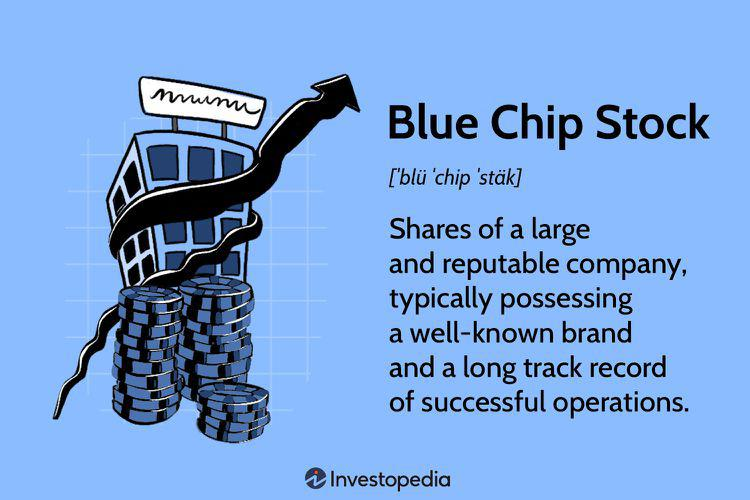

Blue chip stocks represent shares in nationally recognized, well-established, and financially sound companies. These entities have demonstrated their ability to endure economic challenges and remain resilient over time, often characterized by their large market capitalization, reliable earnings, and a history of consistent dividend payments. In the stock market, blue chip stocks are held in high regard due to their stability and perceived reliability, making them a cornerstone of conservative investment strategies. Renowned examples include corporations such as Apple, Microsoft, and Johnson & Johnson.

Algorithms, in a broad sense, are sets of rules or instructions given to accomplish specific tasks or solve problems. Algorithmic trading, known as algo trading, utilizes these algorithms to automate trading decisions in financial markets. By incorporating mathematical models, statistical analyses, and computational efficiencies, algo trading enables high-speed, precise execution of trades, often surpassing human capabilities in terms of scale and speed. The process involves coding strategies into trading systems to automatically perform functions such as market making, arbitrage, and trend following.



The purpose of this article is to dissect the potential applications of algorithmic trading within the context of investing in blue chip stocks. As these stocks are generally less volatile compared to smaller or emerging market counterparts, algorithmic approaches tailored for such a unique category could present distinct opportunities and challenges. By examining how algo trading can be adapted to optimize investment strategies around blue chip stocks, this article aims to provide insights into augmenting traditional investment approaches with cutting-edge technology.

Selection criteria for blue chip companies typically include key financial metrics like robust revenues, consistent dividend histories, and prudent debt levels, each indicative of a company's strong business model and financial health. The evaluation also considers qualitative factors such as brand strength, market presence, corporate governance, and the ability to innovate and adapt in a changing market.

Throughout this article, readers will gain a comprehensive understanding of blue chip stocks and the criteria for their selection, explore the foundational principles of algorithmic trading, and consider how such technological advancements can be strategically applied to the investment in blue chip companies. In addition, challenges and risk management strategies will be discussed, equipping potential investors with the knowledge to navigate both the benefits and limitations inherent to algo trading in this sector.

## Table of Contents

## Understanding Blue Chip Stocks

Blue chip stocks are typically defined as shares in well-established and financially sound companies with a strong historical performance. These stocks are widely recognized for their stability and reliability, often paying dividends consistently even during economic downturns. The term "blue chip" is derived from poker, where blue chips hold the highest value.

Blue chip companies are generally characterized by their large market capitalization, indicating the total market value of a company's outstanding shares. This market cap often exceeds billions of dollars, placing these companies among the largest and most influential entities in their respective industries. Stability is another hallmark, as blue chip companies demonstrate resilient financial performance over time, maintaining steady earnings growth and cash flow. This financial robustness often allows them to return profits to shareholders through regular dividend payments, further enhancing their appeal.

Reliability is fueled by the strong market presence and brand recognition that blue chip companies often enjoy. These entities typically operate in sectors considered essential or with a long-term growth trajectory, such as technology, healthcare, finance, consumer goods, and energy. Notable examples of blue chip stocks include Apple Inc. in technology, Johnson & Johnson in healthcare, JPMorgan Chase in financial services, Procter & Gamble in consumer goods, and ExxonMobil in energy.

Historically, blue chip stocks have been favored by investors due to their capability to deliver steady returns over long periods. They often exhibit less [volatility](/wiki/volatility-trading-strategies) compared to smaller, growth-oriented stocks. This stability allows them to act as anchors within diversified investment portfolios, providing a reliable balance between risk and return. The historical performance of these stocks is often illustrated by their positions in major stock indices like the Dow Jones Industrial Average (DJIA) and the S&P 500, which track the performance of leading companies in the U.S. market.

Despite their advantages, investing in blue chip stocks is not without risks. While these stocks are less volatile, they are not immune to market fluctuations. Economic downturns, market corrections, or industry-specific challenges can impact their stock prices. For instance, blue chip companies may face risks such as regulatory changes, technological disruptions, or global economic shifts that affect their operations. Additionally, while dividend payments are generally stable, they can be reduced or suspended in times of significant financial stress.

In summary, blue chip stocks are integral to investment strategies due to their large market cap, stability, and reliability. While they offer potential for consistent returns and reduced volatility, investors must remain aware of the risks associated with market changes and economic challenges. These stocks continue to play a pivotal role in the portfolios of investors seeking a balance of growth and security.

## Criteria for Selecting Blue Chip Companies

Selecting blue chip companies necessitates a careful evaluation of several financial and non-financial criteria. Key financial metrics are central to this analysis and provide insight into the financial health and operational efficiency of a company.

**Revenue, Dividend History, and Debt Levels**

Revenue is a critical indicator of a company's ability to generate sales and support growth initiatives. Consistent revenue growth over time suggests strong market demand and effective management strategies. Additionally, a robust dividend history is often associated with blue chip companies. Regular and increasing dividend payments exemplify a firm's financial strength and long-term profitability, serving as a tangible return to investors.

Evaluating a company's debt levels involves examining its debt-to-equity ratio and interest coverage ratio. A manageable debt load relative to equity and the ability to cover interest payments comfortably from earnings signifies prudent financial management. Utilizing these financial metrics, investors can assess the stability and resilience of prospective blue chip companies.

**Strong Brand and Market Presence**

A distinguishing feature of blue chip companies is a strong brand and market presence, which often provides competitive advantages such as customer loyalty and pricing power. These companies typically occupy leading positions in their respective sectors, characterized by extensive product portfolios and global reach.

**Evaluation of Company Management and Corporate Governance**

The quality of a company’s management and its corporate governance practices play a pivotal role in sustaining its blue chip status. Effective leadership is reflected in strategic decision-making, operational efficiency, and the execution of long-term goals. Strong corporate governance, characterized by transparency, ethical practices, and accountability, helps in minimizing risks and fosters investor confidence.

**Role of Innovation and Market Adaptation**

For a company to maintain blue chip status, it must adapt to changing market conditions and leverage innovation to remain competitive. This involves investing in research and development, adopting new technologies, and exploring new market opportunities. Companies that continually evolve can better withstand economic downturns and capitalize on growth prospects.

**Case Studies of Blue Chip Companies**

Several companies exemplify the characteristics of blue chip status through their historical performance and strategic initiatives. For instance, companies like Johnson & Johnson and Procter & Gamble have maintained their blue chip status over several decades. Their success can be attributed to diversified product lines, consistent financial performance, and a commitment to innovation and sustainability.

By considering these criteria, investors can make informed decisions when identifying and selecting blue chip companies for their portfolios, ensuring alignment with long-term investment goals.

 to Algorithmic Trading

Algorithmic trading refers to the use of computer algorithms to execute trading strategies in financial markets. These algorithms, programmed to follow a defined set of instructions, aim to achieve trades with optimal speed, efficiency, and precision, often beyond the capability of human traders. The core principles of [algorithmic trading](/wiki/algorithmic-trading) revolve around its ability to process vast amounts of data quickly, thereby enabling faster decision-making and trade execution.

Several types of algorithmic trading strategies exist, each with its specific objectives and methods. Market making involves providing [liquidity](/wiki/liquidity-risk-premium) to markets by continuously offering buy and sell quotes. Arbitrage seeks to exploit price disparities between different markets or instruments. Trend following leverages historical market data to identify and capitalize on existing market trends. Each of these strategies requires distinct algorithmic techniques and is chosen based on the trade objectives and market conditions.

The benefits of using algorithms in trading are significant. Algorithms help to eliminate emotional biases in trading decisions, which can often lead to irrational market behavior. They also enhance data analysis capabilities, allowing traders to identify patterns and opportunities that might not be apparent to human analysts. Additionally, algorithmic trading ensures consistency in executing trades, adhering strictly to predetermined parameters and risk management protocols.

Despite these advantages, algorithmic trading presents certain challenges and risks. One major concern is the reliance on technology, which makes systems susceptible to technical failures and cyber threats. Additionally, algorithms might sometimes exacerbate market volatility, particularly in illiquid markets, due to rapid trading volumes. The potential for flawed algorithmic logic or poor data input poses further risks, which could lead to substantial financial losses.

For successful algorithmic trading implementations, technological and data requirements are crucial. High-speed internet connectivity, robust computing infrastructure, and access to real-time market data are essential. Traders also need sophisticated software platforms that support algorithm development, testing, and deployment. Ensuring these technical elements are in place is fundamental to achieving the desired efficiency and precision in trading outcomes.

## Algorithmic Trading Applications for Blue Chip Stocks

Algorithmic trading has increasingly become a cornerstone in modern investment strategies, offering a robust framework to improve returns and efficiency, particularly with blue chip stocks. These stocks, known for their stability and strong market presence, provide an ideal environment for algorithmic applications, given their liquidity and accessibility.

**Enhancing Investment Strategies**

Algorithmic trading can significantly enhance investment strategies for blue chip stocks through systematic analysis and execution. Algorithms can process vast amounts of data far faster and more accurately than a human trader, thereby identifying lucrative opportunities that may go unnoticed. By employing advanced mathematical models, traders can forecast price movements and execute trades based on the analyzed data. This results in optimized trade timing and higher precision in transaction execution.

**Analyzing Macroeconomic Indicators and Corporate Reports**

Algorithms can analyze macroeconomic indicators such as interest rates, GDP growth rates, and inflation, which affect blue chip stocks significantly. Moreover, algorithms can sift through corporate financial reports, extracting essential metrics like earnings per share (EPS), price-to-earnings ratios (P/E), and other relevant fundamentals. This data-driven approach facilitates the generation of predictive insights, aiding in the formulation of strategies that align with both macroeconomic conditions and specific corporate performance metrics.

**Optimizing Trade Timing and Execution**

Algorithmic strategies are specifically designed to optimize the timing and execution of trades. For instance, [volume](/wiki/volume-trading-strategy)-weighted average price (VWAP) and time-weighted average price (TWAP) strategies ensure that trades are carried out at favorable prices within a set period, minimizing market impact. Additionally, statistical [arbitrage](/wiki/arbitrage) algorithms can identify and exploit temporary mispricings in blue chip stocks, executing trades with precision to capitalize on short-lived discrepancies.

Here's a basic example of a VWAP trading strategy implemented in Python:

```python
import numpy as np

def calculate_vwap(prices, volumes):
    return np.sum(prices * volumes) / np.sum(volumes)

prices = np.array([101, 102, 103])
volumes = np.array([1500, 1600, 1700])

vwap = calculate_vwap(prices, volumes)
print("VWAP:", vwap)
```

**Examples of Successful Algo Trades**

Numerous cases exist where algorithmic trading has successfully improved returns for blue chip stocks. Hedge funds and institutional investors employ algo trading to maintain competitive advantages, executing millions of trades on companies like Apple, IBM, and ExxonMobil. These algorithms not only analyze historic price data but also integrate real-time market conditions to dynamically adjust trading strategies.

**Risks and Pitfalls**

Despite its advantages, algorithmic trading in blue chip stocks is not devoid of risks, particularly because these markets are less volatile compared to others like small-cap or emerging markets. This reduced volatility can lead to narrower profit margins from algorithmic trades. Moreover, the presence of numerous market participants employing similar strategies can increase the complexity of achieving consistent alpha, the excess return over market benchmarks.

Therefore, while algorithms can optimize trading processes, traders must exercise caution and employ rigorous [backtesting](/wiki/backtesting) and risk management frameworks. Adjustments and continuous monitoring of algorithms ensure alignment with evolving market trends and regulatory requirements, safeguarding investments and enhancing returns in the stable yet competitive landscape of blue chip stocks.

## Challenges and Considerations in Algo Trading Blue Chip Stocks

Algorithmic trading in blue chip stocks presents numerous challenges, despite its potential for optimizing investment strategies. One major challenge is the stringent market regulations and compliance requirements. Regulatory bodies such as the Securities and Exchange Commission (SEC) in the United States impose rules that influence how algorithms can be used in trading, including restrictions on market manipulation and requirements for transparency. These regulations necessitate ongoing compliance efforts and can limit the scope of algorithmic strategies.

Technological and resource investments are also substantial considerations. Developing and maintaining an algorithmic trading system requires advanced computing power, significant data storage, and sophisticated software platforms that can process vast amounts of data in real-time. Furthermore, human capital investments in skilled developers and quantitative analysts are essential to design, test, and monitor the trading algorithms effectively.

Risk management is a critical component specific to algorithmic trading of blue chip stocks. Despite their general stability and lower volatility, blue chip stocks can still be subject to sudden market shifts. Algorithms must be equipped with mechanisms to hedge against potential losses, such as stop-loss orders and dynamic risk assessments. The integration of [machine learning](/wiki/machine-learning) models for predictive analytics can enhance risk management but requires robust training datasets to function effectively.

Continuous algorithm adjustments and monitoring are vital due to the dynamic nature of financial markets. Algorithms must adapt to evolving market conditions, which involves regular back-testing and refinement based on historical data and real-time market inputs. This ongoing adjustment process demands comprehensive monitoring systems to ensure that the algorithms perform efficiently and do not deviate from expected outcomes.

In conclusion, while algorithmic trading offers compelling advantages for trading blue chip stocks, it involves complex challenges related to regulatory compliance, technological infrastructure, risk management, and continuous algorithm optimization. Addressing these challenges is essential for sustainable profitability and reducing potential trading risks.

## Conclusion

Blue chip stocks play a crucial role in the stock market, offering stability and reliability that attract a wide range of investors. They are often characterized by large market capitalization, consistent dividend payouts, and sound financial health. Algorithmic trading, on the other hand, represents a modern approach to trading that leverages advanced algorithms for speed and precision in executing trades. When applied to blue chip stocks, algorithmic trading can significantly optimize investment strategies.

Investors can harness algorithms to systematically analyze vast datasets, identifying trends and patterns that might not be immediately noticeable through traditional analysis. For example, algorithms can process macroeconomic indicators and corporate financial reports to identify optimal trading opportunities, ensuring trades are executed at the most advantageous times. This can enhance portfolio performance by improving timing and reducing emotional biases inherent in manual trading.

Looking ahead, the integration of advanced trading technologies with blue chip investing is likely to become even more prominent. As technology evolves, algorithms will become more sophisticated, capable of analyzing even more complex data sets with increased accuracy. This advancement opens new possibilities for enhancing returns and managing risks associated with blue chip stock portfolios.

It is essential for investors to expand their knowledge of both blue chip investing and the potential of algorithmic trading. By understanding these components, investors can make informed decisions and sharpen their competitive edge in the market. As trading technologies continue to advance, staying informed about these developments and market conditions becomes increasingly important. This proactive approach helps investors adapt strategies to capitalize on new opportunities while effectively managing risks associated with their blue chip investments.

## References & Further Reading

[1]: Bergstra, J., Bardenet, R., Bengio, Y., & Kégl, B. (2011). ["Algorithms for Hyper-Parameter Optimization."](https://papers.nips.cc/paper/4443-algorithms-for-hyper-parameter-optimization) Advances in Neural Information Processing Systems 24.

[2]: ["Advances in Financial Machine Learning"](https://www.amazon.com/Advances-Financial-Machine-Learning-Marcos/dp/1119482089) by Marcos Lopez de Prado

[3]: ["Evidence-Based Technical Analysis: Applying the Scientific Method and Statistical Inference to Trading Signals"](https://www.amazon.com/Evidence-Based-Technical-Analysis-Scientific-Statistical/dp/0470008741) by David Aronson

[4]: ["Machine Learning for Algorithmic Trading"](https://github.com/stefan-jansen/machine-learning-for-trading) by Stefan Jansen

[5]: ["Quantitative Trading: How to Build Your Own Algorithmic Trading Business"](https://www.amazon.com/Quantitative-Trading-Build-Algorithmic-Business/dp/1119800064) by Ernest P. Chan