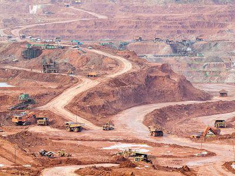

Junior gold miners occupy a distinct niche within the expansive mining industry. Diverging from the practices of larger mining corporations, these companies prioritize exploration and discovery, and they often operate with constrained resources but a marked level of ambition. Junior gold miners primarily concentrate on identifying new deposits of gold, seeking valuable and untapped mineral resources. Despite their limited scale, these enterprises contribute significantly to the mineral exploration process, performing a function that larger companies might forego due to the inherent risks and unpredictabilities involved.

In the contemporary mining landscape, junior gold miners are classified based on a variety of factors, including market capitalization, stage of the exploration process, and proximity to production. These criteria help investors and stakeholders understand the potential and risks associated with investing in such ventures. Platforms like the Toronto Stock Exchange (TSX) Venture Exchange provide a critical avenue for these miners to seek funding, thereby sustaining their quest for discovery.



The rise of algorithmic trading has introduced new dynamics into the junior mining sector. This technology facilitates more efficient trading and better market predictability, allowing investors to make more informed decisions. By leveraging data analytics, investors can potentially navigate the high-risk, high-reward landscape of junior gold mining more effectively.

As the mining industry continues to evolve, junior gold miners remain vital. They fuel innovation and growth, challenging traditional exploration methods and embracing technological advancements. This article aims to explore the classification of junior gold miners, their indispensable role in the mining industry, and the transformative impact of algorithmic trading technologies on investment strategies and outcomes within this sector.

## Table of Contents

## What is a Junior Gold Miner?

Junior gold miners represent a segment within the mining sector primarily focused on exploring and identifying new gold deposits. These companies, unlike their larger counterparts, do not engage in extensive mining operations. Instead, their primary focus is on the early stages of the mining process—exploration and discovery. Junior gold miners are generally small to medium-sized enterprises lacking the infrastructure required for full-scale extraction and processing of gold.

The exploration efforts of junior gold miners are typically fueled by external funding sources. Since these companies do not have significant revenue from mining operations, they often depend on venture capital and other forms of investment to finance their exploration activities. This relationship with financial markets is crucial, as it allows them to conduct comprehensive geological surveys, employ advanced technologies for exploration, and secure the necessary permits and licenses for operations.

The economic model of junior gold miners is inherently high-risk and high-reward. While their operational costs and resource scale are significantly smaller compared to major mining corporations, their success hinges on the discovery of viable gold deposits. A significant find can lead to substantial profits, often resulting in acquisition by larger mining companies or partnerships to develop the mining site into a producing mine.

The strategic positioning of junior gold miners in the mineral exploration sector makes them an attractive option for investors willing to engage with high [volatility](/wiki/volatility-trading-strategies) and risk. Investors potentially gain access to lucrative returns if a junior miner successfully locates and develops a profitable deposit. This dynamic is a critical feature of the junior gold mining sector, balancing exploration ambition with financial risk management.

## Criteria for Classification

Junior gold miners are exploration-focused companies that are defined by a set of criteria rather than a singular, universally accepted definition. Several factors help in classifying a company as a junior gold miner:

1. **Market Capitalization**: Junior gold miners typically have a lower market capitalization compared to established mining companies. While the exact threshold fluctuates, junior miners often have market caps ranging from a few million to a few hundred million dollars. This criterion reflects the speculative nature of their business model, which centers on exploration rather than production.

2. **Exploration Phase**: The primary focus of junior gold miners is on the exploration and discovery of new gold deposits. These companies spend significant resources on geological surveys, drilling, and analyzing mineral samples to assess the potential of a site. Unlike major mining companies that have an established production line, juniors are usually in the early stages of exploration and development.

3. **Proximity to Production**: Junior gold miners are typically further from full-scale production. A crucial factor for their classification is whether they have identified economically viable reserves. These companies might possess promising exploration properties but lack the infrastructure and capital to transition into production without external investment or partnerships with larger mining firms.

4. **Funding and Financial Models**: Given their focus on high-risk exploration, junior miners often rely on external funding to support their operations. This can include capital raised through public offerings, venture capital, or joint ventures. Their financial models are generally structured around raising funds for exploration projects, with the promise of high returns should they discover significant gold deposits.

The **Toronto Stock Exchange (TSX) Venture Exchange** is a significant platform for junior gold miners, where they can list to access public investment. This exchange is geared towards emerging companies, providing a venue with specific regulatory requirements that cater to the capital needs and risk profiles of junior mining entities. The TSX Venture Exchange operates under less stringent regulations compared to larger exchanges, reflecting the high-risk, high-reward nature of investing in junior gold mining companies.

These criteria collectively provide a framework for identifying and classifying junior gold miners, allowing investors and industry analysts to assess and compare their potential and risks.

## Role in the Mining Industry

Junior gold miners are essential players in the mining industry, primarily focusing on the early stages of mineral discovery. Unlike their larger counterparts, junior miners take on substantial risks by investing in the exploration of untapped gold deposits. This willingness to engage in high-risk exploration activities is crucial as it often leads to significant geological discoveries that benefit the entire mining sector.

The process of mineral exploration involves several stages, including prospecting, target generation, drilling, and feasibility studies. Junior miners often conduct the groundwork by applying innovative geological theories and advanced exploration techniques to identify potential gold deposits. Their contributions are critical in producing new geological data sets and mapping uncharted territories, thus expanding the understanding of mineral resources.

In addition to broadening geological knowledge, junior gold miners frequently act as the research and development (R&D) arm of the mining industry. They are instrumental in testing and implementing new exploration methods, technologies, and analytical tools. For instance, advances in geophysical and geochemical techniques can lead to more efficient resource identification and extraction processes. By pioneering these techniques, junior miners not only enhance their exploration success but also provide valuable insights and methodologies for larger mining companies to adopt.

Overall, the role junior miners play in the mining industry is indispensable. By shouldering risks that larger companies often avoid, they drive innovation and geological discovery, supporting the sustainability and growth of the global mining sector.

## Algorithmic Trading in the Mining Sector

Algorithmic trading, or algo trading, employs computer algorithms to manage trading decisions, execute orders, and manage risk in financial markets based on predetermined criteria. In the mining industry, particularly among junior gold miners, this technology is becoming increasingly important. These miners often operate in volatile markets where traditional trading strategies may not suffice, and [algorithmic trading](/wiki/algorithmic-trading) offers a way to enhance efficiency and profitability.

In the context of junior gold miners, algorithmic trading models can be leveraged to predict market trends and manage investment risks. For instance, algorithms can analyze large datasets, identifying patterns that might not be immediately evident to human traders. This capability is particularly advantageous in the gold market, where prices can be influenced by a multitude of factors such as geopolitical events, currency fluctuations, and changes in supply and demand dynamics.

Algorithmic trading allows investors to make data-driven decisions. For example, quantitative models can be developed to analyze historical price data, providing insights into potential future movements of gold prices. Basic principles of time series analysis, including techniques like moving averages and [momentum](/wiki/momentum) indicators, can be coded in Python to preprocess and analyze gold price data. Here is a simple Python code snippet that utilizes a moving average to generate trading signals:

```python
import pandas as pd

# Load historical gold price data
data = pd.read_csv('gold_price_data.csv')
data['Date'] = pd.to_datetime(data['Date'])
data.set_index('Date', inplace=True)

# Calculate moving averages
short_window = 20
long_window = 50

data['Short_MA'] = data['Close'].rolling(window=short_window, min_periods=1).mean()
data['Long_MA'] = data['Close'].rolling(window=long_window, min_periods=1).mean()

# Generate signals
data['Signal'] = 0.0
data['Signal'][short_window:] = np.where(data['Short_MA'][short_window:] > data['Long_MA'][short_window:], 1.0, 0.0)

# Calculate daily returns
data['Daily_Returns'] = data['Close'].pct_change()

# Calculate strategy returns
data['Strategy_Returns'] = data['Signal'].shift(1) * data['Daily_Returns']
```

Incorporating such models into an investment strategy can help in identifying buy and sell signals, thus enabling investors to potentially capture profits while minimizing risks. This is particularly useful for junior gold miners, who may experience rapid changes in valuation based on exploration results or market sentiment.

Moreover, algorithmic trading can help manage investment risks associated with junior gold miners. By systematically [backtesting](/wiki/backtesting) trading strategies against historical data, investors can optimize these strategies to better handle the unique volatility presented by junior mining stocks.

Despite these advantages, there are inherent risks. Market conditions can change rapidly, and algorithms that have performed well historically may not necessarily continue to do so. Therefore, continuous monitoring and adjustment of algorithms are crucial.

In summary, algorithmic trading is a valuable tool for navigating the complexities of the mining sector, especially for junior gold miners. It offers a sophisticated approach to trade execution and risk management, enabling investors to capitalize on opportunities while mitigating potential pitfalls.

## Investment Risks and Opportunities

Investing in junior gold miners carries several significant risks, stemming largely from market volatility and geopolitical factors. Market volatility in this sector is often higher than in more established mining companies due to the speculative nature of exploration activities. Prices of junior mining stocks can fluctuate rapidly based on factors such as commodity price dynamics, exploration results, and macroeconomic trends. For instance, the price of gold itself is subject to fluctuations influenced by currency exchange rates, inflation expectations, and global economic conditions, all of which can impact junior miners significantly.

Geopolitical factors also contribute to the risk profile. Junior gold miners often operate in countries with varying degrees of political and economic stability. Changes in government, regulatory environments, or local community relationships can pose risks, potentially causing project delays or increased operational costs. For example, a shift in mining policies or the imposition of tariffs can affect the operational viability of mining projects.

Despite these risks, the potential for high returns remains substantial if a junior gold miner successfully discovers a significant mineral deposit. The discovery and subsequent development of a new gold resource can dramatically increase a company's valuation, offering lucrative returns to early investors. Historically, some junior miners have transitioned into major producers following successful explorations, generating substantial shareholder value.

In navigating the balance between risk and reward, understanding the underlying factors is crucial for investors. Investment in junior miners can be enhanced by leveraging algorithmic tools for data analysis, offering a more informed basis for decision-making. Algorithmic models can analyze historical data, market trends, and potential geopolitical risks, providing a probabilistic framework for assessing investment opportunities. 

For instance, an investor might use Python to develop a model that predicts price movements based on gold price trends and historical volatility. By simulating scenarios, such an algorithm can evaluate potential outcomes and forecast returns, aiding in risk management. Here is a simple Python snippet that demonstrates how to simulate potential returns using Monte Carlo simulation:

```python
import numpy as np

# Parameters
initial_price = 100
num_simulations = 1000
num_days = 252
volatility = 0.2
drift = 0.05

# Monte Carlo simulation for price prediction
simulation_results = np.zeros(num_simulations)

for i in range(num_simulations):
    prices = [initial_price]
    for _ in range(num_days):
        daily_return = np.random.normal(loc=drift/num_days, scale=volatility/np.sqrt(num_days))
        price = prices[-1] * np.exp(daily_return)
        prices.append(price)
    simulation_results[i] = prices[-1]

expected_return = np.mean(simulation_results)
print(f"Expected Return: {expected_return}")
```

This model generates potential future price paths to estimate expected returns. While algorithmic tools do not eliminate the inherent risks, they support more nuanced investment strategies, potentially improving outcomes for investors in junior gold miners. Understanding these dynamics is crucial for anyone considering investment in this high-risk-high-reward sector.

## Conclusion

Junior gold mining companies play a crucial role in the global mining ecosystem. These companies, with their focus on exploration and discovery, are essential for identifying new gold deposits and advancing the understanding of geological formations. By driving the early stages of mineral discovery, they set the foundation for further development and production, often taking on risks that larger companies might avoid due to their size and operational scope.

The integration of algorithmic trading within this sector presents both opportunities and challenges. Algorithmic trading allows for the efficient execution of trades and helps investors manage the inherent volatility and risks associated with junior gold miners. This technology enables the analysis of vast datasets to identify market trends, optimize investment strategies, and predict potential shifts in the industry. Therefore, despite the high risks, the use of algorithmic models can enhance decision-making processes, making investments in junior miners potentially more rewarding.

As the mining industry continues to evolve, junior gold miners are expected to remain at the forefront of exploration and innovation. Their agility and willingness to adopt new technologies position them as crucial players in discovering and developing the world's gold resources. The ongoing evolution of algorithmic trading and data analytics will likely further enhance their role, ensuring that they continue to contribute significantly to the global mining ecosystem.

## References & Further Reading

[1]: Baxter, J. L. (2001). ["Evaluating the Risk and Investment Climate for Junior Mining Companies."](https://www.researchgate.net/publication/330914338_The_Business_of_Mining_Mineral_Project_Valuation) Resources Policy, Volume 27, Issue 2.

[2]: Johnstone, B. (2020). ["Understanding Mineral Exploration: Why Junior Miners are Vital."](https://newagemetals.com/mineral-exploration-a-short-guide-to-understanding-the-process/) Mining.com.

[3]: Lopez de Prado, M. (2018). ["Advances in Financial Machine Learning."](https://www.amazon.com/Advances-Financial-Machine-Learning-Marcos/dp/1119482089) John Wiley & Sons.

[4]: Chan, E. P. (2009). ["Quantitative Trading: How to Build Your Own Algorithmic Trading Business."](https://github.com/ftvision/quant_trading_echan_book) John Wiley & Sons.

[5]: Leonard, M. (2019). ["Emerging Markets and the Toronto Stock Exchange Venture Exchange."](https://www.hernandezlopezfh.com/obituary/maria-de-la-luz-garcia) International Journal of Economics and Business Research, 18(3), 341-357.

[6]: Aronson, D. R. (2006). ["Evidence-Based Technical Analysis: Applying the Scientific Method and Statistical Inference to Trading Signals."](https://www.amazon.com/Evidence-Based-Technical-Analysis-Scientific-Statistical/dp/0470008741) John Wiley & Sons.

[7]: Bachelier, L. (1900). "Theory of Speculation." Annales scientifiques de l'École Normale Supérieure. 

[8]: Salant, S. W., & Henderson, D. R. (1978). ["Market Anticipations of Government Policies and the Price of Gold."](http://www-personal.umich.edu/~ssalant/salanthenderson.pdf) Journal of Political Economy, 86(3), 627-648.