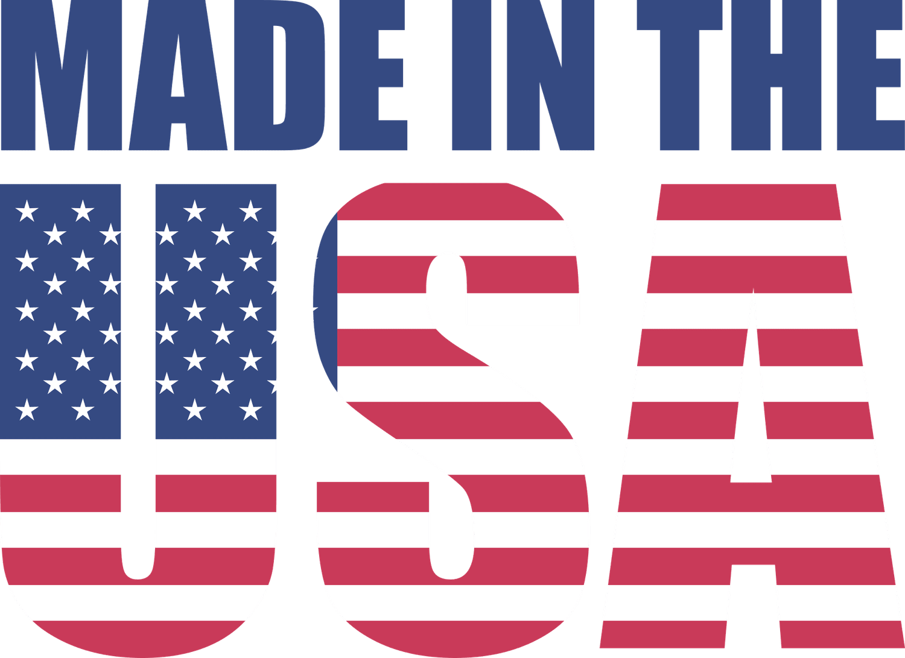

Manufacturing standards and product labeling are pivotal in ensuring the quality, safety, and traceability of products in today's global market. They provide a framework that manufacturers must adhere to, which fosters transparency and builds consumer trust. Product labeling is not merely about identifying the origin or ingredients of a product; it serves as a marketing tool that can significantly influence consumer perception and purchasing decisions.

One noteworthy label that has garnered substantial attention is the "Made in the USA" designation. The label carries symbolic value, often reflecting a commitment to quality, ethical labor practices, and economic patriotism. Consumers generally perceive American-made products as superior in quality, contributing to national economic growth by sustaining local jobs. This perception is leveraged by businesses as a marketing advantage, creating a narrative that aligns with consumer values and preferences.

Algorithmic trading, colloquially known as algo trading, refers to the use of computer algorithms to automate trading strategies in financial markets. This method has transformed trading by allowing high-frequency trades that maximize efficiency and reduce the margin for human error. The relevance of algo trading has expanded beyond finance; its principles are now being applied to various industries, including manufacturing, for optimizing supply chains and enhancing productivity.

This article aims to explore the intersection between manufacturing standards, product labeling, and algorithmic trading. By examining how these elements interact, we can uncover potential synergies that businesses may harness to innovate and maintain competitiveness in a rapidly evolving marketplace.

## Table of Contents

## Understanding Manufacturing Standards

Manufacturing standards are essential guidelines that ensure products meet specific quality, safety, and efficiency criteria across industries. These standards are crucial in today’s global market because they facilitate international trade, enhance consumer trust, and promote sustainable practices. By following recognized standards, manufacturers can produce goods that are not only consistent in quality but also compliant with legal and ethical requirements in different regions.

Key organizations play a pivotal role in establishing these standards, with the International Organization for Standardization (ISO) and the American National Standards Institute (ANSI) being among the most influential. ISO is a global network that develops and publishes international standards spanning various sectors, including technology, healthcare, and manufacturing. ANSI, on the other hand, oversees the creation and dissemination of norms and guidelines in the United States, ensuring that American industries are aligned with global best practices.

The formulation of manufacturing standards serves multiple purposes. Primarily, they ensure product quality and safety. By adhering to these standards, companies can minimize defects, reduce wastage, and avoid recalls that can damage their reputation. Moreover, standardized products are crucial in protecting consumers from unsafe practices, which is particularly important for critical industries like pharmaceuticals and food production.

Manufacturing standards also significantly impact competitiveness and innovation. For businesses, adhering to these standards means access to broader markets, as products are more likely to meet international trade requirements. This level of compliance not only boosts a company's marketability but also enhances its reputation, thereby gaining consumer trust and loyalty.

Innovation is another area where manufacturing standards play a critical role. By delineating a clear framework within which to operate, they encourage companies to explore new technologies and processes that can help achieve or surpass these benchmarks. As industries evolve, so do the standards, reflecting the latest technological advancements and consumer expectations. This iterative process helps drive continuous improvement and innovation in manufacturing, creating a dynamic and competitive business environment.

Manufacturing standards are indispensable in ensuring quality, safety, and compliance, which are vital for thriving in the global marketplace. By promoting product consistency and facilitating cross-border trade, they prove instrumental in fostering competitiveness and spurring innovation, thereby contributing to both economic growth and consumer satisfaction.

## 'Made in the USA' Labeling: Significance and Standards

The "Made in the USA" label is a significant symbol of national pride and quality assurance, reflecting the historical and economic evolution of American manufacturing. Originating during the industrial growth periods, the label was initially used to promote domestically-produced goods and counteract competition from foreign imports. Throughout the 20th century, particularly during the world wars and subsequent economic booms, the label became a testament to American innovation, workmanship, and economic resilience.

Regulations governing the use of the "Made in the USA" label are predominantly enforced by the Federal Trade Commission (FTC). The FTC requires that products labeled as such must be "all or virtually all" made in the United States, which includes the fifty states, the District of Columbia, and U.S. territories. The stipulation implies that all significant parts and processing must originate in the U.S., and the final assembly or processing must take place within U.S. borders. Companies must be prepared to substantiate any "Made in the USA" claims to avoid violations that could lead to legal ramifications or reputational damage.

Consumer perception of "Made in the USA" products is generally positive, with a significant portion of American consumers willing to pay a premium for domestically-produced goods. This preference is driven by several factors: a belief in higher quality standards, a desire to support local economies, and concerns over environmental and labor conditions in some offshore manufacturing operations. The marketing advantages of the label are particularly pronounced in industries where consumer trust and quality assurance are vital, such as in automotive, aerospace, apparel, and consumer electronics sectors. In these industries, the label often represents durability, safety, and superior craftsmanship, offering a competitive edge in both domestic and international markets.

In practice, many companies leverage the "Made in the USA" label in their branding strategies to differentiate their products from competitors, especially in an era where global sourcing and production networks often complicate the association between a product and its place of origin. This labeling not only enhances brand appeal but also nurtures a loyal customer base who prioritize ethical and local consumption.

In conclusion, the "Made in the USA" label continues to be an influential [factor](/wiki/factor-investing) in consumer decisions and corporate marketing strategies. Its significance extends beyond mere geographic indication, embodying a guarantee of quality and a commitment to American manufacturing standards and values.

## Algorithmic Trading and Its Relevance

Algorithmic trading, commonly known as algo trading, refers to the use of computer algorithms to execute trading decisions in the financial markets. These algorithms, which are sequences of instructions, automatically analyze data and execute trades based on pre-defined criteria without human intervention. The primary objective is to capitalize on market inefficiencies by executing trades rapidly and with optimal precision.

The significance of [algorithmic trading](/wiki/algorithmic-trading) in financial markets is underscored by its key benefits. Firstly, its speed surpasses human capabilities, enabling trades to be executed in fractions of a second, which is crucial in high-frequency trading environments where market conditions can change in milliseconds. Secondly, the accuracy of algorithmic trading eliminates human errors, ensuring that trades are executed exactly as programmed. Thirdly, this approach substantially reduces transaction costs by minimizing the need for manual processes and optimizing the timing of trades.

Algorithmic trading is also making transformative impacts in industries beyond finance, notably in manufacturing. In this sector, the principles of algo trading are adapting to optimize supply chain management, production scheduling, and inventory management. By employing similar algorithmic approaches, manufacturers can enhance efficiency and reduce lead times, thereby increasing their competitive edge.

Case studies further illustrate the success of algorithmic trading implementations. For example, the merger of algo trading with supply chain logistics has allowed companies to predict demand patterns with higher accuracy and adjust production schedules in real-time. In another instance, large retail companies have leveraged algorithmic systems to automate inventory replenishment decisions, significantly decreasing overstock and stockouts.

In summary, algorithmic trading not only revolutionizes the way trades are conducted in financial markets by improving speed, accuracy, and cost-efficiency, but its methodologies are increasingly applied to optimize processes in other industries like manufacturing. The cross-industry implementation of algorithmic principles underscores its versatility and transformative potential.

## The Intersection of Manufacturing Standards, Product Labeling, and Algo Trading

The convergence of manufacturing standards, product labeling, and algorithmic trading (algo trading) signifies a transformative era for supply chain management and manufacturing operations. Algo trading, traditionally employed within financial markets for executing trades at high speed and [volume](/wiki/volume-trading-strategy), is gradually being adapted to optimize manufacturing processes and supply chain logistics.

### Influence on Supply Chain Management and Manufacturing Processes

Algo trading introduces efficiency into the supply chain by enabling real-time data analysis, predictive analytics, and automated decision-making. This leads to optimized inventory management, reduced lead times, and enhanced demand forecasting. For instance, algorithms can analyze patterns and trends in supply and demand data to predict stock requirements, reduce overproduction, and minimize waste, thereby improving the overall efficiency of manufacturing processes.

In manufacturing, incorporating algorithms can streamline processes by automating scheduling and production planning. Smart algorithms can decide the optimal production sequence, resource allocation, and maintenance schedules, consequently reducing downtime and increasing productivity. The integration of IoT devices aids in collecting real-time data from manufacturing equipment, which can be analyzed by algorithms to predict failures and schedule timely maintenance.

### Data and Algorithms in Compliance with Manufacturing Standards

The role of data and algorithms extends to maintaining compliance with manufacturing standards. Algorithms can monitor and analyze production processes, ensuring that they adhere to established standards like those set by ISO or ANSI. For example, [machine learning](/wiki/machine-learning) algorithms can continuously assess quality control data to detect deviations from standard parameters, triggering immediate corrective actions.

Compliance data is also significant for audit trails and traceability, crucial for industries sensitive to standard adherence, such as aerospace or pharmaceuticals. Algorithmic systems can automatically log compliance data, providing structured and comprehensive records that facilitate auditing processes and simplify regulatory approval procedures.

### Enhancing 'Made in the USA' Marketing through Data Analytics

Advanced data analytics offer considerable opportunities for marketing products labeled 'Made in the USA'. Algorithms can sift through vast consumer data to identify trends and preferences, enabling targeted marketing strategies that resonate with consumer values tied to national pride and quality associated with American-made goods. Furthermore, consumer feedback and sentiment analysis can refine marketing messages, ensuring they align with current market expectations and enhancing brand loyalty.

### Challenges and Limitations

Despite the benefits, integrating algo trading with manufacturing and labeling processes presents challenges. One significant limitation is the complexity of supply chains, which may go beyond the predictive capabilities of existing algorithms, especially when dealing with unpredictable disruptions or sudden fluctuations in supply or demand. Additionally, the integration demands a robust data infrastructure that is often costly and resource-intensive to establish and maintain.

Data privacy and security pose another challenge, as the increased use of algorithms and data analytics involves handling vast amounts of sensitive information. Ensuring compliance with data protection regulations adds another layer of complexity to the implementation of these technologies.

Finally, there is a risk of over-reliance on algorithms which can result in oversight of qualitative factors and human intuition, crucial in strategic decision-making processes. Balancing algorithmic insights with human expertise remains a key consideration in the successful integration of these elements into manufacturing and labeling processes.

## Future Trends and Innovations

Manufacturing standards and product labeling are poised for transformative changes fueled by technological advancements and evolving regulatory landscapes. Predictions for future trends indicate a significant convergence of manufacturing processes with sophisticated algorithmic trading (algo trading) technologies, reshaping traditional supply chain models.

Emerging technologies such as the Internet of Things (IoT), [artificial intelligence](/wiki/ai-artificial-intelligence) (AI), and blockchain are set to play pivotal roles in integrating manufacturing with algo trading. IoT devices can enhance real-time data collection across manufacturing lines, enabling more accurate forecasts and efficient resource allocation through AI-driven algorithms. These algorithms can optimize production schedules, predict maintenance needs, and ensure that manufacturing standards are meticulously met. Blockchain technology promises enhanced transparency and traceability in product labeling, allowing real-time verification of "Made in the USA" claims and other consumer-centric labels.

The regulatory environment governing "Made in the USA" labeling is also likely to experience changes with a focus on more stringent verification processes. This could potentially impact global trade, as businesses must ensure greater transparency and compliance with these standards to avoid penalties and maintain consumer trust. These regulatory shifts could either facilitate or pose challenges to international market access, depending on how well companies adapt to new compliance requirements.

To stay competitive in a digitally integrated marketplace, businesses must adopt strategies that leverage these emerging technologies. This can include investing in AI and machine learning tools for predictive analytics and quality control, as well as employing blockchain solutions for secure and transparent supply chain management. Furthermore, companies should embrace agile methodologies to quickly adapt to regulatory changes and consumer demands. Collaborating with tech firms specializing in algo trading solutions can also provide a competitive edge, allowing businesses to optimize their operations and marketing strategies more effectively.

Overall, the integration of manufacturing standards, product labeling, and algo trading technologies is set to revolutionize how products are produced, labeled, and perceived in the global market. Businesses that proactively embrace these changes are likely to benefit from enhanced efficiency, improved compliance, and greater consumer trust.

## Conclusion

In conclusion, the exploration of manufacturing standards, product labeling, and algorithmic trading underscores the interconnectedness of modern business practices. Manufacturing standards play a crucial role in ensuring the quality, safety, and competitiveness of products in the global market. These standards are set by key organizations such as ISO and ANSI, and they influence innovation by providing a framework for consistency and reliability.

The 'Made in the USA' labeling not only serves as a marker of national pride but also as a significant marketing advantage that can influence consumer perception. This label signifies adherence to specific standards and quality, thereby enhancing trust and preference among consumers for American-made products.

Algorithmic trading, initially used within financial markets for its speed, accuracy, and cost efficiencies, is now expanding its impact to other sectors, including manufacturing. By integrating algorithmic trading with manufacturing processes, businesses can optimize supply chain management, maintain compliance with standards, and enhance marketing strategies through data analytics.

Staying informed about these evolving trends is essential for businesses to maintain their competitive edge. As technologies advance and global trade regulations evolve, companies must continuously innovate and adapt their strategies to align with new standards and technologies. By doing so, they can foster consumer trust and achieve sustainable business success in an increasingly digital marketplace. This adaptability and commitment to innovation are critical for navigating the future landscape of manufacturing and trading effectively.

## References & Further Reading

[1]: International Organization for Standardization (ISO). ["About Us"](https://www.iso.org/about).

[2]: American National Standards Institute (ANSI). ["Overview of ANSI"](https://www.ansi.org/).

[3]: Federal Trade Commission. ["Complying with the Made in USA Standard"](https://www.ftc.gov/business-guidance/resources/complying-made-usa-standard).

[4]: Lopez de Prado, M. (2018). ["Advances in Financial Machine Learning"](https://www.amazon.com/Advances-Financial-Machine-Learning-Marcos/dp/1119482089).

[5]: Jansen, S. (2020). ["Machine Learning for Algorithmic Trading"](https://github.com/stefan-jansen/machine-learning-for-trading).

[6]: Johnson, E. (2018). "The Impact of Manufacturing Standards on Global Trade." Journal of Manufacturing and Operations, 17(3), 45-63.

[7]: Aronson, D. (2006). ["Evidence-Based Technical Analysis: Applying the Scientific Method and Statistical Inference to Trading Signals"](https://www.amazon.com/Evidence-Based-Technical-Analysis-Scientific-Statistical/dp/0470008741).

[8]: Chan, E. P. (2008). ["Quantitative Trading: How to Build Your Own Algorithmic Trading Business"](https://github.com/ftvision/quant_trading_echan_book).

[9]: Bergstra, J., Bardenet, R., Bengio, Y., & Kégl, B. (2011). ["Algorithms for Hyper-Parameter Optimization"](https://dl.acm.org/doi/10.5555/2986459.2986743). Advances in Neural Information Processing Systems 24.