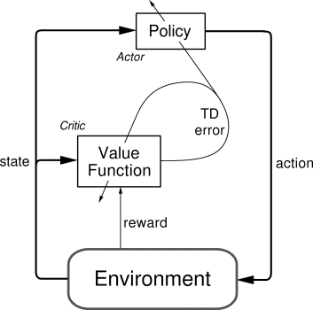

## Table of Contents

## What is a critic in machine learning?

In machine learning, a critic is a component of certain algorithms, particularly in reinforcement learning and generative adversarial networks (GANs). Its main job is to evaluate or "critique" the performance or output of another part of the system, like an actor in reinforcement learning or a generator in GANs. For example, in a GAN, the critic assesses how realistic the images produced by the generator are, helping the generator improve its outputs over time.

Think of the critic as a teacher or coach. In reinforcement learning, the critic helps the actor by estimating how good or bad the actions it takes are. It does this by looking at the rewards the actor gets and trying to predict future rewards. This helps the actor learn which actions to take to get the best results. In GANs, the critic helps the generator by telling it how close its fake images are to real ones, pushing the generator to create better and more realistic images.

## How does a critic function within reinforcement learning?

In reinforcement learning, the critic is like a coach that helps the actor, which is the part of the system that makes decisions. The critic's job is to look at what the actor does and guess how good or bad those actions are. It does this by looking at the rewards the actor gets from the environment. The critic uses these rewards to predict how much reward the actor might get in the future if it keeps doing what it's doing. This helps the actor learn which actions will lead to the best outcomes.

For example, imagine the actor is trying to learn how to play a game. The critic watches the actor's moves and the points it gets. If the actor does something that leads to a lot of points, the critic will tell it that this is a good move. If the actor does something that leads to fewer points, the critic will say it's a bad move. Over time, the actor uses the critic's feedback to get better at the game. This process of the critic evaluating and guiding the actor helps the whole system learn and improve.

## What is the role of a critic in actor-critic methods?

In actor-critic methods, the critic helps the actor by giving it feedback on how good its actions are. The actor is like a player that makes decisions, and the critic is like a coach that tells the player if those decisions are good or bad. The critic does this by looking at the rewards the actor gets from the environment. It uses these rewards to guess how much reward the actor might get in the future if it keeps doing what it's doing. This helps the actor learn which actions will lead to the best results.

For example, think of the actor as trying to learn how to play a game. The critic watches the actor's moves and the points it gets. If the actor does something that leads to a lot of points, the critic will tell it that this is a good move. If the actor does something that leads to fewer points, the critic will say it's a bad move. Over time, the actor uses the critic's feedback to get better at the game. This process of the critic evaluating and guiding the actor helps the whole system learn and improve.

## Can you explain the difference between a critic and an actor in reinforcement learning?

In [reinforcement learning](/wiki/reinforcement-learning), the actor and the critic have different jobs but work together to help the system learn. The actor is like a player in a game. It makes decisions and takes actions in the environment. Its goal is to figure out the best actions to take to get the most rewards. For example, if the actor is learning to play a video game, it decides which buttons to press to move the character and complete the game.

The critic, on the other hand, is like a coach that watches the actor and gives feedback. It looks at the rewards the actor gets from the environment and uses them to guess how good or bad the actor's actions are. The critic helps the actor by telling it if its actions are leading to good or bad outcomes. Over time, the actor uses the critic's feedback to improve its decisions and get better at the task. This teamwork between the actor and the critic helps the whole system learn and perform better.

## How is the critic's performance evaluated in machine learning models?

The performance of a critic in [machine learning](/wiki/machine-learning) models is evaluated by how well it helps the overall system improve. For example, in reinforcement learning, the critic's job is to estimate the value of the actions taken by the actor. If the critic's estimates are accurate, the actor can learn faster and perform better. So, one way to evaluate the critic's performance is to look at how well the actor is doing. If the actor is getting more rewards over time, it suggests that the critic is doing a good job of guiding it.

Another way to evaluate the critic's performance is by looking at the difference between its predictions and the actual rewards received. This is often measured using a metric called the temporal difference (TD) error. If the TD error is small, it means the critic's predictions are close to the actual rewards, which is a sign of good performance. For instance, if the critic predicts that a certain action will lead to a reward of 10, but the actual reward is 9, the TD error is small, indicating that the critic's estimate was pretty accurate. By keeping the TD error low, the critic helps the system learn more effectively.

## What are the common algorithms used to train a critic?

Common algorithms used to train a critic in reinforcement learning include Temporal Difference (TD) Learning and its variations, such as TD(0) and TD(lambda). In TD Learning, the critic learns to predict future rewards by comparing its current estimate with the actual reward received after taking an action. For example, if the critic predicts a reward of 10 but the actual reward is 9, it updates its estimate to be closer to 9. This process helps the critic improve its predictions over time. The TD error, which is the difference between the predicted and actual rewards, guides the critic's learning. A smaller TD error means the critic's predictions are getting more accurate.

Another popular method is Q-Learning, which can be used to train a critic in actor-critic methods. In Q-Learning, the critic learns to estimate the value of taking a particular action in a given state. It updates its estimate based on the immediate reward and the estimated future rewards from the next state. The critic's goal is to find the best action for each state that leads to the highest total reward. This helps the actor make better decisions. Both TD Learning and Q-Learning help the critic provide valuable feedback to the actor, improving the overall performance of the reinforcement learning system.

## How does a critic contribute to the learning process in deep reinforcement learning?

In deep reinforcement learning, the critic helps the actor learn by giving it feedback on how good its actions are. The critic looks at the rewards the actor gets from the environment and uses them to guess how much reward the actor might get in the future if it keeps doing what it's doing. This helps the actor learn which actions will lead to the best outcomes. For example, if the actor is playing a game, the critic watches its moves and the points it gets. If the actor does something that leads to a lot of points, the critic tells it that this is a good move. If the actor does something that leads to fewer points, the critic says it's a bad move. Over time, the actor uses the critic's feedback to get better at the game.

The critic's learning process often involves using algorithms like Temporal Difference (TD) Learning. In TD Learning, the critic learns to predict future rewards by comparing its current estimate with the actual reward received after taking an action. If the critic predicts a reward of 10 but the actual reward is 9, it updates its estimate to be closer to 9. This process helps the critic improve its predictions over time. The TD error, which is the difference between the predicted and actual rewards, guides the critic's learning. A smaller TD error means the critic's predictions are getting more accurate, helping the actor make better decisions and improve the overall performance of the reinforcement learning system.

## What are the challenges faced when implementing a critic in complex environments?

Implementing a critic in complex environments can be tough because the critic has to handle a lot of information and make good guesses about future rewards. In a simple game, the critic might only need to look at a few things to give feedback to the actor. But in a complex environment, like a real-world robot moving around, there are many more things to consider. The critic has to learn to pay attention to the right things and ignore the noise. This can be hard because the critic might make mistakes if it doesn't have enough data or if the data is too messy.

Another challenge is that the critic needs to learn quickly and accurately. In a complex environment, the rewards might be delayed or spread out over time, making it harder for the critic to figure out which actions lead to good outcomes. For example, if a robot is learning to navigate a busy city, it might take a long time to see if its actions lead to reaching the goal. The critic has to use algorithms like Temporal Difference Learning to update its predictions, but if the environment changes a lot, the critic might struggle to keep up. This can slow down the learning process and make it harder for the actor to improve its performance.

## Can you describe a practical example where a critic has been effectively used in machine learning?

A practical example where a critic has been effectively used in machine learning is in training a robot to navigate a maze. Imagine a robot that needs to find its way from the start to the end of a complex maze. The actor in this setup is the robot, which makes decisions about which direction to move at each junction. The critic watches the robot's moves and the rewards it gets, like reaching the end quickly or avoiding dead ends. The critic uses this information to guess how good each move is and tells the robot if it's on the right track. Over time, the robot learns from the critic's feedback and gets better at finding the shortest path through the maze.

In this example, the critic's job is to help the robot understand which moves lead to success. For instance, if the robot turns left at a junction and eventually reaches the end of the maze, the critic will tell it that turning left was a good move. If the robot turns right and ends up in a dead end, the critic will say that turning right was a bad move. By using algorithms like Temporal Difference Learning, the critic updates its guesses about the value of each move based on the rewards the robot gets. This helps the robot learn faster and more effectively, eventually mastering the maze with the critic's guidance.

## How do you optimize the critic's architecture for better performance?

To optimize the critic's architecture for better performance, you need to think about how the critic learns and predicts rewards. One way to do this is by using a [neural network](/wiki/neural-network) with the right number of layers and neurons. If the network is too simple, it might not be able to learn the complex patterns in the environment. But if it's too complex, it might take too long to train and could overfit to the data. You can try different sizes and shapes of the network to see what works best. For example, you might start with a small network and slowly add more layers or neurons until the critic's predictions get more accurate.

Another important thing is to choose the right loss function and optimizer for training the critic. The loss function tells the critic how far off its predictions are from the actual rewards, and the optimizer helps the critic adjust its weights to get better. A common loss function for the critic is the Mean Squared Error (MSE), which measures the average of the squared differences between the predicted and actual values. You can use optimizers like Adam or RMSprop, which help the critic learn quickly and smoothly. By tweaking these parts of the critic's architecture, you can help it give better feedback to the actor, leading to faster and more effective learning in the whole system.

## What advanced techniques can be used to improve the stability and efficiency of a critic?

One advanced technique to improve the stability and efficiency of a critic is to use experience replay. Experience replay involves storing the critic's experiences in a memory buffer and then randomly sampling from this buffer during training. This helps the critic learn from a diverse set of experiences, reducing the chance that it will forget old lessons or get stuck on recent ones. By mixing old and new experiences, the critic can learn more smoothly and effectively. For example, if the critic is learning to predict rewards in a game, it can use experience replay to remember both early and late game situations, helping it make better predictions overall.

Another technique is to use target networks. A target network is a copy of the critic's network that updates more slowly than the main network. The critic uses the target network to predict future rewards, which helps stabilize its learning. Without a target network, the critic's predictions can change too quickly, causing the actor to get confused. By using a target network, the critic can provide more consistent feedback to the actor, leading to more stable and efficient learning. For instance, if the critic is helping a robot navigate, the target network can help it give steady advice, even as the robot explores new paths.

## How does the critic's design impact the overall system's ability to handle multi-agent scenarios?

In multi-agent scenarios, the critic's design plays a crucial role in helping the overall system learn and perform well. When multiple actors are working together or against each other, the critic needs to understand not just one actor's actions but also how those actions affect other [agents](/wiki/agents). This means the critic must be able to handle more complex information and make predictions based on the interactions between agents. For example, if two robots are working together to move a heavy object, the critic needs to consider how each robot's actions influence the other's success. A well-designed critic can provide valuable feedback that helps all agents improve their strategies and work more effectively as a team.

One way to design a critic for multi-agent scenarios is to use a centralized critic that can see the actions and rewards of all agents. This type of critic can learn to predict the overall outcome of the system and guide each agent towards better performance. For instance, in a game where multiple players are competing, a centralized critic can help each player understand how their actions affect the game's outcome. Another approach is to use decentralized critics, where each agent has its own critic. This can be useful in large-scale environments where a single critic might struggle to handle all the information. By carefully choosing the right critic design, you can help the system handle the complexities of multi-agent interactions and improve its learning and performance.