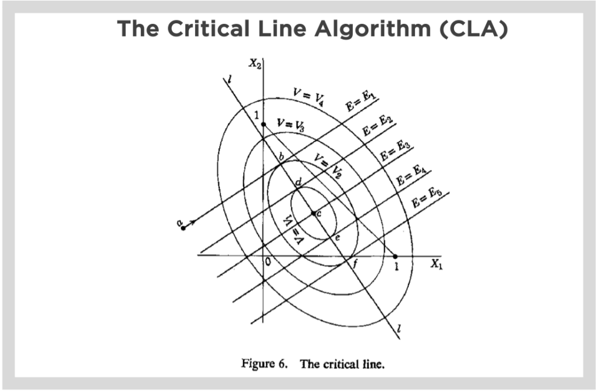

## Table of Contents

## What is the Critical Line Algorithm (CLA)?

The Critical Line Algorithm (CLA) is a method used in finance to find the best mix of investments, known as a portfolio, that gives the highest return for a given level of risk. It was created by Harry Markowitz as part of his Modern Portfolio Theory. The algorithm works by figuring out how to balance different investments so that the overall risk is minimized while still aiming for the highest possible return. It does this by looking at how each investment's risk and return affects the whole portfolio.

CLA works by moving along what's called the "efficient frontier," which is a line showing the best possible portfolios. The algorithm starts with an initial guess and then adjusts the mix of investments step by step. At each step, it checks if moving to a new mix will make the portfolio better. It keeps doing this until it can't find any more improvements. This way, it helps investors find the best portfolio that matches their risk and return goals.

## Who developed the Critical Line Algorithm and when?

The Critical Line Algorithm was developed by Harry Markowitz. He is a famous economist who came up with the idea in the 1950s. Markowitz wanted to help people make better investment choices by figuring out the best way to mix different investments.

He created the Critical Line Algorithm as a part of his bigger idea called Modern Portfolio Theory. This theory is all about balancing risk and reward in investments. The algorithm helps find the best mix of investments that gives the highest return for the least amount of risk. It's like a step-by-step guide that keeps adjusting until it finds the perfect balance.

## What are the main applications of the Critical Line Algorithm?

The Critical Line Algorithm is mainly used in finance to help people figure out the best way to mix different investments into a portfolio. It's like a tool that helps investors find the perfect balance between risk and reward. By using this algorithm, investors can see which mix of stocks, bonds, or other investments will give them the highest return for the amount of risk they're willing to take. This is super helpful for anyone who wants to make smart investment choices without taking on too much risk.

Another big use of the Critical Line Algorithm is in creating what's called the "efficient frontier." This is a line that shows all the best possible portfolios you can make. The algorithm helps move along this line, checking different mixes of investments to find the one that's just right. It's like trying on different outfits until you find the one that fits perfectly. This helps financial advisors and investors see all their options clearly and pick the portfolio that matches their goals.

Overall, the Critical Line Algorithm is a key part of something called Modern Portfolio Theory. This theory, created by Harry Markowitz, is all about making smart investment decisions. The algorithm helps people apply this theory in real life, making it easier to build a portfolio that's both safe and profitable. It's used by big investment firms, financial advisors, and even individual investors who want to do their own research and planning.

## How does the Critical Line Algorithm work in portfolio optimization?

The Critical Line Algorithm works in portfolio optimization by figuring out the best way to mix different investments to get the highest return for a given level of risk. It starts with an initial guess for the mix of investments and then keeps adjusting this mix step by step. At each step, the algorithm checks if moving to a new mix will make the portfolio better. It does this by looking at how each investment's risk and return affects the whole portfolio. The goal is to find the perfect balance where you can't make the portfolio any better without taking on more risk.

As the algorithm works, it moves along something called the "efficient frontier," which is a line showing all the best possible portfolios. The algorithm keeps trying different mixes until it can't find any more improvements. It's like trying on different outfits until you find the one that fits perfectly. This helps investors see all their options clearly and pick the portfolio that matches their goals. By using the Critical Line Algorithm, investors can make smart choices about which stocks, bonds, or other investments to include in their portfolio, aiming for the highest return while keeping risk under control.

## What are the key steps involved in implementing the CLA?

The Critical Line Algorithm, or CLA, starts with an initial guess about how to mix different investments into a portfolio. This guess is usually based on the expected returns and risks of each investment. The algorithm then begins to adjust this mix step by step. At each step, it looks at how changing the mix affects the overall risk and return of the portfolio. The goal is to find a better mix that gives a higher return for the same level of risk or the same return with less risk.

As the algorithm keeps adjusting the mix, it moves along a line called the "efficient frontier." This line shows all the best possible portfolios you can make. The algorithm keeps checking different mixes until it can't find any more improvements. It's like trying different combinations until you find the one that works best. This way, the CLA helps investors find the perfect balance between risk and reward, making it easier to choose the right investments for their portfolio.

By using the CLA, investors can see all their options clearly and pick the portfolio that matches their goals. The algorithm does all the hard work of figuring out the best mix of investments, so investors can focus on their overall investment strategy. It's a powerful tool that helps make smart investment decisions by showing the best ways to balance risk and return.

## What are the advantages of using the Critical Line Algorithm over other methods?

The Critical Line Algorithm (CLA) has some big advantages when it comes to figuring out the best mix of investments. One of the main advantages is that it's really good at finding the best portfolio for you. It does this by looking at all the different ways you can mix your investments and picking the one that gives you the highest return for the least amount of risk. This means you get to see the best possible options without having to guess or try a lot of different mixes yourself. It's like having a smart friend who knows exactly what to do to make your investments work better.

Another advantage of the CLA is that it's very efficient. It doesn't take a lot of time or computer power to find the best portfolio. The algorithm moves along the "efficient frontier," which is a line showing all the best portfolios, and it keeps adjusting until it finds the perfect mix. This makes it easier and faster for investors to make smart choices about their money. Whether you're a big investment firm or just someone trying to save for the future, the CLA can help you find the best way to balance risk and reward in your investments.

## Can you explain the concept of the efficient frontier in relation to CLA?

The efficient frontier is like a map that shows all the best possible ways to mix your investments into a portfolio. It's a line on a graph where each point represents a different mix of investments. The goal is to find the mix that gives you the highest return for the least amount of risk. The Critical Line Algorithm, or CLA, helps you move along this line, checking different mixes until it finds the perfect one. It's like trying on different outfits until you find the one that fits perfectly.

The CLA works by starting with a guess about how to mix your investments and then keeps adjusting this mix step by step. As it moves along the efficient frontier, it looks at how each change affects the overall risk and return of your portfolio. The algorithm keeps going until it can't find any more improvements. This way, it helps you see all your options clearly and pick the portfolio that matches your goals. By using the CLA, you can make smart choices about which investments to include, aiming for the highest return while keeping risk under control.

## How does CLA handle constraints in portfolio optimization?

The Critical Line Algorithm, or CLA, is really good at dealing with rules or limits when figuring out the best way to mix investments. These rules, called constraints, can be things like not putting too much money into one stock or making sure the total risk stays below a certain level. The CLA can handle these rules by changing the way it looks at different mixes of investments. It keeps adjusting the mix to find the best one that still follows all the rules. This helps investors make smart choices while staying within their limits.

As the CLA moves along the efficient frontier, it checks if each new mix of investments follows the rules. If a mix doesn't follow the rules, the algorithm tries a different mix. It keeps doing this until it finds a mix that gives the highest return for the least risk, all while following the rules. This way, the CLA helps investors find the perfect balance between risk and reward, even when there are lots of rules to follow.

## What are some common challenges or limitations when using the Critical Line Algorithm?

One common challenge when using the Critical Line Algorithm is that it can be sensitive to the data you put in. If the numbers you use for things like expected returns or risks are not accurate, the algorithm might not find the best mix of investments. This means you need to be careful and use good, reliable data. Another limitation is that the CLA can be hard to use when you have a lot of different investments. As the number of investments grows, it can take more time and computer power to find the best mix, which might not be practical for everyone.

Another challenge is that the CLA assumes that the future will be like the past. It uses past data to guess how investments will do in the future, but things can change. This means the best mix of investments today might not be the best tomorrow. Also, the CLA can struggle with certain types of rules or limits, like not being able to short sell some investments. If the rules are too complicated, the algorithm might have a hard time finding the best mix that follows all the rules.

## How can the performance of the CLA be improved or optimized?

One way to make the Critical Line Algorithm work better is by using better data. The CLA needs good numbers to find the best mix of investments. If you use more accurate data for things like expected returns and risks, the algorithm will give you better results. You can also use something called "robust optimization," which helps the CLA handle changes in the data better. This means the algorithm can still find a good mix of investments even if the future is different from the past.

Another way to improve the CLA is by making it faster. When you have a lot of different investments, the algorithm can take a long time to find the best mix. You can use special computer tricks, like parallel processing, to make it work faster. This means the computer can do many things at once, which can help the CLA find the best mix more quickly. Also, you can use simpler rules or limits to make the algorithm easier to use. If the rules are too complicated, the CLA might have a hard time finding the best mix, so keeping things simple can help.

## What are some advanced techniques or variations of the Critical Line Algorithm?

One advanced technique for the Critical Line Algorithm is called "Robust Optimization." This method makes the CLA better at handling changes in data. It does this by looking at different possible futures and finding a mix of investments that works well no matter what happens. This is helpful because the future can be hard to predict, and robust optimization helps make the CLA more reliable. It's like having a plan that works even if things don't go exactly as expected.

Another variation is using "Multi-Objective Optimization." This means the CLA can look at more than just risk and return. It can also consider other things that are important to investors, like how much the investments cost or how easy they are to buy and sell. By looking at all these things at once, the CLA can find a mix of investments that is better overall. It's like choosing a car that's not just fast but also safe and affordable.

Lastly, there's something called "Stochastic Programming." This technique lets the CLA handle uncertainty even better. It does this by running many different scenarios to see how the portfolio might do in the future. This helps the CLA find a mix of investments that is likely to do well no matter what happens. It's like preparing for different weather conditions by packing a variety of clothes for a trip.

## How does the CLA integrate with modern computational tools and software?

The Critical Line Algorithm works well with modern computers and software. It can be used in special programs that help with investing, like MATLAB or Python. These programs have tools that make it easy to put the CLA to work. They can handle big amounts of data quickly and run the algorithm many times to find the best mix of investments. This makes it easier for investors to use the CLA without needing to know a lot about math or computers.

Also, the CLA can be part of bigger software systems that help manage money. These systems can take in lots of different information, like stock prices and news, and use the CLA to make smart choices about where to invest. The software can run the CLA in the background, so investors can focus on their overall strategy. This way, the CLA helps make investing easier and more efficient, using the power of modern technology to find the best portfolios.

## What is the Understanding of the Critical Line Algorithm (CLA)?

The Critical Line Algorithm (CLA) is designed to address portfolio optimization challenges with a focus on inequality constraints. Distinct from conventional quadratic programming methods commonly used for optimization, CLA is tailored for scenarios where financial models impose such constraints, ensuring a more realistic representation of investment scenarios. The algorithm is celebrated for its ability to secure precise solutions efficiently, operating within a finite number of iterations, which is crucial for time-sensitive trading environments.

At the heart of CLA is the aim to derive optimal conditions where the balance between risk and return across various portfolios is achieved. This task is conceptualized through the efficient frontier, a key element in modern portfolio theory. The efficient frontier represents a set of portfolios that offer the maximum expected return for a given level of risk or alternatively, the lowest risk for a given level of expected return. Unlike some algorithms that yield only a single optimal point, CLA calculates the entire efficient frontier, providing a comprehensive visualization of potential asset distributions under different market conditions.

Mathematically, the efficient frontier can be established by solving optimization problems that consider expected returns $(\mu)$, covariance of asset returns $(\Sigma)$, and a risk aversion parameter $(\lambda)$. The optimization problem can be formulated as:

$$
\min_{\mathbf{w}} \frac{1}{2}\mathbf{w}^T \Sigma \mathbf{w} - \lambda \mathbf{w}^T \mu
$$

Subject to:

$$
\sum_{i=1}^{n} w_i = 1
$$

$$
w_i \geq 0
$$

where $\mathbf{w}$ is the vector of portfolio weights, $\Sigma$ is the covariance matrix, and $\mu$ is the vector of expected returns. The constraints ensure that the total portfolio weight sums to one and that negative asset holdings are not considered, aligning with standard investment restrictions.

The utility of CLA in providing a complete efficient frontier equips traders and portfolio managers with a robust tool for evaluating a spectrum of asset allocations, enhancing strategic decision-making. By efficiently handling complex constraints, CLA supports the dynamic and often restrictive scenarios encountered in real-world financial markets, making it an invaluable tool for practitioners seeking a holistic understanding of investment opportunities.

## References & Further Reading

[1]: Markowitz, H. M. (1952). ["Portfolio Selection."](https://www.jstor.org/stable/2975974) The Journal of Finance, 7(1), 77-91.

[2]: David Ruppert. (2004). ["Statistics and Finance: An Introduction."](https://link.springer.com/book/10.1007/978-1-4419-6876-0) Springer.

[3]: Fabozzi, F. J., & Markowitz, H. M. (2002). ["The Theory and Practice of Investment Management."](https://onlinelibrary.wiley.com/doi/book/10.1002/9781118267028) Wiley Finance.

[4]: Grinold, R. C., & Kahn, R. N. (2000). ["Active Portfolio Management: A Quantitative Approach for Producing Superior Returns and Controlling Risk."](https://www.amazon.com/Active-Portfolio-Management-Quantitative-Controlling/dp/0070248826) McGraw-Hill.

[5]: Michaud, R. O. (1998). ["Efficient Asset Management: A Practical Guide to Stock Portfolio Optimization and Asset Allocation."](https://academic.oup.com/book/52209) Harvard Business School Press.