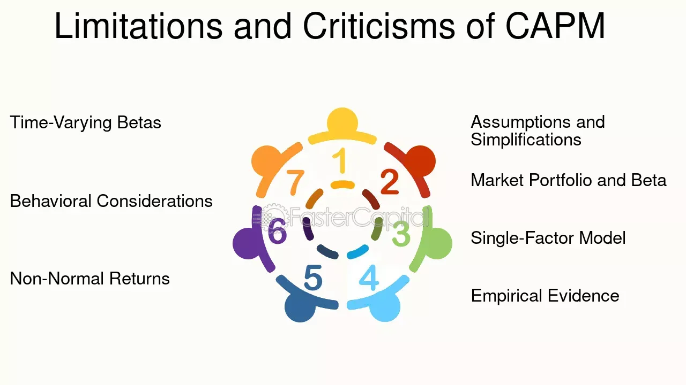

## Table of Contents

## What is the Capital Asset Pricing Model (CAPM)?

The Capital Asset Pricing Model, or CAPM, is a way to figure out how much return, or profit, you should expect from an investment. It helps investors see if an investment is worth the risk. The model uses a formula that looks at the risk-free rate, which is what you would get from a very safe investment like a government bond, and then adds a bit extra based on how risky the investment is. This extra bit is called the risk premium, and it depends on how the investment moves with the market.

In simple terms, CAPM says that the expected return on an investment should be the risk-free rate plus a risk premium. The risk premium is calculated by taking the difference between the market return and the risk-free rate, and then multiplying it by a number called beta. Beta shows how much the investment's price moves compared to the market. If an investment has a high beta, it means it's more sensitive to market changes, so it should give you a higher return to make up for the higher risk. CAPM helps investors make smarter choices by understanding the balance between risk and reward.

## What are the basic assumptions of the CAPM?

The Capital Asset Pricing Model (CAPM) relies on a few key assumptions to work. First, it assumes that investors are rational and will always try to get the most return for the least amount of risk. This means they'll choose investments carefully, looking at how risky they are and what kind of return they might get. CAPM also assumes that all investors have the same information about investments, so everyone is making decisions based on the same facts. This is called the assumption of homogeneous expectations.

Another big assumption is that investors can borrow and lend money at a risk-free rate. This means they can take out loans or put money into very safe investments like government bonds without worrying about losing money. CAPM also assumes that you can buy or sell any amount of an investment without affecting its price. This is called perfect capital markets, where there are no limits on trading and no extra costs like taxes or fees.

Lastly, CAPM assumes that all investors plan to hold their investments for the same amount of time, usually one period. This helps keep things simple by focusing on returns over a set time frame. These assumptions help make the model easier to use, but they also mean that CAPM might not always perfectly match the real world, where things can be more complicated.

## Why is the CAPM important in financial theory?

The Capital Asset Pricing Model, or CAPM, is really important in financial theory because it helps people figure out how much return they should expect from an investment based on how risky it is. It gives investors a way to compare different investments and see if the potential reward is worth the risk. By using CAPM, investors can make better choices about where to put their money. It's like a tool that helps them understand if they're getting a fair deal for the risks they're taking.

CAPM also helps in setting prices for assets. It tells us that the price of an investment should reflect its risk and expected return. If an investment seems too risky for the return it offers, its price might go down until it's more in line with what people expect. This model is used a lot by financial experts to value stocks and other investments, and it's taught in many finance classes. Even though it's based on some assumptions that don't always hold true in real life, CAPM is still a key part of financial theory because it gives us a clear way to think about risk and return.

## What are some common criticisms of the CAPM's assumptions?

One big criticism of CAPM is that it assumes all investors have the same information and think the same way about investments. In real life, this isn't true. People have different information and different ideas about what's a good investment. This means that the model might not work as well because it doesn't account for how people actually make decisions. Another problem is that CAPM assumes you can borrow and lend money at the same risk-free rate. But in the real world, borrowing money is usually more expensive than lending it, and this can make a big difference in how people invest.

Another criticism is that CAPM assumes you can buy or sell any amount of an investment without affecting its price. This is called perfect capital markets, but in reality, buying or selling a lot of something can change its price. Also, there are often extra costs like taxes and fees that the model doesn't consider. These things can make the model less accurate. Finally, CAPM assumes everyone plans to hold their investments for the same amount of time, but in real life, people have different time frames for their investments, which can affect how they see risk and return.

## How does the empirical evidence challenge the CAPM?

Empirical evidence has shown that the Capital Asset Pricing Model (CAPM) doesn't always work the way it's supposed to. A lot of studies have found that the model doesn't explain why some stocks give higher returns than others as well as it should. For example, some stocks that are supposed to be less risky according to CAPM actually give higher returns than expected. This doesn't fit with what the model says should happen, where riskier stocks should give higher returns.

Another big challenge to CAPM comes from what's called the "anomalies." These are patterns in stock returns that the model can't explain. For instance, small companies often give higher returns than big companies, even when they're supposed to be riskier according to CAPM. Also, stocks with high book-to-market ratios, which means their market value is low compared to their book value, tend to do better than the model predicts. These findings suggest that there are other things affecting stock returns that CAPM doesn't take into account.

## What are the implications of the CAPM's failure to explain stock returns?

The failure of the Capital Asset Pricing Model (CAPM) to explain stock returns means that investors and financial experts can't fully rely on it to make decisions. If CAPM worked perfectly, it would tell us exactly how much return to expect from an investment based on its risk. But since it doesn't, people have to look at other factors to understand why some stocks do better than others. This makes investing more complicated because there's no simple formula to follow. Investors might need to consider things like company size, how much a stock's price has gone up or down in the past, or even the overall mood of the market.

Because of these issues, financial experts have come up with other models to try to better explain stock returns. These new models take into account more details about stocks and the market. For example, some models look at how a company's size or its book-to-market ratio can affect its returns. Even though CAPM is still taught and used as a starting point, its limitations mean that investors need to use a mix of different tools and ideas to make the best investment choices. This means that understanding the stock market is more about using a lot of different information and less about following one simple rule.

## Can you explain the concept of beta and its limitations in the CAPM?

Beta is a number that tells you how much an investment's price moves compared to the overall market. In the Capital Asset Pricing Model, or CAPM, beta is important because it helps figure out how much extra return, or risk premium, you should expect from an investment. If an investment has a beta of 1, it moves the same way as the market. If it's more than 1, it's more sensitive to market changes, so it's riskier but should give you a higher return. If it's less than 1, it's less sensitive, so it's less risky and should give you a lower return.

Even though beta is useful, it has some limitations. One big problem is that beta is based on past data, so it might not be a good predictor of what will happen in the future. Just because a stock moved a certain way in the past doesn't mean it will keep doing that. Also, beta only looks at how an investment moves with the market, but there are other things that can affect a stock's price, like how big the company is or its financial health. These other factors can make beta less useful for understanding all the risks involved with an investment.

## How do alternative models like the Fama-French three-factor model critique the CAPM?

The Fama-French three-factor model says that the Capital Asset Pricing Model, or CAPM, doesn't tell the whole story about why stocks do well or not. The Fama-French model adds two more things to look at, besides just the market's ups and downs like CAPM does. These extra things are the size of the company and something called the book-to-market ratio. The size part means that smaller companies often give higher returns than bigger ones, even if they're riskier. The book-to-market part means that companies with a high book-to-market ratio, where their market value is low compared to what they're worth on paper, also tend to do better than CAPM predicts. By adding these factors, the Fama-French model tries to explain stock returns better than CAPM.

The Fama-French model shows that CAPM might be too simple because it only looks at how a stock moves with the market. In real life, there are lots of other things that can affect a stock's price. The Fama-French model points out that just knowing a stock's beta, which is how much it moves with the market, isn't enough. Investors need to think about other stuff too, like how big the company is and what its financial situation looks like. This makes the Fama-French model a more complete way to understand why some stocks do better than others, and it challenges the idea that CAPM can explain everything on its own.

## What role does market efficiency play in the criticism of the CAPM?

Market efficiency is a big reason why people criticize the Capital Asset Pricing Model, or CAPM. The idea of market efficiency is that all the information about a stock is already in its price. If markets are really efficient, then it's hard to beat the market by picking stocks that do better than what CAPM predicts. But some people say that markets aren't always that efficient. They think that there are ways to find stocks that will do better than CAPM says they should, which means the model might not be working right.

Because of this, some people think that CAPM doesn't explain everything about stock returns. If markets aren't fully efficient, then other things like how big a company is or its financial health can affect stock prices in ways that CAPM doesn't account for. This makes people look for other models, like the Fama-French three-factor model, that try to explain more about why stocks do well or not. So, the idea that markets might not be as efficient as we think is a big part of why people criticize CAPM and look for better ways to understand stock returns.

## How have behavioral finance theories impacted the critique of the CAPM?

Behavioral finance theories have added a new layer to the criticism of the Capital Asset Pricing Model, or CAPM. These theories say that people don't always make smart, logical choices about money. Instead, they can be affected by their feelings, like fear or excitement, and they might make mistakes because of these emotions. CAPM assumes that everyone is rational and looks at all the information in the same way. But behavioral finance shows that this isn't true, and people's emotions and mistakes can change how the market works. This means that CAPM might not explain everything about stock returns because it doesn't take into account how people really behave.

Because of these ideas from behavioral finance, people have started to see that CAPM might be too simple. If people are making decisions based on feelings and not just facts, then stock prices can move in ways that CAPM can't predict. For example, people might get too excited about a stock and push its price up higher than it should be, or they might get scared and sell a stock even if it's a good investment. These behaviors can make it hard to use CAPM to understand why some stocks do better than others. So, behavioral finance has made people think that we need to look at more than just risk and return to really understand the stock market.

## What are the practical implications of the criticisms for investors and portfolio managers?

The criticisms of the Capital Asset Pricing Model (CAPM) mean that investors and portfolio managers can't just rely on it to make all their investment choices. They need to think about other things too, like how big a company is or how people feel about the market. CAPM is supposed to help figure out if a stock is worth the risk, but because it doesn't always work, investors have to look at more than just the numbers. They might need to consider things like how a company is doing financially, or even what other people are saying about it. This makes investing more complicated, but it can also help investors make better choices if they use all the information they can get.

Portfolio managers, who handle big groups of investments, also have to be careful because of these criticisms. They can't just use CAPM to decide how to set up their portfolios. They need to use other models too, like the Fama-French three-factor model, which looks at more things than just how a stock moves with the market. They also need to think about how people's feelings and behaviors can affect stock prices. This means they might need to change their strategies more often and be ready to adjust their portfolios based on new information. By understanding that CAPM has limits, portfolio managers can make smarter decisions and maybe even find better investments.

## What ongoing research and developments are addressing the shortcomings of the CAPM?

Researchers are working on new models to fix the problems with the Capital Asset Pricing Model, or CAPM. One big model they use is the Fama-French three-factor model, which looks at more than just how a stock moves with the market. It also considers how big the company is and its book-to-market ratio. This helps explain why some stocks do better than others in ways that CAPM can't. Another model is the Carhart four-factor model, which adds a fourth factor called momentum. This means it looks at how a stock has been doing recently, which can also help predict future returns. These new models try to give a more complete picture of what affects stock prices.

Behavioral finance is another area where researchers are trying to improve on CAPM. This field looks at how people's feelings and mistakes can change the market. For example, people might get too excited about a stock and push its price up too high, or they might get scared and sell a good stock. By understanding these behaviors, researchers can make models that account for these human factors. This can help investors and portfolio managers make better choices by considering not just the numbers, but also how people act. So, ongoing research in both new models and behavioral finance is trying to make up for the shortcomings of CAPM and help people understand the stock market better.

## What is CAPM and what are its assumptions?

The Capital Asset Pricing Model (CAPM) is a fundamental model in finance, introduced in the early 1960s, that builds upon Harry Markowitz's modern portfolio theory. The primary aim of CAPM is to evaluate an asset's expected return by measuring its non-diversifiable risk, also known as systematic risk, through a metric called beta (β). Beta represents the asset's sensitivity to market movements and is crucial in gauging expected returns relative to a risk-free asset.

CAPM is articulated through the formula:

$$
E(R_i) = R_f + \beta_i (E(R_m) - R_f)
$$

where:
- $E(R_i)$ is the expected return on the investment,
- $R_f$ is the risk-free rate of return,
- $\beta_i$ is the beta of the investment,
- $E(R_m)$ is the expected return of the market.

This model operates under several key assumptions: first, it presupposes that investors are inherently risk-averse and make decisions based on risk and return over a single, uniform investment horizon. The model also assumes that investors can borrow and lend unlimited amounts at the risk-free rate, which simplifies the capital allocation process.

In addition, CAPM posits an idealized world absent of taxes, inflation, and transaction costs. These elements are considered to significantly affect investment decisions, yet they remain unaccounted for in the basic CAPM framework. The uniform assumptions regarding a static market and investor behavior further simplify the model, providing a straightforward tool for calculating expected returns.

Despite these contributions, CAPM has drawn substantial criticism, particularly concerning its underlying assumptions. Critics argue that the assumptions of a frictionless market, constant risk factors, and a singular time horizon do not mirror actual market conditions. Real-world markets exhibit complexities such as taxes, inflation, and varying transaction costs, which CAPM does not address. Furthermore, investor behavior is more dynamic and will often vary among individuals, contrary to CAPM's uniform approach. 

These limitations have compelled economists and financial practitioners to explore alternative models that incorporate a broader range of variables and offer a more nuanced representation of contemporary financial markets. In this context, continual advancements in financial theories and technologies prompt ongoing evaluations and the application of enhancements beyond the traditional CAPM framework.

## What are alternative models and how applicable are they?

The limitations of the Capital Asset Pricing Model (CAPM) have led to the development of several alternative models that aim to provide a more comprehensive explanation of asset returns. Among these, the Fama-French three-[factor](/wiki/factor-investing) model and the Arbitrage Pricing Theory (APT) are particularly notable.

The **Fama-French three-factor model** extends CAPM by including two additional factors: size and value. The model can be expressed as:

$$

R_i - R_f = \alpha + \beta (R_m - R_f) + sSMB + hHML + \epsilon 
$$

Where:
- $R_i$ is the return on the portfolio
- $R_f$ is the risk-free rate
- $R_m$ is the return on the market portfolio
- $SMB$ (Small Minus Big) is the risk factor related to the size of firms, capturing the superior returns of small-cap stocks compared to large-cap stocks
- $HML$ (High Minus Low) is the risk factor associated with value stocks, measured by high book-to-market ratios outperforming growth stocks
- $\alpha$ is the portfolio's alpha
- $\beta, s, h$ are coefficients that measure the sensitivity to each factor
- $\epsilon$ represents the error term

The inclusion of size and value offers improved predictive power over CAPM by accounting for additional sources of risk that affect asset returns.

**Arbitrage Pricing Theory (APT)** is another prominent model that provides a multi-factor approach to asset pricing. Unlike CAPM’s single-factor reliance on the market portfolio, APT suggests that asset returns can be predicted using multiple macroeconomic factors. This model is less prescriptive in its factors, allowing them to be determined empirically. Generally, APT is represented as:

$$

R_i = R_f + \sum_{j=1}^{n} \beta_jF_j + \epsilon_i 
$$

Where:
- $F_j$ are various systematic factors that influence asset returns
- $\beta_j$ are factor-specific sensitivities
- $\epsilon_i$ is the idiosyncratic shock for asset $i$

The flexibility of APT allows it to adapt to different market conditions and investment objectives by considering diverse factors such as inflation rates, economic growth, and changes in interest rates.

Another model, the **Intertemporal CAPM (ICAPM)**, developed by Robert Merton, extends CAPM by incorporating changing investment opportunities over multiple periods. ICAPM is particularly useful where future changes in consumption or investment opportunities affect current asset values. It accommodates investor needs for hedging against future income risks and changes in investment horizons.

These models, despite their advantages, are not without shortcomings. Criticisms often target assumptions about factor stability and the models' empirical validation. Furthermore, the efficacy of these models can vary greatly depending on the trading objectives and specific market conditions.

In practice, the choice between these models and their applicability often hinges on the specific context of the investment strategy and market environment. Traders and investors may use these models to build portfolios that better capture market anomalies and risk factors, complementing algorithmic trading systems that require sophisticated analytical frameworks.

## References & Further Reading

[1]: Fama, E. F., & French, K. R. (1992). ["The Cross-Section of Expected Stock Returns."](https://onlinelibrary.wiley.com/doi/full/10.1111/j.1540-6261.1992.tb04398.x) The Journal of Finance, 47(2), 427-465.

[2]: Ross, S. A. (1976). ["The Arbitrage Theory of Capital Asset Pricing."](https://www.sciencedirect.com/science/article/pii/0022053176900466) Journal of Economic Theory, 13(3), 341-360.

[3]: Merton, R. C. (1973). ["An Intertemporal Capital Asset Pricing Model."](https://www.econometricsociety.org/publications/econometrica/1973/09/01/intertemporal-capital-asset-pricing-model) Econometrica, 41(5), 867-887.

[4]: Sharpe, W. F. (1964). ["Capital Asset Prices: A Theory of Market Equilibrium Under Conditions of Risk."](https://onlinelibrary.wiley.com/doi/full/10.1111/j.1540-6261.1964.tb02865.x) The Journal of Finance, 19(3), 425-442.

[5]: Black, F., Jensen, M. C., & Scholes, M. (1972). ["The Capital Asset Pricing Model: Some Empirical Tests."](https://www.efalken.com/LowVolClassics/blackjensenscholes.pdf) Studies in the Theory of Capital Markets, 79-121.

[6]: Lopez de Prado, M. (2018). ["Advances in Financial Machine Learning."](https://www.amazon.com/Advances-Financial-Machine-Learning-Marcos/dp/1119482089) John Wiley & Sons.

[7]: Jarrow, R. A., & Yildirim, Y. (2002). ["Options and Derivatives Pricing: Models and Massive Computation."](https://papers.ssrn.com/sol3/papers.cfm?abstract_id=585828) Society for Industrial and Applied Mathematics.  

[8]: ["Algorithmic Trading: Winning Strategies and Their Rationale"](https://books.google.com/books/about/Algorithmic_Trading.html?id=WAlFDwAAQBAJ) by Ernie Chan

[9]: ["Behavioral Finance and Investor Types"](https://onlinelibrary.wiley.com/doi/book/10.1002/9781119202417) by Michael M. Pompian