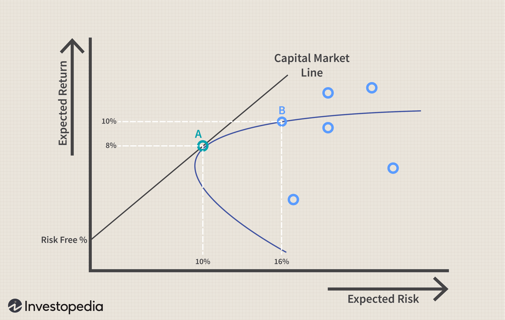

The Capital Asset Pricing Model (CAPM) has long been established as a pivotal framework in financial theory, introduced to equip investors with a method to calculate the expected return on an investment by correlating it with its inherent risk relative to a risk-free asset. The essence of CAPM is its proposition that the expected return on an asset is linearly related to its beta, which measures its sensitivity to movements in the overall market. Mathematically, this is expressed as:

$$
E(R_i) = R_f + \beta_i (E(R_m) - R_f)
$$

where $E(R_i)$ is the expected return on the investment, $R_f$ is the risk-free rate, $\beta_i$ is the asset's beta, and $E(R_m)$ is the expected return of the market.

Despite its prominence, CAPM has increasingly come under scrutiny, particularly with the rise of algorithmic trading and advancements in computational finance. Critics argue that the assumptions underpinning CAPM, such as market efficiency and homogeneous investor expectations, may not hold in today's complex and fast-paced trading environments. Algorithmic trading, which relies on sophisticated data analysis and real-time decision-making, often demands more flexible and multifactor approaches than CAPM typically provides.

This article aims to address these criticisms and evaluate CAPM's role within the context of modern finance, particularly its impact on algorithmic trading strategies. We will examine the critical assumptions and limitations of CAPM and explore alternative models proposed by economists and practitioners that aim to address these constraints. Additionally, the discussion will extend to how these evolving models affect algorithmic trading, offering insights into their application for enhanced investment decision-making. This examination seeks to provide a comprehensive understanding of CAPM's place in current investment landscapes and highlight the necessity for ongoing adaptation and model improvement in the face of technological advances.

## Table of Contents

## Understanding CAPM and Its Assumptions

The Capital Asset Pricing Model (CAPM) is a fundamental model in finance, introduced in the early 1960s, that builds upon Harry Markowitz's modern portfolio theory. The primary aim of CAPM is to evaluate an asset's expected return by measuring its non-diversifiable risk, also known as systematic risk, through a metric called beta (β). Beta represents the asset's sensitivity to market movements and is crucial in gauging expected returns relative to a risk-free asset.

CAPM is articulated through the formula:

$$
E(R_i) = R_f + \beta_i (E(R_m) - R_f)
$$

where:
- $E(R_i)$ is the expected return on the investment,
- $R_f$ is the risk-free rate of return,
- $\beta_i$ is the beta of the investment,
- $E(R_m)$ is the expected return of the market.

This model operates under several key assumptions: first, it presupposes that investors are inherently risk-averse and make decisions based on risk and return over a single, uniform investment horizon. The model also assumes that investors can borrow and lend unlimited amounts at the risk-free rate, which simplifies the capital allocation process.

In addition, CAPM posits an idealized world absent of taxes, inflation, and transaction costs. These elements are considered to significantly affect investment decisions, yet they remain unaccounted for in the basic CAPM framework. The uniform assumptions regarding a static market and investor behavior further simplify the model, providing a straightforward tool for calculating expected returns.

Despite these contributions, CAPM has drawn substantial criticism, particularly concerning its underlying assumptions. Critics argue that the assumptions of a frictionless market, constant risk factors, and a singular time horizon do not mirror actual market conditions. Real-world markets exhibit complexities such as taxes, inflation, and varying transaction costs, which CAPM does not address. Furthermore, investor behavior is more dynamic and will often vary among individuals, contrary to CAPM's uniform approach. 

These limitations have compelled economists and financial practitioners to explore alternative models that incorporate a broader range of variables and offer a more nuanced representation of contemporary financial markets. In this context, continual advancements in financial theories and technologies prompt ongoing evaluations and the application of enhancements beyond the traditional CAPM framework.

## Major Criticisms of CAPM

The Capital Asset Pricing Model (CAPM) has been a staple in financial economics, yet it has faced notable criticisms over the years due to several inherent limitations. Empirical studies have highlighted discrepancies in CAPM’s predictions, particularly for assets with extreme beta values. These high or low beta stocks often produce returns that deviate significantly from the expected outcomes posited by CAPM, indicating potential weaknesses in the model.

One of the significant shortcomings of CAPM lies in its failure to account for factors such as the size effect and anomalous stock returns. Research has consistently shown that smaller firms tend to yield higher returns compared to larger firms, a phenomenon not explained solely by beta. Furthermore, certain stocks exhibit abnormal returns that cannot be justified by their systemic risk alone, suggesting that CAPM's one-dimensional risk measure oversimplifies the complexities of investment risk.

Critics have also pointed out that CAPM inadequately addresses unsystematic risks. While the model presumes that unsystematic risk can be eliminated through diversification, it overlooks the practical challenges investors face in achieving perfect diversification. Moreover, CAPM depends heavily on market expectations, which are notoriously difficult to quantify and subject to change. This reliance introduces another layer of uncertainty into the model’s predictions.

The assumptions underlying CAPM further contribute to its criticisms. The model posits a single-period framework with static assumptions about investor behavior, which inadequately reflects real-world conditions where investors operate over multiple periods and are influenced by varying market sentiments and events. These static assumptions make CAPM less adaptable to dynamic market conditions.

Lastly, CAPM’s dependence on historical beta poses a challenge for accurate risk and return predictions. Markets are constantly evolving, and past volatilities may not effectively forecast future behaviors. As a result, reliance on a historical beta can lead to mispricing of assets and misguided investment decisions. This limitation underscores the need for incorporating more adaptive and multi-faceted approaches in asset pricing models, especially in the context of rapidly changing financial environments.

## Algorithmic Trading and CAPM

Algorithmic trading has revolutionized financial markets by leveraging speed, vast datasets, and sophisticated strategies to optimize trading decisions. These algorithmic systems often demand models that are more dynamic and adaptable than what the traditional Capital Asset Pricing Model (CAPM) can offer. CAPM, while foundational, exhibits limitations that pose significant challenges when applied to the complex and fast-paced environment of [algorithmic trading](/wiki/algorithmic-trading). 

Critics argue that CAPM's reliance on a single metric—beta—as a measure of risk and its assumption of a linear relationship between expected returns and market risk are overly simplistic for modern trading systems. Algorithmic trading systems require models that can respond to real-time market conditions, incorporate a multitude of risk factors, and adjust for rapidly shifting economic variables. The static nature of CAPM and its assumptions, such as constant risk-free rates and a single-period investment horizon, are often misaligned with the dynamic conditions present in algorithmic trading.

Responsive to the shortcomings of CAPM, developers and traders are increasingly turning to multifactor models that go beyond beta, incorporating additional factors like size, value, [momentum](/wiki/momentum), and even [alternative data](/wiki/best-alternative-data) sources such as sentiment analysis and macroeconomic indicators. These models aim to offer a more nuanced understanding of asset price dynamics, providing a richer framework for risk management and asset pricing.

Despite CAPM's limitations, it still serves as a useful baseline in the development of more intricate models. Its relative simplicity offers a starting point from which traders and developers can build more sophisticated approaches. CAPM's user-friendly nature and its theoretical basis make it a valuable tool for calibrating more complex models that incorporate a variety of financial and non-financial factors. Consequently, while CAPM alone may not suffice as the sole model for algorithmic trading, it remains an integral component of a comprehensive modeling toolkit, contributing to the layered strategies employed by traders seeking to navigate the intricacies of modern financial markets. 

In conclusion, as algorithmic trading evolves, the financial industry must continue to seek and develop advanced models that surpass the constraints of CAPM, aiming to balance simplicity and complexity to achieve optimal trading outcomes.

## Alternative Models and Their Applicability

The limitations of the Capital Asset Pricing Model (CAPM) have led to the development of several alternative models that aim to provide a more comprehensive explanation of asset returns. Among these, the Fama-French three-[factor](/wiki/factor-investing) model and the Arbitrage Pricing Theory (APT) are particularly notable.

The **Fama-French three-factor model** extends CAPM by including two additional factors: size and value. The model can be expressed as:

$$

R_i - R_f = \alpha + \beta (R_m - R_f) + sSMB + hHML + \epsilon 
$$

Where:
- $R_i$ is the return on the portfolio
- $R_f$ is the risk-free rate
- $R_m$ is the return on the market portfolio
- $SMB$ (Small Minus Big) is the risk factor related to the size of firms, capturing the superior returns of small-cap stocks compared to large-cap stocks
- $HML$ (High Minus Low) is the risk factor associated with value stocks, measured by high book-to-market ratios outperforming growth stocks
- $\alpha$ is the portfolio's alpha
- $\beta, s, h$ are coefficients that measure the sensitivity to each factor
- $\epsilon$ represents the error term

The inclusion of size and value offers improved predictive power over CAPM by accounting for additional sources of risk that affect asset returns.

**Arbitrage Pricing Theory (APT)** is another prominent model that provides a multi-factor approach to asset pricing. Unlike CAPM’s single-factor reliance on the market portfolio, APT suggests that asset returns can be predicted using multiple macroeconomic factors. This model is less prescriptive in its factors, allowing them to be determined empirically. Generally, APT is represented as:

$$

R_i = R_f + \sum_{j=1}^{n} \beta_jF_j + \epsilon_i 
$$

Where:
- $F_j$ are various systematic factors that influence asset returns
- $\beta_j$ are factor-specific sensitivities
- $\epsilon_i$ is the idiosyncratic shock for asset $i$

The flexibility of APT allows it to adapt to different market conditions and investment objectives by considering diverse factors such as inflation rates, economic growth, and changes in interest rates.

Another model, the **Intertemporal CAPM (ICAPM)**, developed by Robert Merton, extends CAPM by incorporating changing investment opportunities over multiple periods. ICAPM is particularly useful where future changes in consumption or investment opportunities affect current asset values. It accommodates investor needs for hedging against future income risks and changes in investment horizons.

These models, despite their advantages, are not without shortcomings. Criticisms often target assumptions about factor stability and the models' empirical validation. Furthermore, the efficacy of these models can vary greatly depending on the trading objectives and specific market conditions.

In practice, the choice between these models and their applicability often hinges on the specific context of the investment strategy and market environment. Traders and investors may use these models to build portfolios that better capture market anomalies and risk factors, complementing algorithmic trading systems that require sophisticated analytical frameworks.

## Conclusion

The Capital Asset Pricing Model (CAPM) remains a cornerstone in finance education and practice, establishing itself as a crucial framework for understanding the relationship between risk and expected return. However, its limitations have become increasingly evident in the face of evolving financial markets and advanced trading techniques like algorithmic trading. This modern trading methodology underscores the need for models that offer greater flexibility and precision, paving the way for the development and adoption of more robust alternatives.

One of the key challenges that algorithmic trading presents to CAPM is its reliance on static assumptions and a singular focus on market risk represented by beta $(\beta)$. This simplistic view does not sufficiently account for the multifaceted risks and dynamics present in today's financial markets, where speed and adaptability are critical. Consequently, there is an increasing shift toward multi-factor models and other sophisticated approaches that incorporate a broader range of variables and conditions.

The inherent complexity and unpredictability of financial markets mean that no single model can perfectly predict all outcomes. Instead, continuous adaptation to new information, market conditions, and technological advancements is essential. Modern tools and research are driving the development of more refined models that strive to better anticipate risk and potential returns.

Ultimately, investors and traders are encouraged to employ a diversified approach, considering a range of models and factors when making investment decisions. This strategy is aimed at enhancing returns while managing risk more effectively. By integrating various models and continuously updating their approaches, market participants can better navigate the complexities of financial markets and position themselves to take advantage of new opportunities.

## References & Further Reading

[1]: Fama, E. F., & French, K. R. (1992). ["The Cross-Section of Expected Stock Returns."](https://onlinelibrary.wiley.com/doi/full/10.1111/j.1540-6261.1992.tb04398.x) The Journal of Finance, 47(2), 427-465.

[2]: Ross, S. A. (1976). ["The Arbitrage Theory of Capital Asset Pricing."](https://www.sciencedirect.com/science/article/pii/0022053176900466) Journal of Economic Theory, 13(3), 341-360.

[3]: Merton, R. C. (1973). ["An Intertemporal Capital Asset Pricing Model."](https://www.econometricsociety.org/publications/econometrica/1973/09/01/intertemporal-capital-asset-pricing-model) Econometrica, 41(5), 867-887.

[4]: Sharpe, W. F. (1964). ["Capital Asset Prices: A Theory of Market Equilibrium Under Conditions of Risk."](https://onlinelibrary.wiley.com/doi/full/10.1111/j.1540-6261.1964.tb02865.x) The Journal of Finance, 19(3), 425-442.

[5]: Black, F., Jensen, M. C., & Scholes, M. (1972). ["The Capital Asset Pricing Model: Some Empirical Tests."](https://www.efalken.com/LowVolClassics/blackjensenscholes.pdf) Studies in the Theory of Capital Markets, 79-121.

[6]: Lopez de Prado, M. (2018). ["Advances in Financial Machine Learning."](https://www.amazon.com/Advances-Financial-Machine-Learning-Marcos/dp/1119482089) John Wiley & Sons.

[7]: Jarrow, R. A., & Yildirim, Y. (2002). ["Options and Derivatives Pricing: Models and Massive Computation."](https://papers.ssrn.com/sol3/papers.cfm?abstract_id=585828) Society for Industrial and Applied Mathematics.  

[8]: ["Algorithmic Trading: Winning Strategies and Their Rationale"](https://books.google.com/books/about/Algorithmic_Trading.html?id=WAlFDwAAQBAJ) by Ernie Chan

[9]: ["Behavioral Finance and Investor Types"](https://onlinelibrary.wiley.com/doi/book/10.1002/9781119202417) by Michael M. Pompian