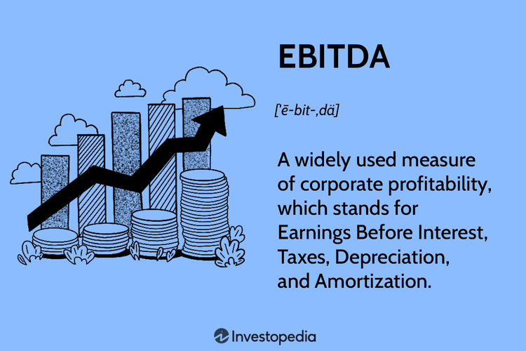

## Table of Contents

## What is EBITDA and how is it calculated?

EBITDA stands for Earnings Before Interest, Taxes, Depreciation, and Amortization. It is a way to measure a company's performance and profitability by looking at its earnings without considering the costs of interest, taxes, and the depreciation and amortization of assets. This measure helps to show how well a company's core operations are doing by removing the effects of financing and accounting decisions.

To calculate EBITDA, you start with the company's net income, which is the profit after all expenses have been subtracted. Then, you add back the expenses for interest, taxes, depreciation, and amortization. This gives you a clearer picture of the company's operating performance because it removes the impact of how the company is financed or how it accounts for its assets over time. For example, if a company has a net income of $100,000, interest expenses of $20,000, tax expenses of $30,000, depreciation of $10,000, and amortization of $5,000, the EBITDA would be $165,000.

## Why is EBITDA used as a financial metric?

EBITDA is used as a financial metric because it helps people see how well a company is doing at its main job, without getting distracted by other things like loans, taxes, or how old its equipment is. It's like looking at the score of a game without counting the points from penalties or extra time. By focusing on earnings before interest, taxes, depreciation, and amortization, people can compare companies more easily, even if those companies have different ways of borrowing money or different ages of machines.

This measure is also popular because it gives a quick snapshot of a company's cash flow from its regular business activities. It's useful for business owners, investors, and bankers who want to know if a company can make enough money to pay its bills, invest in new projects, or pay back loans. While EBITDA doesn't tell the whole story, it's a handy tool that helps everyone understand the health of a company's core operations in a simple way.

## What are the common criticisms of using EBITDA?

Some people think that using EBITDA can be misleading because it leaves out important costs like interest, taxes, depreciation, and amortization. These costs are real and can affect a company's money situation a lot. For example, if a company has big loans, the interest payments can eat into its profits. Ignoring these costs might make a company look healthier than it really is.

Another criticism is that EBITDA can be used to hide problems. Since it doesn't include depreciation and amortization, it might make it seem like a company's equipment or technology isn't getting old. But in reality, these assets do wear out and need to be replaced, which costs money. So, focusing only on EBITDA might give a too-optimistic view of a company's future earnings.

Lastly, because EBITDA is not a standard measure set by accounting rules, companies can sometimes use it in different ways. This can make it hard to compare one company to another. If everyone calculates EBITDA differently, it can be confusing and might even be used to make a company look better than it is.

## How does EBITDA potentially misrepresent a company's financial health?

EBITDA can make a company look healthier than it really is because it leaves out important costs like interest, taxes, depreciation, and amortization. These are real expenses that can affect how much money a company has. For example, if a company has big loans, the interest payments can take a big chunk out of its profits. By not including these costs, EBITDA might show a company making more money than it actually does after all bills are paid.

Also, EBITDA doesn't consider that equipment and technology get old and need to be replaced. This is a big deal because replacing old stuff costs money. If a company looks good on EBITDA but has to spend a lot to keep its machines running, it might not be as financially strong as it seems. Ignoring these costs can give a too-optimistic view of a company's future earnings and its ability to keep making money over time.

## Can you explain how EBITDA ignores important expenses like depreciation and amortization?

EBITDA leaves out depreciation and amortization, which are important expenses that show how much a company's equipment and other assets are wearing out over time. Depreciation is for physical things like machines and buildings, and amortization is for non-physical things like patents or software. These costs are real and need to be paid eventually, but EBITDA doesn't count them. This means a company might look like it's making more money than it really is because it's not showing the cost of keeping its stuff working.

By ignoring depreciation and amortization, EBITDA can make a company seem healthier than it is. Imagine a company has old machines that need to be replaced soon. The cost to buy new machines won't show up in EBITDA, so it might look like the company is doing great. But when the time comes to spend money on new equipment, the company might not have enough cash, even though EBITDA made it look like they did. This can be a big problem because it gives a false sense of how much money the company really has to work with.

## What are the implications of using EBITDA for companies with high capital expenditures?

For companies with high capital expenditures, using EBITDA can be misleading because it doesn't show the money spent on new equipment or buildings. These companies often need to buy new things to keep their business running smoothly. If they use EBITDA to show how they're doing, it might look like they have more money than they really do because it doesn't count the costs of these big purchases.

This can be a problem when investors or bankers look at EBITDA and think the company is doing well financially. They might not realize that the company needs to spend a lot of money soon to replace old equipment or expand. If the company doesn't have enough cash after these big expenses, it could struggle to pay its bills or grow, even though EBITDA made it look like everything was fine.

## How does EBITDA affect the valuation of companies in different industries?

EBITDA can affect how companies in different industries are valued because it shows how much money a company makes from its main business before paying for things like loans, taxes, and the wear and tear of its equipment. Some industries, like tech or software, might have lower capital expenses, so their EBITDA might be a good way to see how they're doing. But in industries like manufacturing or oil and gas, where companies need to spend a lot on new machines or drilling equipment, using EBITDA alone might make these companies look more profitable than they really are. This is because EBITDA doesn't show the big costs of buying new equipment or replacing old stuff.

Because of these differences, people who value companies need to be careful when using EBITDA. In industries with high capital costs, other measures like free cash flow might give a better picture of how much money a company really has. On the other hand, in industries where capital costs are lower, EBITDA can be a useful tool to quickly compare how well companies are doing at their core business. So, while EBITDA can be a helpful number, it's important to look at it together with other financial measures to get a full understanding of a company's health, especially across different industries.

## What are some real-world examples where reliance on EBITDA led to poor financial decisions?

One real-world example where reliance on EBITDA led to poor financial decisions is the case of Toys "R" Us. In 2005, the company was bought out in a leveraged buyout, which means it was bought using a lot of borrowed money. The buyers looked at EBITDA to see if the company could handle the debt. But, they didn't pay enough attention to how much money Toys "R" Us needed to spend on new stores and keeping up with online shopping trends. Because EBITDA didn't show these big costs, it made the company look healthier than it was. In the end, Toys "R" Us couldn't pay its debts and had to close down in 2018.

Another example is the energy company Enron. In the late 1990s and early 2000s, Enron used EBITDA to make its financial performance look better than it really was. They focused on EBITDA to show high earnings, but they didn't show the real costs of their business, like the money they were losing on some projects. This made investors think Enron was doing well, but it was actually hiding big problems. When the truth came out, Enron went bankrupt in 2001, showing that relying too much on EBITDA can hide serious financial issues.

## How do financial analysts and investors critique the use of EBITDA in financial analysis?

Financial analysts and investors often critique the use of EBITDA because it can make a company look more profitable than it really is. They point out that EBITDA ignores important costs like interest, taxes, depreciation, and amortization. These costs are real and can have a big impact on a company's cash flow. For example, if a company has a lot of debt, the interest payments can eat into its profits. By not including these costs, EBITDA might give a too-optimistic view of how much money a company has to work with, which can lead to bad investment decisions.

Another concern is that EBITDA can be used to hide problems within a company. Since it doesn't include depreciation and amortization, it doesn't show how much money a company needs to spend to replace old equipment or technology. This can make a company seem healthier than it is, especially for businesses that need a lot of money to keep their machines running. Investors and analysts worry that focusing too much on EBITDA can lead to overlooking these essential costs, causing surprises down the road when the company needs to spend money it doesn't have.

## What alternative metrics do experts suggest using instead of or alongside EBITDA?

Experts often suggest using other metrics alongside or instead of EBITDA to get a better picture of a company's financial health. One popular alternative is free cash flow (FCF), which shows how much money a company has left after it pays for everything it needs to run and grow its business. FCF is useful because it includes all the costs that EBITDA leaves out, like interest, taxes, and the money spent on new equipment or buildings. This gives a clearer view of how much cash a company really has to work with.

Another important metric is net income, which is the profit a company makes after all expenses, including interest, taxes, depreciation, and amortization, have been subtracted. Net income gives a complete picture of a company's profitability because it includes all costs. By looking at net income, investors and analysts can see if a company is truly making money or if it's just looking good on paper because of EBITDA. Using these metrics together with EBITDA helps everyone understand a company's financial situation better and make smarter decisions.

## How has the use of EBITDA evolved in corporate finance and what future trends might we see?

The use of EBITDA in corporate finance has changed a lot over time. At first, it was a simple way to see how much money a company was making from its main business, without worrying about things like loans or taxes. But as more people started using it, they realized it could make companies look better than they really were. This led to some big mistakes, like when companies went bankrupt even though their EBITDA looked good. Now, people are more careful and often use EBITDA along with other numbers to get a fuller picture of a company's health.

In the future, we might see even more changes in how EBITDA is used. As more people learn about its limits, they might start using other measures like free cash flow more often. This would give a better idea of how much money a company really has after paying for everything it needs. Also, with new technology and ways of doing business, companies might need new ways to show how they're doing. So, while EBITDA will still be around, it might be just one part of a bigger set of tools that people use to understand a company's financial situation.

## What are the regulatory perspectives on the use of EBITDA in financial reporting?

Regulators have mixed feelings about using EBITDA in financial reporting. They know it can be a helpful way to see how a company is doing at its main job, but they also worry that it can hide important costs. Because of this, some regulators, like the Securities and Exchange Commission (SEC) in the United States, have rules about how companies can use EBITDA. They want to make sure that if a company uses EBITDA, it also shows other numbers that give a full picture of its money situation. This helps investors and others understand the real financial health of a company.

In the future, regulators might keep an eye on how companies use EBITDA and might make more rules to stop it from being used in a way that tricks people. They might ask companies to explain why they use EBITDA and to show other important numbers like free cash flow or net income. This way, everyone can see the whole story and not just the part that makes the company look good. Regulators want to make sure that financial reports are clear and honest, so people can trust them when making decisions about where to put their money.

## How does EBITDA compare with other financial metrics?

EBITDA, or Earnings Before Interest, Taxes, Depreciation, and Amortization, is a key financial metric, often contrasted with others like Net Income, Operating Cash Flow, and EBIT (Earnings Before Interest and Taxes). Each provides unique insights into a company's performance.

EBITDA is particularly valued for assessing operational efficiency by excluding often non-cash and non-operational items such as interest, taxes, depreciation, and amortization. The following formula represents EBITDA:

$$
\text{EBITDA} = \text{Net Income} + \text{Interest} + \text{Taxes} + \text{Depreciation} + \text{Amortization}
$$

This formula highlights that EBITDA is derived from net income by adding back the expenses associated with financing and accounting decisions (interest and taxes) and non-cash charges (depreciation and amortization).

In contrast, Net Income provides a comprehensive view of profitability by incorporating all expenses, revenues, gains, and losses incurred by the business. This makes Net Income a more inclusive measure of financial performance, often used for assessing overall profitability and earnings per share, following the formula:

$$
\text{Net Income} = \text{Total Revenue} - \text{Total Expenses}
$$

Operating Cash Flow offers insights into the actual cash generated by the company from its operational activities, highlighting [liquidity](/wiki/liquidity-risk-premium) and operational cash generation capacity. Notably, it includes changes in working capital, differentiating it from EBITDA. It can be calculated as:

$$
\text{Operating Cash Flow} = \text{Net Income} + \text{Depreciation and Amortization} - \text{Changes in Working Capital}
$$

EBIT, another closely observed financial metric, differs from EBITDA by excluding depreciation and amortization. It reflects income generated from operations before deducting interest and taxes, focusing purely on operational efficiency without the adjustments for non-cash depreciation and amortization expenses:

$$
\text{EBIT} = \text{Net Income} + \text{Interest} + \text{Taxes}
$$

Recognizing these differences is crucial for making nuanced financial decisions. For instance, while EBITDA might be preferred when comparing operational efficiency across firms or industries, Net Income offers a fuller picture when evaluating profitability post all expenses. Operating Cash Flow is crucial for determining whether a business can generate sufficient cash to maintain and grow operations, and EBIT provides clarity on operational income without accounting for non-cash depreciation and amortization.

Thus, each metric caters to varying analytical needs, shaped by the industry and specific financial goals. Choosing the correct metric is essential for comprehensive and effective financial analysis, allowing investors and analysts to tailor their assessments to specific investment strategies and risk considerations.

## What is the relationship between Algorithmic Trading and Financial Metrics?

Algorithmic trading utilizes sophisticated algorithms to execute trades by analyzing detailed financial data, including EBITDA, which stands for Earnings Before Interest, Taxes, Depreciation, and Amortization. This trading approach relies heavily on financial metrics to assess the value and operational health of companies, helping traders make informed investment decisions.

Financial metrics are central to [algorithmic trading](/wiki/algorithmic-trading) strategies. By offering insight into a company's core profitability, metrics like EBITDA allow traders to identify potential investment opportunities with greater precision. EBITDA's role in algorithmic models is to serve as an indicator of operational performance, assisting in screening stocks that meet particular profitability criteria. These models often compute the EBITDA by summing the values of net income, interest, taxes, depreciation, and amortization, which is mathematically expressed as:

$$
\text{EBITDA} = \text{Net Income} + \text{Interest} + \text{Taxes} + \text{Depreciation} + \text{Amortization}
$$

Technological advancements have significantly enhanced the ability of algorithmic trading systems to process vast datasets. These systems can analyze multiple real-time financial indicators, ensuring that trading decisions are executed swiftly and accurately. High-frequency trading ([HFT](/wiki/high-frequency-trading-strategies)) platforms, for example, can perform trades within milliseconds, capitalizing on even the slightest market fluctuations by utilizing comprehensive datasets that include EBITDA figures.

Furthermore, risk management and profitability are greatly enhanced through the integration of financial metrics within algorithmic systems. Traders employ various software tools and programming languages, such as Python, to develop algorithms capable of dynamically adjusting to changing market conditions. Python's libraries, like Pandas and NumPy, enable handling large datasets and performing complex financial calculations efficiently.

By incorporating EBITDA into algorithmic models, traders can devise strategies that manage risks more effectively and optimize returns. This method allows traders to adjust their models based on the financial health indicators of different companies, thereby refining their investment approaches and achieving desired outcomes in diverse market conditions.

## References & Further Reading

[1]: ["Financial Statement Analysis: A Practitioner's Guide"](https://www.amazon.com/Financial-Statement-Analysis-Practitioners-Guide/dp/0470635606) by Martin S. Fridson and Fernando Alvarez

[2]: ["Valuation: Measuring and Managing the Value of Companies"](https://www.amazon.com/Valuation-Measuring-Managing-Companies-Finance/dp/1119610885) by McKinsey & Company Inc.

[3]: ["Corporate Finance"](https://www.investopedia.com/terms/c/corporatefinance.asp) by Jonathan Berk and Peter DeMarzo

[4]: ["Algorithmic Trading: Winning Strategies and Their Rationale"](https://www.amazon.com/Algorithmic-Trading-Winning-Strategies-Rationale-ebook/dp/B00CY5HC0U) by Ernie Chan

[5]: ["Trading and Exchanges: Market Microstructure for Practitioners"](https://www.amazon.com/Trading-Exchanges-Market-Microstructure-Practitioners/dp/0195144708) by Larry Harris

[6]: ["EBITDA: The Good, the Bad and the Wrong"](https://blog.truelytics.com/ebitda-the-good-the-bad-the-ugly) by John L. Maginn, CFA Institute Magazine, 2018