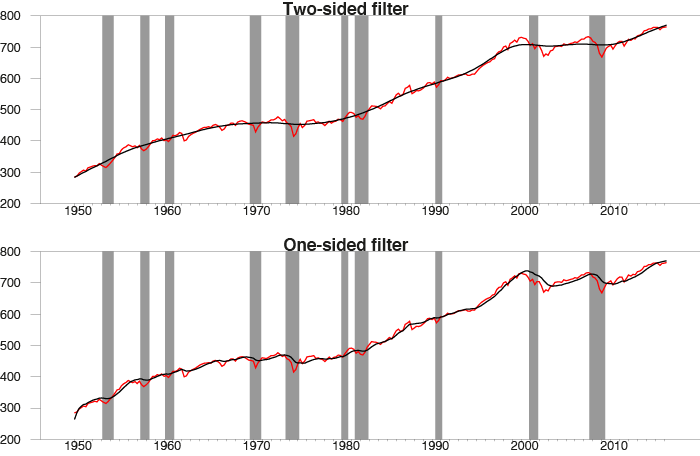

## Table of Contents

## What is the Hodrick-Prescott (HP) filter?

The Hodrick-Prescott (HP) filter is a statistical tool used to separate a time series into two parts: the trend and the cycle. Imagine you have data about something over time, like the economy's growth. The HP filter helps you see the overall direction (trend) of that growth, which might be slowly increasing or decreasing, and the short-term ups and downs (cycle) that happen around that trend.

This filter is often used in economics to analyze things like GDP or unemployment rates. By smoothing out the short-term fluctuations, economists can better understand the long-term patterns and make more accurate predictions. However, it's important to choose the right "smoothing parameter" when using the HP filter. This parameter decides how much smoothing is done, and using the wrong value can lead to misleading results.

## How does the HP filter work to separate trend from cycle in time series data?

The HP filter works by trying to find a smooth trend line that goes through your data. It does this by balancing two things: how close the trend line stays to the actual data points, and how smooth the trend line is. Imagine you're drawing a line through a set of points on a graph. You want the line to be as smooth as possible, but you also want it to be close to the points. The HP filter uses math to find the best line that does both of these things well.

Once the HP filter finds this smooth trend line, it separates the original data into two parts. The trend is the smooth line that shows the long-term direction of your data. The cycle, or what's sometimes called the residual, is everything that's left over. This part shows the short-term ups and downs that don't fit the overall trend. By looking at these two parts separately, you can understand what's happening in the long run and what's just temporary noise.

## What are the common applications of the HP filter in economics?

The HP filter is often used in economics to study the ups and downs of a country's economy. Economists use it to look at data like the Gross Domestic Product (GDP) or unemployment rates. By separating the trend from the cycle, they can see the long-term growth of the economy and the short-term changes that happen around it. This helps them understand if the economy is growing steadily or if there are big swings happening.

Another common use of the HP filter is in analyzing business cycles. Economists can use it to figure out when the economy is expanding or shrinking. By looking at the cycle part of the data, they can see if there are patterns that happen over time, like booms and busts. This information is really helpful for making economic policies and planning for the future.

## What are the main criticisms of the HP filter?

One of the main criticisms of the HP filter is that it can change how the data looks at the beginning and end of the time series. This is called the "end-point problem." The filter needs data from both before and after a point to work well, but at the start and end of the data, there's no "before" or "after" to use. This can make the trend look different than it really is, which can be a big problem if you're trying to make predictions about the future.

Another criticism is that the HP filter can make it seem like there are cycles in the data when there really aren't any. This can happen because the filter tries to make the trend as smooth as possible, which can create patterns that aren't actually there. Economists worry that this might lead to wrong conclusions about how the economy works. Choosing the right smoothing parameter is also tricky, and using the wrong one can make the results even more misleading.

## How does the HP filter's sensitivity to endpoints affect its reliability?

The HP filter's sensitivity to endpoints can make it less reliable, especially when looking at the start and end of a time series. This is because the filter needs data from before and after a point to work well. At the beginning and end of the data, there's no "before" or "after" to use, so the filter has to guess. This guessing can lead to a trend that doesn't match what's really happening. If you're trying to predict what will happen next in the economy, these guesses can make your predictions less accurate.

This problem with endpoints is a big reason why some economists are cautious about using the HP filter. They worry that the trend it shows at the start and end might not be trustworthy. This can be a real problem if you're making important decisions based on the data, like setting economic policies. Because of this, it's important to understand the HP filter's limitations and maybe use other methods to check the results.

## Can the HP filter distort economic data, and if so, how?

Yes, the HP filter can distort economic data, especially at the beginning and end of a time series. This happens because the filter needs data from both before and after a point to work well. At the start and end of the data, there's no "before" or "after" to use, so the filter has to guess. These guesses can make the trend look different from what's really happening. If you're trying to predict what will happen next in the economy, these guesses can lead to wrong predictions.

Another way the HP filter can distort data is by making it seem like there are cycles when there really aren't any. The filter tries to make the trend as smooth as possible, which can create patterns that aren't actually there. This can be a problem because economists might think these made-up patterns show how the economy works, when they're really just a result of the filter. Choosing the right smoothing parameter is also tricky, and using the wrong one can make the distortions even worse.

## What alternative methods exist to the HP filter for trend-cycle decomposition?

One alternative to the HP filter is the Baxter-King filter. This filter also helps separate a time series into a trend and a cycle, but it works differently. Instead of trying to make the trend as smooth as possible like the HP filter, the Baxter-King filter uses a moving average to look at the data over a set period of time. This helps it avoid some of the problems with the HP filter, like the end-point problem, but it can still be tricky to use because you have to choose the right time period for the moving average.

Another method is the Christiano-Fitzgerald filter. This filter is good at dealing with the end-point problem because it uses a different way to calculate the trend. It looks at all the data points and weighs them differently depending on how close they are to the point you're looking at. This can give you a better picture of the trend, especially at the start and end of the data. But like the other methods, it's not perfect, and you still need to be careful about how you use it.

A third option is to use something called a band-pass filter. This filter helps you look at specific parts of the data, like cycles that happen over a certain time. It's good at picking out these cycles without making up patterns that aren't there. But it can be hard to set up because you need to know exactly what kind of cycles you're looking for. Each of these alternatives has its own strengths and weaknesses, so economists often use more than one method to make sure they're getting the right picture of the data.

## How does the choice of the smoothing parameter in the HP filter impact the results?

The smoothing parameter in the HP filter is really important because it decides how much the filter will smooth out the data. If you pick a big number for the smoothing parameter, the filter will make the trend very smooth. This means the trend will look more like a straight line, and all the short-term ups and downs will be in the cycle part. But if you pick a small number, the trend won't be as smooth, and it will look more like the original data. This can make it harder to see the long-term direction because the trend will have more of the short-term changes in it.

Choosing the right smoothing parameter is tricky because there's no one-size-fits-all answer. Different kinds of data might need different amounts of smoothing. For example, if you're looking at yearly data, you might use a smaller number than if you're looking at monthly data. Using the wrong number can make the results misleading. If the smoothing parameter is too big, you might miss important short-term changes. If it's too small, the trend might not be clear enough to see the long-term direction. So, it's important to think carefully about what number to use and maybe try different ones to see what works best for your data.

## What are the implications of using the HP filter for policy-making?

Using the HP filter for policy-making can help policymakers understand the long-term direction of the economy. By separating the trend from the cycle, they can see if the economy is growing steadily or if it's just having short-term ups and downs. This can be really helpful for making big decisions, like setting budgets or planning for future growth. If the trend shows the economy is growing slowly, policymakers might decide to spend more money to help it grow faster. On the other hand, if the trend shows the economy is doing well, they might decide to save money for the future.

But there are also risks when using the HP filter for policy-making. The filter can be misleading, especially at the start and end of the data. This is called the end-point problem, and it can make it hard to predict what will happen next. If policymakers make decisions based on these wrong predictions, they might end up doing things that don't help the economy. Also, the HP filter can make it seem like there are patterns in the data that aren't really there. This can lead to wrong ideas about how the economy works, which can make policy-making even harder. So, it's important for policymakers to be careful and maybe use other methods to check the results from the HP filter.

## How have empirical studies evaluated the performance of the HP filter against other methods?

Empirical studies have compared the HP filter with other methods like the Baxter-King filter and the Christiano-Fitzgerald filter. These studies often look at how well each method separates the trend from the cycle in economic data. One big finding is that the HP filter can be good at showing the long-term direction of the economy, but it can also make mistakes, especially at the start and end of the data. This is called the end-point problem, and it can make the HP filter less reliable than other methods that handle this problem better. For example, the Christiano-Fitzgerald filter is often better at dealing with the end-point problem because it uses all the data points and weighs them differently.

Another important thing that empirical studies have found is that the choice of the smoothing parameter in the HP filter can really change the results. Different kinds of data might need different amounts of smoothing, and using the wrong number can make the results misleading. Some studies have shown that other methods, like band-pass filters, can be better at picking out real cycles in the data without making up patterns that aren't there. Overall, while the HP filter is a useful tool, these studies suggest that it's important to use it carefully and maybe check the results with other methods to make sure they're right.

## What are the theoretical limitations of the HP filter in capturing economic cycles?

The HP filter has some problems when it comes to capturing economic cycles. One big problem is that it can make up cycles that aren't really there. The filter tries to make the trend as smooth as possible, which can create patterns in the data that don't actually exist. This can be a big issue because economists might think these made-up cycles are real and use them to make decisions about the economy. Another problem is that the HP filter needs data from both before and after a point to work well. At the start and end of the data, there's no "before" or "after" to use, so the filter has to guess. These guesses can make the trend look different from what's really happening, especially at the beginning and end of the time series.

Another limitation of the HP filter is that it relies a lot on the smoothing parameter. This is a number that decides how much the filter will smooth out the data. If you pick a big number, the trend will be very smooth, and all the short-term ups and downs will be in the cycle part. But if you pick a small number, the trend won't be as smooth, and it will look more like the original data. Choosing the right number is tricky because there's no one-size-fits-all answer. Different kinds of data might need different amounts of smoothing, and using the wrong number can make the results misleading. This makes it hard to use the HP filter to understand economic cycles because the results can change a lot depending on the smoothing parameter you choose.

## How can the HP filter be modified or improved to address its criticisms?

To make the HP filter better and fix some of its problems, people have tried different things. One idea is to use other data to help the HP filter guess what's happening at the start and end of the time series. This can help with the end-point problem, where the filter can be wrong because it doesn't have enough data to work with. Another idea is to change how the HP filter works so it doesn't make up cycles that aren't really there. This can be done by making the filter less focused on making the trend super smooth and more focused on showing the real patterns in the data.

Another way to improve the HP filter is to be really careful about choosing the smoothing parameter. This is the number that decides how much the filter will smooth out the data. By trying different numbers and seeing how they change the results, you can find the one that works best for your data. Some people also suggest using the HP filter along with other methods, like the Baxter-King filter or the Christiano-Fitzgerald filter. By comparing the results from different methods, you can get a better idea of what's really happening in the data and make sure the HP filter isn't leading you to the wrong conclusions.

## What is the Hodrick-Prescott Filter and how does it work?

The Hodrick-Prescott (HP) Filter is a widely utilized data-smoothing technique employed predominantly in macroeconomic analysis to extract the long-term trend component of an economic time series from short-term fluctuations. Developed by economists Robert Hodrick and Edward Prescott, the technique is designed to provide a clearer picture of the underlying economic conditions by removing cyclical variations and noise.

Mathematically, the HP Filter achieves this by solving an optimization problem where the objective is to minimize the sum of the squared deviations of the time series from its trend, subject to a penalty on the second difference of the trend. This can be represented by the following expression:

$$
\min_{g(t)} \sum_{t=1}^{T} (y_t - g_t)^2 + \lambda \sum_{t=2}^{T-1} [(g_{t+1} - g_t) - (g_t - g_{t-1})]^2
$$

Here, $y_t$ is the observed time series, $g_t$ is the trend component, and $\lambda$ is a smoothing parameter that determines the sensitivity of the series to short-term fluctuations. A higher $\lambda$ produces a smoother trend by heavily penalizing fluctuations in the trend component.

In practical applications, such as macroeconomics, the HP Filter is particularly effective in smoothing economic indicators like the Conference Board's Help Wanted Index. This application allows economists to benchmark the index against other economic data to identify underlying trends and inform policy decisions. The Help Wanted Index, for instance, measures the number of help-wanted advertisements, which is a proxy for labor market conditions. By filtering this data, analysts can better understand long-term shifts in employment trends, eliminating the noise introduced by seasonal hiring practices or economic shocks.

The HP Filter is also employed in comparing long-term trends between various economic indicators, such as GDP and unemployment rates, facilitating a more comprehensive analysis of economic health and potential policy impacts. Despite its widespread use, it is crucial for practitioners to be mindful of the chosen $\lambda$ value, as the results of the HP Filter can be highly sensitive to this choice, which varies depending on the frequency of the data being analyzed (e.g., quarterly vs. annual data).

## References & Further Reading

[1]: Hamilton, J. D. (2017). ["Why You Should Never Use the Hodrick-Prescott Filter."](https://econweb.ucsd.edu/~jhamilto/hp.pdf) National Bureau of Economic Research Working Paper No. 23429.

[2]: Hodrick, R. J., & Prescott, E. C. (1997). ["Postwar U.S. Business Cycles: An Empirical Investigation."](https://www.jstor.org/stable/2953682) Journal of Money, Credit, and Banking, 29(1), 1-16.

[3]: Ravn, M. O., & Uhlig, H. (2002). ["On Adjusting the Hodrick-Prescott Filter for the Frequency of Observations."](https://www.jstor.org/stable/3211784) Review of Economics and Statistics, 84(2), 371-376.

[4]: Morley, J., Nelson, C. R., & Zivot, E. (2003). ["Why Are the Beveridge-Nelson and Unobserved-Components Decompositions of GDP So Different?"](https://files.stlouisfed.org/files/htdocs/conferences/moconf/papers/morley.pdf) Review of Economics and Statistics, 85(2), 235-243.

[5]: [Stock, J. H., & Watson, M. W. (1999). "Business Cycle Fluctuations in U.S. Macroeconomic Time Series."](https://www.sciencedirect.com/science/article/pii/S1574004899010046) Handbook of Macroeconomics, Volume 1, 3-64.