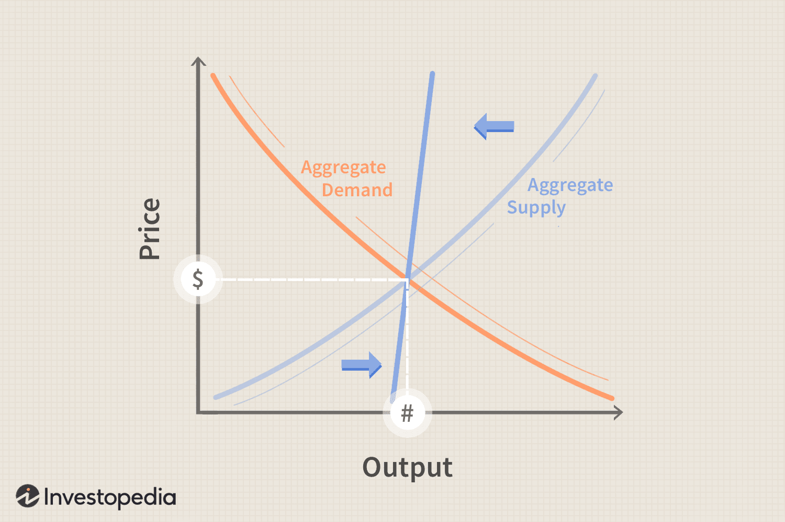

Supply-side economics is a theory that focuses on increasing the supply of goods and services as a key driver of economic growth. Its central tenet is that policies aimed at reducing barriers, such as taxes and regulations, will stimulate production and investment, leading to job creation and, ultimately, a more robust economy. This approach is rooted in the belief that creating incentives for producers and investors will result in a "trickle-down" effect that benefits the broader population.

The fiscal policy debate surrounding supply-side economics is deeply intertwined with discussions about tax cuts and deregulation, and their tangible impact on economic performance. Proponents argue that reducing the tax burden on businesses and high-income individuals encourages them to invest in capital, hire more workers, and innovate, thereby increasing overall economic output. This perspective suggests that such policies can lead to sustainable economic prosperity and higher living standards across all socioeconomic groups. This view gained particular prominence during the 1980s with the implementation of "Reaganomics," a set of economic policies adopted by U.S. President Ronald Reagan, which emphasized tax cuts and deregulation.

Critics of supply-side economics challenge the premise that benefits trickle down to the general population. They argue that tax cuts predominantly favor the wealthy and do not necessarily lead to proportional increases in investment or job creation. Historical analyses often point to instances where tax cuts have failed to produce the anticipated economic growth, suggesting that the wealthy may not always reinvest their tax savings in ways that substantially benefit the broader economy.

The theory has been a focal point for vigorous debate among economists and policymakers, with strong opinions on both sides about its efficacy and fairness. Beyond traditional industries, modern technological advancements, such as algorithmic trading, have introduced new dimensions to supply-side economics. These innovations raise questions about how fiscal policies should adapt in a highly digital and automated economic environment, furthering the discourse on the relevance and application of supply-side theories in contemporary policy-making. As these discussions continue, supply-side economics remains a significant yet contentious aspect of economic policy and theory.

## Table of Contents

## Understanding Supply-Side Economics

Supply-side economics is an economic theory that emphasizes the role of production (or supply) in driving economic growth. The central tenet of this theory is that lower taxes on businesses and the wealthy can lead to increased investment, job creation, and broader economic expansion. The idea is predicated on the assumption that when businesses and affluent individuals retain a greater portion of their income, they have more resources to invest in productive activities.

The primary mechanism through which supply-side economics operates is the increase in disposable income resulting from tax reductions. When businesses face lower tax burdens, they are more likely to have the capital necessary for expansion and innovation. This can lead to the creation of new jobs and enhancement of technological capabilities, fostering an environment conducive to economic growth.

Advocates of supply-side economics argue that reducing taxes and regulatory barriers enables businesses to operate more efficiently and profitably. This, in turn, is believed to provide benefits across the socioeconomic spectrum through what is known as the "trickle-down effect." According to this perspective, as businesses grow and their revenues increase, these benefits are expected to extend to employees in the form of higher wages and to consumers through lower prices and improved goods and services.

Despite these claims, supply-side economics is not without its detractors. Critics argue that the anticipated benefits, such as job creation and increased investment, do not always materialize as proposed by the theory. An often-cited concern is that tax savings may not be reinvested productively by the wealthy; instead, they might accumulate as savings or be directed towards non-productive investments. Critics also highlight that economies do not always exhibit the expected positive correlation between tax cuts and economic growth. Historical instances sometimes show that job growth and increased productivity are not directly linked to reductions in tax rates.

The debate surrounding supply-side economics continues to be a significant aspect of discussions on fiscal policies, with various studies and data analyses attempting to measure the true impact and efficacy of these economic strategies.

## Historical Context and Evolution

Supply-side economics gained prominence in the late 20th century, particularly during the presidency of Ronald Reagan in the United States. This economic theory, which emphasizes reducing taxes and regulatory constraints to spur economic growth, was popularized by economists such as Arthur Laffer. Laffer is notably recognized for the Laffer Curve, a concept that describes the relationship between tax rates and tax revenue. According to the Laffer Curve, there is an optimal tax rate that maximizes revenue without hindering economic activity. This principle became a cornerstone of supply-side economics, advocating for tax cuts as a means to stimulate investment and increase overall economic productivity.

The practical application of supply-side economics has varied significantly across different political and economic landscapes. During the Reagan administration, these policies were manifested through substantial tax cuts, deregulation, and a focus on reducing the influence of government in economic affairs. These measures were designed to encourage business investment and subsequently, job creation. Advocates argue that these policies contributed to the economic boom of the 1980s, characterized by a period of sustained growth and decreasing unemployment rates.

However, the success of supply-side economics is not universally accepted. While the Reagan era is often cited as a successful implementation of these principles, there have been instances where similar policies did not yield the desired outcomes. For example, the economic policies implemented by British Prime Minister Liz Truss drew heavily on supply-side theories. Her administration proposed significant tax cuts aimed at boosting investment and economic growth. Nonetheless, these measures were met with skepticism and ultimately led to heightened economic uncertainty and market instability, which culminated in her resignation. The Truss administration's experience is frequently referenced as a cautionary tale about the potential pitfalls of unfettered supply-side policies.

The varying outcomes of supply-side economics highlight the complexity of predicting economic behavior and the influence of contextual factors, such as global economic conditions, political stability, and market reactions. As such, while supply-side economics has been a pivotal force in shaping fiscal policy, its effectiveness remains a contentious topic, fostering ongoing debate and analysis among economists and policymakers.

## Five Common Criticisms of Supply-Side Economics

Supply-side economics, while influential, is subject to numerous criticisms which challenge its theoretical foundations and empirical outcomes. 

One major critique is the hypothesis that tax cuts, particularly for high-income earners and corporations, automatically spur job creation. Critics point to periods in economic history where significant tax reductions did not yield commensurate increases in employment. For instance, following the major tax cuts of the early 1980s in the United States, job growth was not as robust as predicted. This discrepancy raises questions about the assumed direct relationship between tax cuts and job market expansion.

Another point of contention involves the claim that supply-side policies inherently boost investment. The argument posits that lower taxes leave more capital in the hands of businesses and wealthy individuals, presumably encouraging reinvestment in the economy. However, empirical studies often show little correlation between reduced tax rates and investment levels. The additional income saved through tax cuts is not always channeled into productive investments, undermining one of the central tenets of supply-side theory.

Moreover, critics argue that productivity growth—an essential driver of economic prosperity—is not directly influenced by supply-side policies. Productivity is often more closely linked with factors like technological advancement, workforce education, and infrastructure, none of which are automatically addressed by tax reductions. Research has shown that periods of significant productivity advancement do not correlate strongly with times of aggressive supply-side fiscal policies, casting doubt on the theory's claims regarding productivity enhancement.

These criticisms underscore the complexity and uncertainty inherent in economic policymaking. They highlight the need for a nuanced understanding of how various factors interact within the broader economic system, rather than relying on simplified models that may not capture the multifaceted nature of economic growth and development.

## Supply-Side Economics in the Modern Era

With advancements in technology, the interplay between supply-side economics and [algorithmic trading](/wiki/algorithmic-trading) has introduced new dimensions to fiscal policy discussions. Algorithmic trading, defined as the use of computer algorithms to automate trading decisions, has significantly transformed financial markets by increasing the speed and efficiency of trade executions. As markets become more digital and automated, the implications for supply-side economic strategies are profound.

Algorithmic trading impacts market [liquidity](/wiki/liquidity-risk-premium) and [volatility](/wiki/volatility-trading-strategies), influenced by supply-side policies such as tax cuts and deregulation. These policies can stimulate technological innovation by increasing disposable income for businesses, enabling them to invest in algorithmic systems. This environment encourages the development of advanced trading algorithms, which can make markets more efficient by narrowing bid-ask spreads and improving market depth.

Simultaneously, algorithmic trading raises questions about the effectiveness of traditional supply-side approaches. For instance, when tax incentives are implemented, businesses may channel the benefits into algorithmic trading technology rather than expanding physical operations or hiring more workers. This allocation of resources might not align with the job creation goals traditionally associated with supply-side economics. 

Furthermore, the rapid growth of algorithmic trading has brought about a shift in how economic theories are applied. Algorithms can quickly interpret policy changes, potentially undermining the intended long-term impacts of economic policies. This reality necessitates a re-evaluation of supply-side principles to ensure that they remain effective in an era dominated by digital finance.

Ultimately, the integration of supply-side policies with innovations like algorithmic trading demands a nuanced approach, balancing technological advancement with the broader economic objectives of growth and employment. As the financial landscape continues to evolve, it becomes essential to adapt these economic theories to maintain their relevance and effectiveness.

## Conclusion

Supply-side economics, while historically significant, remains a divisive topic both academically and politically. This economic theory, with its strong emphasis on boosting production and incentives through mechanisms like tax cuts and deregulation, has played a crucial role in shaping fiscal policies across various administrations. Its proponents argue that reducing barriers for businesses leads to increased economic growth, trickle-down benefits, and overall prosperity. However, the practical application of these principles often sparks debate, as outcomes have not always aligned with predictions, drawing skepticism from critics.

The impact of supply-side economics on fiscal policy and economic outcomes highlights the complexity of effectively aligning economic theory with practical application. Policymakers adopting supply-side strategies must navigate unpredictable variables such as consumer confidence, global economic conditions, and technological advancements. The real-world implications of these strategies necessitate ongoing scrutiny and adjustment to effectively harness desired growth and equitable distribution of resources.

Continuous evaluation and adaptation are necessary to ensure economic policies meet the demands of an evolving economic environment. As technology reshapes industries and financial markets, integrating innovations like algorithmic trading into the supply-side framework might offer new opportunities and challenges. Moreover, the socioeconomic implications of supply-side policies need to be revisited to ensure they address contemporary issues such as income inequality and sustainable development. By staying responsive to changing economic landscapes and data-driven insights, supply-side economics could be refined to achieve more balanced and inclusive economic outcomes.

## References & Further Reading

[1]: ["Advances in Financial Machine Learning"](https://www.amazon.com/Advances-Financial-Machine-Learning-Marcos/dp/1119482089) by Marcos Lopez de Prado

[2]: Bergstra, J., Bardenet, R., Bengio, Y., & Kégl, B. (2011). ["Algorithms for Hyper-Parameter Optimization."](https://dl.acm.org/doi/10.5555/2986459.2986743) Advances in Neural Information Processing Systems 24.

[3]: ["Evidence-Based Technical Analysis: Applying the Scientific Method and Statistical Inference to Trading Signals"](https://www.amazon.com/Evidence-Based-Technical-Analysis-Scientific-Statistical/dp/0470008741) by David Aronson

[4]: ["Machine Learning for Algorithmic Trading"](https://github.com/stefan-jansen/machine-learning-for-trading) by Stefan Jansen

[5]: ["Quantitative Trading: How to Build Your Own Algorithmic Trading Business"](https://www.amazon.com/Quantitative-Trading-Build-Algorithmic-Business/dp/1119800064) by Ernest P. Chan