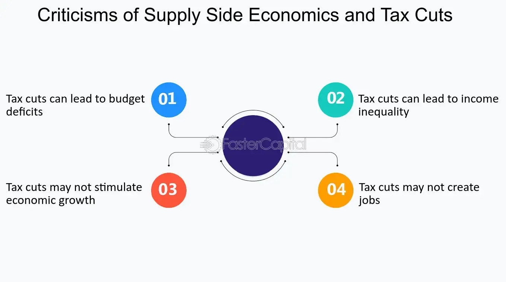

## Table of Contents

## What is supply-side economics?

Supply-side economics is an economic theory that focuses on increasing the supply of goods and services to boost economic growth. It suggests that lower taxes and fewer regulations for businesses can encourage them to produce more. When businesses produce more, they need more workers, which leads to more jobs and higher wages. This, in turn, can help the overall economy grow. The idea is that by helping producers, the benefits will eventually trickle down to everyone in the economy.

A key part of supply-side economics is the belief that lower taxes on income and businesses will lead to more investment. When people and businesses have more money after taxes, they are more likely to invest in new projects and businesses. This increased investment can lead to more innovation and growth. Critics of supply-side economics argue that it mainly benefits the rich and does not always lead to the promised economic growth for everyone. Despite this, many governments have used supply-side policies to try to boost their economies.

## What are the main principles of supply-side economics?

Supply-side economics believes that the best way to grow the economy is by helping businesses produce more. It says that if the government lowers taxes and cuts down on rules for businesses, companies will make more things. When businesses make more, they need more workers, so they hire more people. This leads to more jobs and higher pay for workers. The idea is that when businesses do well, everyone in the economy will benefit eventually.

Another big idea in supply-side economics is that lower taxes will lead to more investment. When people and businesses pay less in taxes, they have more money to spend on new projects and starting new companies. This can lead to new inventions and more growth in the economy. But some people argue that supply-side economics mainly helps rich people and doesn't always make life better for everyone. Even so, many governments have tried using these ideas to help their economies grow.

## What are the common criticisms of supply-side economics?

One common criticism of supply-side economics is that it mostly helps rich people and big businesses. Critics say that when taxes are lowered, especially for the wealthy, it doesn't always lead to more jobs or higher wages for everyone. Instead, the rich might just keep their extra money or spend it on things that don't help the economy grow, like luxury items. This means that the benefits don't "trickle down" to regular people as much as supply-side economists claim.

Another criticism is that supply-side policies can lead to bigger gaps between rich and poor people. When the government cuts taxes and regulations, it might make life harder for workers and the environment. For example, fewer rules could mean businesses pollute more or pay workers less. Also, if the government has less tax money, it might have to cut back on important services like schools and healthcare, which hurts people who need these services the most.

Lastly, some people argue that supply-side economics doesn't always work as promised. They say that cutting taxes doesn't always lead to more investment and growth. Sometimes, businesses might not use their extra money to hire more people or start new projects. Instead, they might just save it or give it to shareholders. This means the economy might not grow as much as supply-side economists hope, and the government ends up with less money to spend on things that help everyone.

## How does supply-side economics impact income inequality?

Supply-side economics can make income inequality worse. This happens because the main idea of supply-side economics is to lower taxes and reduce regulations for businesses and rich people. When taxes go down, rich people and big companies keep more of their money. But they don't always use this extra money to create more jobs or raise wages. Instead, they might spend it on things that don't help the economy grow, like fancy cars or big houses. So, the rich get richer, but the benefits don't always reach regular people.

Also, when the government cuts taxes, it has less money to spend on things like schools, healthcare, and help for poor people. These services are really important for people who don't have a lot of money. If the government can't afford to keep these services running well, it can make life harder for people who need them the most. So, while supply-side economics might help the economy grow a bit, it can also make the gap between rich and poor people even bigger.

## Can you explain the 'trickle-down' effect and its criticisms?

The 'trickle-down' effect is a big idea in supply-side economics. It says that when the government gives tax breaks and fewer rules to rich people and big businesses, they will use their extra money to create more jobs and start new projects. This should help the whole economy grow. The idea is that the benefits will start at the top with the rich people and then 'trickle down' to everyone else, making life better for all.

But many people don't think the trickle-down effect works well. Critics say that when rich people get tax cuts, they often don't use the extra money to help the economy grow. Instead, they might buy fancy things or save the money. So, the benefits don't really trickle down to regular people. This can make the gap between rich and poor people even bigger. Also, when the government cuts taxes, it has less money for important services like schools and healthcare, which can hurt people who need these services the most.

## What evidence exists against the effectiveness of supply-side tax cuts?

Some studies show that supply-side tax cuts don't always help the economy grow as much as promised. For example, after big tax cuts in the 1980s under President Reagan, the U.S. economy did grow, but not as much as expected. A lot of the extra money from the tax cuts went to rich people, and they didn't use it to create many new jobs or start new businesses. Instead, the gap between rich and poor people got bigger. This shows that the benefits might not trickle down to everyone as supply-side economics says they should.

Another piece of evidence comes from looking at different countries that tried supply-side policies. In some places, like Kansas in the U.S., big tax cuts led to less money for the government and didn't help the economy grow. The state had to cut back on important services like schools and roads, which hurt regular people. This suggests that cutting taxes doesn't always lead to more investment and growth, and it can make life harder for people who rely on government services.

## How do critics argue that supply-side economics affects government revenue?

Critics say that supply-side economics can hurt government revenue. When the government cuts taxes, especially for rich people and big businesses, it gets less money. This means the government has less to spend on important things like schools, hospitals, and roads. If the economy doesn't grow as much as expected, the government might have to borrow more money or cut back on services. This can make life harder for people who need these services.

Some studies show that after big tax cuts, like those in the 1980s in the U.S., the government didn't get more money back from a growing economy. Instead, the rich got richer, but the government still had less money. This made it tough to pay for important programs. Critics argue that the idea that tax cuts will lead to enough growth to make up for the lost revenue often doesn't happen, leaving the government in a tough spot financially.

## What are the historical examples where supply-side economics failed to meet its goals?

One big example of supply-side economics not working as planned is what happened in the United States during the 1980s under President Reagan. He cut taxes a lot, hoping that it would make the economy grow fast. But the growth wasn't as big as expected. Rich people got a lot more money, but they didn't use it to create many new jobs or start new businesses. Instead, the gap between rich and poor people got bigger. The government also had less money to spend on important things like schools and healthcare, which made life harder for many people.

Another example is what happened in Kansas in the early 2010s. The state cut taxes a lot, thinking it would help the economy grow. But it didn't work out that way. The economy didn't grow much, and the state ended up with a big budget problem. They had to cut back on services like schools and roads, which hurt a lot of people. This showed that cutting taxes doesn't always lead to more investment and growth, and it can make things worse for the government and regular people.

## How do Keynesian economists critique supply-side economics?

Keynesian economists think that supply-side economics doesn't help the economy as much as it says it will. They believe that the government should spend more money during tough times to help people and businesses. When the government spends more, it can create jobs and make the economy grow faster. Keynesian economists say that cutting taxes for rich people and businesses might not lead to more jobs or higher wages for everyone. Instead, they think that the rich might just keep their extra money or spend it on things that don't help the economy grow.

Another big point Keynesian economists make is that supply-side economics can make the gap between rich and poor people bigger. When the government cuts taxes, it has less money to spend on important things like schools and healthcare. This hurts people who need these services the most. Keynesian economists believe that the government should use its money to help everyone, not just the rich. They argue that supply-side policies often don't lead to the promised economic growth and can leave the government with less money to help people who are struggling.

## What are the arguments against supply-side economics in terms of economic growth?

Critics say that supply-side economics doesn't always make the economy grow as much as it promises. They argue that when the government cuts taxes, especially for rich people and big businesses, the extra money doesn't always lead to more jobs or new businesses. Instead, rich people might just save their money or spend it on things that don't help the economy grow, like fancy cars or big houses. This means the benefits don't "trickle down" to regular people as much as supply-side economists hope. Studies, like what happened in the 1980s under President Reagan, show that even though the economy grew a bit, it didn't grow as much as expected, and the gap between rich and poor people got bigger.

Another argument against supply-side economics is that it can hurt the government's ability to help the economy. When taxes are cut, the government has less money to spend on important things like schools, hospitals, and roads. If the economy doesn't grow enough to make up for the lost tax money, the government might have to borrow more or cut back on services. This can make life harder for people who need these services the most. Critics point to examples like Kansas in the early 2010s, where big tax cuts didn't lead to much growth and left the state with a big budget problem, showing that supply-side policies don't always work out as planned.

## How does supply-side economics influence inflation, according to its critics?

Critics say that supply-side economics can make inflation worse. When the government cuts taxes and businesses make more things, they might raise prices because they have more demand for their products. If the economy grows fast but the government doesn't have enough money to help everyone, people might have to pay more for things like food and housing. This can make inflation go up, which means the cost of living gets higher and can hurt people who don't have a lot of money.

Another point critics make is that supply-side economics can lead to too much money chasing too few goods. When rich people and businesses get tax cuts, they might spend more, but if the supply of goods doesn't grow fast enough, prices can go up. This can cause inflation because there's more money in the economy but not enough stuff to buy. Critics worry that this kind of inflation can make life harder for regular people, especially if the government can't help them with services like healthcare and education because it has less money from taxes.

## What alternative economic theories do critics of supply-side economics propose?

Critics of supply-side economics often support Keynesian economics. This theory says that the government should spend more money during tough times to help people and businesses. When the government spends more, it can create jobs and make the economy grow faster. Keynesian economists believe that cutting taxes for rich people and businesses might not lead to more jobs or higher wages for everyone. Instead, they think the government should use its money to help everyone, not just the rich. They argue that this way, the economy can grow in a way that helps more people and doesn't make the gap between rich and poor people bigger.

Another alternative is demand-side economics, which focuses on making sure people have enough money to buy things. This theory says that when people have more money to spend, businesses will make more things to meet the demand. This can help the economy grow without just helping the rich. Demand-side economists believe that things like raising the minimum wage, giving people unemployment benefits, and other ways to put more money in people's pockets can help the economy. They think this is a better way to make sure everyone benefits from economic growth, not just the people at the top.

## References & Further Reading

[1]: ["Advances in Financial Machine Learning"](https://www.amazon.com/Advances-Financial-Machine-Learning-Marcos/dp/1119482089) by Marcos Lopez de Prado

[2]: Bergstra, J., Bardenet, R., Bengio, Y., & Kégl, B. (2011). ["Algorithms for Hyper-Parameter Optimization."](https://dl.acm.org/doi/10.5555/2986459.2986743) Advances in Neural Information Processing Systems 24.

[3]: ["Evidence-Based Technical Analysis: Applying the Scientific Method and Statistical Inference to Trading Signals"](https://www.amazon.com/Evidence-Based-Technical-Analysis-Scientific-Statistical/dp/0470008741) by David Aronson

[4]: ["Machine Learning for Algorithmic Trading"](https://github.com/stefan-jansen/machine-learning-for-trading) by Stefan Jansen

[5]: ["Quantitative Trading: How to Build Your Own Algorithmic Trading Business"](https://www.amazon.com/Quantitative-Trading-Build-Algorithmic-Business/dp/1119800064) by Ernest P. Chan