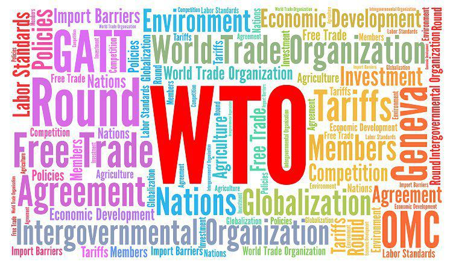

Globalization, trade, and financial markets are undergoing increased scrutiny as their complexities become more evident. In recent years, these interconnected domains have faced mounting criticism for facilitating economic disparities on a global scale. Organizations such as the World Trade Organization (WTO) are frequently identified as contributors to inequality in international trade dynamics. Established in 1995 with the goal of supervising and liberalizing global trade, the WTO has been criticized for its perceived favoritism towards developed nations at the expense of less affluent economies. This has sparked debates about the fairness and equity of the global economic framework.

Simultaneously, the evolution of technology has introduced algorithmic trading into financial markets, further complicating the landscape. This development, while promising increased efficiency and potential profits, has nonetheless raised questions about market fairness, accessibility, and transparency. Algorithmic trading enables transactions to be conducted at unprecedented speeds, often disadvantaging smaller investors unable to compete with high-frequency trading firms. As such, there are growing concerns that these technological advancements could exacerbate existing inequities within markets.

This article examines these pressing issues, exploring the criticisms directed at WTO trade policies and the implications of algorithmic trading. By analyzing these aspects, our goal is to uncover and better understand the multifaceted challenges emerging from globalization, trade, and technology in today's world. These reflections aim to highlight the necessity for critical assessments and potential reforms to ensure that international trade and financial markets operate in an equitable and transparent manner suitable for all participants.

## Table of Contents

## Understanding Globalization and the WTO

Globalization refers to the process by which international trade, economic integration, and cross-cultural exchanges have intensified due to advancements in technology, communications, and policy frameworks. It has facilitated the movement of goods, services, and capital across borders, contributing to increased economic activity and interconnectedness among nations. However, globalization's benefits are unevenly distributed, often raising concerns about the disparities it creates or exacerbates.

The World Trade Organization (WTO) plays a significant role in managing globalization through its mandate to oversee international trade agreements and resolve disputes among its member nations. Established on January 1, 1995, the WTO succeeded the General Agreement on Tariffs and Trade (GATT) and is headquartered in Geneva, Switzerland. As of 2023, the organization boasts 164 member countries, accounting for a substantial majority of global trade.

The primary functions of the WTO include facilitating negotiations on trade agreements, ensuring compliance with trade rules, and providing a forum for resolving trade disputes. Through these roles, the WTO aims to promote free and open trade across the globe, thereby enhancing economic growth and development.

However, the effectiveness of the WTO and its policies has been a subject of critique. Many critics argue that the WTO disproportionately benefits developed nations at the expense of developing countries. They contend that the organization enforces trade rules more stringently on developing nations while allowing developed countries to maintain protectionist measures, such as subsidies and tariffs, that hinder fair competition. This perceived bias is often attributed to the greater negotiating power and influence that advanced economies wield over trade policy discussions and decisions within the WTO framework.

Additionally, free market principles, which advocate for minimal governmental intervention in trade and commerce, are often championed by the WTO. Proponents argue that open markets can lead to job creation, increased consumer choice, and technological innovation. However, there remains a significant gap between theory and practice, as the promised economic upliftment often fails to reach the most vulnerable communities in developing economies.

A crucial aspect of globalization and WTO policies is that while they aim to create a level playing field, persistent inequalities and economic disparities remain evident. The phenomenon often leads to imbalances where wealth and opportunities are concentrated in specific regions or sectors, leaving others behind. As globalization continues to shape the international economic landscape, addressing these discrepancies becomes imperative to ensure that the benefits of global trade and integration are more evenly distributed across all nations and populations.

## Criticisms Against the WTO

The World Trade Organization (WTO) faces significant criticism for allegedly exacerbating economic imbalances through biased trade policies. Critics argue that the WTO's framework disproportionately benefits developed countries, leading to inequities in the global market. One predominant concern is the inconsistent enforcement of trade rules. This inconsistency often manifests in practices where penalties and sanctions are applied unevenly, favoring more economically powerful nations. The lack of transparency in the WTO's decision-making processes further complicates efforts to ensure fair and equal application of trade regulations.

Moreover, the WTO is often accused of being a platform that developed nations use to impose protectionist policies under the guise of free trade. By influencing trade agreements and negotiations, these nations can allegedly maintain economic dominance and hinder the growth potential of developing countries. This imbalance is particularly evident in sectors such as agriculture, textiles, and intellectual property rights, where developed countries secure advantageous terms that restrict market access for developing economies.

The consequence is a global trading environment where the promise of free trade is overshadowed by strategic maneuvers that safeguard the interests of affluent countries. This disproportionately affects countries with emerging economies, which struggle to compete on an uneven playing field. Advocates for reform argue that for the WTO to truly facilitate equitable trade, systemic changes are required to ensure transparency, fair rule enforcement, and genuine equality among member nations. Without such reforms, the envisioned benefits of globalization and trade remain elusive for many.

## Impact of Algorithmic Trading

Algorithmic trading, an evolution from traditional manual trading, utilizes computer algorithms to execute trades at speeds and frequencies human traders cannot achieve. These algorithms are designed to make trading decisions based on a set of predetermined criteria, such as timing, price, or [volume](/wiki/volume-trading-strategy), without direct human intervention. By automating the trading process, [algorithmic trading](/wiki/algorithmic-trading) offers the potential for substantial profits due to its speed and ability to process complex data quickly.

Despite its efficiency, algorithmic trading raises significant concerns regarding fairness and market [volatility](/wiki/volatility-trading-strategies). One prominent issue is the advantage it provides to those who can afford sophisticated infrastructure and technology, often leaving smaller investors at a disadvantage. High-frequency trading ([HFT](/wiki/high-frequency-trading-strategies)), a subset of algorithmic trading, epitomizes this disparity. HFT firms exploit tiny price discrepancies within milliseconds, a feat unattainable by regular human traders or those without similar resources, as noted by Aldridge and Krawciw (2017).

The accessibility barriers imposed by algorithmic trading highlight a critical fairness issue in modern financial markets. Smaller investors, who lack the means to compete technologically with large trading firms, often find themselves marginalized. This technology gap creates an uneven playing field, where market participants without access to high-speed algorithms face potential adverse effects on their trades and investments.

Moreover, the impact of algorithmic trading extends to market volatility. The same mechanisms that allow for rapid executions can exacerbate market fluctuations, as evidenced by several market events. For example, during the "Flash Crash" of May 6, 2010, the Dow Jones Industrial Average plummeted about 1,000 points within minutes, largely attributed to algorithmic trading patterns that created a cascade effect. 

These incidents underscore the potential for algorithm-induced volatility to lead to systemic risks within financial markets. The interconnected nature of algorithmic systems means that erroneous signals or unexpected interactions between competing algorithms can result in significant market disturbances.

To mitigate risks associated with algorithmic trading, regulatory challenges must be addressed. This includes implementing safeguards such as circuit breakers, which pause trading during extreme volatility, and imposing stricter regulations on the algorithms themselves to ensure they operate within ethical and safety standards. Ensuring transparency and accountability in algorithmic trading systems is essential to maintaining market integrity and building trust among all market participants.

In summary, while algorithmic trading embodies a technological marvel that brings increased efficiency and profit potential to financial markets, it also necessitates ongoing scrutiny and regulatory oversight to address issues of fairness, accessibility, and market stability. Balancing these factors is crucial in crafting a financial ecosystem where technological advances benefit all participants equitably.

## Intersections of Global Trade and Technology

Technological advancements have significantly influenced global trade dynamics, enhancing efficiency and accessibility while simultaneously magnifying existing inequities. Platforms such as the stock market have been transformed by these advancements, with algorithmic trading sitting at the forefront of this evolution. Algorithmic trading automates complex transactions using pre-programmed instructions and mathematical models, enabling high-speed trading that often surpasses human capabilities. This method has clear advantages, including increased market [liquidity](/wiki/liquidity-risk-premium), cost savings, and the ability to execute large volumes of trades with precision.

However, the same attributes that make algorithmic trading advantageous also contribute to its downsides. The speed and volume that characterize algorithmic transactions can lead to increased market volatility. Flash crashes, where the market suddenly precipitously declines only to quickly rebound, are a manifestation of such volatility. One notable example occurred on May 6, 2010, when the Dow Jones Industrial Average plunged by about 1,000 points within minutes, largely due to algorithmic trading activities. Such events raise concerns about the stability of markets increasingly dominated by algorithms.

Smaller investors may find themselves at a disadvantage in this landscape, as high-frequency trading (HFT) firms often have access to sophisticated algorithms and superior technological resources. These firms capitalize on minute price differences across markets, executing trades in milliseconds. This technological edge effectively creates a tiered market where individual and less tech-savvy investors may struggle to compete. The increasing predominance of algorithm-based trading raises ethical and economic concerns, especially regarding market accessibility and fairness.

To mitigate these challenges, trade policies and technological frameworks must evolve in sync. Regulatory bodies around the world are under pressure to create regulations that ensure markets remain fair and transparent. These could include implementing circuit breakers to prevent extreme volatility and scrutinizing algorithms for compliance with ethical standards. Furthermore, fostering technological innovation that includes fairer access across different market participant groups can play a significant role.

Addressing these concerns is not straightforward and requires multi-faceted approaches. Policymakers are tasked with balancing the promotion of technological innovation against the risk of exacerbating inequalities within and between markets. This balance is crucial to ensuring that technological advancements foster equitable economic development without compromising market integrity.

In conclusion, while technological advancements in global trade offer considerable efficiencies, they also necessitate careful consideration to avoid exacerbating inequities. These advancements require continuous evaluation and adaptation of trade policies and technological frameworks to ensure they contribute to a balanced and fair global economic environment.

## Case Studies and Real-World Implications

Examining real-world examples provides insight into the broader implications of globalization under the World Trade Organization (WTO) policies and algorithmic trading. These case studies illustrate both the advantages and challenges inherent in these global practices.

### Globalization under WTO Policies

One illustrative case is China’s accession to the WTO in 2001, which significantly impacted both China and global trade dynamics. For China, joining the WTO facilitated a tremendous surge in exports, contributing to the rapid growth of its economy. According to a World Bank report, China's GDP growth averaged about 9% a year, lifting hundreds of millions of people out of poverty. However, the benefits were not universally felt. In the United States and some European countries, industries such as steel and manufacturing experienced significant outsourcing, which led to job losses and economic disruption in certain regions.

The North American Free Trade Agreement (NAFTA) also exemplifies globalization’s dual-edged effects. NAFTA, like the WTO, aimed to reduce trade barriers and boost economic activity among the United States, Canada, and Mexico. While it succeeded in increasing trade and investment among these countries, critics argue that it also contributed to income inequality and job losses in sectors unable to compete with cheaper foreign labor.

### Algorithmic Trading and Market Disruptions

Algorithmic trading, which automates the execution of trades through pre-set programming, has both streamlined financial markets and presented new challenges. The “Flash Crash” of May 2010 serves as a prominent example. On this date, the Dow Jones Industrial Average plummeted nearly 1,000 points within minutes, only to recover shortly after. Investigations attributed this event partially to algorithmic trading systems that exacerbated market volatility. This incident underscored the need for more robust regulatory frameworks to oversee algorithmic practices to prevent such rapid and destabilizing market fluctuations.

Similarly, research indicates that algorithmic trading may disproportionately affect smaller investors who lack access to advanced trading technologies. This can lead to widened spreads and increased market volatility, particularly during periods of financial uncertainty. For instance, during Brexit and the COVID-19 pandemic, algorithms contributed to significant market swings, highlighting the challenges that high-frequency trading poses to market stability.

### Socio-Economic Impacts on Developing Nations

The socio-economic impacts of globalization and emerging technologies like algorithmic trading manifest distinctly in developing nations. For instance, in countries heavily dependent on agriculture, openness to international markets under WTO policies can lead to both opportunities and adversities. The introduction of subsidized agricultural products from developed nations often results in local farmers struggling to compete, threatening traditional livelihoods and exacerbating poverty in rural areas.

Conversely, globalization has facilitated technology transfer, improved access to international markets, and encouraged foreign direct investment. This can foster industrial growth and infrastructure development in developing countries, ultimately enhancing their economic prospects.

In conclusion, while globalization, WTO policies, and algorithmic trading present opportunities for economic growth, they also pose significant challenges that require careful management. Addressing these complexities involves crafting policies that balance trade liberalization with protective measures to ensure inclusive and sustainable growth for all nations, especially for those still striving to catch up.

## Conclusion

Globalization, the World Trade Organization (WTO), and algorithmic trading embody complex systems that significantly influence worldwide economic landscapes. Each system, while effective in optimizing trade and financial transactions, also demands rigorous critique and reform. The interconnectedness of these entities underscores the need for an equilibrium that supports both technological advancement and equitable economic growth.

Globalization facilitates the movement of goods, services, and capital across borders, ostensibly enhancing economic opportunities; however, it also highlights disparities among nations. The WTO, as a regulatory body, has been instrumental in promoting free trade, yet it is frequently criticized for favoring developed economies while leaving developing nations at a disadvantage. The organization's policies must be continuously scrutinized to ensure they are inclusive and equitable.

Algorithmic trading, characterized by its rapid execution of transactions, epitomizes the integration of technology in financial markets. It promises efficiency and the potential for profit maximization but simultaneously raises concerns regarding market fairness and accessibility. High-frequency trading firms often have an edge over individual investors, leading to an imbalanced market landscape. Therefore, regulatory measures are necessary to safeguard against market manipulation and to protect smaller investors.

The intersection of global trade and technology necessitates policies that evolve in tandem with innovations. Policymakers must consider ethical implications and address challenges such as transparency and equitable access to resources and markets. Ensuring that technological advancements coalesce with well-structured trade regulations will foster a more balanced and fair international economic system.

In conclusion, the multifaceted nature of globalization, the WTO, and algorithmic trading demands ongoing assessments and transformative actions. By critically evaluating these systems and implementing necessary reforms, the global community can work towards an integrated approach that enables sustainable and inclusive economic growth. Balancing technological progress with policy development is vital to achieving an equitable distribution of economic benefits.

## References & Further Reading

[1]: Hoekman, B. M., & Kostecki, M. M. (2009). ["The Political Economy of the World Trading System"](https://academic.oup.com/book/1467). Oxford University Press.

[2]: Bhagwati, J. (2008). ["Termites in the Trading System: How Preferential Agreements Undermine Free Trade"](https://www.cambridge.org/core/journals/world-trade-review/article/abs/termites-in-the-trading-system-how-preferential-agreements-undermine-free-trade-by-jagdish-bhagwati-oxford-university-press-oxford-2008/2D51FB590FE75C9EE4D26C8CCD859107). Oxford University Press.

[3]: Aldridge, I., & Krawciw, S. (2017). ["Real-time Risk: What Investors Should Know About Fintech, High-frequency Trading, and Flash Crashes."](https://www.amazon.com/High-Frequency-Trading-Practical-Algorithmic-Strategies/dp/0470563761) Wiley.

[4]: Slaughter, M. J., & Swagel, P. (1997). ["The Effect of Globalization on Wages in the Advanced Economies."](https://papers.ssrn.com/sol3/papers.cfm?abstract_id=95268) International Monetary Fund.

[5]: Hull, J. C. (2012). ["Options, Futures, and Other Derivatives"](https://www.semanticscholar.org/paper/Options%2C-Futures%2C-and-Other-Derivatives-Hull/89bdee500c8623864fc9eb7a471546aa713acc44) (9th edition). Pearson.