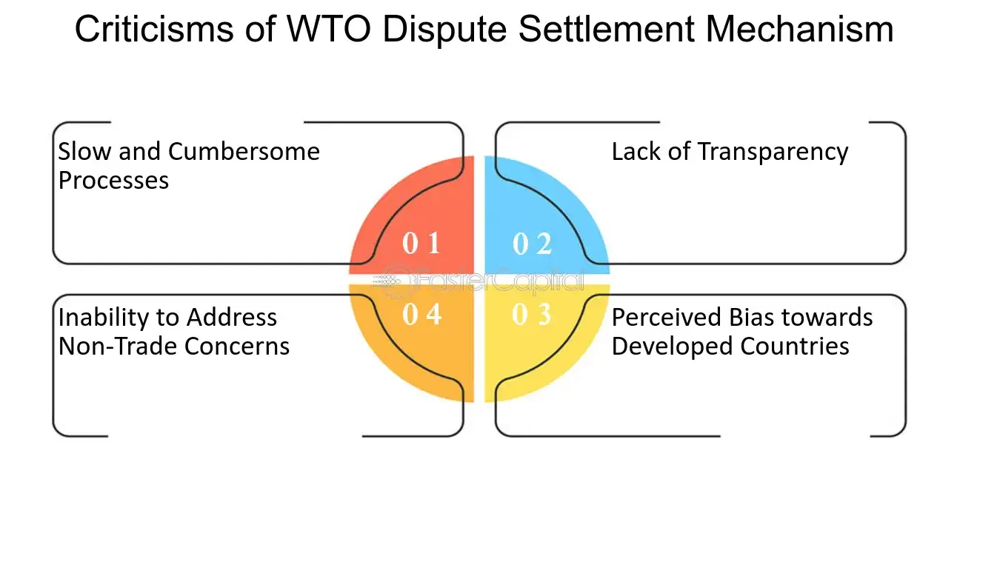

## Table of Contents

## What is the World Trade Organization (WTO)?

The World Trade Organization, or WTO, is an international group that helps countries trade with each other fairly. It was created in 1995 and has more than 160 countries as members. The main goal of the WTO is to make sure that trade between countries happens smoothly and without too many problems. It does this by setting rules that all member countries agree to follow. These rules help to stop countries from treating other countries unfairly when they trade.

The WTO also helps countries solve disagreements about trade. If two countries have a problem, they can go to the WTO to help them talk it out and find a solution. This is important because it helps keep the peace and makes sure that trade can continue. The WTO also holds meetings where countries can talk about new trade ideas and make new agreements. By working together, the WTO helps make the world's economy stronger and helps countries grow and develop.

## What are the main objectives of the WTO?

The main goal of the World Trade Organization (WTO) is to help countries trade with each other in a fair way. It does this by making rules that all member countries have to follow. These rules make sure that no country can treat another unfairly when they are trading. The WTO wants to make sure that trade happens smoothly, without too many problems. This helps the world's economy to grow and helps countries to develop.

Another important objective of the WTO is to help countries solve disagreements about trade. If two countries have a problem, they can go to the WTO to help them talk it out and find a solution. This is important because it helps keep the peace and makes sure that trade can continue. The WTO also holds meetings where countries can talk about new trade ideas and make new agreements. By working together, the WTO helps make the world's economy stronger and helps countries grow and develop.

## What are some common criticisms of the WTO?

Some people say that the WTO helps big, rich countries more than small, poor ones. They think that the rules made by the WTO are better for countries that already have a lot of money and power. These critics say that the WTO doesn't do enough to help poor countries grow and develop. They also think that the WTO should do more to make sure that everyone gets a fair chance to trade.

Another common criticism is that the WTO focuses too much on trade and not enough on other important things, like protecting the environment or workers' rights. Some people worry that the WTO's rules might make it harder for countries to protect their environment or to make sure that workers are treated fairly. They want the WTO to think more about these issues when it makes its rules and helps countries solve their trade disagreements.

## How does the WTO affect developing countries?

The World Trade Organization (WTO) affects developing countries in different ways. Some people think it helps them by making trade rules that everyone has to follow. This can give developing countries a chance to sell their products in bigger markets. For example, if a small country makes a lot of cotton, the WTO can help them sell that cotton to bigger countries. This can help the small country's economy grow and create jobs for people.

However, other people think the WTO can make things harder for developing countries. They say the rules are often made to help rich countries more than poor ones. Sometimes, these rules can make it tough for developing countries to protect their own businesses or to grow their economies the way they want. For example, if a developing country wants to help its farmers by giving them money, the WTO might say that's not allowed. This can make it harder for the country to help its own people.

Overall, the effect of the WTO on developing countries is a mix of good and bad. It depends a lot on the specific rules and how they are used. Some developing countries have been able to use the WTO to their advantage, while others feel like the rules are not fair to them. The WTO tries to help all countries trade fairly, but it's a big challenge to make sure everyone benefits equally.

## What are the environmental concerns related to WTO policies?

Some people worry that the WTO's rules might hurt the environment. They think the WTO focuses too much on making trade easier and not enough on protecting nature. For example, if a country wants to stop importing products that harm the environment, like certain types of plastic, the WTO might say that's not allowed because it goes against free trade. This can make it harder for countries to take action against pollution and other environmental problems.

Another concern is that the WTO's rules can lead to more trade, which can mean more shipping and more factories. This can increase the amount of pollution in the air and water. Some people want the WTO to think more about the environment when it makes its rules. They believe that trade should not come at the cost of the planet's health. The WTO has started to talk about these issues, but many people think it needs to do more to make sure that trade and environmental protection can work together.

## How does the WTO handle labor standards?

The WTO does not have its own rules about labor standards, like making sure workers are treated fairly or paid enough. Instead, it works with other groups like the International Labour Organization (ILO) to help countries talk about these issues. The WTO thinks that trade should not be used to make workers' conditions worse. But some people worry that the WTO's focus on free trade might make it harder for countries to protect their workers.

Some countries want the WTO to do more about labor standards. They think that if the WTO had stronger rules, it could stop countries from using low labor standards to get an advantage in trade. For example, if one country pays its workers very little, it might be able to sell things cheaper than other countries. This can be unfair to workers and businesses in other places. The WTO talks about these issues, but it's hard to make everyone agree on what to do.

## What is the Doha Development Round and why has it faced challenges?

The Doha Development Round is a big meeting that the World Trade Organization (WTO) started in 2001 in Doha, Qatar. The main goal was to help poor countries by making trade rules better for them. They wanted to lower trade barriers so that these countries could sell their products more easily in big markets. This round was supposed to focus on things like farming, services, and helping poor countries grow.

But the Doha Round has faced a lot of challenges. One big problem is that rich and poor countries want different things. Rich countries want to protect their own businesses and farms, while poor countries want more help to sell their products. It's hard to make everyone happy. Also, the meetings have been going on for a long time without much progress. Some people think the rules are too hard to change, and others think the world has changed a lot since 2001, so the old goals don't fit anymore. This has made it tough to finish the round and make new trade deals.

## How effective is the WTO's dispute settlement mechanism?

The WTO's dispute settlement mechanism is a way for countries to solve trade disagreements. It's like a referee that helps countries talk things out and find a solution. Many people think it works pretty well because it gives countries a fair way to settle their problems. If two countries can't agree on something about trade, they can go to the WTO. The WTO will listen to both sides and then decide what should happen. This helps keep trade going smoothly and stops countries from fighting over trade issues.

However, some people think the dispute settlement mechanism can be slow and complicated. It can take a long time to solve a problem, and the rules can be hard to understand. Sometimes, countries don't like the decisions the WTO makes, and they might not follow them. Also, the WTO's system for [picking](/wiki/asset-class-picking) judges has been having problems, which makes it harder to solve disputes quickly. Even with these issues, many countries still use the WTO to help them with trade disagreements because it's better than not having any way to solve problems at all.

## What role does the WTO play in global trade negotiations?

The World Trade Organization (WTO) helps countries talk about and make new trade rules. It brings countries together to discuss what they want from trade and how they can work together better. These meetings, called trade rounds, are important because they help countries agree on things like lowering taxes on goods or making it easier to sell services across borders. The WTO makes sure that everyone gets a chance to speak and that the talks are fair.

But, it's not always easy for the WTO to get countries to agree. Different countries want different things from trade. Rich countries might want to protect their own businesses, while poor countries might want more help to sell their products. This can make the talks long and hard. Even though it's tough, the WTO keeps trying to help countries find common ground so that trade can help everyone.

## How has the WTO responded to criticisms regarding transparency and inclusivity?

The World Trade Organization (WTO) has tried to make its work more open and fair by letting more people know what's going on. They do this by sharing more information about their meetings and decisions. They also invite people from different groups, like businesses and non-profit organizations, to come and talk about trade issues. This way, more people can understand what the WTO is doing and give their ideas.

But some people still think the WTO could do better. They say that even though the WTO shares more information, it can be hard to understand because it's often very detailed and technical. Also, some countries, especially smaller or poorer ones, might not have as much say in the meetings as bigger, richer countries. The WTO knows these are problems and keeps trying to make things better, but it's a big challenge to make everyone happy.

## What are the implications of the WTO's consensus-based decision-making process?

The WTO makes decisions by getting everyone to agree, which is called consensus. This means that all the countries have to say yes to a new rule or agreement. It's good because it makes sure that no country feels left out or treated unfairly. But it can also be really hard to get everyone to agree. Sometimes, even one country saying no can stop a new rule from happening. This can make the WTO slow at making changes or solving problems.

Because of this, the WTO can have a hard time moving forward. When countries have different ideas about what they want, it can take a long time to find a solution that everyone likes. This can be frustrating for countries that want to see quick changes in trade rules. But the consensus process also means that when the WTO does make a decision, it's usually one that a lot of countries can support. This helps keep the peace and makes sure that trade keeps going smoothly, even if it takes longer to get there.

## What future reforms have been proposed to address the challenges faced by the WTO?

People have suggested some changes to help the WTO work better. One big idea is to make the dispute settlement system faster and easier to use. Right now, it can take a long time to solve a trade problem, and some countries don't like the decisions. By making the process quicker and simpler, the WTO could help countries solve their disagreements more easily. Another idea is to make sure that all countries, especially smaller and poorer ones, have a bigger say in the meetings. This could help make the WTO more fair and inclusive.

Another change people talk about is updating the rules to fit today's world. The world has changed a lot since the WTO started, and some old rules don't work as well anymore. For example, new technology and issues like the environment and workers' rights are important now. The WTO could make new rules to deal with these things. Also, some people want the WTO to focus more on helping poor countries grow and develop. By making these changes, the WTO could be better at helping all countries trade fairly and solve their problems.

## References & Further Reading

[1]: Hoekman, B. M., & Kostecki, M. M. (2009). ["The Political Economy of the World Trading System"](https://academic.oup.com/book/1467). Oxford University Press.

[2]: Bhagwati, J. (2008). ["Termites in the Trading System: How Preferential Agreements Undermine Free Trade"](https://www.cambridge.org/core/journals/world-trade-review/article/abs/termites-in-the-trading-system-how-preferential-agreements-undermine-free-trade-by-jagdish-bhagwati-oxford-university-press-oxford-2008/2D51FB590FE75C9EE4D26C8CCD859107). Oxford University Press.

[3]: Aldridge, I., & Krawciw, S. (2017). ["Real-time Risk: What Investors Should Know About Fintech, High-frequency Trading, and Flash Crashes."](https://www.amazon.com/High-Frequency-Trading-Practical-Algorithmic-Strategies/dp/0470563761) Wiley.

[4]: Slaughter, M. J., & Swagel, P. (1997). ["The Effect of Globalization on Wages in the Advanced Economies."](https://papers.ssrn.com/sol3/papers.cfm?abstract_id=95268) International Monetary Fund.

[5]: Hull, J. C. (2012). ["Options, Futures, and Other Derivatives"](https://www.semanticscholar.org/paper/Options%2C-Futures%2C-and-Other-Derivatives-Hull/89bdee500c8623864fc9eb7a471546aa713acc44) (9th edition). Pearson.