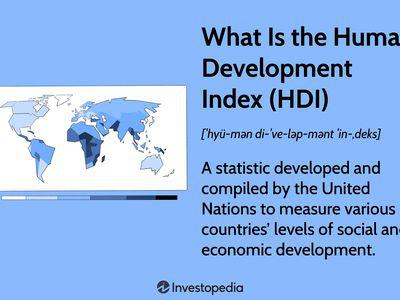

The Human Development Index (HDI) is a composite statistic that reflects a country's average achievements across three principal dimensions: life expectancy, education, and per capita income. These dimensions provide a broadened prism for assessing and comparing human well-being and development across different nations. Formulated by the United Nations Development Programme (UNDP), HDI serves as a crucial tool for monitoring long-term national progress. The index combines life expectancy at birth as an index of population health and longevity, education level measured by mean of years of schooling for adults aged 25 years or older, and expected years of schooling for children of school entering age, alongside Gross National Income (GNI) per capita indicating living standards. 

Originally introduced in the 1990 Human Development Report by Pakistani economist Mahbub ul Haq and Indian Nobel laureate Amartya Sen, the HDI was designed to emphasize that people and their capabilities should be the ultimate criteria for assessing the development of a country, not just economic growth. The HDI thus shifts focus from purely economic metrics such as Gross Domestic Product (GDP) toward a more nuanced understanding of development, emphasizing human welfare and quality of life.



There is growing interest in extending development indicators across diverse domains, including algorithmic trading, where traders are constantly seeking innovative methods to gain insights into market dynamics. Incorporating socio-economic indicators like the HDI into trading algorithms might inform investment strategies by reflecting a country’s developmental prospects, stability, and potential risks, providing traders with a more informed perspective on market conditions.

However, despite its widespread use, the HDI has faced criticism over its simplification of complex development aspects into a singular index. Critics argue that it does not account for inequality, poverty, or environmental sustainability—factors increasingly recognized as critical to comprehensive development metrics. This article aims to explore these criticisms in detail, juxtaposing the HDI against alternative development indices which strive to offer more multifaceted approaches. It will also investigate the applicability of these indicators in modern applications like algorithmic trading, thus bridging traditional economic assessment with emerging technological strategies.

## Table of Contents

## Understanding the Human Development Index (HDI)

The Human Development Index (HDI) is a composite statistic that provides a measure of a country’s average achievements in three fundamental dimensions of human development: life expectancy, education, and Gross National Income (GNI) per capita. Conceived by Pakistani economist Mahbub ul Haq and further developed by Indian economist Amartya Sen, the HDI was introduced in 1990 in the first Human Development Report published by the United Nations Development Programme (UNDP). It has since become a valuable tool for comparing the development levels of countries globally.

**Components of HDI**

1. **Life Expectancy:** This reflects the ability of the population to live a long and healthy life. It is measured using the life expectancy at birth indicator, focusing on the health and longevity of a country’s populace.

2. **Education Index:** This encompasses two metrics: mean years of schooling for adults aged 25 years or older, and expected years of schooling for children of school entry age. These figures are combined to assess the education component, indicating access to and quality of education.

3. **Gross National Income per Capita:** Adjusted to purchasing power parity (PPP), this metric measures the average income of a country's citizens, reflecting the standard of living. The natural logarithm of income is used to reflect the diminishing returns of income; that is, as income increases, its contribution to human development diminishes.

Mathematically, the HDI can be represented as the geometric mean of the normalized indices for each of the three dimensions:

$$
\text{HDI} = \left( \text{Life Expectancy Index} \times \text{Education Index} \times \text{Income Index} \right)^{1/3}
$$

**Historical Development and Implementation by UNDP**

The HDI was first developed in 1990, reflecting a growing interest in broadening measures of well-being that extend beyond traditional economic indicators like GDP. Mahbub ul Haq initiated the concept with the aim of shifting the focus of development economics from national income accounting to center stage people and their capabilities. Since then, the HDI has been published annually in the Human Development Reports produced by the UNDP, providing a picture of the advancements in human development over time.

**Significance in Ranking Countries**

The HDI serves as a comprehensive measure that allows for the comparison of countries' socio-economic development levels, evaluating the effectiveness of their policies in fostering human development. Countries are typically categorized into levels of human development: very high, high, medium, and low. Policymakers, researchers, and international organizations utilize HDI rankings to, for instance, identify areas where interventions are most needed or to allocate resources efficiently.

Through its multidimensional approach, the HDI helps illuminate broader aspects of development that economic indicators alone do not capture, thus providing a nuanced understanding of the comparative status of a country’s development.

## Criticisms of the Human Development Index

The Human Development Index (HDI) has been subject to various criticisms, primarily centered around its simplification of complex developmental dynamics into a single figure. This composite index, while lauded for its accessibility and wide usage, may inadvertently mask nuanced aspects of social and economic progress.

One major criticism is its exclusion of inequality, poverty, and environmental factors. The HDI's focus on life expectancy, education, and income does not account for disparities within populations. For instance, while the Inequality-adjusted HDI (IHDI) attempts to address this by considering inequalities in the distribution of each dimension, the standard HDI can present a skewed picture of development. Countries with similar HDI values might have vastly different levels of inequality, leading to misinterpretations in development status.

The omission of poverty and environmental degradation is another significant limitation. The HDI does not directly incorporate measures of poverty, nor does it reflect sustainable development practices, aspects increasingly regarded as fundamental to understanding a country's comprehensive development status. This oversight can lead to a situation where rapid economic growth, which might elevate the HDI score, could coincide with degrading environmental conditions and persistent poverty.

Cultural and contextual biases are also inherent in the HDI's methodology. The indicators used, such as formal education and income metrics, are critiqued for their Western-centric bias. Educational attainment is measured by years of schooling, which might not equate to quality or relevance in different cultural contexts. Similarly, the use of Gross National Income (GNI) fails to capture the informal economy in many developing nations where significant economic activity may occur outside formal structures.

The accuracy of measuring education and income poses considerable challenges. Educational data can be inconsistent, with variations in reporting standards and quality across countries. Income data, particularly in regions with large informal sectors, may not adequately reflect the true economic activity or the distribution of wealth.

Expert opinions highlight these limitations. Economist Amartya Sen, one of the creators of the HDI, acknowledges that while the index provides a broad overview, it should not be the sole measure of development due to its simplicity and the neglect of other critical dimensions. Case studies further illustrate these shortcomings; for example, countries like Saudi Arabia have high HDI rankings despite notable gender inequality, underscoring the index’s limitations in capturing such disparities.

Overall, while the HDI serves as a useful tool for general assessment of human development, its effectiveness is bounded by its methodological constraints. Acknowledging these criticisms is crucial for enhancing the understanding and application of development metrics.

## Alternative Development Indicators

Alternative development indicators have emerged to address the limitations of the Human Development Index (HDI), acknowledging that a single composite statistic may oversimplify the multifaceted nature of human development. Among these, the Inequality-adjusted HDI (IHDI), Gender Development Index (GDI), and Gross National Happiness (GNH) stand out for their attempts to incorporate aspects of inequality, gender disparities, and subjective well-being.

### Inequality-adjusted Human Development Index (IHDI)

The IHDI is an adaptation of the HDI that accounts for inequality in the three dimensions of human development: life expectancy, education, and income. While the HDI assumes an equal distribution of these dimensions across a population, the IHDI provides a more accurate reflection by reducing the HDI values in proportion to the inequality observed. This adjustment yields a clearer picture of the disparities within a society, which can be crucial for formulating targeted development policies. The main advantage of the IHDI is its ability to reveal hidden inequalities that might otherwise be overlooked by the HDI. However, its limitation lies in the complexity of calculating inequality levels and the constant need for precise and updated data from various regions.

### Gender Development Index (GDI)

The GDI measures gender equality in terms of achievements in the same three dimensions considered by the HDI. It is calculated by comparing female and male HDI values and provides insight into gender disparities. The GDI is particularly useful in highlighting countries where significant gender-based differences affect development outcomes, encouraging policies aimed at achieving gender parity. Nevertheless, the GDI's focus is limited to binary gender differences, potentially missing nuances in gender diversity and the roles of non-binary individuals. 

### Gross National Happiness (GNH)

Originating from Bhutan, GNH offers a holistic approach to measuring a nation's well-being beyond economic success, focusing on psychological well-being, health, education, and cultural and environmental conservation. This multidimensional index reflects the notion that sustainable development requires a balance of material and spiritual aspects. One of the strengths of GNH is its emphasis on cultural values and sustainability, aspects often overlooked by purely economic or income-focused measures. However, the main limitation is its subjective nature; happiness and well-being are difficult to quantify consistently across different societies and may not directly correlate with economic conditions.

### Multidimensional Poverty Indices and Sustainability-focused Measurements

Beyond these indices, multidimensional poverty indices aim to capture the non-income-based aspects of poverty, which traditional economic indicators might neglect. Similarly, sustainability-focused measurements accord importance to environmental resilience and the long-term viability of economic practices, essential in an era of increasing ecological concerns.

Overall, these alternative indicators provide more nuanced and comprehensive assessments of development. While each has its advantages in shedding light on specific aspects of human development, their limitations highlight the challenges of creating a universally applicable measure. These tools collectively inspire a continuous evaluation and enhancement of global development metrics, seeking to provide deeper insights beyond mere economic output.

## Integrating Development Indicators in Algo Trading

Development indicators such as the Human Development Index (HDI) play an increasingly pivotal role in [algorithmic trading](/wiki/algorithmic-trading) by offering insights into the socio-economic environment of various countries. In this context, these indicators serve as vital tools for assessing investment risks and opportunities in global markets. HDI and similar indicators, which encapsulate aspects like life expectancy, education, and income, help in understanding the general health and progression of economies. For traders, these metrics provide a broader economic perspective that can influence investment decisions, particularly in emerging markets where economic stability and development trajectories are critical concerns.

When assessing global market opportunities, traders can use development indicators to gauge the potential risk and return of investing in a particular country. A high HDI might indicate a stable economy with a skilled workforce and robust infrastructure, reducing investment risks. On the contrary, a low HDI could signal potential socio-economic challenges that might hinder economic performance or pose risks. By integrating these insights into trading algorithms, investors can optimize their portfolios by targeting markets with favorable development trends while mitigating those with adverse socio-economic conditions.

The incorporation of development indicators to predict market trends involves leveraging socio-economic data to understand potential market movements. For instance, improvements in a country’s education index may suggest a future boost in productivity and innovation, which could lead to economic growth. Similarly, positive shifts in life expectancy may indicate better healthcare and a healthier workforce, enhancing economic output. Traders may employ quantitative models that [factor](/wiki/factor-investing) in changes in these indicators to predict future economic performance and adjust trading strategies accordingly.

Python, being a versatile language for data analysis and [machine learning](/wiki/machine-learning), serves as an excellent tool for incorporating development indicators into trading algorithms. Here is a simple example of how one might use Python to analyze development data:

```python
import pandas as pd
import numpy as np
from sklearn.linear_model import LinearRegression

# Example data: HDI and GDP growth rate
data = pd.DataFrame({
    'HDI': [0.7, 0.8, 0.85, 0.9],
    'GDP_growth': [2, 3, 2.5, 4]
})

# Define dependent and independent variables
X = data['HDI'].values.reshape(-1, 1)
y = data['GDP_growth'].values

# Train a simple linear regression model
model = LinearRegression()
model.fit(X, y)

# Predict GDP growth based on HDI
predicted_growth = model.predict(np.array([[0.88]]))

print(f"Predicted GDP growth rate for HDI of 0.88: {predicted_growth[0]:.2f}%")
```

This code snippet uses a linear regression model to predict GDP growth based on HDI values, illustrating how development data can inform market predictions.

Integrating development indicators into trading algorithms also comes with challenges. One significant issue is the availability and reliability of data, especially in less developed regions where socio-economic data might be sparse or outdated. Moreover, the dynamic nature of global markets means that reliance solely on socio-economic indicators may not capture abrupt geopolitical changes, financial crises, or other factors that impact markets in the short term. The complexity of translating qualitative aspects of development into quantitative models can also be a hurdle.

Despite these challenges, the benefits are noteworthy. Development indicators provide a macroeconomic context that could enhance traditional financial and economic data analysis, leading to a more holistic investment strategy. By understanding the socio-economic landscape through these indicators, traders can not only identify growth opportunities but also better assess potential risks, leading to more informed decision-making processes. The fusion of development data with algorithmic trading signifies an innovative progression in how global markets are analyzed and engaged with.

## Conclusion

The Human Development Index (HDI), while a widely recognized tool, faces criticisms due to its inherent limitations. Primarily, it oversimplifies the multifaceted nature of development by compressing complex socio-economic factors into a single numeric value. This simplification often excludes critical elements like inequality, poverty, and environmental sustainability. Critics also highlight the cultural and contextual biases that may skew data representation and affect the reliability of HDI, particularly in countries with varied educational measurements and income standards.

In response, alternative indicators such as the Inequality-adjusted HDI (IHDI), Gender Development Index (GDI), and Gross National Happiness (GNH) emerge to offer a broader assessment of development. These measures attempt to incorporate factors like gender disparities, happiness, and inequality, thereby offering a potentially more rounded understanding of a nation's progress. Moreover, indicators focusing on multidimensional poverty and sustainable development further illustrate this comprehensive approach, addressing many criticisms leveled at HDI.

Notably, the application of development indicators like HDI has found innovative uses outside traditional evaluation, notably in algorithmic trading. Traders leverage these metrics to gauge investment risks and opportunities influenced by socio-economic shifts. By integrating HDI and similar indicators into trading algorithms, they aim to anticipate market trends driven by developmental changes across the globe. This approach not only broadens the application of development metrics but also enhances the predictive accuracy in financial markets.

As development indicators increasingly intersect with technological applications, it becomes essential to continuously refine these measurement tools. Ongoing evaluation and improvement ensure they remain relevant and effective in capturing the nuances of human development in an ever-evolving global landscape.

## References & Further Reading

[1]: United Nations Development Programme (1990). ["Human Development Report 1990."](https://hdr.undp.org/content/human-development-report-1990) Oxford University Press.

[2]: Sen, A., & Mueller, D. C. (1997). ["Inequality, Poverty and Welfare."](https://onlinelibrary.wiley.com/doi/abs/10.1002/j.2325-8012.1997.tb00063.x) Oxford University Press.

[3]: Stiglitz, J. E., Sen, A., & Fitoussi, J. P. (2010). ["Mismeasuring Our Lives: Why GDP Doesn't Add Up."](https://www.wcfia.harvard.edu/publications/mismeasuring-our-lives-why-gdp-doesnt-add) The New Press.

[4]: Ravallion, M. (2010). ["Troubling Tradeoffs in the Human Development Index."](https://www.sciencedirect.com/science/article/pii/S0304387812000041) Journal of Economic Inequality.

[5]: Hirai, T. (2017). ["The Creation of the Human Development Approach"](https://link.springer.com/book/10.1007/978-3-319-51568-7) Springer.

[6]: Alkire, S., & Santos, M. E. (2010). ["Acute Multidimensional Poverty: A New Index for Developing Countries."](https://hdr.undp.org/system/files/documents/hdrp201011.pdf) Human Development Research Paper 2010/11, UNDP.

[7]: Neumayer, E. (2001). ["The Human Development Index and Sustainability—a Constructive Proposal"](https://www.sciencedirect.com/science/article/pii/S0921800901002014) Ecological Economics, Volume 39, Issue 1.

[8]: Alkire, S., Kanagaratnam, U., & Suppa, N. (2019). ["The Global Multidimensional Poverty Index (MPI) 2019."](https://ophi.org.uk/publication/MN-47) OPHI MPI Methodological Note 49. 

[9]: Bourguignon, F., & Morrison, C. (2002). ["Inequality Among World Citizens: 1820-1992."](https://www.jstor.org/stable/3083279) The American Economic Review, Vol. 92, No. 4.

[10]: Botzen, W.J.W., & Bergh, J.C.J.M. van den. (2009). ["Specifications of social welfare in economic studies of climate policy: Overview of criteria and related policy insights."](https://agupubs.onlinelibrary.wiley.com/doi/pdf/10.1029/2009WR007743) Environmental Science & Policy, Volume 12, Issue 7. 

[11]: Anand, S., & Sen, A. (1994). ["Human Development Index: Methodology and Measurement."](https://hdr.undp.org/content/human-development-index-methodology-and-measurement) Occasional Papers No. 12, UNDP.