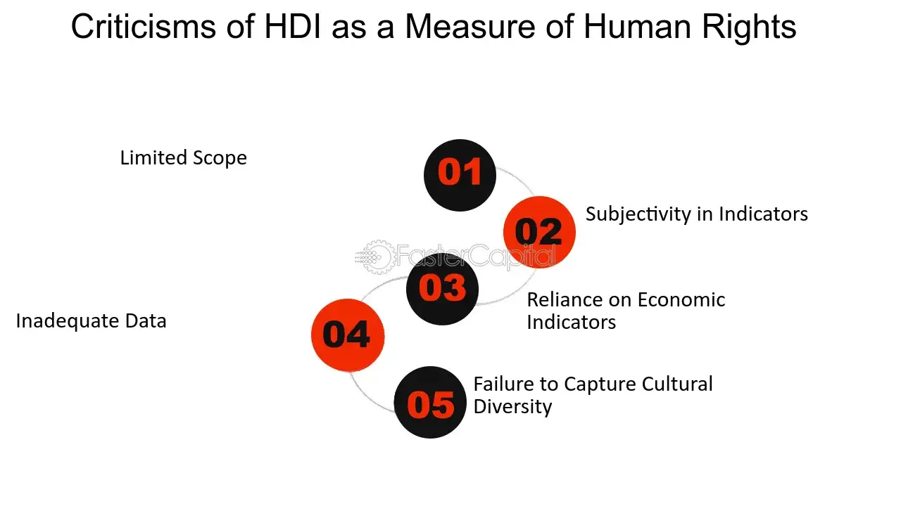

## Table of Contents

## What is the Human Development Index (HDI)?

The Human Development Index (HDI) is a way to measure how well a country is doing in terms of its people's lives. It looks at three main things: how long people live, how much education they get, and how much money they earn. By combining these three factors, the HDI gives a single number that shows the overall level of human development in a country. A higher HDI score means that people in that country generally live longer, are more educated, and have a higher standard of living.

The HDI was created by the United Nations to help compare the development levels of different countries. It's useful because it doesn't just focus on money, like some other measures do. Instead, it tries to give a fuller picture of how well people are doing. Countries with high HDI scores, like Norway and Australia, are seen as having good living conditions for their people. On the other hand, countries with lower HDI scores might need more help to improve things like health care and education for their citizens.

## Why was the HDI created?

The HDI was created because people wanted a better way to measure how well countries were doing. Before the HDI, people mostly used how much money a country made to judge it. But money alone doesn't tell the whole story. The HDI was made to look at other important things like how long people live and how much education they get. This way, it gives a fuller picture of how well people in a country are doing.

The United Nations came up with the HDI in 1990. They wanted to show that development is not just about money, but about improving people's lives in many ways. By including health and education along with income, the HDI helps countries see where they need to focus to make life better for their people. It also helps compare different countries and see which ones are doing a good job at helping their people live longer, healthier, and more educated lives.

## What are the main components of the HDI?

The Human Development Index (HDI) has three main parts: life expectancy, education, and income. Life expectancy looks at how long people live on average in a country. This shows how healthy people are and how good the healthcare system is. Education is measured by looking at how many years of school people go to and how many years they actually spend in school. This tells us how much people are learning and how good the education system is.

The third part of the HDI is income, which looks at how much money people earn. This is measured by something called Gross National Income (GNI) per person. It shows how well people are doing financially. By combining these three parts, the HDI gives a single number that shows how well a country is doing in terms of its people's lives. A higher HDI score means people in that country are living longer, getting more education, and [earning](/wiki/earning-announcement) more money.

## What are some general criticisms of the HDI?

Some people say the HDI has problems. One big issue is that it mixes different things like health, education, and money into one number. This can make it hard to see which areas a country needs to work on most. For example, if a country has a high HDI score, it might look good overall, but it could still have big problems in one area, like education. Also, the HDI doesn't take into account things like inequality. Two countries could have the same HDI score, but in one country, the wealth might be shared more fairly than in the other.

Another criticism is that the HDI can be hard to compare across different countries because it uses averages. This means it might not show the real situation for everyone in a country. For example, if a few rich people live much longer and earn a lot more money, it can make the country's HDI look better than it really is for most people. Also, the HDI doesn't look at things like political freedom or environmental quality, which are important for people's lives too. So while the HDI is useful, it doesn't tell the whole story about how well a country is doing.

## How does the HDI fail to account for income inequality within a country?

The HDI does not look at how evenly money is spread out in a country. It just uses an average number called Gross National Income (GNI) per person. This means that if a few people in a country are very rich, it can make the country's HDI score look good, even if most people are not doing well. For example, if a country has a few billionaires but many poor people, the HDI might still show a high score because it only looks at the average income.

This is a big problem because income inequality can affect how people live their lives. If a lot of people in a country are poor, they might not be able to get good healthcare or education, even if the country's HDI score is high. The HDI doesn't show these differences, so it might make it seem like everyone in the country is doing okay when really, only a few people are doing well. This is why some people say the HDI needs to be used along with other measures that look at how money is shared among people.

## In what ways does the HDI overlook environmental sustainability?

The HDI does not consider how well a country is doing in terms of taking care of the environment. It focuses on health, education, and income, but it does not look at things like air and water quality, or how much a country is using up its natural resources. This means a country could have a high HDI score but be harming the environment a lot. For example, a country might have good healthcare and education, but if it's polluting a lot, that's not good for the future.

Because the HDI does not include environmental factors, it might make it seem like a country is doing well when really, it's not taking care of the planet. This is important because the environment affects people's lives too. If a country is not sustainable, it might face big problems in the future, like running out of clean water or having bad air to breathe. So, while the HDI is useful, it does not give the full picture of how well a country is doing if you don't also look at how it's treating the environment.

## How does the HDI's methodology limit its accuracy in measuring development?

The HDI's way of measuring development can be tricky because it puts together health, education, and income into one number. This mix can hide big problems in one area. For example, a country might have a high HDI score because its people live long and earn good money, but if its schools are not good, the HDI won't show that. Also, the HDI uses averages, which means it might not show the real situation for everyone. If a few rich people live long and earn a lot, it can make the country's HDI look good, even if most people are not doing well.

Another problem with the HDI is that it does not look at how money is shared in a country. If a country has a few very rich people and many poor people, the HDI might still show a high score because it only looks at the average income. This can make it seem like everyone is doing okay when really, only a few people are doing well. Also, the HDI does not think about the environment. A country could have a high HDI but be hurting the planet a lot. This means the HDI might make a country look good, but it's not telling the whole story about how well the country is taking care of its people and the world around them.

## What alternative indices have been proposed to address the shortcomings of the HDI?

To fix some of the problems with the HDI, people have come up with other ways to measure how well countries are doing. One of these is the Inequality-adjusted Human Development Index (IHDI). The IHDI looks at the same things as the HDI—health, education, and income—but it also thinks about how these things are shared among people. This means it can show if a country has big differences between rich and poor people. Another index is the Gender Development Index (GDI), which looks at how men and women are doing in terms of health, education, and income. This helps show if a country is fair to both men and women.

Another alternative is the Multidimensional Poverty Index (MPI), which looks at more than just money. It checks things like if people have enough food, clean water, and good housing. This can give a better idea of how many people are really poor in a country. There's also the Happy Planet Index (HPI), which tries to measure how happy and healthy people are while also thinking about how well the country is taking care of the environment. This index shows that a country can have a high HDI but not be doing well in terms of making its people happy and keeping the planet healthy. These different indices help give a fuller picture of how well countries are doing and where they need to improve.

## How do cultural differences impact the relevance of the HDI across different countries?

Cultural differences can make the HDI less useful when comparing different countries. The HDI looks at things like how long people live, how much education they get, and how much money they earn. But what people value can be different in different cultures. For example, in some cultures, living a long life might not be as important as living a meaningful life. Also, the way education is valued can be different. In some places, going to school for many years might not be seen as important as learning skills that help in everyday life. So, the HDI might not show what really matters to people in different countries.

Another way cultural differences affect the HDI is in how income is seen. In some cultures, having a lot of money might not be as important as having strong family ties or community support. The HDI focuses a lot on money, but it does not think about these other things that can be very important to people. This means that a country might have a high HDI score, but if its people value other things more than money, the HDI might not show how well they are really doing. So, while the HDI can be helpful, it's important to think about cultural differences when using it to compare countries.

## What are the statistical criticisms of the HDI's aggregation method?

The HDI's way of putting together health, education, and income into one number can be tricky. It uses a method called geometric mean to mix these three things. Some people say this way of mixing can hide big problems in one area. For example, if a country is doing really well in health and income but not so good in education, the HDI might still show a high score. This is because the good scores in health and income can make up for the bad score in education. So, the HDI might not show the real situation for each part.

Also, the HDI uses averages, which can make it hard to see the real situation for everyone in a country. If a few rich people live long and earn a lot, it can make the country's HDI look good, even if most people are not doing well. This is because the HDI does not think about how money, health, and education are shared among people. It just looks at the average for the whole country. So, while the HDI can be helpful, it might not tell the whole story about how well a country is doing.

## How have changes in the HDI's calculation over time affected its reliability?

The way the HDI is calculated has changed a few times since it was first made in 1990. These changes were made to make the HDI better and more accurate. For example, in 2010, the United Nations changed how they measure education and income. Instead of just looking at the number of people who can read and write, they started looking at how many years of school people go to and how many years they actually spend in school. They also changed how they measure income to use something called Gross National Income (GNI) per person instead of just looking at how much money a country makes. These changes were meant to make the HDI a better way to measure how well countries are doing.

But these changes can make it hard to compare HDI scores from different years. If you want to see how a country has improved over time, the old HDI scores might not be the same as the new ones because they were calculated differently. This can make it seem like a country has gotten better or worse than it really has. So, while the changes have made the HDI more accurate now, they can make it harder to trust the HDI when looking at how countries have changed over time.

## What advanced critiques exist regarding the theoretical foundations of the HDI?

Some people say the HDI is based on ideas that might not be the best way to measure how well a country is doing. One big idea behind the HDI is that health, education, and income are the most important things for people's lives. But some people think this leaves out other important things like how happy people are, how free they are, and how well the environment is taken care of. They say that just looking at health, education, and income does not give a full picture of what makes life good for people.

Another problem some people see is that the HDI treats health, education, and income as if they are equally important. But in real life, people might think one of these things is more important than the others. For example, in some places, having good health might be more important than having a lot of education. The HDI does not think about these differences, so it might not show what really matters to people in different countries. This makes some people question if the HDI is really a good way to compare how well countries are doing.

## What is the Human Development Index (HDI) and how is it understood?

The Human Development Index (HDI) is a composite statistic that provides a measure of a country’s average achievements in three fundamental dimensions of human development: life expectancy, education, and Gross National Income (GNI) per capita. Conceived by Pakistani economist Mahbub ul Haq and further developed by Indian economist Amartya Sen, the HDI was introduced in 1990 in the first Human Development Report published by the United Nations Development Programme (UNDP). It has since become a valuable tool for comparing the development levels of countries globally.

**Components of HDI**

1. **Life Expectancy:** This reflects the ability of the population to live a long and healthy life. It is measured using the life expectancy at birth indicator, focusing on the health and longevity of a country’s populace.

2. **Education Index:** This encompasses two metrics: mean years of schooling for adults aged 25 years or older, and expected years of schooling for children of school entry age. These figures are combined to assess the education component, indicating access to and quality of education.

3. **Gross National Income per Capita:** Adjusted to purchasing power parity (PPP), this metric measures the average income of a country's citizens, reflecting the standard of living. The natural logarithm of income is used to reflect the diminishing returns of income; that is, as income increases, its contribution to human development diminishes.

Mathematically, the HDI can be represented as the geometric mean of the normalized indices for each of the three dimensions:

$$
\text{HDI} = \left( \text{Life Expectancy Index} \times \text{Education Index} \times \text{Income Index} \right)^{1/3}
$$

**Historical Development and Implementation by UNDP**

The HDI was first developed in 1990, reflecting a growing interest in broadening measures of well-being that extend beyond traditional economic indicators like GDP. Mahbub ul Haq initiated the concept with the aim of shifting the focus of development economics from national income accounting to center stage people and their capabilities. Since then, the HDI has been published annually in the Human Development Reports produced by the UNDP, providing a picture of the advancements in human development over time.

**Significance in Ranking Countries**

The HDI serves as a comprehensive measure that allows for the comparison of countries' socio-economic development levels, evaluating the effectiveness of their policies in fostering human development. Countries are typically categorized into levels of human development: very high, high, medium, and low. Policymakers, researchers, and international organizations utilize HDI rankings to, for instance, identify areas where interventions are most needed or to allocate resources efficiently.

Through its multidimensional approach, the HDI helps illuminate broader aspects of development that economic indicators alone do not capture, thus providing a nuanced understanding of the comparative status of a country’s development.

## References & Further Reading

[1]: United Nations Development Programme (1990). ["Human Development Report 1990."](https://hdr.undp.org/content/human-development-report-1990) Oxford University Press.

[2]: Sen, A., & Mueller, D. C. (1997). ["Inequality, Poverty and Welfare."](https://onlinelibrary.wiley.com/doi/abs/10.1002/j.2325-8012.1997.tb00063.x) Oxford University Press.

[3]: Stiglitz, J. E., Sen, A., & Fitoussi, J. P. (2010). ["Mismeasuring Our Lives: Why GDP Doesn't Add Up."](https://www.wcfia.harvard.edu/publications/mismeasuring-our-lives-why-gdp-doesnt-add) The New Press.

[4]: Ravallion, M. (2010). ["Troubling Tradeoffs in the Human Development Index."](https://www.sciencedirect.com/science/article/pii/S0304387812000041) Journal of Economic Inequality.

[5]: Hirai, T. (2017). ["The Creation of the Human Development Approach"](https://link.springer.com/book/10.1007/978-3-319-51568-7) Springer.

[6]: Alkire, S., & Santos, M. E. (2010). ["Acute Multidimensional Poverty: A New Index for Developing Countries."](https://hdr.undp.org/system/files/documents/hdrp201011.pdf) Human Development Research Paper 2010/11, UNDP.

[7]: Neumayer, E. (2001). ["The Human Development Index and Sustainability—a Constructive Proposal"](https://www.sciencedirect.com/science/article/pii/S0921800901002014) Ecological Economics, Volume 39, Issue 1.

[8]: Alkire, S., Kanagaratnam, U., & Suppa, N. (2019). ["The Global Multidimensional Poverty Index (MPI) 2019."](https://ophi.org.uk/publication/MN-47) OPHI MPI Methodological Note 49. 

[9]: Bourguignon, F., & Morrison, C. (2002). ["Inequality Among World Citizens: 1820-1992."](https://www.jstor.org/stable/3083279) The American Economic Review, Vol. 92, No. 4.

[10]: Botzen, W.J.W., & Bergh, J.C.J.M. van den. (2009). ["Specifications of social welfare in economic studies of climate policy: Overview of criteria and related policy insights."](https://agupubs.onlinelibrary.wiley.com/doi/pdf/10.1029/2009WR007743) Environmental Science & Policy, Volume 12, Issue 7. 

[11]: Anand, S., & Sen, A. (1994). ["Human Development Index: Methodology and Measurement."](https://hdr.undp.org/content/human-development-index-methodology-and-measurement) Occasional Papers No. 12, UNDP.