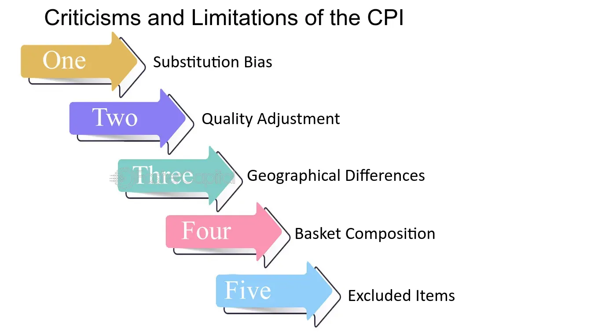

## Table of Contents

## What is the Consumer Price Index (CPI)?

The Consumer Price Index, or CPI, is a way to measure how the prices of things we buy change over time. It looks at the average prices of a basket of goods and services that people typically buy, like food, clothes, and gas. By comparing these prices from one period to another, the CPI helps us understand if things are getting more expensive or if they're staying about the same.

The CPI is important because it helps people and the government understand inflation, which is when prices go up over time. If the CPI goes up, it means that on average, prices are higher than they were before. This can affect how much money people have to spend and how the government makes decisions about things like interest rates and social security benefits. The CPI is used all over the world to help make these kinds of decisions.

## Why is the CPI important for measuring inflation?

The CPI is important for measuring inflation because it shows how the prices of things we buy every day are changing. It looks at a big list of things like food, clothes, and gas, and sees if they cost more or less than they did before. If the CPI goes up, it means that on average, things are getting more expensive. This is what we call inflation.

Knowing the rate of inflation is really helpful for everyone. For people, it can help them understand if their money will buy less in the future. For the government, it's important because it helps them decide things like how much to pay people on social security or if they need to change interest rates to control the economy. So, the CPI is a big deal because it helps us all plan for the future and keep our money's value in check.

## What are some common criticisms of the CPI?

Some people think the CPI doesn't always show the true cost of living. They say it doesn't change fast enough to show new things we buy or if we start buying different stuff. For example, if everyone starts using smartphones instead of landline phones, the CPI might still be looking at the old prices. This can make it seem like prices aren't going up as much as they really are.

Another problem people mention is that the CPI might not be the same for everyone. It uses an average of what people buy, but not everyone buys the same things. If you live in a big city, your costs might go up faster than what the CPI says because things like rent can be much higher there. So, the CPI might not be as helpful for everyone, especially if their spending is different from the average.

Lastly, some critics say the CPI can be slow to show big changes in prices. If there's a sudden jump in the price of something important, like gas, the CPI might not show that right away. This delay can make it hard for the government and people to react quickly to inflation.

## How does the CPI's basket of goods and services affect its accuracy?

The CPI's basket of goods and services is like a shopping list that includes things like food, clothes, and gas. This list is supposed to show what people usually buy, but it can be hard to keep it up to date. If people start buying new things, like smartphones instead of landline phones, the CPI might not change fast enough to include these new items. This can make the CPI less accurate because it might not show the true cost of living if it's still looking at old prices.

Also, everyone's shopping list is different. The CPI uses an average of what people buy, but not everyone buys the same things. If you live in a big city, your costs might go up faster than what the CPI says because things like rent can be much higher there. So, the CPI might not be as helpful for everyone, especially if their spending is different from the average. This can make the CPI less accurate for people whose shopping lists don't match the average.

In the end, the CPI's basket of goods and services can affect how well it measures inflation. If it doesn't change to match what people are buying now, or if it doesn't consider that everyone's shopping list is different, the CPI might not give a clear picture of how prices are changing. This can make it harder for people and the government to understand and plan for inflation.

## Can you explain the substitution bias in the CPI?

Substitution bias in the CPI happens when people start buying different things because the prices change, but the CPI doesn't change its basket of goods and services fast enough. For example, if the price of beef goes up a lot, people might start buying more chicken instead. But the CPI might keep looking at the price of beef and not notice that people are buying more chicken. This can make the CPI seem like prices are going up more than they really are because it's not showing that people are switching to cheaper options.

This bias can make the CPI less accurate because it doesn't show how people actually change what they buy to save money. If the CPI doesn't update its basket to match what people are buying now, it might say inflation is higher than it really is. This can be a problem because it might make people and the government think prices are going up faster than they really are, which can affect decisions about things like interest rates and social security benefits.

## What is the effect of quality adjustments on the CPI?

Quality adjustments in the CPI are changes made to account for when products get better or worse over time. If a new TV comes out that's much better than the old one but costs the same, the CPI might adjust the price to show that you're getting more for your money. This helps keep the CPI accurate by making sure it's not just looking at the price tag, but also what you're getting for that price.

However, making these adjustments can be tricky. Sometimes it's hard to tell how much better a new product really is, and different people might have different opinions on what counts as an improvement. If the CPI gets these adjustments wrong, it might say that prices are going up slower than they really are. This can make it harder for people and the government to understand how much things are really costing and plan for the future.

## How does the CPI handle new products and technological changes?

The CPI tries to keep up with new products and technology by updating its basket of goods and services. When new things like smartphones come out, the CPI might add them to the list if a lot of people start buying them. But this can take time, and sometimes the CPI might still be looking at old prices while new products are already changing how much people spend. This can make the CPI less accurate because it might not show the true cost of living if it's not keeping up with what people are buying now.

Another way the CPI deals with new technology is by making quality adjustments. If a new TV comes out that's much better than the old one but costs the same, the CPI might adjust the price to show that you're getting more for your money. This helps keep the CPI accurate by making sure it's not just looking at the price tag, but also what you're getting for that price. But figuring out how much better a new product is can be hard, and if the CPI gets it wrong, it might say that prices are going up slower than they really are.

## What are the implications of the CPI's geographic coverage?

The CPI looks at prices from all over a country, but it might not be the same for everyone in different places. If you live in a big city, things like rent and food might cost more than what the CPI says because it averages prices from everywhere. This can make the CPI less helpful for people in cities where prices go up faster than in other places. It's like if the CPI is looking at the whole country's shopping list, but your city's list is different and more expensive.

Even though the CPI tries to cover the whole country, it can be hard to make sure it's right for everyone. If the CPI doesn't change to match the prices in different areas, it might not show the true cost of living for people in those places. This can make it harder for people and the government to understand and plan for inflation, especially if they live somewhere with prices that are different from the national average.

## How does the CPI's sampling methodology impact its reliability?

The CPI's sampling methodology is how it picks the prices it looks at. It tries to pick a good mix of prices from all over the country to get an average. But if it doesn't pick the right prices, the CPI might not be very accurate. For example, if it only looks at prices from small towns and not big cities, it might say that prices are lower than they really are for a lot of people. This can make the CPI less reliable because it's not showing the true cost of living for everyone.

Also, the CPI updates its list of prices every few years, but prices can change a lot in between those updates. If the CPI doesn't change its list often enough, it might keep looking at old prices while new prices are already different. This can make the CPI less reliable because it's not keeping up with how prices are changing now. So, the way the CPI picks its prices can really affect how well it measures inflation and helps people and the government plan for the future.

## What are the differences between the CPI and the Personal Consumption Expenditures (PCE) index?

The Consumer Price Index (CPI) and the Personal Consumption Expenditures (PCE) index are both ways to measure how prices change over time, but they do it a bit differently. The CPI looks at a fixed basket of goods and services that people usually buy, like food, clothes, and gas. It tries to see how the prices of these things change from one period to another. On the other hand, the PCE index looks at what people actually spend their money on, and it changes its basket more often to match what people are buying now. This means the PCE can be more up-to-date and might show a different rate of inflation than the CPI.

Another big difference is how they handle changes in what people buy. The CPI can have a problem called substitution bias, where it doesn't change fast enough if people start buying different things because prices change. For example, if beef gets expensive and people switch to chicken, the CPI might still look at beef prices. The PCE index is better at dealing with this because it updates its basket more often and looks at what people are spending money on right now. This makes the PCE index a bit more accurate when it comes to showing how prices are changing in real life.

## How do hedonic adjustments influence the CPI, and what criticisms do they attract?

Hedonic adjustments are changes made to the CPI to account for when products get better or worse over time. For example, if a new TV comes out that's much better than the old one but costs the same, the CPI might adjust the price to show that you're getting more for your money. This helps keep the CPI accurate by making sure it's not just looking at the price tag, but also what you're getting for that price. Without these adjustments, the CPI might say prices are going up when really, you're just getting better stuff for the same price.

However, hedonic adjustments can be tricky and sometimes cause problems. It's hard to figure out how much better a new product really is, and different people might have different opinions on what counts as an improvement. If the CPI gets these adjustments wrong, it might say that prices are going up slower than they really are. This can make it harder for people and the government to understand how much things are really costing and plan for the future. Some people think these adjustments can make the CPI less accurate because they're based on guesses about how much better new products are.

## What are the potential impacts of CPI inaccuracies on economic policy and social security adjustments?

If the CPI isn't accurate, it can mess up how the government makes decisions about the economy. The CPI helps the government decide things like interest rates, which can affect how much it costs to borrow money or how much people save. If the CPI says prices are going up faster than they really are, the government might raise interest rates too much, which can slow down the economy. On the other hand, if the CPI says prices are going up slower than they really are, the government might not raise interest rates enough, which can lead to too much inflation. So, getting the CPI right is really important for keeping the economy stable.

CPI inaccuracies can also affect social security adjustments. Every year, the government uses the CPI to decide how much to increase social security benefits to keep up with inflation. If the CPI is too low, people might not get enough money to cover the real increase in prices, which can make it hard for them to pay for things they need. If the CPI is too high, people might get more money than they need, which can cost the government more than it should. So, making sure the CPI is accurate is important for making sure people get the right amount of help from social security.

## What is the Consumer Price Index (CPI) and how is it understood?

The Consumer Price Index (CPI) is a vital economic indicator that measures the average change over time in the prices paid by urban consumers for a basket of goods and services. It serves as a barometer for inflation, helping economists, policymakers, and the public understand the purchasing power of a currency and the cost of living. The CPI includes several key categories, such as food, housing, apparel, and medical care, each weighted according to its importance in the typical consumer's budget.

The calculation of the CPI involves collecting data from a representative sample of retail outlets, service establishments, rental units, and doctors' offices across urban regions. The U.S. Bureau of Labor Statistics (BLS), responsible for producing the CPI, employs trained data collectors who record prices monthly. The CPI formula is expressed as:

$$
CPI = \frac{\text{Cost of Market Basket in Current Year}}{\text{Cost of Market Basket in Base Year}} \times 100
$$

This index number represents the percentage change in the cost of the basket compared to a base period, providing insight into price trends over time.

The CPI's role in inflation tracking is crucial, as central banks and governments rely on it to devise monetary and fiscal policies. For instance, the Federal Reserve monitors the CPI to make informed decisions about interest rates, aiming to control inflation and stabilize the economy. By understanding inflation rates, policymakers can ensure that wage adjustments, tax brackets, and social security benefits align with the cost of living, thus maintaining economic stability.

There are notable differences between the CPI and other price indices, such as the Producer Price Index (PPI) and the GDP deflator. While the CPI focuses on goods and services consumed by households, the PPI measures the average change in selling prices received by domestic producers for their output, reflecting wholesale price changes. The GDP deflator, on the other hand, encompasses the entire economy, measuring price changes in all domestically produced goods and services, thus offering a broader inflation measure compared to the CPI.

The importance of the CPI extends to everyday economic decision-making for both individuals and businesses. Consumers rely on CPI data to budget their expenses, while firms use it to set pricing strategies, adjust salaries, and plan investments. Moreover, CPI figures are frequently used in contracts for cost-of-living adjustments, ensuring that payments reflect current economic conditions. The CPI’s widespread use highlights its critical role in shaping economic expectations and informing decisions at various levels.

## References & Further Reading

[1]: ["Alternative Data in Asset Management: Usage and Challenges"](https://papers.ssrn.com/sol3/papers.cfm?abstract_id=3715828) by CFA Institute Research Foundation

[2]: Boskin, M. J., Dulberger, E. L., Gordon, R. J., Griliches, Z., & Jorgenson, D. W. (1996). ["Toward a More Accurate Measure of the Cost of Living."](https://www.aeaweb.org/articles?id=10.1257/jep.12.1.3) National Bureau of Economic Research.

[3]: ["Economic and Statistical Adjustments in Price Indexes of Consumer Goods"](https://www.bls.gov/cpi/) by Bureau of Labor Statistics

[4]: Prud'homme, M. (2020). ["Consumer Price Index Manual: Concepts and Methods."](https://www.elibrary.imf.org/display/book/9781513566719/9781513566719.xml) International Monetary Fund.

[5]: ["Understanding Price Index Concepts and Calculations"](https://www.investopedia.com/terms/c/consumerpriceindex.asp) by Bureau of Labor Statistics