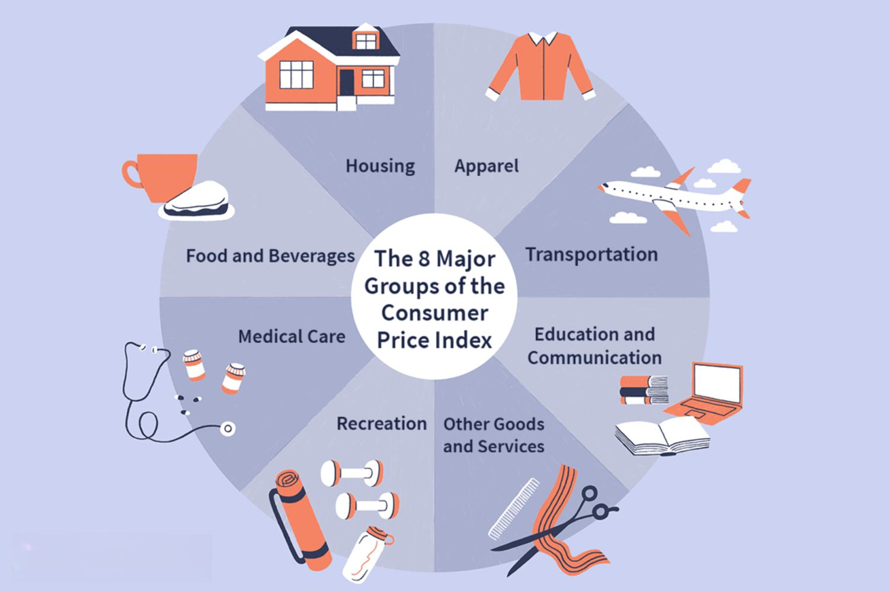

Economic measurement tools are crucial for analyzing and understanding the financial health and stability of an economy. Among these tools, the Consumer Price Index (CPI) plays a vital role in tracking inflation, monitoring economic trends, and formulating monetary policies. The CPI measures changes in the price level of a basket of consumer goods and services purchased by households, providing insights into the cost of living and purchasing power.

Algorithmic trading, a modern phenomenon hinging on high-speed computation and data analysis, has increasingly become an essential component of financial markets. This trading method relies heavily on accurate and timely economic data, including inflation indices like the CPI, to develop and execute trading strategies that maximize returns or minimize risks. As such, discrepancies or inaccuracies in CPI data can significantly impact algorithmic trading effectiveness, potentially leading to erroneous trading decisions.

This article examines the limitations inherent in the CPI, shedding light on how these may affect the efficacy of algorithmic trading strategies. Given the reliance on CPI by investors and policymakers to make informed decisions, understanding potential pitfalls in this index is imperative. This ensures that strategies and policies are based on the most reliable data, highlighting the need for continuous improvement and diversification in economic measurement tools. Investors and policymakers must comprehend these issues to enhance market efficiency and economic stability.

## Table of Contents

## Understanding the Consumer Price Index (CPI)

The Consumer Price Index (CPI) is a vital economic indicator that measures the average change over time in the prices paid by urban consumers for a basket of goods and services. It serves as a barometer for inflation, helping economists, policymakers, and the public understand the purchasing power of a currency and the cost of living. The CPI includes several key categories, such as food, housing, apparel, and medical care, each weighted according to its importance in the typical consumer's budget.

The calculation of the CPI involves collecting data from a representative sample of retail outlets, service establishments, rental units, and doctors' offices across urban regions. The U.S. Bureau of Labor Statistics (BLS), responsible for producing the CPI, employs trained data collectors who record prices monthly. The CPI formula is expressed as:

$$
CPI = \frac{\text{Cost of Market Basket in Current Year}}{\text{Cost of Market Basket in Base Year}} \times 100
$$

This index number represents the percentage change in the cost of the basket compared to a base period, providing insight into price trends over time.

The CPI's role in inflation tracking is crucial, as central banks and governments rely on it to devise monetary and fiscal policies. For instance, the Federal Reserve monitors the CPI to make informed decisions about interest rates, aiming to control inflation and stabilize the economy. By understanding inflation rates, policymakers can ensure that wage adjustments, tax brackets, and social security benefits align with the cost of living, thus maintaining economic stability.

There are notable differences between the CPI and other price indices, such as the Producer Price Index (PPI) and the GDP deflator. While the CPI focuses on goods and services consumed by households, the PPI measures the average change in selling prices received by domestic producers for their output, reflecting wholesale price changes. The GDP deflator, on the other hand, encompasses the entire economy, measuring price changes in all domestically produced goods and services, thus offering a broader inflation measure compared to the CPI.

The importance of the CPI extends to everyday economic decision-making for both individuals and businesses. Consumers rely on CPI data to budget their expenses, while firms use it to set pricing strategies, adjust salaries, and plan investments. Moreover, CPI figures are frequently used in contracts for cost-of-living adjustments, ensuring that payments reflect current economic conditions. The CPI’s widespread use highlights its critical role in shaping economic expectations and informing decisions at various levels.

## Common Flaws and Limitations of CPI

The Consumer Price Index (CPI) is a critical tool in gauging inflation and making economic decisions. However, it possesses several limitations that can impact its effectiveness in reflecting true economic conditions.

One significant limitation is the infrequency of updates and the potential for lags in data. Typically, CPI data is released monthly, but economic conditions can fluctuate much more rapidly. This delay may result in outdated information that fails to accurately capture fast-moving market dynamics or sudden economic shifts. Consequently, decisions based on such data might not reflect current conditions.

CPI's limited scope is another constraint. It does not account for all goods and services consumed by the population. Certain items, especially luxury goods or those with volatile prices like some financial services, are frequently excluded. This exclusion can skew the index, particularly if the omitted items undergo substantial price changes that affect consumer expenditure.

Substitution bias arises when consumers change their purchasing habits in response to price changes, opting for cheaper alternatives. The traditional CPI calculation assumes a fixed basket of goods, which might not reflect these consumer adjustments, thereby misrepresenting the cost of living changes. This adaptability in consumer behavior is not captured effectively, leading to an overstated cost of living when prices rise.

The CPI also struggles with incorporating quality changes and new products. Improvements in product quality can lead to higher prices, but the CPI might not always adjust adequately for these quality enhancements, attributing the entire price increase to inflation. Furthermore, the introduction of new products into the market is typically slow to be reflected in the CPI. As a result, the index may not adequately mirror modern consumption patterns.

Geographical limitations and regional variances also pose challenges to CPI accuracy. Official CPI [statistics](/wiki/bayesian-statistics) often represent a national average, potentially obscuring regional disparities in price changes. Different areas may experience varying inflation rates due to distinct economic activities, demand conditions, and cost structures. Without a nuanced approach that considers these regional differences, the CPI can mislead policymakers and economists trying to understand local economies.

Understanding these limitations is pivotal for improving economic analyses and ensuring more reliable data for decision-making. For sophisticated applications like [algorithmic trading](/wiki/algorithmic-trading), the need for precise, timely, and comprehensive data is paramount to devising effective strategies and minimizing risks associated with economic indicators.

## Implications of CPI Flaws for Algorithmic Trading

Algorithmic trading utilizes computer algorithms to execute trades at high speeds and volumes, relying heavily on economic data to inform decisions. One crucial piece of this data is inflation information, most commonly sourced from the Consumer Price Index (CPI). Accurate inflation data is vital for trading algorithms as it impacts interest rates, currency values, and consumer purchasing power, all of which are critical variables in trading models. Algorithms analyze CPI data to anticipate [interest rate](/wiki/interest-rate-trading-strategies) changes set by central banks, affect stock valuations, and forecast economic trends.

Relying on flawed CPI data poses significant risks for trading strategies. One primary concern is that inaccuracies in CPI reporting can lead to incorrect estimations of real interest rates, influencing decisions on interest rate derivatives and fixed-income securities. Flawed CPI data can also misinform [volatility](/wiki/volatility-trading-strategies) projections, affecting pricing models for options and futures contracts. In essence, all financial instruments sensitive to inflation expectations may be priced inefficiently if the underlying data is defective.

Several instances highlight trading errors or inefficiencies caused by inaccurate CPI data. Historically, if inflation is underreported due to misestimated CPI, investors might underreact to actual inflationary pressures, possibly leading to a delayed market response and sudden market corrections once the true inflation rate becomes apparent. Conversely, overestimation can lead to unnecessary tightening in financial conditions, impacting equities negatively and causing undue volatility in foreign exchange markets.

To mitigate the risks associated with reliance on CPI, traders and firms can adopt several strategies. First, diversifying data sources by integrating alternative inflation measures such as the Producer Price Index (PPI) or Personal Consumption Expenditures (PCE) can provide a broader perspective on price changes. Additionally, deploying real-time data analytics and [machine learning](/wiki/machine-learning) algorithms can help detect discrepancies and anticipate revisions in official reports. Adaptable algorithms, which incorporate predictive analytics and are designed to respond dynamically to data revisions, can further enhance resilience.

Furthermore, regular [backtesting](/wiki/backtesting) of trading algorithms with historical data, including periods of significant CPI revisions, allows firms to understand the potential impact of data inaccuracies on their strategies. Lastly, forming partnerships with data analytics firms specializing in economic data can offer insights that may not be available from traditional CPI sources alone.

In conclusion, while CPI remains a fundamental component of economic data for algorithmic trading, its limitations necessitate a prudent approach to data reliance. By adopting diversified data strategies and utilizing advanced analytics, traders can better navigate the inherent uncertainties of economic data, ensuring more robust and informed trading decisions.

## Case Studies: Historical Impact of CPI Inaccuracies

The Consumer Price Index (CPI) plays a central role in economic decision-making, providing a measure of inflation used by policymakers, businesses, and investors. However, inaccuracies and revisions in CPI data can lead to significant market repercussions, especially in the context of algorithmic trading strategies that rely heavily on precise economic figures.

One notable example of market reaction to inaccurate CPI reporting occurred in January 1996 when the U.S. Bureau of Labor Statistics made a methodological change to the way it calculated the CPI. This update led to a downward revision of the inflation rate. The initial release of the CPI data suggested higher inflation than what was actually occurring. Bond markets, sensitive to inflation expectations, reacted negatively, causing a spike in yields. Once the revised data were released, there was subsequent volatility as market participants adjusted their portfolios to reflect the lower rate of inflation.

Algorithmic trading, which utilizes historical and real-time data to make trading decisions, is particularly vulnerable to such inaccuracies. Algorithms designed to respond to inflation data may initiate trades based on erroneous inputs, leading to potential financial losses. For example, trading strategies built on [momentum](/wiki/momentum) or mean reversion models rely on accurate inflation expectations to predict asset price movements. An inflation rate error, therefore, can cause algorithms to misjudge the market's direction, resulting in misplaced trades and increased transaction costs.

Revisions to CPI data often lead to market corrections as participants recalibrate their expectations. These corrections can amplify market volatility, notably affecting high-frequency trading wherein the speed of execution is critical to trading success. As an illustration, when CPI data is revised, trading algorithms that act on initial figures might execute trades that are rapidly counter-balanced by others adjusting to corrected data. This creates a feedback loop of buying and selling pressures, magnifying short-term market fluctuations.

Financial institutions, recognizing the risks posed by flawed CPI data, have implemented various resolution efforts to safeguard their trading strategies. Techniques such as the inclusion of [alternative data](/wiki/best-alternative-data) sources, machine learning models capable of predicting possible data revisions, and stress-testing of trading algorithms against historical data discrepancies have been adopted. These measures help mitigate the impact of data inaccuracies by providing a more holistic view of the economic environment.

Historically, the lessons learned from CPI data discrepancies underline the importance of diversification in data sources and the need for robust risk management frameworks. Financial institutions and traders are encouraged to balance reliance on publicly released datasets with proprietary analytics and alternative indicators. By doing so, they can reduce vulnerability to unexpected revisions and enhance the resilience of their trading strategies.

In summary, the historical impact of CPI inaccuracies emphasizes the need for continuous improvements in economic data collection and dissemination. For algorithmic traders, incorporating a diversified data strategy and remaining adaptable to data revisions are crucial steps in navigating the complexities of financial markets influenced by inflation metrics.

## Alternatives and Complements to the CPI

The Consumer Price Index (CPI) is a widely used tool for measuring inflation, but it is not without its competitors and complements. Other indices, such as the Producer Price Index (PPI) and Personal Consumption Expenditures (PCE), are often used alongside or as alternatives to the CPI to provide a more comprehensive picture of economic trends.

The Producer Price Index (PPI) measures the average change over time in the selling prices received by domestic producers for their output. Unlike the CPI, which captures consumer prices, the PPI examines the prices at the wholesale level before products reach consumers. This focus on the production side can offer early signals of inflationary trends since increases in producers' costs can eventually be passed onto consumers. However, the PPI may not perfectly reflect consumer experiences with inflation as it does not account for retail markups or service prices encountered by the final consumers.

Personal Consumption Expenditures (PCE) is another vital index, capturing the changes in the prices of goods and services consumed by households. A key advantage of the PCE over the CPI is its broader scope, including a more diverse range of expenditures. Additionally, the PCE adjusts more fluidly to changes in consumer behavior, accounting for substitution between goods when relative prices change. This adaptability makes the PCE often considered a more accurate reflection of economic realities. However, the complexity and breadth of the PCE can make it less intuitive and harder to communicate to the general public compared to the CPI.

Innovations in economic data collection and real-time analytics have increasingly become essential in boosting the efficacy of these indices. With advances in technology, large-scale data collection has become more feasible, enabling the use of web scraping, mobile apps, and digital payments data to gather more updated and frequent price information. These methods can help mitigate some of the timeliness and responsiveness issues associated with traditional indices like the CPI, PPI, and PCE.

For algorithmic trading, the diversification of data sources opens new avenues for improving accuracy and efficiency. By incorporating a blend of different indices and real-time analytics, trading algorithms can achieve a more robust understanding of inflationary trends, leading to better alignment with market realities. Firms can, for instance, integrate the PPI for early production cost signals while concurrently using PCE data to gauge consumer spending patterns. This approach offers traders the ability to tailor strategies that are responsive to both production and consumption-side changes.

In conclusion, while the CPI remains a cornerstone of economic analysis, its limitations necessitate complementary indices like the PPI and PCE to provide a more rounded view of inflation and economic activity. Ongoing advancements in data collection and analytics promise further refinements in economic measurement, presenting opportunities to enhance algorithmic trading strategies through a diversified data approach. This integration of multiple sources ultimately helps ensure a balanced and comprehensive understanding of market dynamics.

## Conclusion

The Consumer Price Index (CPI) plays a vital role in economic analysis and trading but is not without its limitations. This index, which measures the average change over time in the prices paid by consumers for a market basket of consumer goods and services, serves as a key indicator for inflation tracking and economic policy-making. Despite its significance, CPI is beset with several flaws, such as infrequent data updates, limited scope, substitution bias, challenges in measuring quality changes, and regional variances. These limitations can hinder accurate economic predictions and influence decision-making in algorithmic trading, where precise data is crucial for developing effective strategies.

Moreover, the reliance on CPI in trading can introduce significant risks. Inaccurate CPI data can result in flawed trading algorithms, leading to errors and inefficiencies in market operations. The impact of these inaccuracies could be amplified in high-frequency trading environments, where split-second decisions based on economic indicators are the norm.

Given the importance of precise economic data, it's imperative to continuously improve data collection methodologies. Innovations such as real-time data analytics and diversified sources can enhance the accuracy of economic measurements like CPI. Additionally, exploring alternative indices such as the Producer Price Index (PPI) or the Personal Consumption Expenditures (PCE) could provide a more comprehensive view of inflationary pressures, helping traders develop more robust strategies.

Looking forward, both economic measurement tools and algorithmic trading technologies are expected to evolve. The integration of advanced technologies, including machine learning and big data analytics, can refine economic analyses and trading models, reducing dependencies on potentially flawed CPI data. 

It is essential to maintain a balanced reliance on multiple data sources for informed financial decision-making. Investors, policymakers, and technologists should collectively focus on addressing the deficiencies of the CPI. By investing in improved data collection methods, fostering transparency, and endorsing innovative approaches, they can enhance the quality and accuracy of economic measurements, thereby supporting more stable market environments and informed policy decisions. The collaborative effort in refining these dimensions will be crucial for mitigating risks associated with CPI inaccuracies and ensuring the reliability of algorithmic trading outcomes.

## References & Further Reading

[1]: ["Alternative Data in Asset Management: Usage and Challenges"](https://papers.ssrn.com/sol3/papers.cfm?abstract_id=3715828) by CFA Institute Research Foundation

[2]: Boskin, M. J., Dulberger, E. L., Gordon, R. J., Griliches, Z., & Jorgenson, D. W. (1996). ["Toward a More Accurate Measure of the Cost of Living."](https://www.aeaweb.org/articles?id=10.1257/jep.12.1.3) National Bureau of Economic Research.

[3]: ["Economic and Statistical Adjustments in Price Indexes of Consumer Goods"](https://www.bls.gov/cpi/) by Bureau of Labor Statistics

[4]: Prud'homme, M. (2020). ["Consumer Price Index Manual: Concepts and Methods."](https://www.elibrary.imf.org/display/book/9781513566719/9781513566719.xml) International Monetary Fund.

[5]: ["Understanding Price Index Concepts and Calculations"](https://www.investopedia.com/terms/c/consumerpriceindex.asp) by Bureau of Labor Statistics