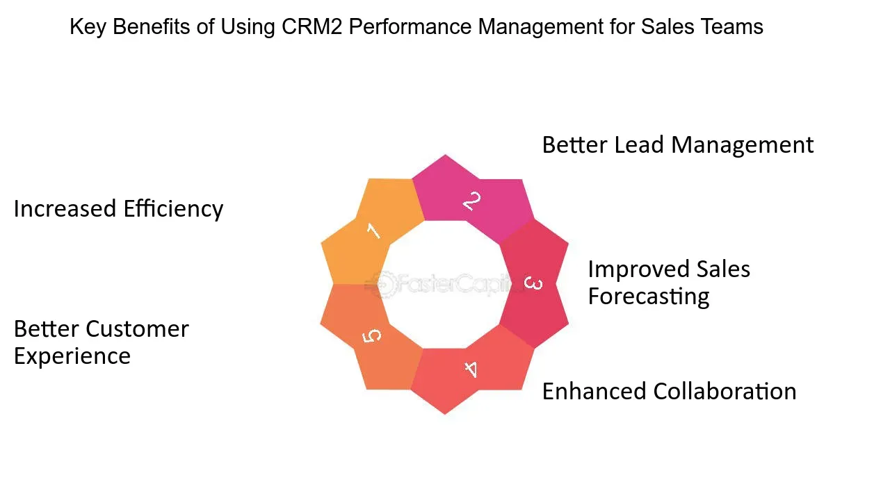

## Table of Contents

## What is CRM2?

CRM2 stands for Client Relationship Model Phase 2. It is a set of rules in Canada that help make sure people who invest money get clear and honest information from their investment advisors. These rules started in 2016 and aim to help investors understand how much they are paying for advice and how their investments are doing.

Under CRM2, investment firms must give their clients detailed reports. These reports show the costs of the services, the performance of the investments, and any fees or charges. This way, investors can see exactly what they are paying and how their money is growing. It helps them make better choices about their investments and trust their advisors more.

## How does CRM2 differ from the original CRM?

CRM2, or Client Relationship Model Phase 2, is an update to the original CRM rules in Canada. The original CRM focused on improving how investment firms communicate with their clients. It made sure that firms told clients about the risks of investing and gave them account statements regularly. But the original CRM did not go into as much detail about fees and performance as CRM2 does.

CRM2 takes things a step further by requiring investment firms to be much more open about the costs and how well investments are doing. With CRM2, firms must give clients detailed reports that show all the fees they are paying, not just some of them. These reports also show how the investments are performing over time. This helps clients see the full picture of their investments and make better decisions.

In short, while the original CRM set the stage for better communication, CRM2 builds on that by adding more detailed and clearer information about fees and performance. This makes it easier for investors to understand what they are paying for and how their money is working for them.

## What are the main components of CRM2?

CRM2 has three main parts that help investors understand their investments better. The first part is about showing all the fees. Investment firms now have to tell clients about every fee they charge, like management fees and trading costs. This way, investors can see exactly how much they are paying for advice and services. The second part is about showing how investments are doing. Firms have to give reports that show how much money the investments have made or lost over time. This helps investors see if their money is growing or not.

The third part of CRM2 is about giving clear and regular reports. Firms need to send these reports to clients at least once a year. These reports put all the information about fees and performance in one place, making it easy for investors to understand their investments. By knowing all the costs and seeing how their investments are doing, investors can make smarter choices about where to put their money.

## What functionalities does CRM2 offer to businesses?

CRM2 helps businesses by making them more open with their clients. It tells businesses to show all the fees they charge, so clients know exactly what they are paying for. This can build trust because clients feel they are getting honest information. When businesses are clear about fees, clients might be happier and more likely to stay with the business. This can help businesses keep their clients and maybe even get new ones who like the clear information.

Another way CRM2 helps businesses is by making them show how well investments are doing. Businesses have to give reports that show if the investments are making money or losing it. This helps clients see if their money is growing. When businesses can show good results, it can make clients trust them more. This can lead to clients staying with the business longer and maybe telling others about it. So, CRM2 can help businesses by showing they care about their clients and want to help them make smart choices with their money.

## How does CRM2 improve customer relationship management?

CRM2 helps improve customer relationship management by making sure businesses are clear about all the fees they charge. When businesses show every fee, like management fees and trading costs, clients feel they are getting honest information. This openness can build trust between the business and the client. When clients trust a business, they are more likely to stay with it and even tell others about it. This can help the business keep its clients happy and grow its customer base.

Another way CRM2 improves customer relationships is by showing clients how well their investments are doing. Businesses have to give reports that show if the investments are making or losing money. This helps clients see if their money is growing. When clients can see good results, they feel more confident in the business. This confidence can lead to stronger, longer-lasting relationships between the business and its clients. By being open about fees and showing investment performance, CRM2 helps businesses take better care of their customers.

## What are the key benefits of implementing CRM2 for a company?

Implementing CRM2 helps a company by making it more open with its clients. When a company shows all the fees it charges, like management fees and trading costs, clients know exactly what they are paying for. This openness builds trust because clients feel they are getting honest information. When clients trust a company, they are more likely to stay with it and even tell others about it. This can help the company keep its clients happy and grow its customer base.

Another key benefit of CRM2 is that it helps a company show clients how well their investments are doing. Companies have to give reports that show if the investments are making or losing money. This helps clients see if their money is growing. When clients can see good results, they feel more confident in the company. This confidence can lead to stronger, longer-lasting relationships between the company and its clients. By being open about fees and showing investment performance, CRM2 helps a company take better care of its customers.

## How does CRM2 impact data privacy and security?

CRM2 makes companies show clients more information about fees and how their investments are doing. This means companies have to collect and keep more data about their clients. To keep this data safe, companies need to follow strict rules about data privacy and security. They have to make sure the information they collect is protected from hackers and other bad people who might try to steal it.

When companies follow CRM2 rules, they help make sure clients' information is kept private and safe. This can build trust between the company and its clients because clients know their data is being looked after. But, it also means companies need to be extra careful about how they handle and protect all the extra data they have to collect because of CRM2.

## What are the challenges businesses might face when adopting CRM2?

When businesses start using CRM2, they might find it hard to change their systems to show all the fees and how investments are doing. They need to collect more information about their clients and make sure it's all correct. This can be a lot of work and might need new computer systems or ways of doing things. It can also cost money to make these changes, which can be tough for some businesses.

Another challenge is keeping all the new data safe. With CRM2, businesses have to handle more private information about their clients. They need to make sure this information doesn't get stolen or lost. This means they have to follow strict rules about data privacy and security, which can be hard to do. If they don't do it right, they could get in trouble or lose their clients' trust.

Also, businesses need to make sure their staff knows about CRM2 and can explain it to clients. This means training people, which takes time and money. If the staff doesn't understand CRM2 well, they might not be able to help clients understand it, which could make clients unhappy. So, businesses have to work hard to make sure everyone knows what to do and can do it right.

## How can CRM2 be integrated with existing business systems?

When a business wants to use CRM2, it needs to change its computer systems and the way it works to show all the fees and how investments are doing. They might need new software that can keep track of all the fees and make reports for clients. This new software has to work well with the systems the business already uses. Sometimes, they can add CRM2 features to their old systems, but other times, they might need to buy new systems that can handle CRM2 rules. This can take time and money, but it helps make sure the business can give clients the clear information they need.

To make sure everything works smoothly, the business also needs to train its staff on how to use the new systems and understand CRM2 rules. They have to learn how to explain these rules to clients in a way that's easy to understand. This training is important because if the staff doesn't know how to use the new systems or explain CRM2, clients might get confused or unhappy. By making sure the new systems work well with the old ones and training everyone properly, a business can follow CRM2 rules and keep its clients happy and informed.

## What are the best practices for maximizing the effectiveness of CRM2?

To make CRM2 work well, a business should be very open with its clients. They need to show all the fees clearly in the reports they give to clients. This means making sure the reports are easy to read and understand. The business should also make sure the reports show how well the investments are doing in a way that clients can see if their money is growing. By being honest and clear, the business can build trust with its clients. When clients trust the business, they are more likely to stay with it and tell others about it.

Another important thing is to keep the data safe. Since CRM2 makes businesses collect more information about their clients, they need to follow strict rules about keeping this information private and secure. This means using good security systems and making sure only the right people can see the data. The business should also train its staff well. They need to understand CRM2 rules and know how to explain them to clients in a simple way. When the staff knows what they're doing, they can help clients better, which makes the clients happier and more likely to stay with the business.

## How does CRM2 influence customer satisfaction and loyalty?

CRM2 helps make customers happier and more loyal by making sure they get clear information about fees and how their investments are doing. When a business shows all the fees it charges, like management fees and trading costs, customers know exactly what they are paying for. This openness builds trust because customers feel they are getting honest information. When customers trust a business, they are more likely to stay with it and even tell others about it. This can help the business keep its customers happy and grow its customer base.

Another way CRM2 influences customer satisfaction and loyalty is by showing customers how well their investments are doing. Businesses have to give reports that show if the investments are making or losing money. This helps customers see if their money is growing. When customers can see good results, they feel more confident in the business. This confidence can lead to stronger, longer-lasting relationships between the business and its customers. By being open about fees and showing investment performance, CRM2 helps businesses take better care of their customers, making them more satisfied and loyal.

## What future developments can we expect in CRM2 technology?

In the future, CRM2 technology might get better at using computers to make things easier for businesses and their clients. We might see new software that can quickly put together all the information about fees and how investments are doing. This software could use smart math to make the reports even clearer and more helpful. It could also help businesses follow the rules about keeping client information safe by using the latest security technology.

Another thing we might see is CRM2 working better with other computer systems that businesses use. This could mean that businesses don't have to change their old systems as much when they start using CRM2. Instead, the new CRM2 technology could fit right in with what they already have. This would make it easier for businesses to start using CRM2 and keep their clients happy with clear and honest information.

## What is the impact of CRM2 on financial disclosure?

CRM2, or Client Relationship Model 2, significantly influences financial disclosure practices in Canada by setting forth requirements that enhance transparency between investment advisors and investors. Under CRM2, investment advisors must provide clear and detailed reports on both the performance and the costs associated with investments. These reports are crucial for empowering investors with a comprehensive understanding of how their investments are managed and the expenses they incur.

One of the foundational aspects of CRM2 is the inclusion of the money-weighted rate of return in performance reports. This measure reflects the investor's actual experience by taking into account the size and timing of cash flows. Money-weighted return can be calculated using the formula:

$$
MWR = \left( \frac{V_{end} - V_{start} - C}{V_{start} + \sum{W_i \cdot C_i}} \right)
$$

where:
- $V_{end}$ is the ending value of the portfolio,
- $V_{start}$ is the starting value of the portfolio,
- $C$ is the total external cash flows into the portfolio,
- $W_i$ is the weight of each cash flow,
- $C_i$ is each individual cash flow.

In addition to performance metrics, CRM2 mandates the disclosure of investment costs in dollar terms. This includes commissions, trailing commissions, and any other charges that may apply, providing investors with a transparent view of the costs impacting their net returns.

The visibility of these costs often leads investors to reconsider their investment choices, frequently shifting preferences towards low-cost alternatives such as Exchange-Traded Funds (ETFs). ETFs are attractive for their typically lower management fees compared to traditional mutual funds, aligning with the investor’s pursuit of cost-efficiency motivated by CRM2's disclosure requirements.

By ensuring transparency in both performance and costs, CRM2 aids investors in making informed decisions. This regulatory framework encourages a more educated investment approach, as investors can better assess the value they receive relative to the costs they incur. Consequently, CRM2 not only informs investors but also pressures investment advisors to adopt strategies that are both cost-effective and performance-oriented, ultimately promoting a more transparent and efficient investment environment.

## References & Further Reading

[1]: McFadden, R. (2016). ["The Canadian Securities Administrators’ CRM2 Amendments: Overview and Implementation."](https://www.bizapedia.com/trademarks/hoo-hoo-liners-86597226.html) Canadian Securities Regulation.

[2]: Baker, K. H., & Filbeck, G. (2013). ["Investment Risk and Uncertainty: Advanced Risk Awareness Techniques."](https://academic.oup.com/book/27011) Oxford University Press.

[3]: Aldridge, I., & Krawciw, S. (2017). ["Real-Time Risk: What Investors Should Know About FinTech, High-Frequency Trading, and Flash Crashes."](https://www.fx361.com/page/2021/0922/8868453.shtml) Wiley.

[4]: Lopez de Prado, M. (2018). ["Advances in Financial Machine Learning."](https://www.amazon.com/Advances-Financial-Machine-Learning-Marcos/dp/1119482089) Wiley.

[5]: Lhabitant, F. S. (2004). ["Handbook of Hedge Funds."](https://www.amazon.com/Handbook-Hedge-Funds-Fran%C3%A7ois-Serge-Lhabitant/dp/0470026634) John Wiley & Sons.

[6]: Canadian Securities Administrators. (2012). ["The Integrated Model of Regulation of the Canadian Capital Markets."](https://www.securities-administrators.ca/) Canadian Securities Administrators.

[7]: Bank of Canada. (2015). ["Regulation and Financial Stability."](https://www.bankofcanada.ca/2015/12/fsr-december-2015/) Bank of Canada Publications.