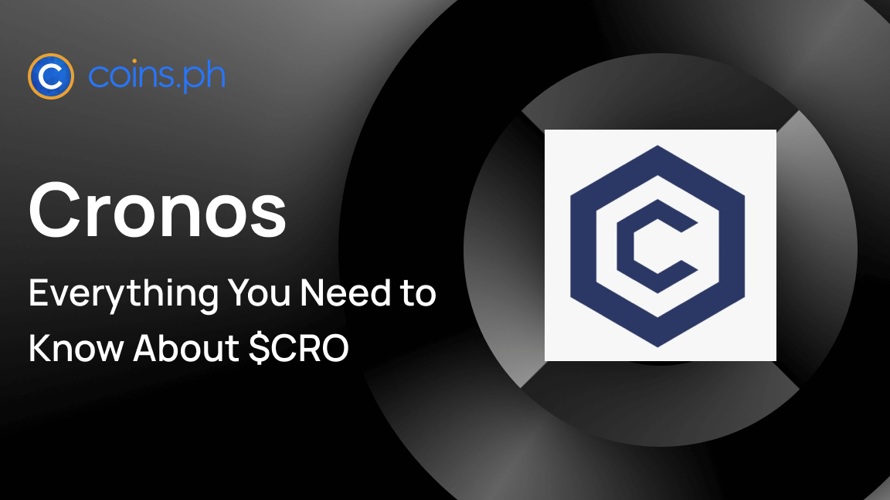

## Table of Contents

## What is Cronos (CRO) and its basic concept?

Cronos (CRO) is a cryptocurrency that is part of the Crypto.com ecosystem. It is used to power the Crypto.com chain, which is a blockchain platform designed to make it easy for people to buy, sell, and pay with cryptocurrencies. The basic idea behind Cronos is to create a fast, secure, and easy-to-use system that helps more people use digital currencies in their everyday lives.

One of the main uses of Cronos is to pay for transaction fees on the Crypto.com chain. This means that when people want to send or receive cryptocurrencies, they use Cronos to cover the costs. Cronos can also be used to get discounts on the Crypto.com platform, like lower fees when trading or using their Visa card. By using Cronos, the Crypto.com team hopes to make cryptocurrencies more accessible and useful for everyone.

## Who created Cronos and what is the history behind it?

Cronos (CRO) was created by the team behind Crypto.com, a company focused on making cryptocurrencies easier to use. The founder of Crypto.com is Kris Marszalek, who started the company in 2016. Before Crypto.com, Kris had experience in tech startups and wanted to make a platform that would help more people use digital money. The idea for Cronos came from the need to have a fast and secure way to handle transactions on the Crypto.com platform.

The history of Cronos is tied to the growth of Crypto.com. In 2018, Crypto.com launched its own blockchain, called the Crypto.org Chain, and Cronos is the native [cryptocurrency](/wiki/cryptocurrency) of this chain. The goal was to create a system where people could easily buy, sell, and use cryptocurrencies without complicated processes. Over time, Cronos has been used more and more for things like paying transaction fees and getting discounts on the Crypto.com platform. This has helped Cronos become an important part of the Crypto.com ecosystem, making it easier for people to use digital currencies in their daily lives.

## How does Cronos (CRO) function within its ecosystem?

Cronos (CRO) is the main cryptocurrency in the Crypto.com ecosystem. It helps the Crypto.com chain work smoothly by being used to pay for transaction fees. When people want to send or receive other cryptocurrencies on the Crypto.com platform, they use Cronos to cover the costs. This makes the transactions fast and secure. Cronos also helps keep the network running well because it encourages people to take part in the system by holding and using Cronos.

Besides paying for fees, Cronos has other uses that make it valuable within the Crypto.com ecosystem. People can use Cronos to get discounts on the Crypto.com platform. For example, if you pay with Cronos, you might get lower fees when trading other cryptocurrencies or using the Crypto.com Visa card. This encourages more people to use Cronos and helps make the whole ecosystem more active and useful. By using Cronos in these ways, Crypto.com aims to make cryptocurrencies easier and more helpful for everyone.

## What are the main use cases of Cronos (CRO)?

Cronos (CRO) is used mainly to pay for fees on the Crypto.com platform. When people want to send or receive other cryptocurrencies, they use Cronos to cover the costs. This makes the transactions quick and safe. It's like using coins to play games at an arcade – you need Cronos to keep things running smoothly on the Crypto.com chain.

Another big use for Cronos is getting discounts on the Crypto.com platform. If you pay with Cronos, you can get lower fees when trading other cryptocurrencies or using the Crypto.com Visa card. This makes Cronos valuable because it saves you money. It's like using a special card at a store to get a discount on your shopping – using Cronos helps you spend less on the Crypto.com platform.

## How can someone acquire Cronos (CRO)?

You can get Cronos (CRO) by buying it on a cryptocurrency exchange. Many big exchanges like Binance, Coinbase, and Crypto.com itself let you trade other cryptocurrencies or regular money for Cronos. You just need to sign up on one of these exchanges, deposit some money or other cryptocurrencies, and then you can buy Cronos. It's like going to a store and trading your dollars for something you want – in this case, you're trading for Cronos.

Another way to get Cronos is by using the Crypto.com platform. When you use their services, like the Crypto.com Visa card or their trading platform, you can earn Cronos as a reward. For example, if you spend money using the Crypto.com Visa card, you can get some Cronos back as cashback. It's like getting points or rewards when you shop with a special credit card – the more you use it, the more Cronos you can earn.

## What are the benefits of using Cronos (CRO) over other cryptocurrencies?

Using Cronos (CRO) has some special benefits compared to other cryptocurrencies. One big advantage is that Cronos helps you save money on the Crypto.com platform. When you use Cronos to pay for things like trading fees or using the Crypto.com Visa card, you get discounts. This makes Cronos more valuable because it helps you spend less money. It's like using a special card at a store to get a discount on your shopping – Cronos helps you keep more money in your pocket.

Another benefit of Cronos is that it's designed to make using cryptocurrencies easier and faster. On the Crypto.com platform, Cronos is used to pay for transaction fees, which helps keep the network running smoothly. This means that when you want to send or receive other cryptocurrencies, using Cronos makes the process quick and secure. It's like using coins to play games at an arcade – you need Cronos to keep things running smoothly on the Crypto.com chain.

## How does Cronos integrate with the Crypto.com platform?

Cronos is the main part of the Crypto.com platform. It helps everything work smoothly. When people want to send or receive other cryptocurrencies on Crypto.com, they use Cronos to pay the fees. This makes the transactions fast and safe. It's like using coins to play games at an arcade – you need Cronos to keep things running well on the Crypto.com chain.

Cronos also gives users special benefits on the Crypto.com platform. If you use Cronos to pay for things like trading fees or using the Crypto.com Visa card, you get discounts. This makes Cronos valuable because it helps you save money. It's like using a special card at a store to get a discount on your shopping – using Cronos helps you spend less on the Crypto.com platform.

## What are the technical specifications of Cronos (CRO), including its blockchain architecture?

Cronos (CRO) is the cryptocurrency that powers the Crypto.com chain, which is a blockchain designed to make using digital money easy and fast. The Crypto.com chain uses a technology called Tendermint, which helps make transactions quick and secure. Tendermint works by having different computers agree on what's happening on the blockchain, which keeps everything running smoothly. Cronos is used to pay for the fees when you send or receive other cryptocurrencies on the Crypto.com platform, making it an important part of the system.

The Crypto.com chain is built to handle a lot of transactions at once, which means it can work well even when many people are using it. It can process transactions in about 5 seconds, which is very fast compared to some other blockchains. Cronos also has a total supply that is set, meaning there will only ever be a certain amount of Cronos in existence. This can help keep its value stable over time. By using Cronos within the Crypto.com ecosystem, the platform aims to make cryptocurrencies easier and more useful for everyone.

## How does Cronos (CRO) ensure security and scalability?

Cronos (CRO) uses a special technology called Tendermint to keep the Crypto.com chain safe and fast. Tendermint works by having different computers all agree on what's happening on the blockchain. This makes it hard for anyone to cheat or mess up the system because they would need to control most of these computers, which is very difficult. By using Tendermint, Cronos helps make sure that transactions are secure and that the information on the blockchain stays correct.

Cronos also helps the Crypto.com chain handle a lot of transactions at the same time, which is called scalability. The chain can process transactions in about 5 seconds, which is much faster than some other blockchains. This means that even when a lot of people are using the platform, it can still work well without slowing down. By being fast and able to handle many transactions, Cronos makes it easier for more people to use cryptocurrencies without waiting a long time.

## What are the future development plans for Cronos (CRO)?

The future of Cronos (CRO) looks exciting as the Crypto.com team plans to keep improving and expanding the use of Cronos. They want to make Cronos even more useful by adding new ways for people to use it on their platform. For example, they might add more rewards for people who use Cronos to pay for things or make it easier to use Cronos with other cryptocurrencies. They also plan to keep working on making the Crypto.com chain faster and more secure, so it can handle even more transactions without slowing down.

Another big part of the future plans for Cronos is to help more people around the world use cryptocurrencies. The Crypto.com team wants to make it easier for people in different countries to buy, sell, and use Cronos. They might do this by adding more ways to pay with Cronos, like using it at more stores or online. They also want to keep making Cronos a valuable part of their ecosystem, so it stays important and useful for everyone who uses the Crypto.com platform.

## How does Cronos (CRO) compare to other layer-1 blockchain solutions?

Cronos (CRO) is a cryptocurrency that powers the Crypto.com chain, which is a layer-1 blockchain solution. Compared to other layer-1 blockchains like Ethereum or Bitcoin, Cronos focuses on being fast and easy to use. The Crypto.com chain can process transactions in about 5 seconds, which is much quicker than Ethereum's average transaction time. This speed makes Cronos a good choice for people who want to use cryptocurrencies without waiting a long time. Also, Cronos uses a technology called Tendermint, which helps keep the blockchain secure and running smoothly, even when many people are using it at the same time.

Another way Cronos stands out is how it's used within the Crypto.com ecosystem. While other layer-1 blockchains might be used for different things, Cronos is mainly used to pay for fees on the Crypto.com platform and to get discounts on services like trading or using the Crypto.com Visa card. This makes Cronos very valuable for people who use Crypto.com a lot. Unlike some other cryptocurrencies, Cronos has a set total supply, which can help keep its value stable over time. Overall, Cronos offers a fast, secure, and user-friendly way to use cryptocurrencies, especially within the Crypto.com ecosystem.

## What are the potential risks and challenges facing Cronos (CRO)?

One of the biggest risks for Cronos (CRO) is the competition from other cryptocurrencies. There are many other digital currencies out there, and some of them might offer better features or become more popular. If people start using other cryptocurrencies more than Cronos, its value could go down. Another challenge is keeping the Crypto.com platform safe from hackers. Even though Cronos uses strong technology like Tendermint to stay secure, there's always a chance that someone could find a way to break into the system and cause problems.

Another risk is that the value of Cronos can change a lot. Cryptocurrencies can go up and down in price very quickly, and this can make it hard for people to know if they should buy or sell Cronos. If the price goes down a lot, people might lose money. Also, the Crypto.com team needs to keep making Cronos useful and valuable. If they stop adding new features or ways to use Cronos, people might not want to use it as much. Keeping Cronos important in the Crypto.com ecosystem is a big challenge, but it's also what can make it successful in the future.

## References & Further Reading

[1]: ["Cronos Chain: Whitepaper"](https://whitepaper.cronos.org/) - Comprehensive document outlining the technical specifications and goals of the Cronos blockchain.

[2]: Buterin, V. (2014). ["A Next-Generation Smart Contract and Decentralized Application Platform."](https://ethereum.org/content/whitepaper/whitepaper-pdf/Ethereum_Whitepaper_-_Buterin_2014.pdf) - Ethereum Whitepaper.

[3]: Koshy, A., & Norton, S. (2021). ["The Rise of DeFi: How DeFi Works and Why Businesses Should Care."](https://scholar.google.com/citations?user=UXP5TEIAAAAJ) Deloitte Insights.

[4]: Antonopoulos, A. M., & Wood, G. (2018). ["Mastering Ethereum: Building Smart Contracts and DApps"](https://www.amazon.com/Mastering-Ethereum-Building-Smart-Contracts/dp/1491971940) - A detailed guide on Ethereum and smart contract development.

[5]: Rjoub, H., & Hmedat, E. (2018). ["Blockchain Technology, Applications, Challenges, and Opportunities: A Systematic Overview."](https://www.researchgate.net/publication/377380337_Blockchain_Technology_in_Education_Opportunities_Challenges_and_Beyond) 2018 8th International Conference on Computer Science and Information Technology.

[6]: Narayanan, A., Bonneau, J., Felten, E. W., Miller, A., & Goldfeder, S. (2016). ["Bitcoin and Cryptocurrency Technologies: A Comprehensive Introduction"](https://press.princeton.edu/books/hardcover/9780691171692/bitcoin-and-cryptocurrency-technologies) - A solid introduction to underlying technologies of cryptocurrencies.

[7]: Rosic, A. (2017). ["What Are DApps? The Future of Decentralized Apps."](https://decrypt.co/resources/what-are-decentralized-applications-dapps) - An article providing an introduction to decentralized applications.

[8]: Yaga, D., Mell, P., Roby, N., & Scarfone, K. (2019). ["Blockchain Technology Overview"](https://arxiv.org/abs/1906.11078) - National Institute of Standards and Technology Internal Report 8202.