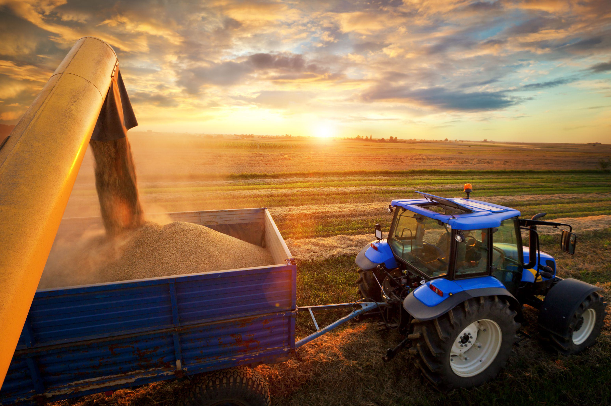

Understanding the concept of a crop year is essential for stakeholders in the agricultural industry as it directly influences the pricing and availability of key commodities. A crop year, distinct from a calendar year, begins with the planting and ends with the harvesting of a particular crop. This temporal framework helps agricultural producers, traders, and policymakers to plan and make decisions in alignment with seasonal cycles. 

The U.S. Department of Agriculture (USDA) plays a vital role in providing reliable crop estimates, which are crucial in guiding trading decisions. These estimates offer insights into production levels, acreage, and yield projections, serving as a benchmark for market participants to anticipate supply and demand dynamics. Economic fluctuations in agricultural commodities often result from changes in USDA forecasts, underscoring the importance of these reports.



Algorithmic trading introduces both opportunities and challenges in the agricultural sector, allowing traders to leverage technology for faster and more accurate decision-making processes. By utilizing algorithms, traders can process vast amounts of data swiftly, identify market trends, and execute transactions with minimal human intervention. However, integrating algorithmic systems also necessitates overcoming challenges like ensuring data quality and addressing market volatility.

This article investigates how USDA estimates influence agricultural trading strategies, specifically through the lens of algorithmic trading. It explores the interplay between crop year dynamics, USDA data, and algorithmic models, providing a comprehensive understanding of how technological advancements are shaping modern agricultural markets.

## Table of Contents

## Understanding Crop Year and Its Significance

A crop year is a specific period used to measure the growth and harvesting cycle of agricultural products. Unlike the traditional calendar year, which runs from January 1 to December 31, a crop year aligns with the planting and harvesting phases, varying by crop and region. For example, in the United States, the crop year for corn typically begins on September 1 and ends on August 31 of the following year. This time frame is crucial as it encompasses the entire lifecycle of the crop, enabling accurate assessment of production volumes and quality.

The concept of the crop year is vital for commodity pricing and agricultural planning. It provides a structured timeline that stakeholders can use to evaluate supply forecasts and market dynamics. Understanding the timing of the crop year helps traders and farmers anticipate market trends, manage inventories, and strategize pricing. By coordinating activities around the crop year, they can minimize risks associated with unexpected fluctuations in supply and demand.

Weather and environmental conditions significantly influence crop yield and quality, impacting crop year dynamics. Factors such as rainfall, temperature, and soil health play critical roles in determining the success or failure of a crop. Variability in these conditions from year to year can lead to differences in production levels, thus affecting market prices and availability. Unfavorable weather conditions, like droughts or floods, can disrupt the usual patterns of crop growth, leading to reduced yields or degraded quality. Conversely, favorable weather can result in bumper crops, potentially driving down prices if supply exceeds demand.

Given these variables, stakeholders must continuously monitor environmental forecasts and adjust their strategies accordingly. Advanced models and simulations are often employed to predict potential outcomes and mitigate risks related to environmental changes. The ability to adapt and respond to these conditions directly influences agricultural productivity and economic viability in any given crop year.

## USDA's Role in Crop Year Estimates

The U.S. Department of Agriculture (USDA) plays a pivotal role in shaping agricultural markets through its comprehensive crop reports and forecasts. By collecting and analyzing vast amounts of data on crop production, acreage, yield, and stock levels, the USDA provides stakeholders with essential insights that inform trading and investment decisions across the agricultural spectrum.

The USDA's process for producing crop reports is methodical and detailed. It typically begins with extensive field surveys and data collection, involving collaboration with regional agricultural offices and producers. The National Agricultural Statistics Service (NASS), a branch of the USDA, regularly collects data on planting intentions, crop conditions, and progress through surveys and remote sensing technology. These inputs form the basis for preliminary estimates of crop production.

Economists and analysts within the USDA then analyze this data, employing statistical models to forecast production levels, expected yields, and stock usage. These projections are detailed in monthly reports, such as the World Agricultural Supply and Demand Estimates (WASDE), which provide a global perspective on agricultural commodity markets. Reports are updated throughout the year, with major releases aligned with critical stages in the growing season.

The significance of USDA reports is considerable due to their widespread acceptance as reliable and impartial sources of information. Agricultural traders and stakeholders utilize these reports to gauge market trends, assess risk, and make informed decisions about buying and selling commodities. Beyond traders, these reports serve policymakers, agribusinesses, and researchers by offering a consistent and comprehensive overview of agricultural market conditions.

Recent USDA reports have underscored dynamics within supply and demand, impacting price movements and market [volatility](/wiki/volatility-trading-strategies). For example, the October 2023 WASDE report highlighted lower-than-expected corn yields, which were attributed to adverse weather conditions in key U.S. growing regions. Consequently, this led to revisions in both domestic and global corn supply estimates, influencing pricing strategies and crop insurance decisions.

In summary, the USDA's crop year estimates are integral to agricultural markets, serving as benchmarks for production expectations and new market developments. By maintaining a high standard of data accuracy and transparency, the USDA continues to be a crucial source of knowledge that aids stakeholders in navigating the complexities of agricultural trading.

## Algorithmic Trading in Agriculture

Algorithmic trading refers to the use of computer algorithms to automate trading decisions and execute orders in financial markets. In the agricultural sector, [algorithmic trading](/wiki/algorithmic-trading) is employed to efficiently handle trades of commodities such as corn, wheat, soybeans, and other agricultural products. This method leverages the power of computer processing to streamline the trading process, relying on predefined criteria and complex mathematical models to determine buying and selling strategies.

One of the primary benefits of algorithmic trading is the speed at which trades are executed. Unlike manual trading, algorithms can process large volumes of market data in real-time and execute trades within milliseconds. This rapid processing can be advantageous in highly volatile markets, where price shifts can occur within seconds. For instance, algorithms can rapidly respond to shifts in commodity prices triggered by new weather reports or geopolitical developments.

Accuracy is another significant advantage of using algorithms. Algorithms can accurately interpret vast amounts of data input for analysis, reducing the potential for human error, which can be more prevalent in manual trading. This ensures a more precise alignment with trading strategies and increases the probability of achieving desired outcomes.

The data processing capabilities of algorithms are unparalleled. Algorithms are capable of digesting large datasets from diverse sources, including satellite imagery, IoT devices in agriculture, and USDA reports. They can parse this data to identify patterns or correlations that might not be immediately evident to human traders, allowing for more informed decision-making.

Despite these benefits, algorithmic trading in agriculture also faces specific challenges. Data quality is paramount; inaccurate or outdated data can lead to erroneous trading decisions. Ensuring the integrity, reliability, and timeliness of data inputs is critical to the successful implementation of algorithmic strategies. Moreover, market volatility presents another layer of complexity. While algorithms can process data quickly, they may not always predict sudden, unforeseen market events, which can lead to significant financial risks.

Algorithms must be adeptly programmed to adapt to changing market conditions, and to assess risk factors accurately. This requires continuous updates and fine-tuning, along with rigorous testing to ensure the algorithm performs well under different scenarios.

In summary, algorithmic trading in agriculture provides considerable advantages in terms of speed, accuracy, and data processing capabilities, making it an invaluable tool for traders. However, traders must also be vigilant regarding challenges such as data quality and market volatility to optimize the performance and reliability of their trading strategies.

## Impact of USDA Estimates on Algo Trading Strategies

USDA estimates are integral to algorithmic trading models by providing critical data that helps inform trading decisions. These models rely on USDA reports to integrate vast amounts of agricultural data into predictive algorithms. The U.S. Department of Agriculture (USDA) publishes periodic reports containing estimates of crop yields, acreage, and inventories, which are pivotal for traders aiming to gain insights into market direction. Algorithmic trading systems leverage these reports to update predictions and optimize trading strategies.

Algorithmic models incorporate USDA estimates through data feeds and automated scripts that parse the information. By using [machine learning](/wiki/machine-learning) algorithms, traders build predictive models that can automatically adjust based on USDA updates. For instance, linear regression models can predict future price movements based on released crop estimates:

```python
from sklearn.linear_model import LinearRegression
import numpy as np

# Example data inputs
usda_estimates = np.array([[200, 300], [250, 350], [300, 400]])  # Example USDA estimates
price_changes = np.array([5, 7, 10])  # Corresponding market price changes

# Create linear regression model
model = LinearRegression()
model.fit(usda_estimates, price_changes)

# Predicting price change based on new USDA estimate
new_usda_estimate = np.array([[280, 390]])
predicted_price_change = model.predict(new_usda_estimate)
print(f"Predicted Price Change: {predicted_price_change[0]}")
```

In real-time trading, USDA data's timeliness is crucial. High-frequency trading ([HFT](/wiki/high-frequency-trading-strategies)) strategies exploit the speed at which algorithms can process new information. These strategies might employ complex signals triggered by USDA report releases to execute trades within milliseconds, thus gaining an advantage by reacting faster than manual trading operations.

Recent market movements underscore the influence of USDA reports. For example, an unexpected upward revision in corn yield estimates could lead to a sharp decline in corn futures as supply forecasts exceed demand projections. Algorithmic systems, by continuously analyzing such data, can adjust their positions in anticipation of these trends.

The seamless integration of USDA data into algorithmic models enhances decision-making capabilities, offering traders a comprehensive view of expected market shifts. This integration not only supports instant reaction to data releases but also facilitates the synthesis of historical data and market conditions, refining the precision of predictive strategies and allowing traders to hedge against potential risks in agricultural commodity markets.

## Case Study: Crop Year and Algorithmic Trading

In the 2020 crop year, the soybean market experienced significant volatility, providing a unique case study for the intersection of USDA estimates and algorithmic trading strategies. During this period, soybean production was heavily influenced by erratic weather patterns, particularly in key growing regions across the United States. These conditions resulted in fluctuating yield projections, which were reflected in the USDA's periodic reports.

The USDA's September 2020 report initially estimated soybean production at approximately 4.3 billion bushels. However, subsequent reports adjusted these figures due to adverse weather impacts, particularly in the Midwest, leading to a reduction in the projected yield. This variability highlighted the importance of the USDA's frequent updates and their ability to influence market perceptions and trading behavior.

Algorithmic trading models were able to integrate USDA data efficiently by employing real-time data feeds and advanced analytics. An often-used approach involved developing predictive models that analyzed historical USDA reports, weather patterns, and market reactions to forecast price movements. Below is a simplified Python code snippet illustrating a basic model setup for incorporating USDA data into an algorithmic trading strategy:

```python
import numpy as np
import pandas as pd
from sklearn.linear_model import LinearRegression

# Load historical USDA data along with weather conditions
usda_data = pd.read_csv('usda_soybean_reports.csv')
weather_data = pd.read_csv('weather_conditions.csv')

# Merge the datasets on relevant keys
data = pd.merge(usda_data, weather_data, on='date')

# Feature selection (USDA reports and weather factors)
X = data[['usda_estimated_yield', 'rainfall', 'temperature']]
y = data['market_price']

# Train the linear regression model
model = LinearRegression()
model.fit(X, y)

# Predict future prices based on new USDA report
new_data = pd.DataFrame({
    'usda_estimated_yield': [4.0], 
    'rainfall': [1.2], 
    'temperature': [24]
})
predicted_price = model.predict(new_data)
print(f"Predicted Soybean Market Price: {predicted_price[0]:.2f}")
```

This predictive model illustrates how algorithmic traders could forecast price movements based on USDA data. The outcome revealed that traders who rapidly adjusted their strategies in response to updated USDA estimates could optimize their trading positions, enhancing profitability amidst market volatility.

Despite the advantages, limitations were evident. Algorithmic models are heavily reliant on the quality and granularity of data inputs. Any inaccuracies in USDA reporting or delays in data dissemination could lead to erroneous predictions. Furthermore, during periods of extreme market volatility, driven by macroeconomic factors such as trade policies, the models required constant recalibration to maintain accuracy.

This case demonstrated the effectiveness of using algorithmic trading in rapidly changing market conditions and highlighted the importance of robust data collection and model flexibility. As such, it underscores the necessity for continuous improvement in data integration techniques and the review of model assumptions to account for unexpected market dynamics.

## Future Prospects and Trends

The integration of algorithmic trading in the agricultural sector is evolving rapidly, largely driven by advancements in technology. One significant trend is the increase in predictive analytics using machine learning and [artificial intelligence](/wiki/ai-artificial-intelligence). These technologies enhance the accuracy and efficiency of trading strategies by enabling the analysis of vast datasets, such as historical price data, weather patterns, and crop yield [statistics](/wiki/bayesian-statistics). For instance, predictive models can incorporate variables like precipitation levels and temperature forecasts to predict commodity price movements more reliably.

Algorithms can process and analyze these data points in real-time, identifying patterns and correlations that human analysts might overlook. This capacity for real-time analysis is crucial in the volatile agricultural markets, where prices can fluctuate based on unexpected events such as natural disasters or sudden changes in policy. As a result, algorithmic trading allows for a more responsive trading strategy, adjusting positions swiftly as new data emerges.

Another emerging trend is the increased use of blockchain technology for data integrity and transparency. Blockchain can be used to create decentralized databases for crop production data, enhancing the trustworthiness of information that feeds into trading algorithms. This technology has the potential to minimize fraudulent activities and ensure that data used in algorithmic trading is accurate and reliable.

In terms of USDA reporting, advancements could further enhance integration with algorithmic solutions. Automated data feeds from the USDA can facilitate high-frequency trading by providing up-to-the-minute updates on crop conditions, planting intentions, and harvest progress. This real-time data flow could be integrated with algorithmic trading platforms to enhance decision-making processes.

Speculatively, as data analytics continue to grow more sophisticated, we may see the development of hybrid models combining various algorithms to optimize trading outcomes. These models could integrate traditional economic indicators with machine learning insights to provide a more comprehensive understanding of market dynamics. Additionally, the development of quantum computing might revolutionize algorithmic trading by solving complex computations at unprecedented speeds, thereby refining predictive models further.

Overall, the future of algorithmic trading in agriculture is set to become increasingly data-driven and technologically advanced, offering enhanced capabilities for stakeholders to navigate the complexities of the commodity markets. As these technologies evolve, they promise to transform agricultural trading strategies, making them more precise, fast, and adaptive to changing conditions.

## Conclusion

The interrelation between crop years, USDA estimates, and algorithmic trading represents a convergence of agricultural knowledge, governmental oversight, and advanced technology, creating a multifaceted approach to commodity trading. Crop years, defined by the growth, harvesting, and sale cycle of specific commodities, are critical for understanding seasonal availability and market dynamics. Their influence extends to pricing and inventory decisions within the agriculture industry. The USDA provides pivotal estimates and statistics during these cycles, offering stakeholders valuable insights into supply, demand, and potential market fluctuations. These reports form an essential foundation for traders, allowing them to anticipate movements and develop informed strategies.

Algorithmic trading in agriculture leverages computational efficiency to process large datasets, including USDA estimates and weather patterns, thereby enhancing decision-making in real time. By integrating technology, traders gain advantages in speed, accuracy, and scale, analyzing vast amounts of data more swiftly than traditional methods allow. This technological integration optimizes trading outcomes by reducing the cognitive load on human traders and minimizing emotional biases.

For industry stakeholders, adapting to technological advancements is not merely beneficial but necessary for maintaining competitiveness in the modern financial landscape. By embracing algorithmic tools and techniques, stakeholders can improve predictive accuracy and respond more dynamically to market changes. This adoption necessitates an investment in technology infrastructure and skills development, ensuring that agricultural trading strategies are aligned with both current innovations and potential future advancements.

In summary, the synergy between crop years, USDA estimates, and algorithmic trading underlines the transformative potential of integrating comprehensive data analysis with economic agricultural cycles. Industry stakeholders are encouraged to continue evolving alongside these technological advancements to yield enhanced decision-making processes and capitalize on the full spectrum of opportunities presented by modern trading strategies.

## References & Further Reading

[1]: ["Crop Production Reports"](https://usda.library.cornell.edu/concern/publications/tm70mv177?locale=en) from the United States Department of Agriculture (USDA)

[2]: Irwin, S. H., & Good, D. L. (2013). ["Market Instability in a New Era of Corn, Soybean, and Wheat Prices."](https://ageconsearch.umn.edu/record/94694) American Journal of Agricultural Economics, 95(1), 1-38.

[3]: Tang, J., & Xiong, W. (2012). ["Index Investment and the Financialization of Commodities."](https://www.princeton.edu/~wxiong/papers/commodity.pdf) NBER Working Paper No. 16385.

[4]: Lopez de Prado, M. (2018). ["Advances in Financial Machine Learning."](https://www.amazon.com/Advances-Financial-Machine-Learning-Marcos/dp/1119482089) John Wiley & Sons.

[5]: Chan, E. P. (2009). ["Quantitative Trading: How to Build Your Own Algorithmic Trading Business."](https://github.com/ftvision/quant_trading_echan_book) John Wiley & Sons.

[6]: Kudryavtsev, Y., & Shi, S. (2016). ["Volatility forecasting in agricultural markets under the efficient market hypothesis: Evidence from international agricultural commodity futures."](https://pmc.ncbi.nlm.nih.gov/articles/PMC6949601/) International Review of Financial Analysis, 45, 316-323.