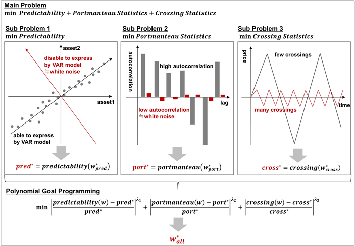

## Table of Contents

## What is cross-asset arbitrage?

Cross-asset arbitrage is a trading strategy where you make money by taking advantage of price differences between two or more related assets. For example, if gold is cheaper in one market than in another, you can buy it where it's cheaper and sell it where it's more expensive, making a profit from the difference.

This strategy can be used with different types of assets like stocks, bonds, commodities, and currencies. It requires quick action and good information because the price differences usually don't last long. Traders use advanced tools and models to spot these opportunities and act fast to make money before the prices even out.

## How does cross-asset arbitrage differ from other types of arbitrage?

Cross-asset arbitrage is different from other types of arbitrage because it involves trading across different types of assets, like stocks, bonds, and commodities, instead of just one type. For example, if you see that the price of gold is lower in one market than in another, you can buy gold in the cheaper market and sell it in the more expensive one. This is different from, say, pure statistical arbitrage, where you might trade only stocks, looking for small price differences between similar stocks.

Another type of [arbitrage](/wiki/arbitrage) is spatial arbitrage, where you take advantage of price differences in the same asset but in different locations. For instance, if wheat is cheaper in one country than another, you could buy it in the cheaper country and sell it in the more expensive one. Cross-asset arbitrage is broader because it can involve different assets and different markets, making it more complex but also potentially more rewarding if you can spot the right opportunities.

In contrast, risk arbitrage, also known as merger arbitrage, focuses on the price differences that arise from corporate events like mergers and acquisitions. Here, you might buy the stock of a company being acquired and short sell the stock of the acquiring company, betting on the spread between the two prices. Cross-asset arbitrage, on the other hand, doesn't rely on specific corporate events but on general market inefficiencies across different asset classes.

## What are the basic principles behind cross-asset arbitrage?

The main idea behind cross-asset arbitrage is to make money by spotting and using price differences between different types of assets. For example, if you see that gold is cheaper in one market than in another, you can buy gold where it's cheaper and sell it where it's more expensive. This way, you make a profit from the difference in prices. The key is to find these differences quickly and act fast because they usually don't last long.

To do cross-asset arbitrage well, you need good information and tools to help you find these price differences. Traders use special computer programs and models to spot these opportunities. They also need to be quick because the prices can change fast. It's important to understand how different assets are related to each other, like how the price of oil might affect the price of stocks in the energy sector. By understanding these relationships, traders can make smart moves to make money from the price differences.

## What types of assets are typically involved in cross-asset arbitrage?

Cross-asset arbitrage usually involves trading different types of assets like stocks, bonds, commodities, and currencies. For example, if you see that the price of oil is lower in one market than in another, you can buy oil where it's cheaper and sell it where it's more expensive. This way, you make money from the difference in prices. Stocks and bonds can also be part of this strategy. If a company's stock is undervalued compared to its bonds, you might buy the stock and sell the bonds to profit from the difference.

Another common type of asset used in cross-asset arbitrage is currencies. If the exchange rate between two currencies is different in two markets, you can buy the currency where it's cheaper and sell it where it's more expensive. Commodities like gold, silver, and agricultural products are also often used. For instance, if wheat is cheaper in one country than another, you can buy it in the cheaper country and sell it in the more expensive one. The key is to find these price differences quickly and act fast to make a profit before the prices even out.

## What are the key steps to identify a cross-asset arbitrage opportunity?

To identify a cross-asset arbitrage opportunity, you first need to gather a lot of information about different markets and the prices of various assets like stocks, bonds, commodities, and currencies. You need to keep an eye on how these prices change over time and across different places. For example, if you see that gold is cheaper in one market than in another, that could be a good chance to buy gold where it's cheaper and sell it where it's more expensive. The key is to use tools and computer programs to help you spot these price differences quickly.

Once you've found a possible arbitrage opportunity, you need to check if it's really worth going after. This means looking at the costs of buying and selling the assets, like fees and taxes, and making sure the profit you could make is bigger than these costs. You also need to act fast because these price differences usually don't last long. Using advanced models and understanding how different assets are related to each other can help you make smart decisions and take advantage of these opportunities before they disappear.

## What tools and technologies are essential for executing cross-asset arbitrage?

To do cross-asset arbitrage well, you need special tools and technologies. One important tool is a computer program that can look at lots of data from different markets very quickly. This program helps you see when the price of one asset, like gold, is lower in one place than another. You also need fast internet to make sure you can buy and sell the assets quickly before the prices change.

Another key technology is a trading platform that lets you trade different types of assets easily. This platform should be able to handle stocks, bonds, commodities, and currencies all in one place. You also need good models and algorithms to help you understand how different assets are connected. These models can tell you when there's a good chance to make money from the price differences between assets.

## What are the risks associated with cross-asset arbitrage?

Cross-asset arbitrage can be risky. One big risk is that the price differences you want to use to make money might disappear before you can act. This can happen if other traders also spot the opportunity and start buying and selling, which makes the prices even out quickly. Another risk is that you might not have all the information you need. If you miss some important details about how the assets are related or if there are fees and taxes you didn't think about, you could end up losing money instead of making a profit.

Another risk comes from the technology you use. If your computer program or trading platform has a problem, you might not be able to buy or sell the assets at the right time. Also, there's the risk of market changes. Sometimes, big events like economic news or political changes can make the prices of assets move in unexpected ways, which can mess up your arbitrage plan. So, even though cross-asset arbitrage can be a way to make money, it's important to be careful and think about all these risks before you start.

## How can one mitigate the risks involved in cross-asset arbitrage?

To lower the risks in cross-asset arbitrage, you need to be quick and have good information. Use computer programs and trading platforms that can look at lots of data fast. This helps you spot price differences between different assets before they disappear. Also, always think about the costs like fees and taxes that might eat into your profit. Make sure the money you could make is more than these costs. Being careful with your information and acting fast can help you avoid losing money because the price differences went away too soon.

Another way to reduce risks is to understand how different assets are connected. Use models and algorithms to see how changes in one asset might affect others. This can help you make better decisions and avoid surprises. Also, be ready for big events like economic news or political changes that can shake up the markets. Have a plan for what to do if things don't go as expected. By being prepared and understanding the markets well, you can make cross-asset arbitrage safer and more likely to be successful.

## What are some real-world examples of successful cross-asset arbitrage?

One real-world example of successful cross-asset arbitrage happened in the early 2000s with the Royal Dutch Shell company. Royal Dutch and Shell Transport & Trading were two separate companies that merged to form Royal Dutch Shell. Their stocks were traded on different exchanges, and for a while, the price ratio between the two stocks was not what it should have been. Traders noticed this and bought the cheaper stock while selling the more expensive one, making money from the difference until the prices evened out.

Another example is from the currency markets. In the 1990s, traders found that the exchange rate between the US dollar and the Japanese yen was different in New York and Tokyo. They would buy dollars in Tokyo where they were cheaper and sell them in New York where they were more expensive. This helped them make a profit from the small difference in exchange rates until the markets adjusted and the prices became the same everywhere.

## How do regulatory environments affect cross-asset arbitrage strategies?

Regulatory environments can have a big impact on cross-asset arbitrage strategies. Different countries have different rules about trading, and these rules can change how easy or hard it is to do arbitrage. For example, some countries might have strict rules about buying and selling certain assets, like commodities or currencies. If you want to trade gold, you might need special permissions or have to pay extra fees. These rules can make the costs of arbitrage go up, which might mean you make less money or even lose money if the profit is not big enough to cover the costs.

Also, regulations can affect how fast you can do arbitrage. If there are a lot of rules to follow, it might take longer to buy and sell assets. This can be a problem because arbitrage often depends on acting quickly before the price differences disappear. Some countries might also have rules about how much information you need to share when you trade. If you have to tell everyone what you're doing, other traders might see your moves and start doing the same thing, which can make the price differences go away faster. So, understanding and following the rules in different places is really important for making cross-asset arbitrage work well.

## What advanced strategies can be employed to enhance cross-asset arbitrage?

One advanced strategy to enhance cross-asset arbitrage is to use [machine learning](/wiki/machine-learning) and [artificial intelligence](/wiki/ai-artificial-intelligence). These technologies can look at huge amounts of data from different markets very quickly. They can find patterns and price differences that might be hard for people to see. For example, a machine learning model can predict how the price of oil might affect the price of stocks in the energy sector. By using these predictions, traders can make smarter decisions and act faster, which can help them make more money from arbitrage opportunities.

Another strategy is to use multi-asset hedging. This means buying and selling different types of assets to protect against risks. For instance, if you're doing arbitrage with stocks and bonds, you might also trade commodities or currencies to balance out any losses. This can make your arbitrage strategy safer. Also, understanding how different assets are related to each other, like how interest rates might affect bond prices, can help you find more arbitrage opportunities. By combining these advanced strategies, traders can improve their chances of making money from cross-asset arbitrage.

## How does machine learning and AI impact the future of cross-asset arbitrage?

Machine learning and AI are changing the future of cross-asset arbitrage by making it easier to find and use price differences between different assets. These technologies can look at a lot of data from different markets very quickly. They can find patterns and price differences that might be hard for people to see. For example, a machine learning model can predict how the price of oil might affect the price of stocks in the energy sector. By using these predictions, traders can make smarter decisions and act faster, which can help them make more money from arbitrage opportunities.

In the future, as machine learning and AI get better, they will be even more important for cross-asset arbitrage. These technologies will be able to find more complex patterns and relationships between assets. This means traders can find more arbitrage opportunities and make better use of them. However, it also means that the competition will be tougher because more people will be using these tools. So, traders will need to keep learning and using the latest technology to stay ahead in the game of cross-asset arbitrage.

## How does cross-asset arbitrage work?

Cross-asset arbitrage functions by exploiting price inefficiencies between correlated financial instruments. Initially, traders identify price discrepancies, which are differences in expected versus actual prices, between two or more related assets. For example, the inverse relationship between oil prices and airline stocks is a classic case where fluctuations in oil prices can affect airline profitability, thus impacting stock prices.

Once a price discrepancy is spotted, the trading process involves taking opposing positions in the correlated assets. Specifically, the trader will purchase the undervalued asset while concurrently selling the overvalued asset. This strategy relies on the assumption that the discrepancy is temporary and will eventually return to equilibrium.

Consider two correlated assets, Asset A and Asset B, with prices $P_A$ and $P_B$. If their price relationship deviates from a historical or expected correlation, the arbitrageur might calculate the spread $S = P_A - kP_B$, where $k$ represents the expected price relationship coefficient. The goal is to profit from the spread reverting to zero:

$$
S_{initial} = P_A - kP_B
$$
$$
\text{If } S_{initial} > 0, \text{ sell Asset A and buy Asset B}
$$

$$
\text{If } S_{initial} < 0, \text{ buy Asset A and sell Asset B}
$$

After executing the trades, the arbitrageur monitors the markets to determine when the price discrepancy corrects. This moment is characterized by the price spread $S$ converging back to its expected mean, closing the positions to secure profits:

$$
S_{final} \approx 0
$$

The effectiveness of the strategy depends heavily on the speed and accuracy of execution, as even slight delays or errors can erode potential gains. Thus, sophisticated algorithms and real-time data analysis are crucial to promptly identifying and acting upon these fleeting opportunities.

## References & Further Reading

[1]: Bernstein, P. L. (1992). ["Capital Ideas: The Improbable Origins of Modern Wall Street."](https://archive.org/details/capitalideasimpr0000bern) The Free Press.

[2]: Lopez de Prado, M. (2018). ["Advances in Financial Machine Learning."](https://www.amazon.com/Advances-Financial-Machine-Learning-Marcos/dp/1119482089) Wiley.

[3]: Hull, J. C. (2018). ["Options, Futures, and Other Derivatives."](https://www.pearson.com/nl/en_NL/higher-education/subject-catalogue/finance/Options-Futures-and-Other-Derivatives-Hull.html) Pearson.

[4]: Derman, E. (2011). ["Models. Behaving. Badly.: Why Confusing Illusion with Reality Can Lead to Disaster, on Wall Street and in Life."](https://www.wiley.com/en-us/Models+Behaving+Badly+%3A+Why+Confusing+Illusion+with+Reality+Can+Lead+to+Disaster%2C+on+Wall+Street+and+in+Life-p-9781119944690) Wiley.

[5]: Black, F., & Scholes, M. (1973). ["The Pricing of Options and Corporate Liabilities."](https://www.cs.princeton.edu/courses/archive/fall09/cos323/papers/black_scholes73.pdf) The Journal of Political Economy, 81(3), 637-654. 

[6]: Chan, E. P. (2013). ["Algorithmic Trading: Winning Strategies and Their Rationale."](https://github.com/ftvision/quant_trading_echan_book) Wiley.

[7]: Asness, C. S. (1997). ["The Interaction Between Value and Momentum Strategies."](https://papers.ssrn.com/sol3/papers.cfm?abstract_id=7687) The Financial Analysts Journal, 53(2), 29-36. 

[8]: Litterman, R., & Scheinkman, J. (1991). ["Common Factors Affecting Bond Returns."](https://www.pm-research.com/content/iijfixinc/1/1/54) The Journal of Fixed Income, 1(1), 54-61.