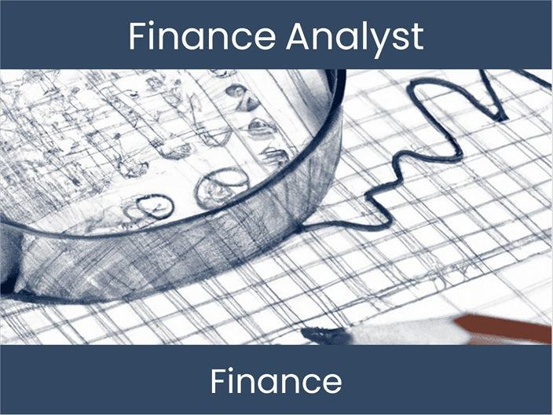

Cross-asset arbitrage is a sophisticated algorithmic trading strategy designed to exploit price discrepancies between related asset classes for profit generation. In contrast to traditional arbitrage, which concentrates on a single asset traded across different markets, cross-asset arbitrage involves multiple interrelated financial instruments, such as stocks, bonds, commodities, and currencies. The strategy capitalizes on complex price relationships that exist across these diverse markets, allowing traders to execute positions that capitalize on these variances. This multifaceted approach requires a nuanced understanding of how different asset classes interact and are correlated, thus allowing for the identification of profitable trading opportunities.

The financial instruments involved in cross-asset arbitrage are diverse and can encompass various asset classes, each with its unique market dynamics and risk profile. For instance, equities and bonds might exhibit inverse correlations due to changes in interest rates, while commodities and currencies frequently demonstrate complex interdependencies shaped by geopolitical events and global economic conditions. By analyzing these relationships, traders can identify scenarios where the price of one asset class diverges from its expected value relative to another, thus presenting a potential arbitrage opportunity.

This article aims to explore the intricate mechanics behind cross-asset arbitrage, examining the types of strategies employed, the challenges faced by traders, and the technological advancements that have facilitated the evolution of this trading strategy. As algorithmic trading continues to evolve, cross-asset arbitrage remains a dynamic and challenging avenue, demanding both technical acumen and a robust understanding of market mechanics.

## Table of Contents

## Key Concepts in Cross-Asset Arbitrage

Arbitrage is a fundamental strategy in financial markets, characterized by the simultaneous purchase and sale of an asset to capitalize on price discrepancies. This concept enables traders to secure a risk-free profit by exploiting market inefficiencies. The strategy relies on the assumption that markets will eventually equilibrate, thereby eliminating the price differential.

In cross-asset arbitrage, the focus shifts from single asset exploitation to leveraging price relationships across diverse asset classes. This approach involves trading and analysis that incorporate multiple financial instruments, such as equities, bonds, and currencies. By understanding the interconnections between different asset classes, traders can identify opportunities where price movements in one asset are expected to influence another, thereby allowing for profitable trading strategies.

For instance, various economic and financial factors can cause the prices of related assets to diverge, even when historical data suggests a strong correlation. In cross-asset arbitrage, traders aim to identify such anomalies and capitalize on the temporary mispricing. An example could be the relationship between interest rates and stock prices; a sudden change in interest rates might momentarily create a misalignment in expected stock valuations.

The core idea is to exploit these price relationships by assessing the statistical and economic linkages between diverse financial instruments. Traders use advanced analytical tools to model these relationships, often employing econometric and statistical techniques to ascertain the degree of correlation between asset classes. In practice, this involves setting up pairs trades, where traders simultaneously buy the undervalued asset and sell the overvalued counterpart, based on the predicted price relationship.

Overall, cross-asset [arbitrage](/wiki/arbitrage) requires a sophisticated understanding of numerous financial markets and a robust analytical framework to effectively identify and exploit transient pricing inefficiencies.

## How Cross-Asset Arbitrage Works

Cross-asset arbitrage functions by exploiting price inefficiencies between correlated financial instruments. Initially, traders identify price discrepancies, which are differences in expected versus actual prices, between two or more related assets. For example, the inverse relationship between oil prices and airline stocks is a classic case where fluctuations in oil prices can affect airline profitability, thus impacting stock prices.

Once a price discrepancy is spotted, the trading process involves taking opposing positions in the correlated assets. Specifically, the trader will purchase the undervalued asset while concurrently selling the overvalued asset. This strategy relies on the assumption that the discrepancy is temporary and will eventually return to equilibrium.

Consider two correlated assets, Asset A and Asset B, with prices $P_A$ and $P_B$. If their price relationship deviates from a historical or expected correlation, the arbitrageur might calculate the spread $S = P_A - kP_B$, where $k$ represents the expected price relationship coefficient. The goal is to profit from the spread reverting to zero:

$$
S_{initial} = P_A - kP_B
$$
$$
\text{If } S_{initial} > 0, \text{ sell Asset A and buy Asset B}
$$

$$
\text{If } S_{initial} < 0, \text{ buy Asset A and sell Asset B}
$$

After executing the trades, the arbitrageur monitors the markets to determine when the price discrepancy corrects. This moment is characterized by the price spread $S$ converging back to its expected mean, closing the positions to secure profits:

$$
S_{final} \approx 0
$$

The effectiveness of the strategy depends heavily on the speed and accuracy of execution, as even slight delays or errors can erode potential gains. Thus, sophisticated algorithms and real-time data analysis are crucial to promptly identifying and acting upon these fleeting opportunities.

## Types of Cross-Asset Arbitrage

Equity-Bond Arbitrage is a form of cross-asset arbitrage involving the trading of bonds and stocks that share a correlation. This strategy exploits the relationship between equity markets and fixed income securities. The correlation may arise from factors like interest rates, which can influence both bond yields and stock prices. A common approach is to identify a mispricing between a stock's implied yield and a bond's yield, and execute trades to capture the differential. For example, if the dividend yield on a stock is significantly higher than the yield on a related bond, an arbitrageur might short the stock and buy the bond, expecting the discrepancy to correct.

Commodity-Equity Arbitrage involves taking positions in both a commodity and a related equity. A classic example is the relationship between oil prices and the stocks of oil companies. If a company's stock does not reflect a recent rise in oil prices, traders may buy the stock while simultaneously selling oil futures or taking a short position in oil. The aim is to profit when the stock price realigns with the underlying commodity value.

Convertible Arbitrage pertains to trading a company's convertible bonds against its stock. Convertible bonds are hybrid securities that offer the option to convert into a predetermined number of the issuer's shares. Arbitrageurs often take a long position in the convertible bond and a short position in the stock, betting on the [volatility](/wiki/volatility-trading-strategies) and using the bond's conversion option to hedge against movements in the stock price. This strategy profits from movements in volatility while mitigating directional risk.

[FX](/wiki/fx-anomaly)-Equity Arbitrage is based on the movements of currency exchange rates relative to a country's equity markets. For instance, if a major currency like the U.S. dollar moves significantly against a foreign currency, it could misalign the value of a foreign company's stock for dollar-based investors. Traders can buy the underpriced equity in terms of one currency while selling it in a currency where it is overpriced, arbitraging the differential caused by currency fluctuations.

Index Arbitrage targets price discrepancies between stock indices and their futures contracts. When the futures contract price differs significantly from the index value, arbitrageurs buy or sell the futures while making offsetting trades in the actual stock index components. This strategy ensures that the two prices converge by the expiration of the futures contract. Index arbitrage requires precise timing and execution, often facilitated by automated trading systems due to the speed necessary to exploit such opportunities.

## Challenges and Risks

Cross-asset arbitrage, while profitable, inherently involves various challenges and risks that traders must manage effectively to secure gains. One predominant challenge is market risk, which arises when price discrepancies between correlated assets expand instead of contracting. This can result in short-term losses if the arbitrage position is prematurely closed or left unhedged during the period of discrepancy.

Execution risk is another significant concern, stemming from the costs associated with carrying out trades, including bid-ask spreads and slippage. Slippage occurs when the actual execution price differs from the expected price, ultimately diminishing potential arbitrage profits. For instance, in a fast-moving market, executing orders at the desired prices can be particularly challenging, making it critical to optimize the speed and accuracy of trade execution.

Timing risk is associated with the delays in executing trades, which can nullify arbitrage opportunities if the price discrepancies correct themselves before the trades are finalized. High-frequency trading systems are often employed to mitigate this risk, yet they require substantial technological infrastructure and resources, which may not be accessible to all market participants.

Correlation breakdown poses another considerable risk for cross-asset arbitrage strategies. When anticipated correlations between assets unexpectedly diverge, the assumption of price movement relationships underpinning the arbitrage strategy is invalidated. For instance, if a trader is executing an equity-bond arbitrage strategy and the historical correlation between the two assets changes, the strategy's foundation can collapse, potentially leading to losses.

These challenges and risks exemplify the complexities of cross-asset arbitrage, necessitating robust strategies and advanced technological tools to exploit opportunities while managing potential pitfalls effectively.

## Real-World Applications and Tools

High-frequency trading ([HFT](/wiki/high-frequency-trading-strategies)) is a key application of cross-asset arbitrage, leveraging sophisticated algorithms to execute trades at speeds measured in microseconds. These algorithms are designed to identify and capitalize on fleeting price discrepancies between related asset classes across multiple markets. HFT firms utilize advanced programming languages and technologies to build algorithms that can interpret market data in real-time, execute trades autonomously, and manage positions efficiently. The success of HFT relies heavily on low latency and high throughput, necessitating the use of co-location services, where trading firms place their servers in close proximity to exchange servers to minimize communication delays.

Quantitative funds, another significant player in cross-asset arbitrage, employ advanced mathematical models to unearth arbitrage opportunities. These funds exploit statistical relationships between different asset classes using techniques such as regression analysis, [machine learning](/wiki/machine-learning), and optimization methods. Quantitative models might include [statistical arbitrage](/wiki/statistical-arbitrage), where mean-reversion strategies are implemented to capture price discrepancies based on historical correlations and price movements. The deployment of such strategies requires a deep understanding of financial mathematics and computational techniques to model the complex interactions between asset classes and market factors.

Technological advancements are indispensable tools in cross-asset arbitrage. Algorithms serve as the backbone of trade execution systems, processing vast volumes of market data to dynamically adjust trading strategies based on real-time conditions. Trading platforms are the interfaces that connect traders to financial markets, providing the necessary infrastructure to execute trades, manage orders, and monitor positions across different asset classes simultaneously. Advanced data analytics play a critical role in analyzing historical and real-time data to uncover patterns and predict future price movements. These analytics are often structured using machine learning algorithms capable of evolving with changing market dynamics.

Effective risk management systems are essential to mitigate the inherent risks associated with cross-asset arbitrage. These systems analyze the potential impact of adverse market movements, evaluate the correlation risks between different asset classes, and apply risk metrics such as Value-at-Risk (VaR) and stress testing to ensure that the portfolio remains within the defined risk parameters. By integrating real-time risk assessment tools with trading algorithms, traders can dynamically hedge positions and adjust their strategies to align with evolving market conditions.

In summary, high-frequency trading, quantitative funds, and cutting-edge technologies form the triad of real-world applications and tools in cross-asset arbitrage. These elements work collectively to identify, execute, and capitalize on arbitrage opportunities while managing the associated risks through sophisticated technological solutions and robust analytical models.

## Case Studies

### LTCM and the Russian Debt Crisis

Long-Term Capital Management (LTCM) was a prominent [hedge fund](/wiki/hedge-fund-trading-strategies) known for its use of sophisticated mathematical models to achieve high returns. In 1998, LTCM faced substantial losses when the Russian government defaulted on its debt, leading to global market turmoil. The fund had heavily utilized cross-asset arbitrage strategies, investing in various fixed-income securities and derivatives, basing decisions on historical correlations.

The Russian default triggered a widespread reassessment of risk, causing correlations between assets to break down. This phenomenon disrupted LTCM's models, which had failed to account for such systemic shocks. Their strategies were predicated on historical price relationships that disintegrated during the crisis, resulting in significant financial losses. LTCM's inability to adapt to the rapidly changing market conditions illustrated key vulnerabilities in cross-asset arbitrage, particularly the risks associated with correlation dependency and model reliability.

### The Flash Crash of 2010

On May 6, 2010, U.S. financial markets experienced a dramatic and rapid decline known as the Flash Crash. Within minutes, major stock indices plunged before partially recovering, creating chaos among traders and investors. This event spotlighted the hazards associated with high-frequency trading (HFT) and cross-asset arbitrage.

Algorithmic trading programs were identified as significant contributors to the Flash Crash. These algorithms execute trades at extremely high speeds, aiming to exploit minute price discrepancies. However, a critical mass of these trades—operating in tight time frames—led to a [liquidity](/wiki/liquidity-risk-premium) vacuum. This lack of market depth resulted in extreme price volatility across equities and their derivatives.

One contributing [factor](/wiki/factor-investing) to the crisis was the interlinking of asset prices due to arbitrage strategies. Algorithmic trading, though designed to stabilize markets by aligning prices of related assets, instead amplified the volatility. The event underscored the importance of circuit breakers and other regulatory measures to mitigate systemic risks associated with high-frequency and cross-asset trading strategies.

## Conclusion

Cross-asset arbitrage presents traders with the potential for substantial financial gains; however, it is intrinsically linked to significant risks and demands a comprehensive understanding of the interdependencies within global financial markets. The necessity for this profound insight is underscored by the complex nature of the relationships between different asset classes such as equities, bonds, commodities, and currencies. Successful execution of cross-asset arbitrage strategies hinges on the market participant's ability to accurately interpret these relationships and react swiftly to fleeting arbitrage opportunities.

As technological advancements continue to reshape the financial landscape, they bring both new opportunities and fresh challenges to the practice of cross-asset arbitrage. High-frequency trading and advanced algorithmic systems have transformed how trades are executed, allowing for rapid identification and exploitation of market inefficiencies. These technologies, while enhancing trading capabilities, also intensify competition, requiring traders to remain on the cutting edge of technology and innovation. 

A robust cross-asset arbitrage strategy is characterized by the deployment of sophisticated algorithms designed to meticulously analyze market data and identify discrepancies. These algorithms, often rooted in complex quantitative models, are pivotal in executing trades with precision and speed. Equally important is effective risk management; the inherent uncertainties and potential for correlation breakdowns necessitate strategies that can mitigate adverse outcomes. This involves continuous monitoring of market conditions, back-testing trading models, and implementing stop-loss mechanisms to safeguard portfolios.

In conclusion, while cross-asset arbitrage offers lucrative opportunities, it is fraught with different layers of complexity and risk. As the landscape evolves, driven by technological progress, traders must adapt and refine their strategies, leveraging cutting-edge technologies and rigorous risk management to navigate this challenging yet rewarding domain.

## References & Further Reading

[1]: Bernstein, P. L. (1992). ["Capital Ideas: The Improbable Origins of Modern Wall Street."](https://archive.org/details/capitalideasimpr0000bern) The Free Press.

[2]: Lopez de Prado, M. (2018). ["Advances in Financial Machine Learning."](https://www.amazon.com/Advances-Financial-Machine-Learning-Marcos/dp/1119482089) Wiley.

[3]: Hull, J. C. (2018). ["Options, Futures, and Other Derivatives."](https://www.pearson.com/nl/en_NL/higher-education/subject-catalogue/finance/Options-Futures-and-Other-Derivatives-Hull.html) Pearson.

[4]: Derman, E. (2011). ["Models. Behaving. Badly.: Why Confusing Illusion with Reality Can Lead to Disaster, on Wall Street and in Life."](https://www.wiley.com/en-us/Models+Behaving+Badly+%3A+Why+Confusing+Illusion+with+Reality+Can+Lead+to+Disaster%2C+on+Wall+Street+and+in+Life-p-9781119944690) Wiley.

[5]: Black, F., & Scholes, M. (1973). ["The Pricing of Options and Corporate Liabilities."](https://www.cs.princeton.edu/courses/archive/fall09/cos323/papers/black_scholes73.pdf) The Journal of Political Economy, 81(3), 637-654. 

[6]: Chan, E. P. (2013). ["Algorithmic Trading: Winning Strategies and Their Rationale."](https://github.com/ftvision/quant_trading_echan_book) Wiley.

[7]: Asness, C. S. (1997). ["The Interaction Between Value and Momentum Strategies."](https://papers.ssrn.com/sol3/papers.cfm?abstract_id=7687) The Financial Analysts Journal, 53(2), 29-36. 

[8]: Litterman, R., & Scheinkman, J. (1991). ["Common Factors Affecting Bond Returns."](https://www.pm-research.com/content/iijfixinc/1/1/54) The Journal of Fixed Income, 1(1), 54-61.