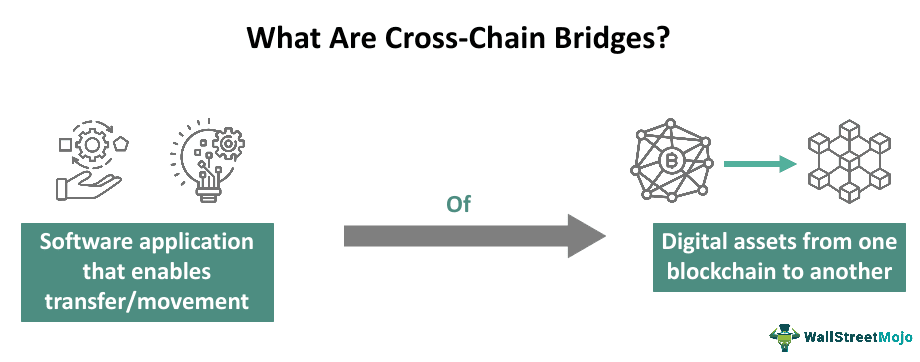

The rapid evolution of blockchain technology has fundamentally transformed various industries by enabling secure and transparent transactions. This technology underpins cryptocurrencies such as Bitcoin and Ethereum, and its applications extend beyond digital currencies into sectors such as supply chain management, healthcare, and finance. However, a significant obstacle obstructing broader adoption is the lack of interoperability between different blockchain networks. Each blockchain operates its independent ecosystem, often leading to siloed operations and limited interaction capabilities. This fragmentation curtails the potential for utilizing blockchain across distributed and decentralized platforms. 

Blockchain interoperability is essential for overcoming these limitations, as it facilitates seamless transactions and interactions across diverse blockchain systems, thereby enhancing their efficiency and functionality. Cross-chain bridges are a pivotal innovation in this pursuit. They are protocols designed to connect separate blockchain networks, enabling the transfer of assets and data between them. These bridges address issues related to blockchain isolation, thus broadening the scope of blockchain applications.



This article aims to explore the various aspects of blockchain interoperability, the mechanics of cross-chain bridges, and their importance in cryptocurrency algorithmic trading. Algorithmic trading, which employs algorithms to automate trading decisions, gains new dimensions through blockchain's decentralized technology. Understanding these interconnected concepts is crucial for harnessing blockchain technology's full potential in the digital economy. As blockchain continues to expand, interoperability and cross-chain solutions will be key drivers in advancing its capabilities and integrating it more fully into everyday applications.

## Table of Contents

## What is Blockchain Interoperability?

Blockchain interoperability is the inherent capability allowing different blockchain networks to communicate, share data, and facilitate transactions amongst one another without discontinuity. Traditionally, blockchains operate as isolated ecosystems, each with its protocols, consensus mechanisms, and data structures. This isolation poses significant hurdles for users and developers who seek to leverage the benefits of multiple blockchain platforms simultaneously. Interoperability addresses this limitation by enabling seamless interaction between disparate blockchains, thus expanding their functional utility and fostering a more interconnected digital finance landscape.

A prime example of the enhanced utility lies in decentralized finance (DeFi), where interoperability allows users to execute transactions across various DeFi platforms without needing to convert digital assets into different formats manually. This capability leads to increased asset liquidity, broader market access, and novel financial products and services. Similarly, in supply chain management, interoperability enables different stakeholders across different blockchain networks to share verified data securely and efficiently, streamlining processes and enhancing transparency and accountability in tracking goods and services from origin to consumption.

To achieve interoperability, various protocols and technologies are engaged, including cross-chain communication protocols, sidechains, and blockchain of blockchains models. These solutions must navigate the challenges of differing transaction speeds, privacy settings, and consensus mechanisms inherent to each blockchain network. By harmonizing these differences, interoperability brings about a more cohesive and efficient blockchain ecosystem. Thus, interoperability not only enriches blockchain technology's current applications but also paves the way for future innovations that require collaborative interaction between multiple blockchain networks.

## Understanding Cross-Chain Bridges

Cross-chain bridges are essential protocols designed to facilitate the efficient transfer of digital assets and information across different blockchain networks. These bridges address the issue of fragmentation that arises from the existence of multiple, isolated blockchain ecosystems. By enabling seamless interaction between these ecosystems, cross-chain bridges not only increase [liquidity](/wiki/liquidity-risk-premium) but also allow users to leverage the distinct advantages offered by various platforms.

There are two primary classifications of cross-chain bridges: trust-based and trustless. Trust-based bridges rely on third-party entities to mediate and verify transactions between distinct blockchains. This type typically requires users to place a certain level of trust in these intermediaries to ensure the security and integrity of their transactions. In contrast, trustless bridges operate without reliance on intermediaries, leveraging smart contracts and cryptographic proofs to automate and secure cross-chain transfers. By doing so, trustless bridges aim to eliminate the need for user trust in third parties, thereby offering a more decentralized and secure method of conducting cross-chain transactions.

A practical use case for cross-chain bridges includes trading scenarios where a user wants to exchange assets between two different blockchains without the need to first convert them into a fiat currency or another intermediary [cryptocurrency](/wiki/cryptocurrency). This capability enhances both flexibility and efficiency for cryptocurrency traders and investors. Moreover, the increased interoperability brought about by these bridges supports the broader adoption and utilization of decentralized applications (dApps) and decentralized finance (DeFi) services, marking a significant step forward in the evolution of blockchain technology.

## Role of Cross-Chain Bridges in Cryptocurrency Trading

Cross-chain bridges significantly enhance the functionality of cryptocurrency trading by enabling the movement of digital assets across different blockchain platforms without necessitating their sale. This flexibility is particularly crucial in the context of [algorithmic trading](/wiki/algorithmic-trading), where liquidity and access to diverse markets and trading pairs are vital for optimizing trading strategies.

Algorithmic trading, which involves the use of computerized systems to execute trades at speeds unachievable by humans, heavily relies on the ability to access various markets and tokens efficiently. Cross-chain bridges facilitate such access by allowing seamless interoperability between different blockchain networks. Traders can leverage these bridges to conduct fast and cost-effective transfers of assets, thereby increasing their trading efficiency and liquidity options.

Moreover, the ability to move assets across different platforms enables traders to exploit price differences—also known as [arbitrage](/wiki/arbitrage) opportunities—across exchanges. For instance, if Bitcoin trades at a higher price on one exchange compared to another, a trader can use a cross-chain bridge to transfer Bitcoin to the higher-priced exchange to sell at a profit, thus capitalizing on the discrepancy.

Here's a simple Python pseudo-code illustrating how traders might employ a cross-chain bridge in an algorithmic trading scenario to seize arbitrage opportunities:

```python
def find_arbitrage_opportunity(prices_exchange_A, prices_exchange_B):
    for asset in prices_exchange_A.keys():
        price_A = prices_exchange_A[asset]
        price_B = prices_exchange_B[asset]

        if price_A < price_B:
            execute_trade(asset, exchange_A, exchange_B, price_A)

        elif price_B < price_A:
            execute_trade(asset, exchange_B, exchange_A, price_B)

def execute_trade(asset, source_exchange, target_exchange, price):
    # Use cross-chain bridge to move asset from source to target
    transfer_via_bridge(asset, source_exchange, target_exchange)
    # Execute sell order on target exchange
    sell_order(target_exchange, asset, price)

# Example usage with hypothetical price data
prices_A = {'BTC': 50000, 'ETH': 2000}
prices_B = {'BTC': 50500, 'ETH': 1980}

find_arbitrage_opportunity(prices_A, prices_B)
```

In this example, the transfer_via_bridge function would utilize a cross-chain bridge protocol to move assets between exchanges securely and efficiently. The potential for arbitrage is identified when prices differ significantly across exchanges, allowing the algorithm to execute trades that capitalize on these imbalances.

The role of cross-chain bridges in cryptocurrency trading extends beyond merely facilitating faster transaction times. It includes providing traders with a broader array of trading strategies and enhancing their ability to maneuver swiftly in response to market changes. By understanding how to effectively implement cross-chain solutions, traders can significantly optimize their operations, making them more adaptive and responsive in the volatile cryptocurrency markets.

## Algorithmic Trading in the Blockchain Era

Algorithmic trading, also known as algo trading, is a method of executing orders using automation dictated by pre-set rules and algorithms. This technique enables the execution of numerous trades at velocities beyond human capabilities, often leveraging factors like timing, price, and quantity to optimize outcomes. The advent of blockchain technology, specifically through cross-chain interoperability, introduces novel avenues and instruments to enhance these trading strategies.

Cross-chain interoperability enables various blockchain networks to exchange information and assets seamlessly. This feature is transformative for algorithmic trading, providing strategies that are otherwise limited by the constraints of isolated networks. By harnessing the power of cross-chain bridges, traders can automate arbitrage strategies effectively. Arbitrage involves taking advantage of price differences of the same asset on different platforms, buying low on one and selling high on another. Cross-chain bridges facilitate this by ensuring traders access diverse markets and trading pairs, thereby increasing liquidity and opportunities without necessarily moving assets across different exchanges.

The true potential of cross-chain functionality lies in its capacity to reduce latency in transactions and enhance access to multiple blockchain ecosystems. In a blockchain-integrated trading strategy, algorithms can be developed to identify arbitrage opportunities using data from multiple chains. Here's a Python code snippet illustrating a simplified approach to leveraging cross-chain data for arbitrage:

```python
import requests

def get_price_from_exchange(exchange_url, asset):
    response = requests.get(f"{exchange_url}/price/{asset}")
    return response.json()['price']

exchange1_url = "https://api.exchange1.com"
exchange2_url = "https://api.exchange2.com"
asset = "BTC"

price1 = get_price_from_exchange(exchange1_url, asset)
price2 = get_price_from_exchange(exchange2_url, asset)

if price1 < price2:
    print(f"Buy {asset} from Exchange 1 at {price1} and sell on Exchange 2 at {price2}")
else:
    print(f"Buy {asset} from Exchange 2 at {price2} and sell on Exchange 1 at {price1}")
```

This script exemplifies how data from multiple exchanges can be utilized to identify and execute arbitrage trades, showcasing the enhanced strategies made possible through cross-chain bridges. Moreover, transactional speed is crucial in such strategies due to the rapid pace of market changes. Cross-chain bridges offer improved transaction speeds compared to traditional methods, thanks to their interoperability, giving traders a critical edge in executing time-sensitive trades.

The integration of blockchain with algorithmic trading isn't merely about speed and new strategies; it also includes increased transparency and security of trade facilitation. Blockchains, by design, provide immutable and transparent records, mitigating risks of fraud—a significant concern in financial transactions. 

As more sophisticated cross-chain solutions and blockchain advancements emerge, algorithmic trading stands to benefit, providing traders with cutting-edge tools to navigate the complex modern financial landscape. The synergy between these technologies is set to redefine trading paradigms, offering streamlined processes and unparalleled market integration.

## Examples of Implementing Cross-Chain Bridges

Several platforms are leading the way in implementing cross-chain bridge solutions, notably Polkadot and Cosmos. These platforms address the challenge of blockchain interoperability by providing robust frameworks that facilitate seamless communication and transaction execution across diverse blockchain networks.

**Polkadot** is a pioneering project known for its innovative relay chain technology. The relay chain is the heart of Polkadot’s architecture, enabling different blockchain networks, called parachains, to interconnect and communicate efficiently. Parachains are specialized blocks that run parallel to the main relay chain, which helps in achieving scalability and speed of transactions. Polkadot's architecture supports the creation and deployment of custom blockchains that can interact with each other securely and scalably, thereby fostering a more coherent blockchain ecosystem. This method allows for shared security across various networks while maintaining distinct governance protocols for each parachain.

A critical component of Polkadot's interoperability is its **Cross-Consensus Message Passing (XCMP)** protocol. XCMP enables seamless message exchanges between parachains without relying on intermediaries, thus preserving decentralization and trustlessness which are core principles of blockchain technology.

**Cosmos**, another significant player in the domain of cross-chain interoperability, utilizes the Inter-Blockchain Communication (IBC) protocol. At the core of Cosmos' architecture is the **Tendermint Byzantine Fault Tolerance (BFT)** consensus mechanism, which provides a fast and secure method for reaching consensus across interconnected blockchain networks. IBC is designed to allow independent blockchains to connect and share data and tokens with one another, facilitating comprehensive interoperability.

Cosmos' ecosystem operates on a hub-and-spoke model where multiple blockchain networks, known as zones, connect to a central hub. This modular approach enhances scalability and functionality while simplifying the process of cross-chain interactions. Through the IBC protocol, Cosmos supports atomic transfers across different chains, ensuring both interoperability and secure, efficient transactions.

Both Polkadot and Cosmos exemplify the potential of cross-chain bridges to overcome the limitations of isolated blockchain networks. By enabling diverse blockchains to interact seamlessly, these platforms not only enhance liquidity and transaction speeds but also broaden the range of applications and services that can be built across multiple networks. Through their innovative solutions, these projects are paving the way for a more integrated and functional blockchain ecosystem.

## Challenges and Risks Associated with Cross-Chain Bridges

Cross-chain bridges, while pivotal for facilitating interoperability across different blockchain networks, pose significant security challenges. These bridges function by connecting distinct blockchains, allowing for the transfer of assets and data. However, their exposure to multiple networks makes them vulnerable to a variety of security threats, including hacking and malicious exploits.

One primary security issue stems from the necessity of additional trust assumptions. Many cross-chain bridges, especially trust-based ones, require users to place their trust in a central entity or a consortium of validators. This setup inherently introduces points of failure that can be exploited by attackers. Trustless bridges, while more decentralized, still face challenges such as smart contract vulnerabilities that can be targeted by sophisticated attacks.

The bridging process often involves locking assets on one blockchain, effectively creating a duplicate or "wrapped" version on another chain. If the lock mechanism is compromised, there is a risk of duplicating or permanently losing the locked assets. Such vulnerabilities were highlighted in incidents like the 2022 Wormhole bridge exploit, where attackers exploited smart contract vulnerabilities resulting in significant financial losses.

To mitigate these risks, it is crucial to enhance security measures. This includes implementing rigorous security protocols, employing multi-signature schemes, and ensuring thorough code audits to identify and patch vulnerabilities before they can be exploited. An emphasis on robust cryptographic techniques can also help safeguard transactions and data transfers across the bridge.

Moreover, regular stress testing and employing real-time monitoring systems can help in early detection of suspicious activities, thereby preventing potential attacks. Encouraging transparent and open-source development practices also allows the broader community to contribute to the bridge's security by identifying vulnerabilities not caught by the internal teams.

Understanding the inherent risks of cross-chain bridges equips users and developers with the knowledge to better protect their assets. It underscores the importance of choosing bridges with strong security track records and staying informed about potential vulnerabilities and updates. As blockchain technology progresses, continuous improvements in the security frameworks of cross-chain bridges are essential to safeguarding digital assets.

## Future of Blockchain Interoperability and Cross-Chain Solutions

The future of blockchain technology is intrinsically linked to the enhancement of interoperability and the development of cross-chain solutions. As these technologies mature, they promise to foster unprecedented levels of innovation and integration across diverse blockchain applications. Interoperability, by enabling seamless communication and transaction flows among heterogeneous blockchain networks, has the potential to redefine the digital landscape. Likewise, cross-chain bridges are crucial facilitators, enabling the transfer of data and assets across disparate blockchains, thus enriching the blockchain ecosystem.

Emerging technologies, particularly decentralized finance (DeFi) platforms, are positioned to significantly benefit from these advancements. DeFi has already demonstrated its capacity to disrupt traditional financial systems by offering open, permissionless financial services. As interoperability grows, DeFi platforms could leverage cross-chain solutions to access a broader range of blockchain technologies, enhancing liquidity and enabling cross-platform functionalities. For instance, a decentralized lending platform could offer users access to assets from multiple blockchains, thereby increasing their portfolio diversification opportunities.

Smart contracts, as self-executing contracts with the terms of the agreement directly written into code, also stand to gain from improved interoperability. Greater interconnectivity between blockchains can enhance the functionality and effectiveness of smart contracts. One possible future development is the creation of cross-chain smart contracts that can execute transactions across multiple blockchain platforms simultaneously. This would transform how automated processes are handled across blockchain networks, making complex multi-chain operations possible.

Technological advancements such as layer 2 solutions and blockchain sharding further promise to bolster cross-chain interactions by pushing the scalability and efficiency of blockchain systems. These improvements could lower transaction costs and increase speed, making cross-chain solutions more viable and attractive for large-scale adoption.

The integration of [artificial intelligence](/wiki/ai-artificial-intelligence) and [machine learning](/wiki/machine-learning) with blockchain interoperability and cross-chain solutions can also open new vistas. These technologies could be employed to manage and optimize cross-chain transactions, predict network congestions, and enhance security protocols through anomaly detection models.

Furthermore, as regulations around blockchain technology begin to take shape globally, compliant interoperability and cross-chain solutions will become vital. These frameworks must be robust enough to accommodate regulatory requirements across jurisdictions while maintaining decentralized ethos.

In summary, the continuous evolution of interoperability and cross-chain solutions is pivotal for the progression of blockchain technology. As these systems advance, they will likely catalyze a new wave of applications and integrations, paving the way for a more interconnected and efficient digital world. Such advancements could very well dictate the trajectory of blockchain's future, making it imperative for stakeholders to invest in and support these developments.

## Conclusion

Blockchain interoperability and cross-chain bridges play a crucial role in the ongoing transformation of the digital economy. As diverse blockchain networks continue to proliferate, their ability to seamlessly interact and transact with one another becomes vital for maintaining the integrity and efficiency of digital operations. These technologies foster a more interconnected blockchain environment, enhancing liquidity and ensuring that digital assets can move freely across platforms.

Incorporating blockchain interoperability with algorithmic trading opens up new avenues for optimizing financial strategies and achieving better economic efficiencies. Algorithmic trading benefits from the ability to operate across multiple blockchain networks, accessing a wider array of data, markets, and trading pairs. Cross-chain bridges facilitate this by enabling rapid and secure asset transfers, critical for executing high-frequency algorithmic trades effectively. This synergy holds the potential to unlock advanced trading strategies, such as cross-market arbitrage, which relies on minor price discrepancies between exchanges.

To harness the full potential of blockchain technology, the development of secure and efficient cross-chain solutions is essential. While the promise of interoperability and cross-chain functionality is significant, it is not without its challenges. Security concerns, particularly those arising from the interconnection of multiple networks, pose risks that must be addressed through rigorous testing, security audits, and architectural innovations. As these technologies evolve, addressing these vulnerabilities will be imperative to ensure the safety and robustness of digital transactions.

In conclusion, the evolution of blockchain interoperability and cross-chain bridges is pivotal to the future of digital finance. By enhancing connectivity across blockchain networks, these technologies not only drive efficiency and innovation but also lay the foundation for a more integrated and versatile financial ecosystem. Their continuous development and integration with algorithmic trading will be instrumental in realizing the untapped potential of blockchain technology, paving the way for a more dynamic and responsive digital economy.

## References & Further Reading

[1]: Buterin, V. (2016). ["Chain Interoperability."](https://cognizium.io/uploads/resources/R3%20Corda-Vitalik%20Buterin%20-%20Chain%20Interoperability%20-%202016%20-%20Sep.pdf) Medium.

[2]: Zamyatin, A., Harz, D., Lind, J., Gervais, A., & Knottenbelt, W. J. (2019). ["XCLAIM: Trustless, Interoperable, Cryptocurrency-Backed Assets."](https://ieeexplore.ieee.org/document/8835387) IEEE Security & Privacy.

[3]: Wood, G. (2016). ["Polkadot: Vision for a Heterogeneous Multi-Chain Framework."](https://assets.polkadot.network/Polkadot-whitepaper.pdf) Polkadot.

[4]: Kwon, J. (2014). ["Cosmos: A Network of Distributed Ledgers."](https://v1.cosmos.network/resources/whitepaper) Cosmos Network.

[5]: Wang, S., Ouyang, L., Yuan, Y., Ni, X., Han, X., & Wang, F. Y. (2019). ["Blockchain-Enabled Smart Contracts: Architecture, Applications, and Future Trends."](https://ieeexplore.ieee.org/document/8643084) IEEE Transactions on Intelligent Transportation Systems.

[6]: López de Prado, M. (2018). ["Advances in Financial Machine Learning."](https://www.amazon.com/Advances-Financial-Machine-Learning-Marcos/dp/1119482089) Wiley.

[7]: Greenspan, G. (2015). ["The Hunt for the Blockchain Killer App."](https://the-blockchain.com/2016/04/12/beware-of-the-impossible-smart-contract/) Multichain Blog.