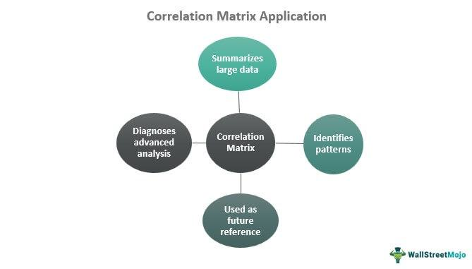

In today’s rapidly evolving financial markets, algorithmic trading is crucial for optimizing trade executions. Such trading relies on sophisticated mathematical models and statistical techniques to analyze market data and execute orders efficiently. Among these techniques, the application of statistical analysis through signal processing is particularly important.

At the heart of these processes lies cross-correlation, a statistical measure that evaluates the similarity between two time series data sets as a function of their time lag. Cross-correlation is used extensively in signal processing to identify relationships between different signals. By analyzing the time lagged relationships, traders can uncover dependencies and lags in financial market data that inform strategic trading decisions.



Cross-correlation functions play an integral role in assessing the time-lag between signals, allowing traders to enhance their strategies by understanding potential lead-lag relationships. For example, when analyzing two financial time series, such as stock prices and a leading economic indicator, cross-correlation can reveal whether changes in the indicator typically precede changes in stock prices, providing a predictive edge.

Understanding how to apply cross-correlation in signal processing is fundamental for developing more effective algorithmic trading approaches. By accurately identifying these lagged correlations, traders can predict market movements with improved precision, leading to better execution strategies and potentially increased profitability. Thus, mastering cross-correlation techniques is essential for any trader looking to leverage data-driven decision-making in today's competitive financial landscape.

## Table of Contents

## Understanding Cross-Correlation

Cross-correlation is a fundamental statistical tool used to assess the degree of similarity between two time series data sets, adjusting for potential lags or delays in one series relative to the other. This measure provides critical insights into the temporal relationship and potential predictive patterns hidden within seemingly random datasets. 

Mathematically, the cross-correlation function $R_{xy}(k)$ between two discrete-time series $x(n)$ and $y(n)$ can be expressed as:

$$

R_{xy}(k) = \sum_{n} x(n) \cdot y(n+k) 
$$

Here, $k$ represents the lag, where a positive $k$ indicates that series $y(n)$ is shifted forward. The cross-correlation function calculates a correlation coefficient for each possible shift, highlighting how much $x$ and $y$ coincide at each lag.

Within signal processing, cross-correlation is essential for tasks such as aligning signals and unmasking periodic patterns that are not immediately apparent. This capability is invaluable in contexts like telecommunications and audio processing where alignment or synchronization is necessary for accurate data interpretation.

Beyond traditional signal processing, cross-correlation finds applications in data analysis and pattern recognition across various fields, from finance to neuroscience. In finance, for instance, it can be used to detect lead-lag relationships between financial instruments, potentially indicating predictive market movements. In neuroscience, cross-correlation assists in identifying timing and synchronization between neuronal firing patterns.

To understand its practical application, consider the example of detecting lead-lag relationships in stock prices. By applying cross-correlation to the time series of two related stocks, traders can identify which stock typically leads the other, potentially guiding anticipatory trading strategies.

For practical implementation, Python's `numpy` library is a widely used tool for computing cross-correlation:

```python
import numpy as np

# Example time series
x = np.array([1, 2, 3, 4, 5])
y = np.array([5, 4, 3, 2, 1])

# Calculate cross-correlation
cross_corr = np.correlate(x, y, mode='full')

# Output the cross-correlation result
print(cross_corr)
```

The above code demonstrates the use of the `np.correlate` function, which calculates the cross-correlation of two sequences `x` and `y`, offering insights into the relationships and dependencies between them.

In summary, cross-correlation is a versatile and powerful statistical tool employed in a wide range of fields for analyzing temporal relationships between data sets. Its capacity to reveal hidden periodicities and align signals makes it indispensable for both theoretical research and practical applications in numerous industries.

## Role of Signal Processing in Algo Trading

Signal processing is an essential component of [algorithmic trading](/wiki/algorithmic-trading), serving as a pivotal tool in refining trading algorithms. It encompasses a variety of techniques designed to analyze, modify, and synthesize signals. These techniques are paramount in filtering out noise, detecting market trends, and predicting future price movements—key factors that enhance decision-making and optimize trade executions in financial markets.

At its core, signal processing aids in the separation of significant data from noise—an inherent challenge in financial markets. The [volatility](/wiki/volatility-trading-strategies) and stochastic nature of financial data often obscure genuine market signals amidst random fluctuations. By applying filtering methods, such as low-pass and high-pass filters, algorithmic traders can isolate useful informational content. For instance, a low-pass filter might remove short-term fluctuations, emphasizing underlying trends in asset prices.

One relevant transformation technique is the Fourier Transform, which translates time-domain financial signals into the frequency domain. This transformation is invaluable in identifying periodic patterns and trends that are not immediately discernible in raw data. By analyzing frequency components, trading algorithms can gain insights into the cyclical behaviors of asset prices, enhancing predictive accuracy.

Beyond traditional filtering and transformation, advanced signal processing techniques such as wavelet analysis offer dynamic, multi-resolution analysis of financial data. Unlike the Fourier Transform, which loses time information, wavelet analysis provides both time and frequency localization. This dual capability allows traders to swiftly adjust to changing market conditions by monitoring both short-term variations and long-term trends simultaneously.

The practical application of signal processing in algorithmic trading extends to several real-world cases. For example, moving average convergence divergence (MACD) is a widely used signal processing technique that helps identify [momentum](/wiki/momentum) and assess price direction. By calculating the differential between multiple time-span moving averages, traders can visualize convergence points, offering insight into potential buy or sell opportunities.

Additionally, signal processing techniques contribute to [machine learning](/wiki/machine-learning) models used in trading. Pre-processing financial data with signal transformation and noise reduction enhances the training of predictive models, leading to more reliable trading algorithms. Integrating signal-processed data into algorithms can significantly improve the reaction speed to market changes, providing a competitive edge in high-frequency trading environments.

These signal processing strategies, underscoring their crucial role in algorithmic trading, drive the evolution of sophisticated trading systems. By continuously adapting and refining these techniques, trading algorithms enhance their precision and robustness in navigating ever-changing financial markets.

## Integrating Cross-Correlation in Trading Strategies

Cross-correlation can be effectively integrated into trading strategies, primarily by leveraging its ability to uncover temporal structures within financial data. This technique is pivotal in identifying lead-lag relationships among asset prices, which can indicate potential future price movements based on historical data patterns. Understanding these dynamics allows traders to make informed decisions by predicting how changes in one asset may precede or follow changes in another.

## Practical Aspects of Incorporating Cross-Correlation

Incorporating cross-correlation into trading algorithms requires careful consideration of several factors. The first step involves selecting the appropriate time series data, such as historical price movements of the assets of interest. By calculating the cross-correlation function between these time series, traders can determine the degree of similarity as a function of time-lag. The formula to compute the cross-correlation function $R_{xy}(k)$ for discrete signal sequences $x(n)$ and $y(n)$ is given by:

$$
R_{xy}(k) = \sum_{n} x(n) \cdot y(n+k)
$$

Here, $k$ represents the lag, and the correlation coefficient helps identify whether one asset's movements systematically precede or succeed another's over various time lags.

### Techniques for Spotting Lead-Lag Relationships

One practical technique for identifying lead-lag relationships is to compute the cross-correlation for different time lags and analyze which lag results in the highest correlation coefficient. By doing so, traders can discern if there is a consistent pattern where changes in one asset lead to changes in another. For instance, if asset A consistently precedes asset B at a lag of 5 days with high correlation, traders might exploit this relationship in crafting predictive trading strategies.

Python, with libraries such as `numpy` and `pandas`, offers robust tools for implementing cross-correlation analysis:

```python
import numpy as np
import pandas as pd

def compute_cross_correlation(series_a, series_b, max_lag):
    lags = range(-max_lag, max_lag + 1)
    cross_correlation_values = [series_a.corr(series_b.shift(lag)) for lag in lags]
    return pd.Series(cross_correlation_values, index=lags)

# Example usage with example_series_a and example_series_b
example_series_a = pd.Series([...])
example_series_b = pd.Series([...])
max_lag = 10
cross_correlation_series = compute_cross_correlation(example_series_a, example_series_b, max_lag)
```

### Strategic Advantages and Challenges

The strategic advantage of using cross-correlation in market analysis lies in its ability to provide actionable insights into price movements that might not be evident through other analytical methods. By anticipating asset movements based on observed lead-lag relationships, traders can time their transactions more effectively to maximize potential returns.

However, leveraging cross-correlation in high-frequency trading presents challenges. The assumptions of stationarity and linearity underlying cross-correlation may not always hold in real-world data, where non-linear relationships and noise often skew results. Additionally, high-frequency trading environments, characterized by rapid market changes, may not afford the time for computing and reacting to cross-correlations without incurring latency.

In conclusion, while cross-correlation is a powerful tool for enriching trading strategies through the identification of inter-asset dynamics, traders need to be mindful of its limitations and ensure it is part of a holistic trading approach that incorporates multiple analytical methods.

## Case Study: Cross-Correlation in Real-World Trading

In a notable case study, the application of cross-correlation in a real-world trading environment significantly enhanced a trading model's predictability. This study focuses on a [quantitative trading](/wiki/quantitative-trading) firm which sought to improve the accuracy of its algorithmic trading strategies by identifying lead-lag relationships between different financial assets.

### Steps Involved

**Data Selection and Preparation**: The first step involved selecting a range of time series data representing the prices of multiple correlated assets over several months. Data cleaning and normalization were essential to ensure that extraneous noise did not impair the accuracy of the analysis.

**Cross-Correlation Analysis**: The core of the experiment was to compute the cross-correlation function (CCF) for pairs of asset prices. The CCF measures the similarity between two time series, $X(t)$ and $Y(t)$, as a function of the time-lag $\tau$ applied to one of them:

$$
\text{CCF}(\tau) = \sum (X(t) - \bar{X})(Y(t+\tau) - \bar{Y})
$$

The Python code snippet used for the calculation is:

```python
import numpy as np

def cross_correlation(x, y, max_lag):
    n = len(x)
    result = np.correlate(x - np.mean(x), y - np.mean(y), mode='full') / (np.std(x) * np.std(y) * n)
    mid_point = len(result) // 2
    return result[mid_point - max_lag: mid_point + max_lag + 1]

# Example usage with synthetic data
x = np.random.rand(100)
y = np.random.rand(100)
lags = range(-5, 6)
cross_corr_values = cross_correlation(x, y, max_lag=5)
```

### Results Obtained

The cross-correlation analysis highlighted a statistically significant lead-lag relationship between certain asset pairs. For instance, it was discovered that changes in the prices of Asset A consistently preceded similar changes in Asset B by a lag of two time intervals. This insight allowed the trading firm to adjust their models accordingly, utilizing this predictive relationship to anticipate future price movements more accurately.

### Insights Gained

Implementing cross-correlation analysis revealed several insights. Primarily, leveraging the temporal dependencies between asset prices enabled the trading firm to enhance its short-term predictive models, resulting in a noticeable improvement in trading execution and profitability. Moreover, the identification of leading indicators among asset pairs provided a strategic advantage in constructing more efficient hedging strategies.

### Lessons Learned

A key lesson from this case study is the importance of data quality in cross-correlation analysis. Ensuring that data is pre-processed to remove anomalies and missing values is crucial for accurate results. Additionally, while cross-correlation can identify potential lead-lag relationships, these relationships must be scrutinized and validated against broader market conditions to avoid spurious correlations.

### Operational Value in Finance

This case study underscores the operational value of cross-correlation in financial trading. By utilizing cross-correlation analysis, trading firms can uncover hidden patterns and relationships in their data, enabling better-informed decision-making and ultimately leading to improved trading performance. Despite its potential, it is important to balance computational efficiency with statistical rigor to achieve meaningful insights that can be effectively integrated into trading strategies.

## Future Prospects and Conclusion

The growing complexity of financial markets requires continuous innovation in trading strategies. As markets become increasingly volatile and data-driven, the reliance on sophisticated mathematical and computational techniques becomes essential. Signal processing, particularly through tools like cross-correlation, is anticipated to play a critical role in the advancement of future trading algorithms. This is because signal processing methods can provide broader insights into market dynamics by analyzing and interpreting vast quantities of financial data swiftly and accurately.

Cross-correlation, with its ability to measure the similarity between time-series data, is expected to gain more prominence in identifying and exploiting intricate relationships between various financial instruments. By understanding the temporal relationships and predicting movement patterns based on historical data, traders can refine their strategies to achieve superior trading outcomes.

The integration of machine learning with algorithmic trading is another promising prospect. Machine learning models are being tailored to incorporate results from statistical measures like cross-correlation, rendering them capable of autonomously optimizing trade executions. This fusion enables the development of adaptive algorithms that learn from data in real-time, adjusting strategies according to shifting market conditions. As data analytics and machine learning technologies continue to evolve, they hold the potential to revolutionize trading strategies, making them more proactive and adaptive.

In conclusion, mastering cross-correlation within signal processing enhances the efficiency and accuracy of algorithmic trading. Traders who deploy advanced statistical tools can discern subtle market signals that are often obscured by noise, leading to more informed decision-making. Future advancements in trading algorithms are expected to further capitalize on these capabilities, enabling them to forecast market trends with greater precision.

To maintain a competitive edge, it is paramount for market participants to stay abreast of innovations and continually adapt to changing dynamics. As financial markets evolve, so too must the algorithms and strategies, underscoring the critical importance of embracing and integrating emerging technologies into trading practices. This approach not only ensures resiliency in the face of market fluctuations but also leverages opportunities facilitated by technological breakthroughs.

## References & Further Reading

[1]: Lopez de Prado, M. (2018). ["Advances in Financial Machine Learning."](https://www.amazon.com/Advances-Financial-Machine-Learning-Marcos/dp/1119482089) Wiley.

[2]: Aronson, D. R. (2006). ["Evidence-Based Technical Analysis: Applying the Scientific Method and Statistical Inference to Trading Signals."](https://www.amazon.com/Evidence-Based-Technical-Analysis-Scientific-Statistical/dp/0470008741) Wiley.

[3]: Jansen, S. (2020). ["Machine Learning for Algorithmic Trading."](https://github.com/stefan-jansen/machine-learning-for-trading) Packt Publishing.

[4]: Chan, E. P. (2008). ["Quantitative Trading: How to Build Your Own Algorithmic Trading Business."](https://github.com/ftvision/quant_trading_echan_book) Wiley.

[5]: Bergstra, J., Bardenet, R., Bengio, Y., & Kégl, B. (2011). ["Algorithms for Hyper-Parameter Optimization."](https://dl.acm.org/doi/10.5555/2986459.2986743) Advances in Neural Information Processing Systems 24.