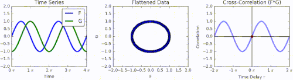

## Table of Contents

## What is cross-correlation in simple terms?

Cross-correlation is a way to measure how similar two signals are by sliding one signal over the other and seeing how they match up at different positions. Imagine you have two sound waves, and you want to see if one wave is a delayed version of the other. You would slide one wave across the other, and at each position, you calculate how well they match. The position where the match is the strongest tells you the delay between the two signals.

This technique is useful in many fields, like signal processing, where it helps in tasks such as finding echoes in audio or aligning different data sets. For example, in telecommunications, cross-correlation can help synchronize signals that have been transmitted and received at different times. By understanding the delay, engineers can adjust the signals to improve communication quality.

## How does cross-correlation differ from autocorrelation?

Cross-correlation and autocorrelation are both ways to compare signals, but they look at different things. Cross-correlation compares two different signals to see how they match up when one is slid over the other. It's like trying to find out if one signal is a delayed version of another. This is useful when you want to see how two different things relate to each other, like comparing the sound of a bird in one recording to the sound in another recording to see if they match at some point.

Autocorrelation, on the other hand, compares a signal with itself. You slide the signal over itself and see how it matches at different positions. This helps you understand the repeating patterns within the same signal. For example, if you have a recording of a heartbeat, autocorrelation can help you find out how regular the heartbeat is by seeing how well it matches itself at different time shifts. So, while cross-correlation is about comparing two different signals, autocorrelation is about understanding the internal structure of one signal.

## Can you explain the mathematical formula for cross-correlation?

The mathematical formula for cross-correlation between two signals, let's call them f(t) and g(t), can be written as a function of a time shift τ. The formula is: C(τ) = ∫[f(t) * g(t+τ) dt], where the integral is taken over all time t. This means you take one signal, g(t), and shift it by τ, then multiply it point by point with the other signal, f(t), and sum up all these products. The result, C(τ), tells you how similar the two signals are at that particular shift.

In simpler terms, imagine you have two sequences of numbers representing the signals. You slide one sequence over the other, multiply the corresponding numbers, and add them up. You do this for every possible shift τ, and the value you get at each shift tells you how well the sequences match at that point. The highest value of C(τ) indicates the best match, which can tell you the delay between the two signals if they are related.

## What are some common applications of cross-correlation in signal processing?

Cross-correlation is widely used in signal processing to find out how similar two signals are and to measure the time delay between them. For example, in audio processing, it can help find echoes in a recording. If you record a sound in a room, the sound might bounce off walls and come back a bit later. By using cross-correlation, you can compare the original sound with the recorded sound to see where the echo shows up. This is useful for improving sound quality in music or speech recordings by removing or reducing unwanted echoes.

Another common use of cross-correlation is in telecommunications. When signals are sent over long distances, they can get delayed. Cross-correlation helps engineers figure out this delay by comparing the sent signal with the received signal. Once they know the delay, they can adjust the signals to make sure they arrive at the right time. This is important for keeping communication clear and reliable, whether it's for phone calls, internet data, or satellite communications.

In the field of image processing, cross-correlation is used to find patterns or objects within an image. For example, if you want to find a specific shape in a larger image, you can use cross-correlation to slide a template of that shape over the image and see where it matches best. This technique is used in things like face recognition, where the system looks for patterns that match known faces, or in medical imaging, where it helps find specific features in scans.

## How is cross-correlation used in image processing?

In image processing, cross-correlation helps find where a smaller image or pattern appears inside a larger image. Imagine you have a picture and you want to find a specific object, like a car, within it. You can use a smaller image of a car as a template and slide it over the larger picture. At each position, you calculate how well the template matches the part of the larger image it's covering. The place where the match is strongest is likely where the car is in the picture. This technique is useful for tasks like object detection, where you need to find specific things in images, such as cars in traffic photos or faces in a crowd.

Cross-correlation is also used in image registration, where you need to align two images that show the same scene but might be slightly different due to things like camera movement or changes in the scene. For example, if you have two pictures of the same landscape taken at different times, you can use cross-correlation to figure out how to shift one image so it lines up perfectly with the other. This is important in fields like medical imaging, where doctors might need to compare scans taken at different times to see how a patient's condition has changed. By aligning the images accurately, they can make better comparisons and diagnoses.

## What role does cross-correlation play in time series analysis?

In time series analysis, cross-correlation helps us understand how two different time series are related to each other. Imagine you have two sets of data that change over time, like the daily temperature and the number of ice cream sales. By using cross-correlation, you can slide one series over the other and see if there's a delay between them. For example, you might find that ice cream sales go up a few days after the temperature rises. This tells you that temperature might be a good predictor of ice cream sales, and the cross-correlation helps you figure out how many days of delay there is.

Cross-correlation is also useful for finding patterns in time series data that might not be obvious at first. For instance, if you're studying stock prices and trading volumes, cross-correlation can show you if there's a relationship between the two. Maybe you find that trading volumes tend to increase before stock prices go up. This kind of insight can be valuable for making predictions or understanding the underlying dynamics of the data. By sliding one series over the other and calculating how they match up at different time shifts, cross-correlation helps reveal these hidden relationships in a clear way.

## How can cross-correlation be applied in the field of economics?

In economics, cross-correlation helps us see how different economic indicators relate to each other over time. For example, imagine you want to know if changes in interest rates affect how much people spend on housing. By using cross-correlation, you can compare the time series data of interest rates and housing spending. You slide the [interest rate](/wiki/interest-rate-trading-strategies) data over the housing spending data and see if there's a delay between when interest rates change and when housing spending goes up or down. This can show if interest rates are a good predictor of housing spending and help economists make better policies.

Cross-correlation is also useful for understanding economic cycles. Let's say you're looking at the relationship between unemployment rates and GDP growth. By applying cross-correlation, you can find out if changes in unemployment tend to happen before or after changes in GDP. If you discover that unemployment goes up a few months before GDP starts to drop, this can help predict economic downturns. Economists can use this information to plan and implement measures to soften the impact of these cycles, making the economy more stable and predictable.

## What are the computational challenges of implementing cross-correlation in large datasets?

Implementing cross-correlation on large datasets can be tough because it involves a lot of calculations. When you have big sets of data, you need to slide one series over the other many times and do a lot of multiplying and adding at each step. This can take a long time, especially if you're working with data that changes quickly, like stock prices or weather data. Computers need to be fast and have enough memory to handle all these calculations without slowing down or running out of space.

To make things easier, people often use special methods like the Fast Fourier Transform (FFT). This trick helps speed up the calculations by changing the data into a different form that's easier to work with. Even with these shortcuts, handling large datasets still needs careful planning and strong computer systems. If you're not careful, you might end up waiting a long time for results or even crashing your computer if it can't handle the load.

## Can you discuss a real-world example where cross-correlation has been used to solve a problem?

In the world of seismology, cross-correlation has been used to find out where earthquakes happen. Scientists use it to compare the signals from different seismometers, which are machines that measure the shaking of the ground. By sliding the signal from one seismometer over the signal from another, they can see if the shaking at one place matches the shaking at another place after a certain delay. This helps them figure out the exact location of the earthquake because the delay tells them how long it took for the seismic waves to travel between the two points. This information is crucial for understanding earthquakes and helping to keep people safe.

Another example is in the field of astronomy, where cross-correlation helps scientists find stars or galaxies that are moving together. Imagine you have a picture of the sky taken at one time and another picture taken a bit later. By using cross-correlation, you can slide the first picture over the second one and see where the stars or galaxies match up best. This tells you how much they've moved and in what direction. This is important for studying how the universe is expanding and how different parts of it are moving relative to each other. By understanding these movements, astronomers can learn more about the history and future of the universe.

## How does the choice of lag affect the results of a cross-correlation analysis?

The choice of lag in cross-correlation analysis is really important because it shows how much one signal is delayed compared to another. When you slide one signal over the other, the lag tells you at which point the signals match up the best. If you pick the wrong lag, you might miss the real relationship between the signals. For example, if you're looking at how temperature affects ice cream sales, choosing a lag of one day might show a strong connection, but if you choose a lag of one month, you might not see any connection at all because the effect happens much sooner.

Picking the right lag can help you understand the timing of the relationship between two signals. In economics, if you want to see how changes in interest rates affect housing spending, you need to find the lag that shows the strongest connection. If the lag is too short or too long, you might think there's no relationship when there actually is one, or you might think the relationship is stronger or weaker than it really is. So, getting the lag right is key to making accurate predictions and understanding how different things are related over time.

## What advanced techniques can enhance the effectiveness of cross-correlation?

One advanced technique to make cross-correlation more effective is using the Fast Fourier Transform (FFT). The FFT helps speed up the calculations by changing the signals into a different form that's easier to work with. Instead of sliding one signal over the other and doing a lot of multiplying and adding, you can use the FFT to do the job much faster. This is really helpful when you're working with big sets of data, like in weather forecasting or stock market analysis, because it lets you get results quickly without using too much computer power.

Another technique is to use windowing, which means you look at smaller parts of the signals instead of the whole thing at once. By breaking the signals into smaller pieces, you can see how the relationship between them changes over time. This can be useful in fields like medicine, where you might want to see how a patient's heart rate and blood pressure relate to each other at different times during a treatment. Windowing helps you spot patterns that might be hidden when you look at the whole signal, making your analysis more detailed and accurate.

## How do experts validate the results of cross-correlation studies in scientific research?

Experts validate the results of cross-correlation studies by comparing them with other methods and data. They might use other statistical tools, like regression analysis, to see if they get the same answers. If the results from cross-correlation match up with these other methods, it makes them more believable. They also look at the data itself to make sure there are no mistakes or weird patterns that could mess up the results. For example, if they're studying how temperature affects ice cream sales, they'd check if the temperature data is correct and if there are any unusual days that could throw off the analysis.

Another way experts validate cross-correlation results is by testing them in real-world situations. They might use the findings to make predictions and then see if those predictions come true. If the predictions are accurate, it's a good sign that the cross-correlation results are reliable. They also share their findings with other researchers, who can try the same analysis with different data or in different places. If other researchers get similar results, it adds more confidence that the original study was done right and the conclusions are solid.

## What is Understanding Cross-Correlation?

Cross-correlation is a fundamental statistical tool used to assess the degree of similarity between two time series data sets, adjusting for potential lags or delays in one series relative to the other. This measure provides critical insights into the temporal relationship and potential predictive patterns hidden within seemingly random datasets. 

Mathematically, the cross-correlation function $R_{xy}(k)$ between two discrete-time series $x(n)$ and $y(n)$ can be expressed as:

$$

R_{xy}(k) = \sum_{n} x(n) \cdot y(n+k) 
$$

Here, $k$ represents the lag, where a positive $k$ indicates that series $y(n)$ is shifted forward. The cross-correlation function calculates a correlation coefficient for each possible shift, highlighting how much $x$ and $y$ coincide at each lag.

Within signal processing, cross-correlation is essential for tasks such as aligning signals and unmasking periodic patterns that are not immediately apparent. This capability is invaluable in contexts like telecommunications and audio processing where alignment or synchronization is necessary for accurate data interpretation.

Beyond traditional signal processing, cross-correlation finds applications in data analysis and pattern recognition across various fields, from finance to neuroscience. In finance, for instance, it can be used to detect lead-lag relationships between financial instruments, potentially indicating predictive market movements. In neuroscience, cross-correlation assists in identifying timing and synchronization between neuronal firing patterns.

To understand its practical application, consider the example of detecting lead-lag relationships in stock prices. By applying cross-correlation to the time series of two related stocks, traders can identify which stock typically leads the other, potentially guiding anticipatory trading strategies.

For practical implementation, Python's `numpy` library is a widely used tool for computing cross-correlation:

```python
import numpy as np

# Example time series
x = np.array([1, 2, 3, 4, 5])
y = np.array([5, 4, 3, 2, 1])

# Calculate cross-correlation
cross_corr = np.correlate(x, y, mode='full')

# Output the cross-correlation result
print(cross_corr)
```

The above code demonstrates the use of the `np.correlate` function, which calculates the cross-correlation of two sequences `x` and `y`, offering insights into the relationships and dependencies between them.

In summary, cross-correlation is a versatile and powerful statistical tool employed in a wide range of fields for analyzing temporal relationships between data sets. Its capacity to reveal hidden periodicities and align signals makes it indispensable for both theoretical research and practical applications in numerous industries.

## What are the practical aspects of incorporating cross-correlation?

Incorporating cross-correlation into trading algorithms requires careful consideration of several factors. The first step involves selecting the appropriate time series data, such as historical price movements of the assets of interest. By calculating the cross-correlation function between these time series, traders can determine the degree of similarity as a function of time-lag. The formula to compute the cross-correlation function $R_{xy}(k)$ for discrete signal sequences $x(n)$ and $y(n)$ is given by:

$$
R_{xy}(k) = \sum_{n} x(n) \cdot y(n+k)
$$

Here, $k$ represents the lag, and the correlation coefficient helps identify whether one asset's movements systematically precede or succeed another's over various time lags.

### Techniques for Spotting Lead-Lag Relationships

One practical technique for identifying lead-lag relationships is to compute the cross-correlation for different time lags and analyze which lag results in the highest correlation coefficient. By doing so, traders can discern if there is a consistent pattern where changes in one asset lead to changes in another. For instance, if asset A consistently precedes asset B at a lag of 5 days with high correlation, traders might exploit this relationship in crafting predictive trading strategies.

Python, with libraries such as `numpy` and `pandas`, offers robust tools for implementing cross-correlation analysis:

```python
import numpy as np
import pandas as pd

def compute_cross_correlation(series_a, series_b, max_lag):
    lags = range(-max_lag, max_lag + 1)
    cross_correlation_values = [series_a.corr(series_b.shift(lag)) for lag in lags]
    return pd.Series(cross_correlation_values, index=lags)

# Example usage with example_series_a and example_series_b
example_series_a = pd.Series([...])
example_series_b = pd.Series([...])
max_lag = 10
cross_correlation_series = compute_cross_correlation(example_series_a, example_series_b, max_lag)
```

### Strategic Advantages and Challenges

The strategic advantage of using cross-correlation in market analysis lies in its ability to provide actionable insights into price movements that might not be evident through other analytical methods. By anticipating asset movements based on observed lead-lag relationships, traders can time their transactions more effectively to maximize potential returns.

However, leveraging cross-correlation in high-frequency trading presents challenges. The assumptions of stationarity and linearity underlying cross-correlation may not always hold in real-world data, where non-linear relationships and noise often skew results. Additionally, high-frequency trading environments, characterized by rapid market changes, may not afford the time for computing and reacting to cross-correlations without incurring latency.

In conclusion, while cross-correlation is a powerful tool for enriching trading strategies through the identification of inter-asset dynamics, traders need to be mindful of its limitations and ensure it is part of a holistic trading approach that incorporates multiple analytical methods.

## What is the role of cross-correlation in real-world trading according to the case study?

In a notable case study, the application of cross-correlation in a real-world trading environment significantly enhanced a trading model's predictability. This study focuses on a [quantitative trading](/wiki/quantitative-trading) firm which sought to improve the accuracy of its [algorithmic trading](/wiki/algorithmic-trading) strategies by identifying lead-lag relationships between different financial assets.

### Steps Involved

**Data Selection and Preparation**: The first step involved selecting a range of time series data representing the prices of multiple correlated assets over several months. Data cleaning and normalization were essential to ensure that extraneous noise did not impair the accuracy of the analysis.

**Cross-Correlation Analysis**: The core of the experiment was to compute the cross-correlation function (CCF) for pairs of asset prices. The CCF measures the similarity between two time series, $X(t)$ and $Y(t)$, as a function of the time-lag $\tau$ applied to one of them:

$$
\text{CCF}(\tau) = \sum (X(t) - \bar{X})(Y(t+\tau) - \bar{Y})
$$

The Python code snippet used for the calculation is:

```python
import numpy as np

def cross_correlation(x, y, max_lag):
    n = len(x)
    result = np.correlate(x - np.mean(x), y - np.mean(y), mode='full') / (np.std(x) * np.std(y) * n)
    mid_point = len(result) // 2
    return result[mid_point - max_lag: mid_point + max_lag + 1]

# Example usage with synthetic data
x = np.random.rand(100)
y = np.random.rand(100)
lags = range(-5, 6)
cross_corr_values = cross_correlation(x, y, max_lag=5)
```

### Results Obtained

The cross-correlation analysis highlighted a statistically significant lead-lag relationship between certain asset pairs. For instance, it was discovered that changes in the prices of Asset A consistently preceded similar changes in Asset B by a lag of two time intervals. This insight allowed the trading firm to adjust their models accordingly, utilizing this predictive relationship to anticipate future price movements more accurately.

### Insights Gained

Implementing cross-correlation analysis revealed several insights. Primarily, leveraging the temporal dependencies between asset prices enabled the trading firm to enhance its short-term predictive models, resulting in a noticeable improvement in trading execution and profitability. Moreover, the identification of leading indicators among asset pairs provided a strategic advantage in constructing more efficient hedging strategies.

### Lessons Learned

A key lesson from this case study is the importance of data quality in cross-correlation analysis. Ensuring that data is pre-processed to remove anomalies and missing values is crucial for accurate results. Additionally, while cross-correlation can identify potential lead-lag relationships, these relationships must be scrutinized and validated against broader market conditions to avoid spurious correlations.

### Operational Value in Finance

This case study underscores the operational value of cross-correlation in financial trading. By utilizing cross-correlation analysis, trading firms can uncover hidden patterns and relationships in their data, enabling better-informed decision-making and ultimately leading to improved trading performance. Despite its potential, it is important to balance computational efficiency with statistical rigor to achieve meaningful insights that can be effectively integrated into trading strategies.

## References & Further Reading

[1]: Lopez de Prado, M. (2018). ["Advances in Financial Machine Learning."](https://www.amazon.com/Advances-Financial-Machine-Learning-Marcos/dp/1119482089) Wiley.

[2]: Aronson, D. R. (2006). ["Evidence-Based Technical Analysis: Applying the Scientific Method and Statistical Inference to Trading Signals."](https://www.amazon.com/Evidence-Based-Technical-Analysis-Scientific-Statistical/dp/0470008741) Wiley.

[3]: Jansen, S. (2020). ["Machine Learning for Algorithmic Trading."](https://github.com/stefan-jansen/machine-learning-for-trading) Packt Publishing.

[4]: Chan, E. P. (2008). ["Quantitative Trading: How to Build Your Own Algorithmic Trading Business."](https://github.com/ftvision/quant_trading_echan_book) Wiley.

[5]: Bergstra, J., Bardenet, R., Bengio, Y., & Kégl, B. (2011). ["Algorithms for Hyper-Parameter Optimization."](https://dl.acm.org/doi/10.5555/2986459.2986743) Advances in Neural Information Processing Systems 24.