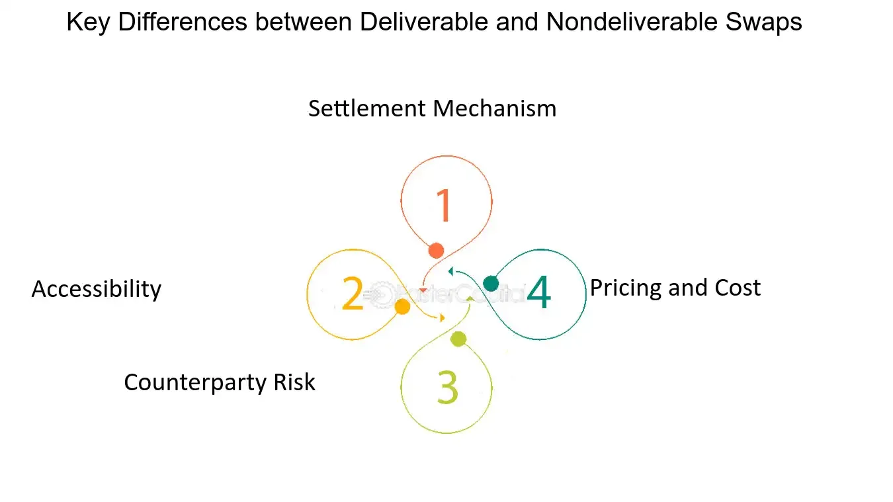

## Table of Contents

## What is cross-currency settlement risk?

Cross-currency settlement risk, also known as Herstatt risk, is the danger that one party in a foreign exchange transaction will pay out the currency it sold but not receive the currency it bought. This can happen because the two legs of the transaction are settled in different time zones, creating a window of vulnerability. For example, if a bank in New York sends dollars to a bank in Tokyo but the Tokyo bank fails to send yen back, the New York bank loses its money.

This risk became famous after the collapse of the German bank Herstatt in 1974, which failed to deliver dollars to counterparties after receiving deutsche marks. To reduce this risk, financial institutions and regulators have developed systems like the Continuous Linked Settlement (CLS), which ensures that both sides of a foreign exchange trade are settled simultaneously. Despite these measures, cross-currency settlement risk remains a concern in international finance because of the large sums involved and the potential for systemic impact if a major player fails.

## Why is cross-currency settlement risk important to understand?

Cross-currency settlement risk is important to understand because it can lead to big financial losses. When people or banks trade different currencies, they need to send and receive money at the same time. But sometimes, one side sends their money and the other side doesn't send theirs back. This can happen because the banks are in different time zones and the money doesn't move at the exact same time. If this happens, the person or bank that sent their money first can lose it all.

Understanding this risk helps banks and traders take steps to protect themselves. They use special systems like CLS to make sure both sides of the trade happen at the same time. This reduces the chance of losing money. But even with these systems, the risk is still there, so it's important for everyone involved in currency trading to know about it and be careful.

## How does cross-currency settlement typically occur?

Cross-currency settlement usually happens when two parties agree to exchange different currencies. For example, a bank in the United States might want to trade dollars for euros with a bank in Europe. They agree on an exchange rate and the amount of money to be swapped. The U.S. bank sends dollars to the European bank, and the European bank sends euros to the U.S. bank. This exchange needs to happen at the same time to avoid any risk.

However, because banks are in different time zones, the money can't always be sent and received at the exact same moment. This creates a window where one bank might send its money but not get the other currency back if the other bank fails or has problems. To reduce this risk, banks use special systems like CLS, which makes sure both sides of the trade happen together. Even with these systems, there's still a chance something could go wrong, so everyone needs to be careful.

## What are the main components involved in a cross-currency transaction?

In a cross-currency transaction, there are two main parts: the currencies being traded and the parties involved. The currencies are what the two sides want to exchange. For example, one side might want to trade dollars for euros. The parties are usually banks or other financial institutions that agree on the amount of money and the exchange rate.

The transaction happens when one party sends their currency to the other party, and the other party sends their currency back. This needs to happen at the same time to be safe. But because the banks are often in different time zones, it's hard to make sure the money moves at the exact same moment. To help with this, they use systems like CLS to make sure both sides of the trade happen together. Even with these systems, there's still a small chance something could go wrong, so everyone needs to be careful.

## What are the common types of risks associated with cross-currency settlements?

Cross-currency settlements come with several risks. One big risk is called settlement risk, where one bank sends its money but doesn't get the other currency back. This can happen because the banks are in different time zones and the money can't move at the exact same time. If the other bank fails or has problems, the first bank loses its money. This risk is also called Herstatt risk, named after a bank that had this problem in 1974.

Another risk is called credit risk. This happens when one bank is worried that the other bank might not be able to pay back the money. If the other bank has financial problems, it might not send the currency as agreed. Banks try to check each other's financial health to reduce this risk, but it's still a concern.

There's also operational risk, which comes from mistakes or problems in the systems used to move the money. If the computers or the people handling the transaction make a mistake, the money might not get where it needs to go. Banks use special systems like CLS to help reduce these risks, but they can still happen.

## How can settlement risk be mitigated in cross-currency transactions?

Settlement risk in cross-currency transactions can be reduced by using special systems like Continuous Linked Settlement (CLS). CLS makes sure that both sides of the trade happen at the same time. This means one bank sends its money and the other bank sends its money back right away, so there's less chance of losing money if one bank has problems. Banks all over the world use CLS to make their currency trades safer.

Another way to reduce settlement risk is by carefully checking the other bank's financial health. This is called due diligence. If a bank knows the other bank is strong and likely to pay back the money, it feels safer making the trade. Banks also use agreements that say if one side can't pay, they have to fix it quickly. This helps make sure everyone gets their money even if something goes wrong.

## What are the roles of central banks and financial institutions in managing cross-currency settlement risk?

Central banks and financial institutions play important roles in managing cross-currency settlement risk. Central banks help by setting rules and guidelines that banks need to follow when they trade currencies. They also keep an eye on the financial system to make sure it's working well and that big problems don't happen. If a bank is in trouble, the central bank might step in to help fix things and keep the system safe.

Financial institutions, like banks, work together to use systems like CLS to make their trades safer. They check each other's financial health before making a trade to lower the chance of losing money. They also make agreements that say what to do if something goes wrong, so they can fix problems quickly. By working together and following the rules, they help keep the money moving smoothly and safely across different countries.

## Can you explain the concept of Herstatt risk in the context of cross-currency settlements?

Herstatt risk is a type of danger that can happen when people or banks trade different currencies. It got its name from a German bank called Herstatt that failed in 1974. When banks trade currencies, one bank sends its money to the other bank, and the other bank is supposed to send its money back at the same time. But because banks are in different time zones, the money can't always move at the exact same moment. If one bank sends its money but the other bank fails or has problems and doesn't send its money back, the first bank loses its money. This is called Herstatt risk.

To reduce Herstatt risk, banks use special systems like CLS, which stands for Continuous Linked Settlement. CLS makes sure that both sides of the trade happen at the same time, so there's less chance of one bank losing its money. Even with these systems, the risk is still there, so banks need to be careful and check the other bank's financial health before making a trade. By working together and using these systems, banks can make cross-currency trades safer.

## What are the international standards and guidelines for managing cross-currency settlement risk?

International standards and guidelines for managing cross-currency settlement risk are set by groups like the Bank for International Settlements (BIS) and the Committee on Payments and Market Infrastructures (CPMI). These groups make rules that banks around the world should follow to make their currency trades safer. One important rule is to use systems like CLS, which stands for Continuous Linked Settlement. CLS helps make sure that both sides of a currency trade happen at the same time, so there's less chance of one bank losing its money if the other bank has problems.

Another important guideline is for banks to do due diligence, which means checking the other bank's financial health before making a trade. This helps lower the risk that the other bank won't be able to send its money back. Banks also use agreements that say what to do if something goes wrong, so they can fix problems quickly. By following these standards and guidelines, banks can work together to make cross-currency settlements safer and reduce the chances of big financial losses.

## How do technological advancements influence cross-currency settlement risk management?

Technological advancements have made a big difference in managing cross-currency settlement risk. New systems and tools help banks trade currencies more safely. For example, the Continuous Linked Settlement (CLS) system uses technology to make sure both sides of a currency trade happen at the same time. This reduces the chance of one bank losing its money if the other bank has problems. Also, better computer systems help banks check each other's financial health more quickly and accurately, which lowers the risk of trading with a bank that might not be able to pay back the money.

Another way technology helps is by making everything faster and more reliable. With advanced software and networks, banks can move money around the world quickly and safely. This means they can use real-time data to see what's happening with their trades and fix any problems right away. Technology also helps banks follow the rules set by groups like the Bank for International Settlements more easily. By using these new tools, banks can make their cross-currency settlements safer and reduce the chances of big financial losses.

## What are the differences between real-time gross settlement (RTGS) and net settlement systems in managing cross-currency risks?

Real-time gross settlement (RTGS) and net settlement systems are two ways banks can handle cross-currency transactions, and they work differently to manage risks. RTGS settles each transaction as soon as it happens, one at a time. This means if a bank in the U.S. sends dollars to a bank in Japan, the transaction is done right away. Because each trade is settled individually, RTGS reduces the risk that one bank will send its money but not get the other currency back. However, RTGS needs a lot of money to be available all the time, which can be a challenge for banks.

On the other hand, net settlement systems work by adding up all the trades that happen during a certain time and then settling them all at once. For example, if a bank in the U.S. and a bank in Japan trade currencies back and forth many times in a day, they only send the difference at the end of the day. This can save money because banks don't need to have as much cash on hand all the time. But it also means there's more risk because if one bank has problems, the other bank might not get its money back for all the trades that happened during the day. So, net settlement systems can be riskier than RTGS, but they are cheaper and easier to manage.

## How do emerging markets handle cross-currency settlement risk compared to developed markets?

Emerging markets often face more challenges in managing cross-currency settlement risk compared to developed markets. In emerging markets, the financial systems might not be as strong or as well-regulated. This means they might not have access to advanced systems like CLS, which helps make currency trades safer. Also, banks in emerging markets might not have as much money to use for settling trades right away, which can make RTGS harder to use. Because of these issues, there's a higher chance that something could go wrong and one bank might lose its money if the other bank has problems.

Developed markets, on the other hand, usually have better tools and rules to manage cross-currency settlement risk. They often use systems like CLS and RTGS, which help make sure that both sides of a currency trade happen at the same time. This reduces the risk of one bank losing its money. Also, banks in developed markets often have more money to use for settling trades, and they follow strict rules set by groups like the Bank for International Settlements. This makes their cross-currency settlements safer and more reliable than in emerging markets.

## What is Understanding Cross-Currency Settlement Risk?

Settlement risk in cross-currency transactions, frequently referred to as Herstatt Risk, is a critical concern in global finance. This type of risk arises when there is the potential for one party involved in a currency exchange to transfer currency without simultaneously receiving the corresponding amount in the other currency involved. The term "Herstatt Risk" traces its origins to the 1974 failure of the German bank Herstatt, which highlighted the vulnerabilities in currency settlement processes.

A significant [factor](/wiki/factor-investing) that intensifies settlement risk is the existence of time zone differences. Financial markets across the globe do not operate simultaneously due to the variation in local business hours. For example, a transaction involving New York and Tokyo faces a time gap where one market may close while the other is still operating. Such discrepancies can inherently delay the settlement process, increasing exposure to risk as one currency might be delivered hours before the reciprocal payment is received.

Operational inefficiencies compound the issue further. Delays in processing transactions, technical glitches, and manual interventions can all contribute to disruptions in the execution of these settlements. These disruptions can lead to significant financial losses, particularly in the volatile Forex market where exchange rates can fluctuate rapidly.

To mitigate these risks, financial institutions employ several strategies. Chief among them is the implementation of netting agreements. Netting involves aggregating multiple payment obligations between parties into a single net payment, thereby reducing the total number of transactions and minimizing the [volume](/wiki/volume-trading-strategy) of funds at risk. This can be mathematically represented as:

$$
\text{Net Obligation} = \sum (\text{Receipts}) - \sum (\text{Payments})
$$

where the net obligation is calculated by summing all incoming and outgoing payments between two trading parties, offsetting them to arrive at a single net payment.

Additionally, the role of central counterparties (CCPs) is essential in managing settlement risk. CCPs act as intermediaries in financial transactions, providing a centralized clearing mechanism. They assume the counterparty risk, ensuring that each party in the transaction fulfills its financial obligations. This significantly reduces the risk of default and enhances the security of the transaction process.

Effective risk management protocols are crucial in allowing financial institutions to navigate the Forex market, which is inherently volatile. By employing strategic measures such as netting and engaging central counterparties, institutions can lower their exposure to settlement risk, ensuring operational continuity and financial stability in cross-currency transactions.

## References & Further Reading

[1]: Bank for International Settlements (BIS). ["Settlement risk in foreign exchange transactions"](https://www.bis.org/cpmi/publ/d17.htm). Committee on Payments and Market Infrastructures (CPMI) Report.

[2]: Lopez de Prado, Marcos. ["Advances in Financial Machine Learning"](https://www.amazon.com/Advances-Financial-Machine-Learning-Marcos/dp/1119482089). Wiley, 2018.

[3]: Cont, Rama. (2010). ["Credit Default Swaps and Financial Stability"](https://www.researchgate.net/publication/49136389_Credit_default_swaps_and_financial_stability). Financial Stability Review.

[4]: Bank of England. ["Central Counterparties: What are they, why do they matter and how does the Bank supervise them?"](https://www.bankofengland.co.uk/quarterly-bulletin/2013/q2/central-counterparties-what-are-they-why-do-they-matter-and-how-does-the-bank-supervise-them) Explainer article.

[5]: BIS Quarterly Review, September 2020. ["The Technologies, Economics, and Governance of Decentralized Finance"](https://www.bis.org/publ/qtrpdf/r_qt2009.htm). Bank for International Settlements.